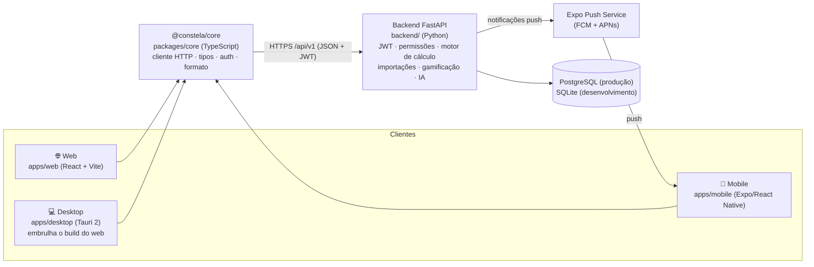
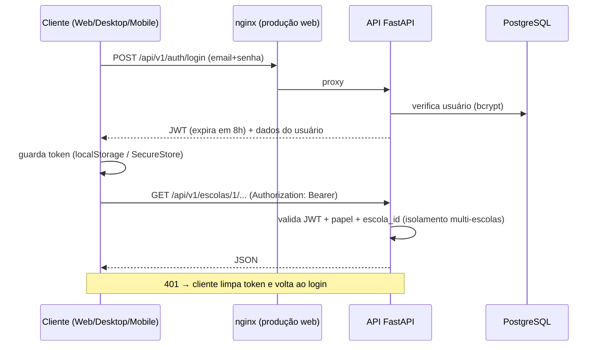
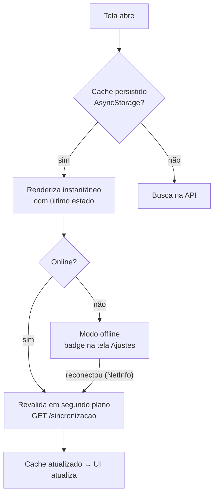

# Arquitetura e Decisões Técnicas

## Visão geral multiplataforma

Um único backend serve três clientes. Toda regra de negócio (motor de
cálculo, permissões, importações, gamificação, IA) vive no backend; os
clientes apenas apresentam e conversam com a mesma API REST.



### Por que esta stack (e não Flutter + NestJS + Supabase)

| Decisão | Motivo |
|---|---|
| **Manter FastAPI** (não migrar para NestJS) | O backend já é API-first, com ampla suíte de testes e o motor de cálculo auditável — o ativo mais valioso do projeto. Reescrever em outra linguagem teria custo e risco altos com ganho funcional zero: “backend único refletido em todas as plataformas” é propriedade do desenho API-first, não da linguagem. |
| **JWT próprio** (não Supabase) | Autenticação com papéis validados no servidor e trilha de auditoria já existem e são testados. Supabase adicionaria dependência externa e migração de dados sem eliminar o backend (o motor de cálculo continuaria precisando dele). |
| **React + React Native** (não Flutter) | Reaproveita 100% do frontend web existente e mantém um único ecossistema (TypeScript) com o pacote `@constela/core` compartilhado. Flutter exigiria reescrever ~20 telas em Dart, e Flutter Web (canvas) é inferior para um sistema administrativo cheio de tabelas (acessibilidade, seleção de texto, carga inicial). |
| **Tauri 2** (não Electron) | O desktop embrulha exatamente o build do `apps/web` (zero telas duplicadas), com binário ~10x menor (WebView do sistema), atualizador embutido e melhor performance. |
| **PostgreSQL via Docker** | Já suportado pelo SQLAlchemy 2 desde a Fase 1 (tipos portáveis, sem SQL cru). O `docker-compose.yml` oficializa: Postgres + backend + web/nginx em um comando. |

## O que é compartilhado

```
packages/core (@constela/core)  ← usado por Web, Desktop e Mobile
├── cliente.ts   cliente HTTP, upload, blobs, login, tratamento de 401
├── tipos.ts     contrato TypeScript da API (espelha os schemas Pydantic)
└── formato.ts   números, notas, datas e tempo em pt-BR

backend/         ← usado por todos os clientes (única fonte de regra de negócio)
```

O core não conhece plataforma: **armazenamento do token** e **reação à
sessão expirada** são adaptadores injetados na inicialização de cada app
(web/desktop → `localStorage` + redirect; mobile → `SecureStore` + reset de
navegação). A base da API também é configurável — só o web em
desenvolvimento tem proxy `/api`.

## Estrutura de pastas

```
sgpe/
├── backend/                 API FastAPI (core, models, routers, services, tests)
│   └── Dockerfile
├── apps/
│   ├── web/                 SPA React + TS + Tailwind (Vite)
│   │   ├── Dockerfile       build estático + nginx (proxy /api)
│   │   └── nginx.conf
│   ├── desktop/             Tauri 2 (Rust) — embrulha apps/web/dist
│   │   └── src-tauri/       conf, ícones, updater, capacidades
│   └── mobile/              Expo / React Native (Android e iOS)
│       └── src/             telas, navegação, contexto, notificações
├── packages/
│   └── core/                @constela/core — TypeScript compartilhado
├── tools/                   utilitários (gerador de ícones)
├── docs/                    ARQUITETURA.md e ROADMAP.md
├── docker-compose.yml       PostgreSQL + backend + web
└── .github/workflows/       CI (testes/builds) e release do desktop
```

## Fluxo de comunicação



- **Web (produção)**: mesma origem via nginx (`/api` → backend), sem CORS.
- **Desktop**: origem `tauri://localhost` — liberada no CORS do backend;
  a URL da API entra no build (`VITE_API_URL`).
- **Mobile**: requisições nativas (sem origem/CORS); URL da API via
  `EXPO_PUBLIC_API_URL`.

## Autenticação e permissões

- JWT assinado (HS256) com expiração de 8h; senha com bcrypt.
- Papéis (admin, coordenador, professor, visitante) validados **no
  backend em cada rota** — o frontend nunca é a única barreira.
- Isolamento multi-escolas por `escola_id` em toda tabela e rota.
- Mobile guarda o token no **SecureStore** (cifrado pelo sistema);
  web/desktop no `localStorage` do WebView.
- Logout no mobile também remove o token de push do aparelho.

## Offline e sincronização (mobile)



- **Leituras**: TanStack Query com cache persistido (7 dias). O endpoint
  consolidado `GET /escolas/{id}/sincronizacao` devolve dashboard,
  ranking, evolução, alertas e mural em **uma** viagem de rede, com
  carimbo `gerado_em`.
- **Reconexão**: `onlineManager` ligado ao NetInfo → todas as consultas
  ativas são re-buscadas automaticamente (`refetchOnReconnect`).
- **Escritas** exigem rede (o mobile é primariamente de consulta; as
  operações de escrita pesadas — importações, configurações — são fluxo
  de web/desktop).

## Notificações push

Expo Push Service: um único endpoint HTTPS cobre Android (FCM) e iOS
(APNs), sem a escola precisar de contas próprias no Firebase/Apple.
O app registra o token em `POST /escolas/{id}/dispositivos` (upsert);
eventos relevantes (ex.: importação concluída) disparam
`services/push.notificar_escola()` — sempre melhor esforço, com remoção
automática de tokens mortos.

## Builds por plataforma

| Plataforma | Comando | Sai |
|---|---|---|
| Web | `npm run build:web` → imagem `apps/web/Dockerfile` | estático + nginx |
| Desktop | `npm run build:desktop` (requer Rust) ou tag `v*` no CI | `.msi`/`.exe`, `.dmg`, `.AppImage`/`.deb` + artefatos de atualização |
| Mobile | `eas build -p android|ios` (Expo Application Services) | `.aab`/`.apk`, `.ipa` |
| Backend | `docker compose up -d` | API + PostgreSQL + web |

Atualização automática do desktop: o app verifica o endpoint de releases
na inicialização (updater do Tauri, artefatos assinados — gere as chaves
com `npm run tauri -w @constela/desktop signer generate` e configure os
segredos do workflow `desktop-release.yml`).

## Escalabilidade

- API **stateless** (JWT): escala horizontalmente atrás de um balanceador
  (`docker compose up --scale backend=N` ou múltiplas réplicas). Duas ressalvas
  operacionais ao subir N réplicas:
  - **Migração**: cada container roda `alembic upgrade head` no boot
    (`entrypoint.sh`). Ao escalar, garanta um **único runner de migração** —
    aplique as migrações uma vez antes de subir as réplicas, ou deixe só uma
    subir primeiro — para não haver corrida de DDL entre réplicas.
  - **Rate limit e cache do painel** vivem **em memória por processo**
    (best-effort): com N réplicas a proteção anti-abuso passa a ser por réplica.
    Aceitável por design; para limite global rígido, use um store compartilhado
    (Redis).
- PostgreSQL com índices por `escola_id` em todas as tabelas; consultas
  paginadas (PRD §23).
- Clientes web/desktop servem estático (CDN-ready); mobile reduz carga com
  o endpoint consolidado de sincronização e cache local.
- Push em lotes de 100 (limite do Expo) e fora do caminho crítico.

## Decisões herdadas das Fases 1–6 (continuam valendo)

- **Nada hardcoded**: pesos e regras na tabela `configuracoes` (JSON por
  escola); a API rejeita pesos cuja soma difere de 100% e o motor ainda
  normaliza defensivamente.
- **Histórico imutável**: `snapshots_*` nunca são sobrescritos; evolução é
  comparação entre snapshots; `notas` é cache auditável do último cálculo
  com o passo a passo em `detalhes`.
- **Dificuldade por série**: exceção → padrão → 0.
- **Auditoria**: toda escrita relevante em `logs_auditoria` (nunca apagados).
- **IA isolada** (PRD §154): `services/ia` com provedor trocável
  (anthropic/openai/local); o frontend nunca fala com o modelo; contexto
  montado no backend respeitando o isolamento por escola.
- **Datas em UTC** no banco; formatação pt-BR nos clientes (via core).
- **Segurança**: ORM parametrizado, validação Pydantic em toda entrada,
  CORS restrito, tokens de painel público trocáveis.
