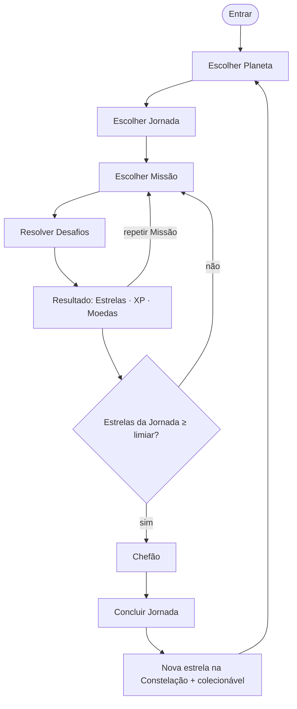
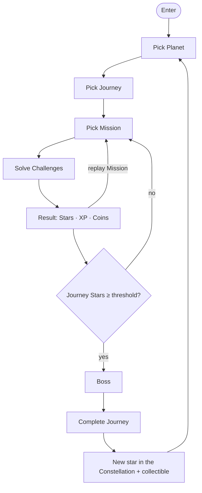

# 05 — Sistemas de Jogo / Game Systems

- **Status:** 🟢 aprovado / approved
- **Padrão / Standard:** [ADR-0002](decisoes/ADR-0002-padrao-de-capitulo.md) (16 partes)
- **Fontes / Sources:** `docs/quest/03-gamificacao-progressao.md`, `docs/quest/02-banco-de-dados.md`, `backend/app/quest/models.py` (QuestMissao.xp_base/moedas_base, QuestJornada.estrelas_chefao, QuestPerfil.dificuldade/sequencia_dias), `_estado-atual/RELATORIO-2026-07-09.md`
- **Depende de / Depends on:** conteúdo/BNCC/dificuldade pedagógica → [06](06-pedagogico-bncc.md); fantasia/colecionáveis → [03](03-universo.md)/[15](15-arte-audio-assets.md); telas/HUD → [07](07-ux-fluxos-navegacao.md); itens cosméticos → [04](04-personagens-avatar.md); dados/infra/offline → [11](11-arquitetura.md) + Apêndice [B](apendice-B-api-dados.md); telemetria → [17](17-telemetria-metricas.md); temporadas/passe/loja rotativa/config por escola → [19](19-liveops.md); rankings/social → [09](09-social.md); acessibilidade → [13](13-acessibilidade.md).

> **Convenção:** "§N" = uma das 16 **partes deste capítulo**; "Seção NN" = outro capítulo da Bible.
> **Escopo:** este capítulo decide os **sistemas e regras de jogo** (loop, economia, progressão,
> mecânicas). Conteúdo, fantasia, telas, avatar e infraestrutura pertencem a outros capítulos.

---

## 🇧🇷 Sistemas de Jogo

### 1. Objetivo
Ser a **referência definitiva do sistema de jogo** do Constela Quest: o **core loop**, a **economia de 3
moedas** (XP, Moedas, Estrelas), a **progressão** (níveis), a **maestria** (estrelas por Missão), as
**mecânicas de desafio**, os **Chefões**, a **dificuldade adaptativa**, a **Chama do Cosmo** (sequência),
as **Missões diárias** e a **economia cosmética** (como se ganham/gastam Moedas). Define as regras e a
matemática; **não** o conteúdo (Seção [06](06-pedagogico-bncc.md)), a fantasia (Seção [03](03-universo.md))
nem as telas (Seção [07](07-ux-fluxos-navegacao.md)).

### 2. Contexto
Os sistemas de jogo transformam o **conteúdo BNCC** (Seção [06](06-pedagogico-bncc.md)) em **jogo** dentro
do universo (Seção [03](03-universo.md)), jogado pelo avatar (Seção [04](04-personagens-avatar.md)). No
ecossistema **Hub → Edu → Quest**, o Edu fornece a identidade e a série; os sistemas produzem o progresso
que o professor acompanha (Seção [08](08-professor-familia.md), sem ver Moedas/loja). **Estado atual (Q0):**
o núcleo jogável **não existe** — "Jogar agora" é só um aviso; nenhuma tentativa é submetida, nenhum
XP/Estrela/Moeda é calculado. O **esquema de dados** existe (`quest_missoes`, `quest_desafios`,
`quest_progresso`, `quest_tentativas`, `quest_habilidades`) mas sem endpoints. Este capítulo especifica o
sistema a construir (Fase Q1+).

### 3. Filosofia da funcionalidade
Motivar **sem pressão** e tornar o **progresso visível**. São **três** moedas porque uma moeda única cai
na armadilha clássica — a "criança rica que não aprende" (só junta) ou a "criança aplicada sem nada para
gastar". Separando **progresso** (XP), **maestria** (Estrelas) e **expressão** (Moedas), cada esforço
alimenta a emoção certa: XP = "eu cresço" (nunca cai), Estrelas = "eu domino", Moedas = "eu me expresso".
O sistema privilegia a **motivação intrínseca** (curiosidade, domínio); recompensa é celebração, não
suborno. **Erro nunca pune** (Princípio 6). O loop tem de fazer a criança **querer voltar amanhã** (Seção [00](00-visao-e-norte.md)).

### 4. Experiência que o jogador deve sentir
- **Domínio crescente:** "estou ficando bom nisso" — a maestria é sentida, não cobrada.
- **Progresso tangível:** cada esforço acende algo (XP sobe, Estrela nasce, Constelação cresce).
- **Celebração, não punição:** acerto vira festinha; erro vira "quase! vamos de novo?".
- **Ritmo gostoso:** o loop é curto, claro e sempre termina com recompensa — nunca de mãos vazias.

### 5. Fluxo completo
**Core loop:** escolher Planeta (Seção [03](03-universo.md)) → **Jornada** → **Missão** → sequência de
**Desafios** → **resultado** (acertos, Estrelas de maestria, XP, Moedas) → **recompensa/celebração** →
próxima Missão. As Missões de uma Jornada **acumulam Estrelas**; quando a Jornada atinge o limiar de
Estrelas, **libera o Chefão** (Missão final); **vencer o Chefão conclui a Jornada**, acende uma **estrela
nova** no céu pessoal (fantasia = Seção [03](03-universo.md)) e concede um **colecionável do planeta**.
**Ritmo diário:** ao entrar, **presente de login** (trilha de 7 dias) + **3 Missões diárias** + a **Chama
do Cosmo** conta mais um dia. **Primeira vez:** o onboarding guia a 1ª Missão (Seção [08](08-onboarding-ftue.md)).
**Retorno:** a Chama e a Constelação mostram continuidade.

**Fluxograma oficial do Core Loop:**

### 6. Interface (quando existir)
As telas são da Seção [07](07-ux-fluxos-navegacao.md); aqui, o que os sistemas **expõem/exigem**: os
sistemas **expõem** XP, Moedas, Estrelas e a Chama para exibição (a composição do HUD é da 07); o
**MissãoPlayer** (host que apresenta Desafios **sem gabarito** e coleta respostas) precisa apresentar uma
mecânica por vez e enviar respostas; a tela de **resultado/recompensa** nunca deixa a criança de mãos
vazias. Layout e navegação = Seção [07](07-ux-fluxos-navegacao.md).

### 7. UX
Feedback **imediato e gentil**: acerto celebra na hora; erro é acolhido ("quase!", "vamos juntos"), nunca
marcado como falha (Princípio 6). **Tempo nunca é critério único** e tudo é narrado em pt-BR
(acessibilidade, Seção [13](13-acessibilidade.md)). Vocabulário canônico (Seção [02](02-vocabulario.md)):
Missão/Desafio/Constelação/Estrela/Chefão, nunca "prova/exercício/tarefa/erro".

### 8. Game Design
**a) Economia de 3 moedas (decidido).**
- **XP** — só cresce; move a **progressão/nível**; nunca é gasto nem perdido.
- **Estrelas** — **maestria por Missão (0–3)**; vale a **melhor tentativa**, nunca são perdidas. As
  Estrelas conquistadas **dentro de uma Jornada** são a **chave do Chefão** (§8f).
- **Moedas** — ganhas jogando; **gastas em cosméticos** (item = Seção [04](04-personagens-avatar.md)). Sem
  dinheiro real (Princípio 7).
- **Recompensas extensíveis (decidido):** o ato de conceder recompensa é aberto — além de XP/Moedas/itens/
  colecionáveis, a economia poderá conceder no futuro **títulos, molduras, emblemas, efeitos visuais e
  mascotes**. A **definição desses itens é da Seção [04](04-personagens-avatar.md)**; aqui fica só a concessão.

**b) XP e nível (decidido; números-padrão, ajustáveis por config — Seção [19](19-liveops.md)).**
- **XP por Desafio (ao vivo):** `4 × dificuldade` (1–5); **× 1,5** se for a **1ª resposta correta sem
  dica** *naquela tentativa* (o bônus vale também em rejogos, pois é por tentativa, não histórico).
- **Bônus de conclusão de Missão:** `xp_base` da Missão (campo `QuestMissao.xp_base`) **× multiplicador de
  estrela** (1★=1,0 · 2★=1,25 · 3★=1,5).
- **Ordem de cálculo:** soma-se o XP dos Desafios + o bônus de Missão; **então** aplica-se o **fator de
  repetição** *(por `quest_progresso.tentativas`, **vitalício** — não zera na virada de dia)*: 1ª conclusão
  = 100%; 2ª = 50%; 3ª = 25%; **4ª em diante = 0%**.
- **Anti-farm (decidido):** a partir da 4ª conclusão, o rejogo **não rende XP nem Moedas** — só permite
  **melhorar Estrelas** (naturalmente limitadas a 3★ por Missão). O rejogo vira **maestria, não grind**,
  fechando o loop de farm (junto ao teto diário de XP). *(Refina o "25% da 3ª em diante" de `docs/quest/03`,
  que deixava um resíduo de Moedas por rejogo, sem adicionar sistema novo.)*
- **Teto diário: 600 XP** — ao atingir, é **celebrado** (não bloqueia continuar jogando); zera na virada de dia (§12).
- **Curva de nível:** XP para o próximo nível = `80 + 20 × nível`. **Subir de nível SEMPRE** credita
  **Moedas + um item** (grão-padrão de Moedas em §8c; curadoria do item = Seção [19](19-liveops.md)).

**c) Moedas — faucet (decidido; números-padrão, ajustáveis por config — Seção [19](19-liveops.md)).**
- **Missão:** `moedas_base` da Missão (campo `QuestMissao.moedas_base`, padrão **10**) **× multiplicador de estrela**.
- **Missões diárias:** as **3 diárias** rendem **~15 Moedas** cada; **2 semanais** rendem **~50** cada.
- **Subir de nível:** **~25 Moedas** + item.
- **Alvo de calibração da loja:** um cosmético comum ≈ **2 dias de jogo** (referência de balanceamento,
  Seção [19](19-liveops.md)). As Moedas mudam **só via ledger imutável** (Princípio 14).

**d) Estrelas / maestria (decidido).** Por Missão, pelo **% de acerto**: **concluir = 1★**; **≥80% = 2★**;
**100% = 3★**. Guarda a melhor marca (nunca regride).

**e) A Constelação (mecânica; fantasia = Seção [03](03-universo.md)).** Vencer o Chefão **conclui a
Jornada**, acende uma **estrela nova** no céu pessoal e concede um **colecionável do planeta** (o
item/arte do colecionável é da Seção [03](03-universo.md)/[15](15-arte-audio-assets.md)). É progresso
**eu × eu**, nunca comparação (Princípio 5); rankings entre pessoas = Seção [09](09-social.md).

**f) Chefões (decidido).** O Chefão é a **Missão final** de cada Jornada, **liberado quando as Estrelas
conquistadas *naquela Jornada* ≥ `QuestJornada.estrelas_chefao`** (limiar **autorado por Jornada** na
Seção [06](06-pedagogico-bncc.md); padrão de referência **10**). *(Não usa `estrelas_total`, que é o cache
global.)* Combina mecânicas já vistas, com mais brilho e recompensa maior. Erro nunca pune — pode tentar de novo.

**g) Mecânicas de desafio (catálogo decidido).** Cada mecânica é um **plugin** (contrato em §10): recebe um
Desafio (sem gabarito) e devolve a **resposta crua**; o servidor confere. Catálogo: **quiz** (múltipla
escolha), **arrastar** (arrastar-soltar), **ligar** (pares), **memória**, **completar** (lacunas),
**sequência** (ordenar), **caça-palavras**. **Nº de Desafios por Missão:** autorado por Missão
(`QuestMissao.config`), faixa-padrão **5–8**, sorteados no **nível adaptativo ±1** (§8h). **Dica:** a
criança pode pedir **uma dica** num Desafio (o *conteúdo* da dica é da Seção [06](06-pedagogico-bncc.md), a
*UI* da Seção [07](07-ux-fluxos-navegacao.md)); **usar dica remove o bônus +50%** do §8b. *(Quais mecânicas
entram por fase = roadmap.)*

**h) Dificuldade adaptativa v1 (decidido — heurística, invisível, por Planeta).** Cada perfil tem um
**nível por Planeta** (`QuestPerfil.dificuldade`, ex.: `{matematica: 3}`), faixa **1–5**, **começa em 2**.
Uma **janela das últimas 10 respostas de Desafio naquele Planeta** ajusta o nível: **≥85% de acerto → +1**
(até 5); **≤40% → −1** (até 1), **silencioso e sem punir**. A Missão sorteia Desafios no nível **±1**;
`≤40%` pode disparar uma **Missão de reforço**. O mapeamento **habilidade↔BNCC** é da Seção [06](06-pedagogico-bncc.md).
**Preparação para IA (decidido):** **todas as decisões da adaptação** (janela, nível por Planeta, ajustes
aplicados) são **persistidas** (`quest_tentativas`/`quest_habilidades`), permitindo uma futura **v2
baseada em IA (Q6)** **sem alterar a arquitetura atual**.

**i) Chama do Cosmo — sequência (decidido).** **Dia ativo** = dia com **≥1 Missão concluída** (não basta
logar); cada dia ativo faz **+1**. **Escudo semanal automático:** perdoa **1 falta por semana**, **renova
toda segunda** e é **consumido automaticamente** na 1ª falta. **Fim de semana:** conta se jogar, **não
quebra** se não jogar (separado do escudo). **Perda:** se faltar sem escudo, a Chama **zera com mensagem
gentil**; **reacender** restaura **25% dos dias** perdidos. **Marcos** em **3/7/14/30/60/100** dias dão
recompensa. É sempre a favor da criança — nunca cobrança.

**j) Missões diárias (decidido).** Ao entrar: **presente de login** (trilha de 7 dias) + **3 Missões
diárias** sorteadas + **2 semanais**. A **rotação/curadoria** das diárias e eventos = Seção [19](19-liveops.md).

**k) Conquistas / Achievements (decidido).** Um sistema de conquistas **independente da progressão**:
marcos cumulativos disparam uma conquista (ex.: **100 Missões**, **Chama por 30 dias**, **uma Jornada com
3★**, **100% de um Planeta**). A **recompensa vem da economia existente** (XP/Moedas/cosméticos — item da
Seção [04](04-personagens-avatar.md)). O catálogo de conquistas é **dado autorado** (base do jogo;
conquistas sazonais/curadas = Seção [19](19-liveops.md)); a tela = Seção [07](07-ux-fluxos-navegacao.md).
Modelo: `quest_conquistas`.

### 9. Regras de negócio
- **Servidor é a autoridade do gabarito** (Princípio 13): o catálogo chega ao cliente **sem** `gabarito`;
  o cliente devolve resposta crua; o servidor **confere e calcula** XP/Estrelas/Moedas (mecanismo = Seção [11](11-arquitetura.md)).
- **Economia auditável** (Princípio 14): Moedas mudam **só via ledger imutável**; tentativas são imutáveis;
  XP só cresce; Estrela nunca é perdida. Modelo de dados = Apêndice [B](apendice-B-api-dados.md).
- **Sem compras reais** (Princípio 7): Moedas só se ganham jogando.
- **Regras numéricas não hardcoded:** os números de §8 são o **padrão canônico**; a personalização por
  escola usa o mecanismo de config (Seção [19](19-liveops.md)).
- **Economia cosmética:** Moedas compram itens do catálogo (Seção [04](04-personagens-avatar.md)); um item
  só é equipável se **possuído** — o **inventário/posse é definido aqui** (economia); o item em si é da 04.
- **Estado por perfil** (Princípio 4): XP/Estrelas/Moedas/Chama/progresso nunca vazam entre contas.

### 10. Arquitetura técnica
> Infra (endpoints, modelo de dados, offline, concorrência) = Seção [11](11-arquitetura.md) + Apêndice
> [B](apendice-B-api-dados.md). Aqui ficam os **contratos de sistema**.

- **Registry de mecânicas (contrato):** cada mecânica implementa `{ apresentar(desafio), coletarResposta()
  → respostaCrua }`; o **MissãoPlayer** orquestra a sequência e envia respostas. Nova mecânica = nova
  entrada no registry, sem tocar no núcleo.
- **Ciclo da tentativa (contrato):** `iniciar Missão` → por Desafio, o cliente envia a **resposta crua** →
  o **servidor** confere contra o `gabarito`, aplica as fórmulas (§8b–d) e devolve o resultado → ao fim,
  grava uma **tentativa imutável** e atualiza `progresso`/`habilidades`/`dificuldade`/ledger.
- **O que a tentativa registra:** Desafios, acertos, tempo, XP/Moedas/Estrelas concedidos, respostas e a
  **origem** (`web`/`pwa-offline`). Idempotência e sync offline = Seção [11](11-arquitetura.md).
- **Fonte dos números:** as fórmulas de §8 são o **padrão canônico**; overrides por escola = Seção [19](19-liveops.md).
- **Ganchos de evento (capacidade — decidido):** o motor **suporta** eventos temporários, **Missões por
  tempo limitado**, **multiplicadores temporários** de XP/Moedas e **recompensas exclusivas** de evento. As
  **regras, janelas e curadoria** dos eventos são da Seção [19](19-liveops.md) — aqui fica só a **capacidade**.

### 11. Dependências com outros módulos
- **Conteúdo, BNCC, mapeamento de habilidade, dificuldade pedagógica, `estrelas_chefao` por Jornada, nº de Desafios por Missão, conteúdo da dica** → Seção [06](06-pedagogico-bncc.md).
- **Fantasia da Constelação, dos planetas e dos colecionáveis** → Seção [03](03-universo.md) (arte = [15](15-arte-audio-assets.md)).
- **Telas (HUD, MissãoPlayer, resultado, loja, UI da dica)** → Seção [07](07-ux-fluxos-navegacao.md).
- **Itens cosméticos** (o que existe, arte, equipar) → Seção [04](04-personagens-avatar.md).
- **Infra:** endpoints, dados, autoridade do gabarito, offline/idempotência → Seção [11](11-arquitetura.md) + Apêndice [B](apendice-B-api-dados.md).
- **Telemetria** → Seção [17](17-telemetria-metricas.md).
- **Temporadas, passe, rotação da loja, curadoria de diárias/eventos/conquistas, regras e janelas de eventos, config numérica por escola** → Seção [19](19-liveops.md).
- **Rankings e modos sociais** → Seção [09](09-social.md).
Este capítulo **alimenta:** o progresso que o professor/família acompanham (Seção [08](08-professor-familia.md)).

### 12. Casos extremos (Edge Cases)
- **Virada de dia/semana (decidido):** o "dia" (Chama, diárias, teto) usa o **fuso da escola** (padrão
  `America/Sao_Paulo`, configurável — Seção [19](19-liveops.md)), corte à **meia-noite local**. Na virada:
  **zera o teto diário** e as **diárias/semanais são regeradas** (3+2); a **Chama** avança ou aplica o
  escudo. **NÃO** zeram: o **fator de repetição** (é vitalício, por `quest_progresso.tentativas`), nem
  XP/Estrelas/Moedas.
- **Tentativa offline:** joga em cache e **enfileira**; ao reconectar, o servidor concilia e credita **sem
  duplicar** (idempotência = Seção [11](11-arquitetura.md)).
- **Teto diário atingido:** celebra e **continua jogando** (sem XP extra, sem bloqueio).
- **Missão repetida:** aplica o fator de repetição (§8b); a Estrela mantém a melhor marca.
- **Sem conteúdo semeado:** a Missão aparece **"em breve"** (Seção [03](03-universo.md)/[07](07-ux-fluxos-navegacao.md)), nunca erro.
- **Aluno fora de faixa / turma multisseriada:** a liberação de Jornadas é regra da Seção [06](06-pedagogico-bncc.md); o sistema respeita o que a 06 liberar.
- **Queda de rede no meio da Missão:** progresso parcial preservado localmente, sincroniza depois.

### 13. Escalabilidade futura
- **Novas mecânicas** entram pelo registry (§10) sem mexer no núcleo.
- **Novo conteúdo** = Seção [06](06-pedagogico-bncc.md); **temporadas/eventos** = Seção [19](19-liveops.md).
- **Ajuste fino da economia** por config (Seção [19](19-liveops.md)) sem deploy.
- **Eventos temporários** (multiplicadores, Missões por tempo, recompensas exclusivas) e **conquistas
  sazonais** usam os ganchos de §10/§8k, com regras na Seção [19](19-liveops.md).
- **Recompensas novas** (títulos/molduras/emblemas/efeitos/mascotes) entram sem mudar a economia (item = Seção [04](04-personagens-avatar.md)).
- **Dificuldade adaptativa v2 (IA)** (usando as decisões já persistidas, §8h) e Cosmo que explica erros são Q6.

### 14. Checklist de implementação
- [ ] Economia de 3 moedas com as fórmulas de §8b/c/d (padrão + override por config).
- [ ] Faucet de Moedas (Missão/diárias/semanais/level-up) e ledger imutável.
- [ ] Registry de mecânicas (§10) + as 7 mecânicas (§8g) + mecânica de **dica** (remove bônus).
- [ ] Anti-farm: 4ª conclusão em diante = 0% XP/Moedas (só melhora Estrelas) (§8b).
- [ ] Sistema de **conquistas** (independente da progressão; recompensa via economia) (§8k).
- [ ] **Ganchos de evento** (multiplicadores temporários, Missões por tempo, recompensas exclusivas; regras = Seção [19](19-liveops.md)) (§10).
- [ ] Ciclo da tentativa com **conferência no servidor** (§10; autoridade do gabarito).
- [ ] Estrelas de maestria; Chefão por `estrelas_chefao` **da Jornada**; Constelação + colecionável ao vencer o Chefão.
- [ ] Dificuldade adaptativa v1 **por Planeta** (nível inicial 2; ≥85%→+1; ≤40%→−1; janela de 10; sorteio ±1).
- [ ] Chama do Cosmo completa (dia ativo = ≥1 Missão; escudo semanal; fim de semana; reacender 25%; marcos).
- [ ] Virada de dia por fuso da escola (§12): zera teto/diárias, mantém repetição vitalícia.
- [ ] Eventos de telemetria de jogo/economia (Seção [17](17-telemetria-metricas.md)).
- [ ] DoD conferido contra o Apêndice [F](apendice-F-checklists-dod.md).

### 15. Questões em aberto
**Dentro da responsabilidade da Seção 05, não há questões em aberto** — os sistemas e a matemática estão
definidos (números-padrão adotados/alinhados a `docs/quest/03` e ao schema). Valores **autorados por
conteúdo** (`estrelas_chefao`, nº de Desafios, conteúdo da dica) são da Seção [06](06-pedagogico-bncc.md);
a **curadoria/override** dos números é da Seção [19](19-liveops.md) — registrados como dependências na §11.

### 16. ADR (Architecture Decision Record)
**Decisões arquiteturais registradas por este capítulo:**
1. **Economia de 3 moedas** (XP progride, Estrelas = maestria/chave-de-jornada, Moedas = cosméticos); XP
   só cresce, Estrela nunca perdida, teto diário como celebração.
2. **Fórmula de XP** = XP por Desafio (4×dif, +50% de 1ª sem dica) **+** bônus de Missão (`xp_base` ×
   estrela), com **fator de repetição vitalício** (100/50/25/**0**%).
   **Anti-farm:** da 4ª conclusão em diante o rejogo não rende XP/Moedas (só melhora Estrelas) — decidido
   preferir estender o fator existente a criar um sistema novo.
3. **Chefão liberado por Estrelas da própria Jornada** (`estrelas_chefao`), **não** pelo cache global.
4. **Dificuldade adaptativa v1 por Planeta** (nível 1–5, início 2; ≥85%→+1; ≤40%→−1; janela de 10).
5. **Registry de mecânicas plugável** + **servidor como autoridade do gabarito**; **economia auditável**
   (ledger/tentativas imutáveis).
6. **Virada de dia pelo fuso da escola** (`America/Sao_Paulo` padrão), determinística para a Chama; **fator
   de repetição não zera** na virada.
7. **Conquistas independentes da progressão** (recompensa via economia existente; catálogo autorado; modelo
   `quest_conquistas`) — a Seção 05 apenas suporta; sazonais/curadas = Seção [19](19-liveops.md).
8. **Ganchos de evento como capacidade do motor** (multiplicadores temporários, Missões por tempo,
   recompensas exclusivas); regras, janelas e curadoria = Seção [19](19-liveops.md).
9. **Decisões da adaptação persistidas** (`quest_tentativas`/`quest_habilidades`) para uma futura v2 com IA
   (Q6) **sem alterar a arquitetura atual**.

*(Registro inline; sem criar arquivo de ADR sem autorização.)*

---

## 🇬🇧 Game Systems

### 1. Objective
Be the **definitive reference for the game system** of Constela Quest: the **core loop**, the **3-currency
economy** (XP, Coins, Stars), **progression** (levels), **mastery** (stars per Mission), the **challenge
mechanics**, **Bosses**, **adaptive difficulty**, **Cosmo's Flame** (streak), **daily Missions** and the
**cosmetic economy** (how Coins are earned/spent). It defines the rules and the math; **not** the content
(Section [06](06-pedagogico-bncc.md)), the fantasy (Section [03](03-universo.md)) or the screens (Section [07](07-ux-fluxos-navegacao.md)).

### 2. Context
Game systems turn **BNCC content** (Section [06](06-pedagogico-bncc.md)) into **play** inside the universe
(Section [03](03-universo.md)), played by the avatar (Section [04](04-personagens-avatar.md)). In the **Hub
→ Edu → Quest** ecosystem, Edu supplies identity and grade; the systems produce the progress the teacher
follows (Section [08](08-professor-familia.md), without seeing Coins/store). **Current state (Q0):** the
playable core **doesn't exist** — "Play now" is only a notice; no attempt is submitted, no XP/star/coin is
computed. The **data schema** exists (`quest_missoes`, `quest_desafios`, `quest_progresso`,
`quest_tentativas`, `quest_habilidades`) but with no endpoints. This chapter specifies the system to build (Q1+).

### 3. Feature philosophy
Motivate **without pressure** and make **progress visible**. There are **three** currencies because a
single currency falls into the classic trap — the "rich kid who doesn't learn" (only hoards) or the
"diligent kid with nothing to spend". Separating **progress** (XP), **mastery** (Stars) and **expression**
(Coins), each effort feeds the right emotion: XP = "I grow" (never drops), Stars = "I master", Coins = "I
express myself". The system favors **intrinsic motivation** (curiosity, mastery); reward is celebration,
not bribery. **Mistakes never punish** (Principle 6). The loop must make the child **want to come back
tomorrow** (Section [00](00-visao-e-norte.md)).

### 4. The experience the player should feel
- **Growing mastery:** "I'm getting good at this" — mastery is felt, not demanded.
- **Tangible progress:** every effort lights something (XP rises, a Star is born, the Constellation grows).
- **Celebration, not punishment:** a correct answer is a little party; a mistake is "almost! shall we try again?".
- **Pleasant rhythm:** the loop is short, clear and always ends with a reward — never empty-handed.

### 5. Complete flow
**Core loop:** pick a Planet (Section [03](03-universo.md)) → **Journey** → **Mission** → a sequence of
**Challenges** → **result** (correct answers, mastery Stars, XP, Coins) → **reward/celebration** → next
Mission. A Journey's Missions **accumulate Stars**; when the Journey reaches its Star threshold, it
**unlocks the Boss** (final Mission); **beating the Boss completes the Journey**, lights a **new star** in
the personal sky (fantasy = Section [03](03-universo.md)) and grants a **planet collectible**. **Daily
rhythm:** on entry, a **login gift** (7-day track) + **3 daily Missions** + **Cosmo's Flame** counts one
more day. **First time:** onboarding guides the 1st Mission (Section [08](08-onboarding-ftue.md)). **Return:**
the Flame and Constellation show continuity.

**Official Core Loop flowchart:**

### 6. Interface (when it exists)
Screens are Section [07](07-ux-fluxos-navegacao.md)'s; here, what the systems **expose/require**: the
systems **expose** XP, Coins, Stars and the Flame for display (HUD composition is 07's); the
**MissionPlayer** (host that presents Challenges **without the answer key** and collects answers) must show
one mechanic at a time and send answers; the **result/reward** screen never leaves the child empty-handed.
Layout and navigation = Section [07](07-ux-fluxos-navegacao.md).

### 7. UX
**Immediate and gentle** feedback: a correct answer celebrates at once; a mistake is welcomed ("almost!",
"let's do it together"), never marked as failure (Principle 6). **Time is never the sole criterion** and
everything is narrated in pt-BR (accessibility, Section [13](13-acessibilidade.md)). Canonical vocabulary
(Section [02](02-vocabulario.md)): Mission/Challenge/Constellation/Star/Boss, never "test/exercise/task/error".

### 8. Game Design
**a) 3-currency economy (decided).** **XP** — only grows; drives **progression/level**; never spent or
lost. **Stars** — **mastery per Mission (0–3)**; the **best attempt** counts, never lost. Stars earned
**within a Journey** are the **Boss key** (§8f). **Coins** — earned by playing; **spent on cosmetics**
(item = Section [04](04-personagens-avatar.md)); no real money (Principle 7).
- **Extensible rewards (decided):** the act of granting a reward is open — beyond XP/Coins/items/
  collectibles, the economy may in future grant **titles, frames, badges, visual effects and mascots**. The
  **definition of these items belongs to Section [04](04-personagens-avatar.md)**; here lives only the grant.

**b) XP and level (decided; default numbers, config-adjustable — Section [19](19-liveops.md)).**
- **XP per Challenge (live):** `4 × difficulty` (1–5); **× 1.5** if it's the **1st correct answer with no
  hint** *in that attempt* (the bonus also applies on replays, since it's per attempt, not history).
- **Mission completion bonus:** the Mission's `xp_base` (`QuestMissao.xp_base`) **× star multiplier**
  (1★=1.0 · 2★=1.25 · 3★=1.5).
- **Order of computation:** sum Challenge XP + Mission bonus; **then** apply the **replay factor**: 1st
  completion = 100%; 2nd = 50%; 3rd = 25%; **4th onward = 0%** *(by `quest_progresso.tentativas`,
  **lifetime** — does not reset at day rollover)*.
- **Anti-farm (decided):** from the 4th completion, replaying **yields no XP or Coins** — it only lets you
  **improve Stars** (naturally capped at 3★ per Mission). Replay becomes **mastery, not grind**, closing the
  farm loop (together with the daily XP cap). *(Refines the "25% from the 3rd onward" of `docs/quest/03`,
  which left a Coin trickle on replay, without adding a new system.)*
- **Daily cap: 600 XP** — on reaching it, **celebrated** (does not block further play); resets at rollover (§12).
- **Level curve:** XP to next level = `80 + 20 × level`. **Leveling up ALWAYS** credits **Coins + an item**
  (default Coin grain in §8c; item curation = Section [19](19-liveops.md)).

**c) Coins — faucet (decided; default numbers, config-adjustable — Section [19](19-liveops.md)).**
- **Mission:** the Mission's `moedas_base` (`QuestMissao.moedas_base`, default **10**) **× star multiplier**.
- **Daily Missions:** the **3 dailies** yield **~15 Coins** each; **2 weeklies** yield **~50** each.
- **Level-up:** **~25 Coins** + item.
- **Store calibration target:** a common cosmetic ≈ **2 days of play** (balancing reference, Section
  [19](19-liveops.md)). Coins change **only via an immutable ledger** (Principle 14).

**d) Stars / mastery (decided).** Per Mission, by **% correct**: **complete = 1★**; **≥80% = 2★**;
**100% = 3★**. Keeps the best mark (never regresses).

**e) The Constellation (mechanic; fantasy = Section [03](03-universo.md)).** Beating the Boss **completes
the Journey**, lights a **new star** in the personal sky and grants a **planet collectible** (the
collectible's item/art is Section [03](03-universo.md)/[15](15-arte-audio-assets.md)'s). Progress is
**me × me**, never comparison (Principle 5); person-vs-person rankings = Section [09](09-social.md).

**f) Bosses (decided).** The Boss is each Journey's **final Mission**, **unlocked when the Stars earned *in
that Journey* ≥ `QuestJornada.estrelas_chefao`** (threshold **authored per Journey** in Section
[06](06-pedagogico-bncc.md); reference default **10**). *(It does not use `estrelas_total`, the global
cache.)* It mixes already-seen mechanics with more sparkle and a bigger reward. Mistakes never punish — you can retry.

**g) Challenge mechanics (decided catalog).** Each mechanic is a **plugin** (contract in §10): it receives
a Challenge (no answer key) and returns the **raw answer**; the server checks. Catalog: **quiz** (multiple
choice), **drag** (drag-and-drop), **match** (pairs), **memory**, **fill** (blanks), **sequence**
(ordering), **word-search**. **Challenges per Mission:** authored per Mission (`QuestMissao.config`),
default range **5–8**, drawn at the **adaptive level ±1** (§8h). **Hint:** the child may request **one
hint** on a Challenge (the hint's *content* is Section [06](06-pedagogico-bncc.md)'s, the *UI* Section
[07](07-ux-fluxos-navegacao.md)'s); **using a hint removes the +50% bonus** of §8b. *(Which mechanics ship per phase = roadmap.)*

**h) Adaptive difficulty v1 (decided — heuristic, invisible, per Planet).** Each profile has a **level per
Planet** (`QuestPerfil.dificuldade`, e.g. `{matematica: 3}`), range **1–5**, **starts at 2**. A **window of
the last 10 Challenge answers on that Planet** adjusts the level: **≥85% correct → +1** (up to 5); **≤40%
→ −1** (down to 1), **silent and non-punishing**. The Mission draws Challenges at level **±1**; `≤40%` may
trigger a **reinforcement Mission**. The **skill↔BNCC mapping** is Section [06](06-pedagogico-bncc.md)'s.
**AI-readiness (decided):** **every adaptation decision** (window, per-Planet level, adjustments applied) is
**persisted** (`quest_tentativas`/`quest_habilidades`), enabling a future **AI-based v2 (Q6)** **without
changing the current architecture**.

**i) Cosmo's Flame — streak (decided).** **Active day** = a day with **≥1 completed Mission** (logging in
isn't enough); each active day is **+1**. **Automatic weekly shield:** forgives **1 miss per week**,
**renews every Monday**, **consumed automatically** on the 1st miss. **Weekend:** counts if you play,
**doesn't break** if you don't (separate from the shield). **Loss:** missing without a shield **resets the
Flame with a gentle message**; **rekindle** restores **25% of the lost days**. **Milestones** at
**3/7/14/30/60/100** days give rewards. Always in the child's favor — never a demand.

**j) Daily Missions (decided).** On entry: **login gift** (7-day track) + **3 daily Missions** drawn + **2
weeklies**. The dailies' **rotation/curation** and events = Section [19](19-liveops.md).

**k) Achievements (decided).** An achievement system **independent of progression**: cumulative milestones
fire an achievement (e.g. **100 Missions**, **30-day Flame**, **a Journey at 3★**, **100% of a Planet**).
The **reward comes from the existing economy** (XP/Coins/cosmetics — item from Section
[04](04-personagens-avatar.md)). The achievement catalog is **authored data** (game baseline;
seasonal/curated achievements = Section [19](19-liveops.md)); the screen = Section
[07](07-ux-fluxos-navegacao.md). Model: `quest_conquistas`.

### 9. Business rules
- **Server is the answer-key authority** (Principle 13): the catalog reaches the client **without**
  `gabarito`; the client returns the raw answer; the server **checks and computes** XP/Stars/Coins (mechanism = Section [11](11-arquitetura.md)).
- **Auditable economy** (Principle 14): Coins change **only via an immutable ledger**; attempts are
  immutable; XP only grows; a Star is never lost. Data model = Appendix [B](apendice-B-api-dados.md).
- **No real purchases** (Principle 7): Coins are only earned by playing.
- **Numeric rules not hardcoded:** §8 numbers are the **canonical default**; per-school customization uses
  the config mechanism (Section [19](19-liveops.md)).
- **Cosmetic economy:** Coins buy catalog items (Section [04](04-personagens-avatar.md)); an item is
  equippable only if **owned** — the **inventory/ownership is defined here** (economy); the item itself is 04's.
- **Per-profile state** (Principle 4): XP/Stars/Coins/Flame/progress never leak between accounts.

### 10. Technical architecture
> Infra (endpoints, data model, offline, concurrency) = Section [11](11-arquitetura.md) + Appendix
> [B](apendice-B-api-dados.md). Here live the **system contracts**.

- **Mechanic registry (contract):** each mechanic implements `{ present(challenge), collectAnswer() →
  rawAnswer }`; the **MissionPlayer** orchestrates the sequence and sends answers. A new mechanic = a new
  registry entry, without touching the core.
- **Attempt cycle (contract):** `start Mission` → per Challenge, the client sends the **raw answer** → the
  **server** checks against the `gabarito`, applies the formulas (§8b–d) and returns the result → at the
  end it writes an **immutable attempt** and updates `progresso`/`habilidades`/`dificuldade`/ledger.
- **What the attempt records:** Challenges, correct answers, time, XP/Coins/Stars granted, answers and the
  **origin** (`web`/`pwa-offline`). Idempotency and offline sync = Section [11](11-arquitetura.md).
- **Number source:** the §8 formulas are the **canonical default**; per-school overrides = Section [19](19-liveops.md).
- **Event hooks (capability — decided):** the engine **supports** temporary events, **time-limited
  Missions**, **temporary XP/Coin multipliers** and **event-exclusive rewards**. The events' **rules,
  windows and curation** are Section [19](19-liveops.md)'s — here lives only the **capability**.

### 11. Dependencies on other modules
- **Content, BNCC, skill mapping, pedagogical difficulty, per-Journey `estrelas_chefao`, Challenges per Mission, hint content** → Section [06](06-pedagogico-bncc.md).
- **Constellation, planet and collectible fantasy** → Section [03](03-universo.md) (art = [15](15-arte-audio-assets.md)).
- **Screens (HUD, MissionPlayer, result, store, hint UI)** → Section [07](07-ux-fluxos-navegacao.md).
- **Cosmetic items** (what exists, art, equipping) → Section [04](04-personagens-avatar.md).
- **Infra:** endpoints, data, answer-key authority, offline/idempotency → Section [11](11-arquitetura.md) + Appendix [B](apendice-B-api-dados.md).
- **Telemetry** → Section [17](17-telemetria-metricas.md).
- **Seasons, pass, store rotation, dailies/events/achievements curation, event rules and windows, per-school numeric config** → Section [19](19-liveops.md).
- **Rankings and social modes** → Section [09](09-social.md).
This chapter **feeds:** the progress the teacher/family follow (Section [08](08-professor-familia.md)).

### 12. Edge cases
- **Day/week rollover (decided):** the "day" (Flame, dailies, cap) uses the **school's timezone** (default
  `America/Sao_Paulo`, configurable — Section [19](19-liveops.md)), cut at **local midnight**. At rollover:
  **the daily cap resets** and the **dailies/weeklies regenerate** (3+2); the **Flame** advances or applies
  the shield. **Does NOT reset:** the **replay factor** (lifetime, by `quest_progresso.tentativas`), nor XP/Stars/Coins.
- **Offline attempt:** plays from cache and **queues**; on reconnect the server reconciles and credits
  **without duplication** (idempotency = Section [11](11-arquitetura.md)).
- **Daily cap reached:** celebrates and **keeps playing** (no extra XP, no block).
- **Repeated Mission:** applies the replay factor (§8b); the Star keeps the best mark.
- **No seeded content:** the Mission shows **"coming soon"** (Section [03](03-universo.md)/[07](07-ux-fluxos-navegacao.md)), never an error.
- **Student out of grade / multi-grade class:** unlocking Journeys is Section [06](06-pedagogico-bncc.md)'s rule; the system respects what 06 unlocks.
- **Network loss mid-Mission:** partial progress preserved locally, syncs later.

### 13. Future scalability
- **New mechanics** enter via the registry (§10) without touching the core.
- **New content** = Section [06](06-pedagogico-bncc.md); **seasons/events** = Section [19](19-liveops.md).
- **Economy fine-tuning** via config (Section [19](19-liveops.md)) with no deploy.
- **Temporary events** (multipliers, time-limited Missions, exclusive rewards) and **seasonal achievements**
  use the §10/§8k hooks, with rules in Section [19](19-liveops.md).
- **New rewards** (titles/frames/badges/effects/mascots) plug in without changing the economy (item = Section [04](04-personagens-avatar.md)).
- **Adaptive difficulty v2 (AI)** (using the decisions already persisted, §8h) and a Cosmo that explains mistakes are Q6.

### 14. Implementation checklist
- [ ] 3-currency economy with the §8b/c/d formulas (default + config override).
- [ ] Coin faucet (Mission/dailies/weeklies/level-up) and immutable ledger.
- [ ] Mechanic registry (§10) + the 7 mechanics (§8g) + **hint** mechanic (removes bonus).
- [ ] Anti-farm: 4th completion onward = 0% XP/Coins (Stars only) (§8b).
- [ ] **Achievement** system (independent of progression; reward via the economy) (§8k).
- [ ] **Event hooks** (temporary multipliers, time-limited Missions, exclusive rewards; rules = Section [19](19-liveops.md)) (§10).
- [ ] Attempt cycle with **server-side checking** (§10; answer-key authority).
- [ ] Mastery Stars; Boss by the **Journey's** `estrelas_chefao`; Constellation + collectible on beating the Boss.
- [ ] Adaptive difficulty v1 **per Planet** (start 2; ≥85%→+1; ≤40%→−1; window of 10; draw ±1).
- [ ] Full Cosmo's Flame (active day = ≥1 Mission; weekly shield; weekend; rekindle 25%; milestones).
- [ ] Day rollover by school timezone (§12): reset cap/dailies, keep lifetime replay factor.
- [ ] Game/economy telemetry events (Section [17](17-telemetria-metricas.md)).
- [ ] DoD checked against Appendix [F](apendice-F-checklists-dod.md).

### 15. Open questions
**Within Section 05's responsibility, there are no open questions** — the systems and math are defined
(default numbers adopted from/aligned with `docs/quest/03` and the schema). Content-authored values
(`estrelas_chefao`, Challenges per Mission, hint content) are Section [06](06-pedagogico-bncc.md)'s;
number curation/override is Section [19](19-liveops.md)'s — recorded as dependencies in §11.

### 16. ADR (Architecture Decision Record)
**Architectural decisions recorded by this chapter:**
1. **3-currency economy** (XP progresses, Stars = mastery/Journey-key, Coins = cosmetics); XP only grows,
   a Star never lost, daily cap as celebration.
2. **XP formula** = XP per Challenge (4×diff, +50% for 1st with no hint) **+** Mission bonus (`xp_base` ×
   star), with a **lifetime replay factor** (100/50/25/**0**%).
   **Anti-farm:** from the 4th completion, replay yields no XP/Coins (Stars only) — decided to extend the
   existing factor rather than build a new system.
3. **Boss unlocked by the Journey's own Stars** (`estrelas_chefao`), **not** the global cache.
4. **Adaptive difficulty v1 per Planet** (level 1–5, start 2; ≥85%→+1; ≤40%→−1; window of 10).
5. **Pluggable mechanic registry** + **server as answer-key authority**; **auditable economy** (immutable ledger/attempts).
6. **Day rollover by the school's timezone** (`America/Sao_Paulo` default), deterministic for the Flame; the **replay factor does not reset** at rollover.
7. **Achievements independent of progression** (reward via the existing economy; authored catalog; model
   `quest_conquistas`) — Section 05 only supports them; seasonal/curated = Section [19](19-liveops.md).
8. **Event hooks as an engine capability** (temporary multipliers, time-limited Missions, exclusive
   rewards); rules, windows and curation = Section [19](19-liveops.md).
9. **Adaptation decisions persisted** (`quest_tentativas`/`quest_habilidades`) for a future AI-based v2
   (Q6) **without changing the current architecture**.

*(Recorded inline; no separate ADR file created without authorization.)*
