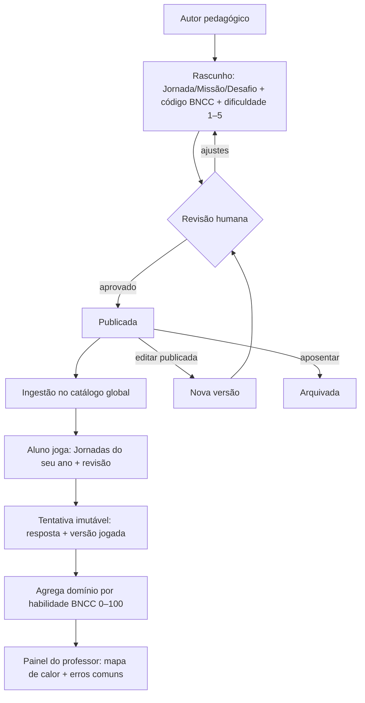
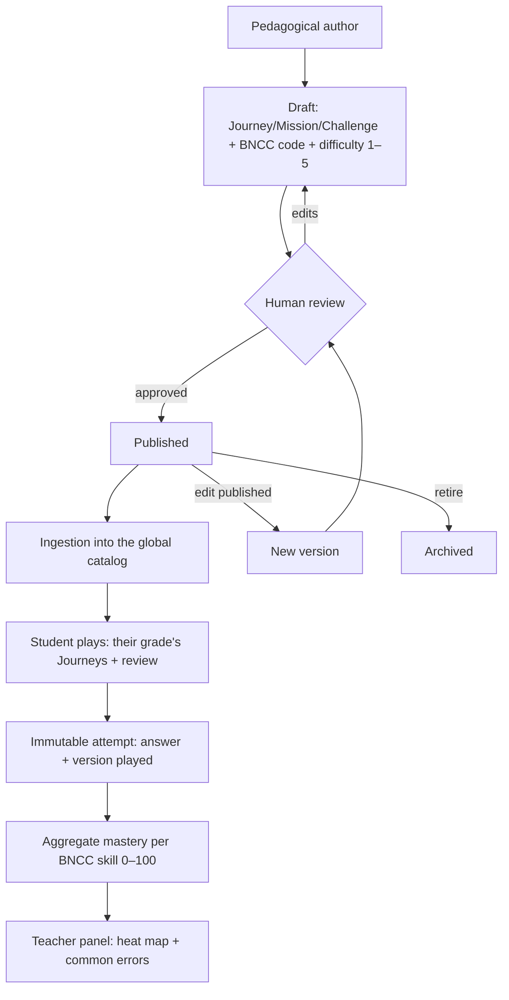

# 06 — Design Pedagógico & BNCC / Learning Design & BNCC

- **Status:** 🟢 aprovado / approved
- **Padrão / Standard:** [ADR-0002](decisoes/ADR-0002-padrao-de-capitulo.md) (16 partes)
- **Fontes / Sources:** `docs/quest/03-gamificacao-progressao.md`, `docs/quest/02-banco-de-dados.md`, `docs/quest/04-integracao-edu.md`, `docs/quest/01-arquitetura.md`, `docs/quest/05-roadmap.md`, `backend/app/quest/models/catalogo.py` (QuestMundo/Jornada/Missao/Desafio), `backend/app/quest/models/progresso.py` (Progresso/Tentativa/Habilidade), BNCC (Base Nacional Comum Curricular — Ensino Fundamental, Anos Iniciais), `_estado-atual/RELATORIO-2026-07-09.md`
- **Depende de / Depends on:** vocabulário → [02](02-vocabulario.md); fantasia/9 planetas/nomes próprios → [03](03-universo.md); economia/dificuldade adaptativa/mecânica do Chefão/geração de diárias → [05](05-sistemas-de-jogo.md); estúdio de autoria/telas → [07](07-ux-fluxos-navegacao.md); painel do professor/mapa de calor → [10](10-professor-familia.md); infra/endpoints/ingestão/formato de seed/fonte-da-verdade do catálogo → [11](11-arquitetura.md) + Apêndice [B](apendice-B-api-dados.md); LGPD/dados de criança → [12](12-seguranca-privacidade.md); acessibilidade → [13](13-acessibilidade.md); arte/áudio gravado dos enunciados → [15](15-arte-audio-assets.md); telemetria → [17](17-telemetria-metricas.md); eventos/temporadas/config por escola → [19](19-liveops.md).

> **Convenção:** "§N" = uma das 16 **partes deste capítulo**; "Seção NN" = outro capítulo da Bible.
> **Escopo:** este capítulo decide **como o currículo BNCC vira conteúdo jogável** — a taxonomia autoral,
> o alinhamento à BNCC, a rubrica de dificuldade pedagógica, o mapa de habilidades, o versionamento
> editorial do conteúdo e as regras pedagógicas. **Não** decide a economia/adaptação dinâmica (Seção 05),
> as telas (Seção 07), a infraestrutura/ingestão (Seção 11) nem a arte/áudio (Seção 15).

---

## 🇧🇷 Design Pedagógico & BNCC

### 1. Objetivo
Ser a **referência definitiva de como o currículo da BNCC se converte em conteúdo jogável** no Constela
Quest: a **taxonomia** do catálogo (Planetas → Jornadas → Missões → Desafios), o **modelo de alinhamento à
BNCC** (o código de habilidade como chave), o **mapa de habilidades** e a **matriz de cobertura**, a
**rubrica de dificuldade pedagógica (1–5)**, o **ciclo editorial versionado** do conteúdo, as **regras de
autoria** (incluindo autoria assistida por IA e curadoria sensível) e a **agregação de domínio por
habilidade** que alimenta o professor. Deve permitir que **autores de conteúdo e devs** produzam e ingiram
material alinhado **sem tomar decisões de produto**. Decide **apenas o que é pedagógico**: números da
economia (Seção [05](05-sistemas-de-jogo.md)), telas (Seção [07](07-ux-fluxos-navegacao.md)), infra (Seção
[11](11-arquitetura.md)) e arte/áudio (Seção [15](15-arte-audio-assets.md)) pertencem a outros capítulos.
**Conteúdo é o gargalo declarado do projeto** — esta seção o organiza.

### 2. Contexto
No ecossistema **Hub → Edu → Quest**, o Edu fornece a identidade (escola, aluno, turma, **ano escolar**) e
o Quest transforma o **currículo BNCC** em jogo. O **catálogo pedagógico é global** (`is_global`, mantido
pelo admin) — *o currículo BNCC é o mesmo para todas as escolas*; escolas apenas **ativam** recursos por
configuração (Seção [19](19-liveops.md), namespace `quest.*`). **Estado atual (Q0):** o **schema de
conteúdo existe** (`quest_mundos`, `quest_jornadas`, `quest_missoes`, `quest_desafios`, `quest_progresso`,
`quest_tentativas`, `quest_habilidades`), mas a pasta de seeds `backend/app/quest/conteudo/` **ainda não
existe no disco**, **não há endpoints, services nem seeds de conteúdo** (o catálogo não tem CRUD nem leitura
— os routers/services existentes cobrem só auth/perfil/professor), e **nenhuma Missão BNCC foi semeada**.
*"Sem conteúdo não há jogo."* Este capítulo especifica o que autorar (Q1+).

### 3. Filosofia da funcionalidade
**Um jogo que por acaso ensina** — nunca uma escola gamificada, prova fantasiada ou catálogo de exercícios
com estrelinhas. O objetivo pedagógico (BNCC) vive **embutido na mecânica lúdica**, jamais exposto como
avaliação. Toda peça de conteúdo passa na pergunta-guia da Seção [00](00-visao-e-norte.md): *"uma criança
entraria mesmo sem ser obrigada?"* — se tem **cara de dever de casa**, falhou. Três crenças governam:
- **A criança nunca vê o andaime.** Nunca vê o código BNCC nem o número de dificuldade — só **sente que "o
  jogo é do tamanho dela"**. O andaime pedagógico é para o autor e o professor.
- **Erro nunca pune** (Princípio 6): o conteúdo é reforço positivo; a melhor tentativa conta; repetir é
  bem-vindo. Nada de subtrair pontos, "vidas" ou reprovação.
- **A revisão é jogo.** A progressão é desenhada para produzir **revisão espaçada disfarçada** — sem "hora
  de revisar", só vontade de voltar.

### 4. Experiência que o jogador deve sentir
- **Criança:** "isso é um jogo, não é aula" — aprende sem perceber que é "matéria"; sente que os Desafios
  são **do tamanho dela** (nem fáceis demais, nem esmagadores); o erro é acolhido e vira caminho.
- **Professor(a):** vê **aprendizagem BNCC num olhar** — quais habilidades a turma domina e onde emperra —
  sem reconfigurar nada e sem ver Moedas/loja (Seção [10](10-professor-familia.md)).
- **Família:** enxerga **evolução por matéria em linguagem simples**, sem jargão BNCC (Seção
  [10](10-professor-familia.md)).
- **Momento mágico:** a criança pede "mais uma" de um assunto que, na escola, ela evitava.

### 5. Fluxo completo
O ciclo de vida do **conteúdo**, do autor à sala de aula:
1. **Autoria** — o autor pedagógico cria Jornada/Missão/Desafio, ancorando cada item a um **código BNCC** e
   a uma **dificuldade 1–5**, em **rascunho**.
2. **Revisão humana** → **publicação**. Conteúdo gerado por IA **sempre** entra como rascunho (nunca publica
   direto); ERER exige curadoria humana especializada antes de publicar (§8i).
3. **Ingestão** no catálogo global (formato de seed e ingestão = Seção [11](11-arquitetura.md)).
4. **Entrega ao aluno** — ele vê as **Jornadas do seu ano escolar** + **revisão opcional dos anos
   anteriores** (§9), série derivada da matrícula (`turmas.ano_escolar`), **zero configuração**.
5. **Tentativa** — o servidor confere (autoridade do gabarito, Seção [05](05-sistemas-de-jogo.md)) e grava a
   tentativa **imutável** com a **versão jogada** e a resposta por Desafio.
6. **Agregação de domínio** por habilidade BNCC (0–100, §8k), recalculável a partir das tentativas.
7. **Painel do professor** — mapa de calor turma × habilidade + erros mais comuns (dados = §8k/§8l; tela =
   Seção [10](10-professor-familia.md)).

**Fluxograma oficial do ciclo de conteúdo:**



**Primeira vez / retorno / offline / erro:** são regras de jogo (Seção [05](05-sistemas-de-jogo.md)) e de
tela (Seção [07](07-ux-fluxos-navegacao.md)); aqui importa que **conteúdo em rascunho nunca chega ao
aluno**, ano **sem conteúdo semeado** aparece "em breve" (nunca erro), e a **versão jogada é congelada** na
tentativa mesmo que a Missão seja editada depois (§12).

### 6. Interface (quando existir)
**N/A própria.** Esta seção **não desenha telas** — entrega **contratos de dados e regras pedagógicas**.
Duas superfícies consomem este capítulo, e **cada uma é de outro dono**:
- **Estúdio/CRUD de autoria** (onde o conteúdo é cadastrado, revisado e publicado) → **decisão de produto em
  aberto** (§15) e telas = Seção [07](07-ux-fluxos-navegacao.md).
- **Painel do professor** (mapa de calor BNCC, erros comuns) → Seção [10](10-professor-familia.md); aqui fica
  só a **especificação dos dados** (§8k/§8l).

### 7. UX
- **Não-leitores primeiro (1º/2º ano):** todo enunciado, instrução, dica e explicação tem **áudio pt-BR
  obrigatório** (Princípio 9) — o item deve ser **resolvível por áudio + ícone + cor**, nunca dependente de
  leitura. A produção do áudio gravado é da Seção [15](15-arte-audio-assets.md); a **regra de linguagem** é
  daqui (§8h). *(Exceção de idioma-alvo: no Planeta **Oxford**, o **termo de inglês** é falado **em inglês**;
  instrução, Cosmo e feedback seguem em pt-BR — §8c.)*
- **Resposta sempre fechada:** nenhum Desafio pede texto livre digitado (Princípio 2 — sem chat livre); a
  resposta é sempre por **interação controlada** — o **catálogo de mecânicas** é da Seção
  [05](05-sistemas-de-jogo.md), nunca campo aberto (§8g).
- **Vocabulário canônico** (Seção [02](02-vocabulario.md)): **Planeta/Jornada/Missão/Desafio/Chefão/
  Constelação**; jamais "prova/exercício/tarefa/erro fatal/reprovado". O tom é o do Cosmo (Seção
  [02](02-vocabulario.md)).
- **Acessibilidade** (Seção [13](13-acessibilidade.md)): alvo ≥ 48px, 1 ação primária por tela, redundância
  ícone+cor+áudio, `prefers-reduced-motion`, modo daltônico; **tempo nunca é o critério único** de um
  Desafio (proíbe item cronometrado como única forma de avaliar).

### 8. Game Design

*A dimensão pedagógica do game design (a economia e as mecânicas em si são da Seção [05](05-sistemas-de-jogo.md)).*

**a) Taxonomia do catálogo (referência — não redefine).** A hierarquia e os rótulos infantis são canônicos
na Seção [03](03-universo.md) (fantasia) e na Seção [02](02-vocabulario.md) (vocabulário). Aqui fica **o que
cada nível autora**:

| Nível interno | Criança vê | O que a Seção 06 autora |
|---------------|-----------|--------------------------|
| `quest_mundos` (Planeta) | **Planeta** | a **disciplina** de cada planeta e seu componente BNCC (§8b) |
| `quest_jornadas` (Jornada) | **Jornada** | `ano_escolar`, `ordem`, **lista `bncc`** de habilidades, `estrelas_chefao` (§8f) |
| `quest_missoes` (Missão) | **Missão** | `nome`, `descricao_crianca`, **`ordem`** (sequência na Jornada, §8e), `tipo` (`normal`/`chefao`/`evento`), **nº de Desafios sorteados por tentativa** (`config.desafios_por_tentativa`, §8f) |
| `quest_desafios` (Desafio) | **Desafio** | `mecanica`, **`dificuldade` 1–5** (§8d), **`bncc_codigo`**, `corpo`, `gabarito`, `dica`, `explicacao` (§8g/§8h) |

**b) Os 9 planetas-matéria (definição pedagógica).** A **ficção, os nomes próprios e a identidade sensorial**
são da Seção [03](03-universo.md)/[15](15-arte-audio-assets.md); aqui fica a **disciplina e o componente
BNCC** de cada um:

| Planeta | Matéria (`slug`) | Componente BNCC | Sigla no código | Observação de código (Anos Iniciais) |
|---------|------------------|-----------------|-----------------|--------------------------------------|
| **Numéria** | Matemática (`matematica`) | Matemática | `MA` | por ano: `EF01MA…`–`EF05MA…` |
| **Palavras** | Português (`portugues`) | Língua Portuguesa | `LP` | por ano **e** blocos: `EF0xLP`, `EF15LP` (1º–5º), `EF12LP` (1º–2º), `EF35LP` (3º–5º) |
| **Biozênia** | Ciências (`ciencias`) | Ciências | `CI` | por ano: `EF01CI…`–`EF05CI…` |
| **Terra Nova** | Geografia (`geografia`) | Geografia | `GE` | por ano: `EF01GE…`–`EF05GE…` |
| **Chronos** | História (`historia`) | História | `HI` | por ano; **unidades temáticas mudam a cada ano** |
| **Oxford** | Inglês (`ingles`) | Língua Inglesa | `LI` | ⚠️ **sem código nos Anos Iniciais** (só a partir do 6º ano) — ver §8c |
| **Colorium** | Artes (`artes`) | Arte | `AR` | ⚠️ **só bloco `EF15AR`** (1º–5º), nunca por ano |
| **Movi** | Ed. Física (`edfisica`) | Educação Física | `EF` | ⚠️ **blocos `EF12EF` / `EF35EF`**; exige **desafio ativo** — ver §15 (Questões em aberto) |
| **Raízes** | ERER (`erer`) | *(não é componente próprio)* | — | ⚠️ **transversal** (Leis 10.639/11.645); **sem código próprio**; curadoria humana — ver §8c/§8i |

**c) Alinhamento à BNCC (decidido — o código é a chave).** O **código de habilidade** (ex.: `EF02MA05`) é o
**fio único** que costura conteúdo ↔ telemetria ↔ painel do professor. Formato: `EF` (etapa) + **2 dígitos**
(ano `01`–`05` **ou** bloco `15`/`12`/`35`) + **sigla do componente** + **sequencial**. Ancoragem em **dois
níveis**: `quest_jornadas.bncc` (JSON, **lista** de códigos da Jornada) e `quest_desafios.bncc_codigo`
(**um** código por Desafio, indexado). **Regra anti-invenção (imutável nesta seção):** **nunca** gerar um
código BNCC por dedução — cite só o código publicado. **Fato de base:** a BNCC codifica **8 componentes**
com habilidades nos Anos Iniciais (MA, LP, CI, GE, HI, AR, EF e **Ensino Religioso — sigla `ER`**); o
Constela **oferta 7 deles com código** (MA/LP/CI/GE/HI/AR/EF) e **não inclui Ensino Religioso**; **Inglês
(`LI`)** só recebe código a partir do 6º ano. Casos especiais:
- **Inglês (Oxford):** a BNCC **não** define Língua Inglesa nos Anos Iniciais (obrigatória só do 6º ano). O
  conteúdo de 1º–5º **não cita código BNCC**; declara-se explicitamente **"sem habilidade BNCC nos Anos
  Iniciais"** e trata-se como **enriquecimento/PPP da escola**, nunca como cumprimento da Base. **Áudio:**
  instrução, Cosmo e feedback são em **pt-BR** (Princípio 9), mas o **termo-alvo** (a palavra/frase em
  inglês) recebe **áudio em inglês** (pronúncia) — é o **único** Planeta com áudio de conteúdo em outra língua.
- **ERER (Raízes):** **não** é componente curricular com sigla/código — é obrigatoriedade **transversal** das
  **Leis 10.639/2003 e 11.645/2008**, trabalhada dentro de habilidades **reais** de História (`HI`), Arte
  (`AR`), Língua Portuguesa (`LP`) e Geografia (`GE`). **Não confundir com Ensino Religioso** (sigla `ER`,
  ex.: `EF01ER…`), que **existe** na BNCC mas **não é ofertado** no Constela: ERER **não** recebe código
  próprio — jamais fabricar um. Curadoria humana (§8i).
- **Arte (Colorium):** habilidades **só no bloco `EF15AR`** — ao mapear por ano, repete-se o conjunto e
  marca-se em que anos o Quest o exercita (não fabricar `EF03AR`).
- **Ed. Física (Movi):** habilidades por **bloco** (`EF12EF`, `EF35EF`); a sigla do componente `EF` colide
  visualmente com a etapa `EF` (ex.: `EF35EF07`).

**d) Rubrica de dificuldade pedagógica 1–5 (decidido — rótulo estático do autor).** Cada Desafio recebe uma
`dificuldade` **estática** que o **autor** calibra. É o rótulo que **alimenta** a dificuldade adaptativa
dinâmica da Seção [05](05-sistemas-de-jogo.md) §8h (a adaptação em si é **de 05**, não daqui):

| Nível | Nome-guia | Critério de calibração |
|:-----:|-----------|------------------------|
| **1** | Reconhecer | 1 passo; associação direta; contexto familiar; suporte visual/áudio total; distratores óbvios. |
| **2** | Aplicar (simples) | 1 passo; aplica um conceito recém-visto; sem pegadinha; distratores plausíveis mas distantes. |
| **3** | Escolher/2 passos | 2 passos **ou** discriminar entre alternativas próximas; contexto conhecido. |
| **4** | Combinar/transferir | combina 2 conceitos **ou** transfere a um contexto novo; distratores fortes (erros comuns). |
| **5** | Resolver problema | múltiplos passos, raciocínio ou modelagem; exige planejar; distratores = mal-entendidos típicos. |

Eixos objetivos de calibração: **nº de passos**, **familiaridade do contexto**, **força dos distratores** e
**carga cognitiva** (nunca "carga de leitura" para não-leitores — o áudio a neutraliza). O default de novo
Desafio é `2`.

**e) Progressão pedagógica na Jornada (decidido).** As Missões de uma Jornada são **sequenciadas por
`ordem`** para construir habilidade de forma **cumulativa** (do reconhecer ao resolver), cada uma retomando
o que a anterior firmou. A Jornada é uma **trilha** que termina no **Chefão**. **Revisão espaçada
disfarçada (intenção pedagógica):** como o Chefão só abre por Estrelas da própria Jornada (mecânica = Seção
[05](05-sistemas-de-jogo.md) §8f), o aluno tem **razão natural para revisitar** Missões antigas — revisão
sem "hora de revisar". *(A mecânica é de 05; aqui fica só a intenção que a justifica.)*

**f) Valores autorados por conteúdo (decidido — 05 dá o padrão, 06 dá o valor).**
- **`estrelas_chefao` por Jornada:** o limiar de Estrelas que abre o Chefão é **autorado por Jornada**
  (padrão de referência **10**, fixado em Seção [05](05-sistemas-de-jogo.md) §8f). Calibra-se para o Chefão
  abrir quando o aluno domina ~o suficiente da trilha, não antes. **Validação anti-softlock:** como cada
  Missão vale no máximo **3★** (Seção [05](05-sistemas-de-jogo.md) §8d), exige-se `estrelas_chefao`
  **≤ 3 × (nº de Missões não-Chefão da Jornada)** e **exatamente uma** Missão `tipo=chefao` por Jornada —
  senão o Chefão nunca abre.
- **Nº de Desafios por tentativa:** quantos Desafios a Missão **sorteia por jogada** —
  `config.desafios_por_tentativa` (faixa-padrão **5–8**, de Seção [05](05-sistemas-de-jogo.md) §8g). O
  **total de Desafios autorados** na Missão (o pool, linhas em `quest_desafios`) deve ser **≥** esse número
  **e cobrir a faixa de dificuldade alcançável** pelo sorteio adaptativo (±1 em torno dos níveis que a
  Jornada atinge, Seção [05](05-sistemas-de-jogo.md) §8g/§8h), para que todo aluno tenha itens no seu nível.
  Missões curtas (não-leitores) tendem ao piso; Chefões, ao teto.

**g) Formato e mecânicas dos Desafios (decidido — resposta fechada).** As mecânicas são o **registry
plugável** da Seção [05](05-sistemas-de-jogo.md) §8g/§10 (catálogo lá); aqui ficam as **regras de autoria do
item**:
- **`corpo`** (entregue ao cliente): enunciado + **áudio** + mídia + opções, com **schema por mecânica**.
- **`gabarito`** (**server-only**, nunca ao cliente — Princípio 13): a correção é exclusiva do servidor.
  *(Exceção: o Desafio ativo de **Movi** é confirmado pelo **professor**, não pelo servidor — ver §12/§15.)*
- **`dica`** e **`explicacao`**: conteúdo pedagógico em **linguagem de criança**, cada um com
  **`{texto, áudio}`** (áudio obrigatório, §7; produção = Seção [15](15-arte-audio-assets.md)), acionado
  pelo Cosmo (§8h).
- **Sem texto livre:** mesmo "completar lacuna" usa **banco de opções**, não digitação (Princípio 2). Itens
  de escrita/redação abertos ficam **fora do catálogo** até haver formato fechado curado.

**h) Escrita pedagógica e feedback (decidido).**
- **Enunciado para não-leitor:** frase curta e falada; **áudio obrigatório**; nada essencial só em texto;
  ícone + cor reforçam o sentido. A sub-faixa (não-leitor 1º/2º vs. leitor fluente) rege o **peso do áudio
  vs. texto**, não o conteúdo BNCC.
- **`dica`:** ajuda a **pensar**, não entrega a resposta ("olha as estrelas ali… ajuda?"). O **áudio do
  enunciado** (andaime do não-leitor) é **sempre gratuito**; a `dica` é ajuda **opcional** que apenas
  **deixa de conceder o bônus de 1ª-sem-dica** — **nunca subtrai** recompensa-base (Princípio 6). O valor
  do bônus é regra econômica da Seção [05](05-sistemas-de-jogo.md) §8b; aqui só o conteúdo.
- **`explicacao`:** mostrada após o erro/ao final; explica o **porquê** em tom acolhedor, nunca
  culpabilizante. É o insumo do estado "consolo/reforço" do Cosmo (Seção [02](02-vocabulario.md)).

**i) Autoria assistida por IA e curadoria sensível (decidido).** A IA é um **acelerador do gargalo de
conteúdo**, com guarda-corpos:
- **A IA nunca publica direto.** Todo item gerado por IA entra como **rascunho** para **revisão humana** no
  fluxo editorial (§8j) — regra da fonte de verdade (docs/quest/04).
- **ERER (Raízes) não tem autoria por IA** — **curadoria humana especializada** obrigatória antes de
  publicar (regra Q5; briefing em [`biblia-sensorial/09-raizes.md`](biblia-sensorial/09-raizes.md)).
- **Escopo permitido e responsável** da geração assistida = **decisão do dono** (§15).

**j) Ciclo editorial e versionamento (decidido).** `QuestMissao.status`: **rascunho → publicada →
arquivada**. **Editar uma Missão publicada cria uma nova `versao`**; `QuestTentativa.missao_versao`
**congela** a versão jogada, para telemetria imutável. Assim, uma edição nunca reescreve o histórico: novas
tentativas usam a nova versão, as antigas preservam exatamente o que foi jogado.

**k) Agregação de domínio por habilidade (decidido — medida pedagógica).** `quest_habilidades` guarda, por
`(perfil, bncc_codigo)`, um **domínio 0–100** que é uma **média móvel exponencial** das respostas daquela
habilidade (dá mais peso ao recente, refletindo aprendizado):

```
domínio₀        = 100 se a 1ª resposta foi correta, senão 0
domínioₙ        = round( (1 − α) · domínioₙ₋₁ + α · (100 se acerto, senão 0) )
α (peso do recente) = 0,3  (default pedagógico; pode ser sintonizado — ver Seção 19)
```

**Amostra (determinística):** cada Desafio contribui **uma amostra por tentativa** = *a 1ª resposta foi
correta?* — dica e retentativas **não** alteram a amostra (o domínio mede habilidade, não esforço). É
**cache recalculável** a partir de `quest_tentativas` (reprocessar as respostas em ordem reconstrói o
valor — nunca fica órfão). **Quem grava**: o ciclo de tentativa (Seção [05](05-sistemas-de-jogo.md) §10);
**onde/como** persiste e recomputa = Seção [11](11-arquitetura.md). Aqui fica **a definição pedagógica e a
fórmula**.

**l) Detecção de erros comuns — "ouro pedagógico" (decidido — spec de dados).** Cada resposta errada é
registrada em `QuestTentativa.respostas` com a alternativa escolhida. A **spec pedagógica**: por Desafio,
apurar a **distribuição das respostas erradas** e destacar a **mais escolhida** — ela **revela o
mal-entendido**, não só o erro. Isso vira, no painel do professor, "erros mais comuns" (tela = Seção
[10](10-professor-familia.md); pipeline de eventos = Seção [17](17-telemetria-metricas.md)). Bom design de
**distratores** (§8d, nível 4–5) é o que torna esse dado útil.

**m) Missões diárias — viés pedagógico (intenção — a mecânica é de 05).** A **geração** das diárias/semanais
é da Seção [05](05-sistemas-de-jogo.md) §8j e a **rotação/curadoria** da Seção [19](19-liveops.md). **A
intenção pedagógica que 05 deve honrar:** as diárias **reforçam as habilidades mais fracas** do aluno,
transformando reforço em rotina de jogo — sem nunca anunciar "isto é reforço". *(O critério e a fonte de
dados do sorteio são de 05; aqui fica só a intenção, como em §8e.)*

**n) Mapa de habilidades e matriz de cobertura (decidido — estrutura).** O **mapa de habilidades** é o
inventário, por **ano × componente**, dos **códigos BNCC previstos** que o catálogo precisa cobrir (fonte: a
própria BNCC). A **matriz de cobertura** é a grade **Ano (1º–5º) × Componente × Habilidade**: cada célula
lista os códigos previstos naquele ano×componente e o **status de cobertura** no Quest — **0** (sem
Desafio), **parcial**, ou **coberto** (**≥ 1 Desafio publicado por código previsto**). Deriva-se das listas
`quest_jornadas.bncc` e dos `quest_desafios.bncc_codigo` publicados. **Inglês** e **ERER** entram como
colunas de **regra própria** (sem código, §8c), com meta de cobertura **qualitativa**, não por código. A
matriz é o instrumento que **revela lacunas** e prioriza a produção (o gargalo, §2).

### 9. Regras de negócio
- **Liberação por ano escolar (gating):** o aluno vê as **Jornadas do seu `ano_escolar`** e, **como revisão
  opcional, todas as Jornadas dos anos anteriores** (sempre disponíveis, nunca bloqueando o ano corrente);
  Jornadas de anos **futuros** ficam fechadas. Série **derivada da matrícula** (`turmas.ano_escolar`),
  **sem configuração manual**. O que abre/bloqueia é regra **desta seção**; o sistema (Seção
  [05](05-sistemas-de-jogo.md)) respeita o que a 06 liberar.
- **Planetas com progressão independente:** emperrar em um Planeta **nunca** trava outro (nenhuma criança
  fica 100% bloqueada).
- **Currículo universal:** o currículo BNCC é o **mesmo para toda escola** — por isso o catálogo é **global**
  (o flag `is_global` e a fonte-da-verdade são da Seção [11](11-arquitetura.md)); escolas apenas **ativam**
  recursos por config (Seção [19](19-liveops.md)).
- **Servidor é a autoridade do gabarito** (Princípio 13): o catálogo chega ao cliente **sem** `gabarito`;
  toda serialização de Desafio tem **dois formatos** — **jogável** (sem gabarito) e **autoral** (completo).
- **Resposta fechada e áudio obrigatório:** decorrem dos Princípios 2 e 9; valem para **todo** item.
- **Versionamento imutável:** editar publicada → nova versão; a tentativa congela a versão (§8j).
- **Anti-invenção de código BNCC:** o Constela autora **7 dos 8 componentes com código** dos Anos Iniciais
  (MA, LP, CI, GE, HI, AR, EF) — o 8º, **Ensino Religioso (`ER`), não é ofertado**; **Inglês** (sem código
  antes do 6º) e **ERER** (transversal) **nunca** recebem código fabricado (§8c).
- **Estado por perfil / isolamento por escola** (Princípios 4, 15): conteúdo entregue e domínio são por
  perfil e por `escola_id`, nunca vazam.

### 10. Arquitetura técnica
> Infra (endpoints, ingestão, **formato de seed**, persistência, offline, **fonte-da-verdade do catálogo**)
> = Seção [11](11-arquitetura.md) + Apêndice [B](apendice-B-api-dados.md). Aqui fica **o contrato do dado de
> conteúdo** que o autor preenche.

- **Modelo de conteúdo** (as tabelas que a 06 autora): `quest_mundos` (Planeta/disciplina) → `quest_jornadas`
  (`ano_escolar`, `bncc[]`, `estrelas_chefao`) → `quest_missoes` (`nome`, `descricao_crianca`, `ordem`,
  `tipo`, `config`, `versao`, `status`; **`xp_base`/`moedas_base` são campos de economia da Seção
  [05](05-sistemas-de-jogo.md)**, aqui só como contexto) → `quest_desafios` (`mecanica`, `dificuldade`,
  `bncc_codigo`, `corpo`, `gabarito`, `dica`, `explicacao` — `dica`/`explicacao` incluem **áudio**, §8g).
  Campos completos = Apêndice [B](apendice-B-api-dados.md).
- **Dois shapes de serialização do Desafio:** **jogável** (`corpo`+`dica`, **sem** `gabarito`/`explicacao`
  até responder) e **autoral** (tudo). *(A implementação do schema serializado é da Seção
  [11](11-arquitetura.md); aqui fica a exigência de separar o gabarito.)*
- **Conteúdo é dado, não código:** o conteúdo autorado é **dado estruturado e versionado** (ciclo editorial
  = §8j); a **serialização, o layout em disco** (`backend/app/quest/conteudo/`) **e a ingestão** são da Seção
  [11](11-arquitetura.md).
- **Domínio 0–100** (§8k): fórmula definida aqui; **gravação** no ciclo de tentativa (Seção
  [05](05-sistemas-de-jogo.md) §10); **persistência/recompute** na Seção [11](11-arquitetura.md).
- **Não decide aqui:** **onde vive a verdade do catálogo** (cliente hardcoded `materias.ts` vs. servidor
  `quest_mundos`) — é **pendência cross-módulo** das Seções [03](03-universo.md)/[11](11-arquitetura.md); a
  06 descreve a **taxonomia e os campos**, não a fonte.

### 11. Dependências com outros módulos
- **Vocabulário** (Planeta/Jornada/Missão/Desafio/Chefão) → Seção [02](02-vocabulario.md) (referenciar, nunca redefinir).
- **Fantasia, nomes próprios dos 9 planetas e identidade sensorial** → Seção [03](03-universo.md) (arte/áudio = [15](15-arte-audio-assets.md)).
- **Economia, dificuldade adaptativa dinâmica, mecânica do Chefão, geração das diárias, registry de mecânicas** → Seção [05](05-sistemas-de-jogo.md).
- **Estúdio/CRUD de autoria e todas as telas** → Seção [07](07-ux-fluxos-navegacao.md).
- **Painel do professor (mapa de calor, erros comuns) e Portal da Família** → Seção [10](10-professor-familia.md).
- **Infra:** endpoints, ingestão de seeds, formato de seed, persistência, offline, **fonte-da-verdade do catálogo** → Seção [11](11-arquitetura.md) + Apêndice [B](apendice-B-api-dados.md).
- **LGPD / dados de criança** (telemetria de aprendizado é dado sensível) → Seção [12](12-seguranca-privacidade.md).
- **Áudio gravado dos enunciados/dicas e arte dos colecionáveis** → Seção [15](15-arte-audio-assets.md).
- **Telemetria** (stream de eventos, pipeline de erros comuns, métricas de qualidade) → Seção [17](17-telemetria-metricas.md).
- **Ativação por escola, eventos/temporadas, override numérico** → Seção [19](19-liveops.md).

Este capítulo **alimenta:** os **valores autorados** que a Seção [05](05-sistemas-de-jogo.md) consome
(`estrelas_chefao`, nº de Desafios por tentativa, `dificuldade`, conteúdo de `dica`/`explicacao`, e o
**viés pedagógico** das diárias); o **conteúdo que preenche os planetas** da Seção [03](03-universo.md); a
**spec de dados** do painel da Seção [10](10-professor-familia.md).

### 12. Casos extremos (Edge Cases)
- **Aluno fora de faixa / turma multisseriada:** o gating por `ano_escolar` decide o que abre; turma
  multisseriada libera as Jornadas dos anos presentes. Regra **desta seção**; a 05 respeita.
- **Planeta não ofertado pela escola:** o que acontece (some / bloqueado / "em breve") é **pendência
  cross-módulo** (Seção [03](03-universo.md)/[07](07-ux-fluxos-navegacao.md)); a 06 fornece a regra de
  gating quando essa política for decidida.
- **Matéria sem código BNCC (Inglês, ERER):** o item **declara a ausência** e ancora-se em regra própria
  (§8c) — **nunca** um código fabricado; **falha de validação** se um `bncc_codigo` inexistente/mal-formado
  for cadastrado.
- **Conteúdo em rascunho:** **nunca** chega ao aluno; só o `status = publicada` é servido.
- **Missão editada durante o jogo:** a tentativa em curso mantém a **versão congelada**; a nova versão vale
  para a próxima tentativa (§8j).
- **Ano sem conteúdo semeado:** a Jornada/Missão aparece **"em breve"** (Seção [03](03-universo.md)/[07](07-ux-fluxos-navegacao.md)), **nunca** erro.
- **ERER sem revisão humana:** **não publica** — trava editorial obrigatória (§8i).
- **Ed. Física digital:** um Desafio de `Movi` **não** pode ser puro múltipla-escolha de tablet; exige
  **desafio ativo** (mediar movimento real), **confirmado pelo professor** — uma **exceção** ao gabarito
  server-only (Princípio 13), a formalizar quando o design ativo for fechado (§15).

### 13. Escalabilidade futura
- **Conteúdo novo é dado, não código:** **mais anos/componentes/Jornadas = novas linhas** (ingestão = Seção
  [11](11-arquitetura.md)), zero mudança de arquitetura.
- **Autoria assistida por IA (Q6):** o gargalo de conteúdo escala com geração sob revisão humana (§8i), sem
  mudar o modelo de dados.
- **Dificuldade adaptativa v2 (IA):** consumirá o **domínio por habilidade** (§8k) já persistido — ver Seção
  [05](05-sistemas-de-jogo.md) §8h.
- **Matriz de cobertura** (§8n) guia a produção e revela lacunas antes de declarar um ano×Planeta "coberto".
- **Integração com a plataforma de ensino futura do dono:** como esse software pode **alimentar o catálogo**
  de Jornadas/Missões é **pendência** (§15) — o modelo de conteúdo versionado deixa a porta aberta.

### 14. Checklist de implementação
- [ ] Catálogo em 4 níveis (Planeta→Jornada→Missão→Desafio) semeável a partir do modelo de conteúdo (ingestão = Seção [11](11-arquitetura.md)).
- [ ] Cada Jornada com `ano_escolar`, `bncc[]` e `estrelas_chefao` autorados; cada Desafio com `dificuldade` 1–5 e `bncc_codigo` válido.
- [ ] Validação anti-softlock: `estrelas_chefao` ≤ 3 × nº de Missões não-Chefão; **exatamente uma** Missão `tipo=chefao` por Jornada (§8f).
- [ ] Validação do `bncc_codigo`: **formato** (regex EF+ano/bloco+sigla+seq, §8c) **e existência** contra o mapa de habilidades semeado (§8n); Inglês/ERER sem código.
- [ ] Rubrica de dificuldade 1–5 (§8d) aplicada e conferível pelo autor; pool cobre a faixa de dificuldade alcançável (§8f).
- [ ] Serialização com **dois shapes** (jogável **sem** `gabarito` / autoral) — gabarito nunca ao cliente.
- [ ] Resposta **fechada** em todas as mecânicas; **áudio obrigatório** (campo `{texto, áudio}`) em enunciado, `dica` e `explicacao` (§8g).
- [ ] Ciclo editorial rascunho→publicada→arquivada; editar publicada gera nova `versao`; tentativa congela `missao_versao`.
- [ ] Gating por `ano_escolar` derivado da matrícula (+ revisão opcional dos anos anteriores), planetas independentes.
- [ ] Domínio 0–100 (média móvel exponencial, α=0,3) recalculável de `quest_tentativas` (§8k).
- [ ] Viés pedagógico das diárias para habilidades fracas (§8m) honrado pela geração da Seção [05](05-sistemas-de-jogo.md).
- [ ] IA sempre em rascunho; ERER só com curadoria humana (§8i).
- [ ] Mapa de habilidades + matriz de cobertura (§8n) mantidos; spec do mapa de calor + erros comuns (§8k/§8l) entregue à Seção [10](10-professor-familia.md).
- [ ] DoD conferido contra o Apêndice [F](apendice-F-checklists-dod.md).

### 15. Questões em aberto
Decisões de **produto/governança** que **só o dono toma** — a 06 as registra, não as improvisa:
- ⚠️ **Interface de autoria (06.16):** estúdio de autoria próprio, admin do Edu, ou import? Define custo
  e processo de produção do conteúdo (telas = Seção [07](07-ux-fluxos-navegacao.md)).
- ⚠️ **Escopo de conteúdo do lançamento (06.19):** **1 Planeta profundo** (Matemática, 5 anos) vs. **9
  rasos**? Dimensiona o MVP e o volume de Missões — coordenado com Seções [03](03-universo.md)/[05](05-sistemas-de-jogo.md).
- ⚠️ **Quem é o autor/responsável pedagógico** que produz e valida o conteúdo BNCC e a rubrica de dificuldade
  (staffing/autoridade pedagógica).
- ⚠️ **Governança de aprovação de conteúdo:** quem aprova, publica e ativa recursos por escola sobre o
  catálogo global (papéis/alçada).
- ⚠️ **Política de autoria assistida por IA:** confirmar o escopo permitido de geração (a regra "IA nunca
  publica direto" já está decidida — §8i).
- ⚠️ **Educação Física (Movi):** confirmar entrada só na fase **Q5** e o design ativo (vídeo curto +
  atividade física + confirmação do professor) — novo fluxo de confirmação com o professor (Seção [10](10-professor-familia.md)).
- ⚠️ **ERER (Raízes):** quem é o **especialista humano** e qual o fluxo de aprovação antes de publicar
  (curadoria Q5, sem IA — §8i).
- ⚠️ **Integração com o software de matérias+questões futuro (06.30):** integração nativa, importação, ou
  fonte única de verdade? Decisão estratégica sobre outro produto do dono.

### 16. ADR (Architecture Decision Record)
**Decisões arquiteturais/pedagógicas registradas por este capítulo:**
1. **O código de habilidade BNCC é a chave única** de alinhamento, em **dois níveis** (`quest_jornadas.bncc`
   lista + `quest_desafios.bncc_codigo` único), costurando conteúdo ↔ telemetria ↔ painel.
2. **Anti-invenção de código:** o Constela autora **7 dos 8 componentes com código** dos Anos Iniciais
   (MA/LP/CI/GE/HI/AR/EF) — o 8º, Ensino Religioso (`ER`), **não é ofertado** aqui; **Inglês**
   declara "sem habilidade BNCC nos Anos Iniciais" (enriquecimento/PPP) e **ERER** ancora-se nas **Leis
   10.639/11.645** e a habilidades reais de HI/AR/LP/GE — **nunca** código fabricado.
3. **Rubrica de dificuldade pedagógica 1–5** (rótulo estático do autor) que **alimenta** a adaptativa da
   Seção [05](05-sistemas-de-jogo.md), sem duplicar a lógica adaptativa.
4. **Resposta sempre fechada** (deriva do Princípio 2): nenhum Desafio com texto livre; **áudio obrigatório**
   em enunciado/`dica`/`explicacao` (Princípio 9) — narração é campo obrigatório, não opcional; **exceção de
   idioma-alvo**: o termo de inglês (Oxford) tem áudio **em inglês**.
5. **Gabarito server-only e dois shapes de serialização** (jogável sem gabarito / autoral).
6. **Ciclo editorial + versionamento imutável:** rascunho→publicada→arquivada; editar publicada = nova
   versão; a tentativa congela a versão jogada.
7. **Domínio por habilidade 0–100 = média móvel exponencial** (α=0,3 default; sintonia = Seção [19](19-liveops.md)),
   cache recalculável de `quest_tentativas`.
8. **Gating por ano escolar** derivado da matrícula (+ revisão opcional dos anos anteriores), com **planetas
   de progressão independente**.
9. **Currículo BNCC universal** (idêntico para toda escola) → catálogo global; o **mecanismo** (`is_global`/
   fonte-da-verdade = Seção [11](11-arquitetura.md); ativação por escola = Seção [19](19-liveops.md)) é
   referenciado, não decidido aqui.
10. **Autoria assistida por IA sempre em rascunho** (nunca publica direto); **ERER sem autoria por IA** (Q5
    curadoria humana).
11. **Guarda-corpos de autoria:** validação **anti-softlock** do Chefão (`estrelas_chefao` ≤ 3 × nº de
    Missões não-Chefão; **uma** Missão-Chefão por Jornada) e validação de `bncc_codigo` por **formato +
    existência** (§8f/§8n).

*(Registro inline; sem criar arquivo de ADR sem autorização.)*

---

## 🇬🇧 Learning Design & BNCC

### 1. Objective
Be the **definitive reference for how the BNCC curriculum becomes playable content** in Constela Quest: the
catalog **taxonomy** (Planets → Journeys → Missions → Challenges), the **BNCC alignment model** (the skill
code as the key), the **skill map** and **coverage matrix**, the **pedagogical difficulty rubric (1–5)**,
the **versioned editorial cycle**, the **authoring rules** (incl. AI-assisted authoring and sensitive
curation) and the **per-skill mastery aggregation** that feeds the teacher. It must let **content authors
and devs** produce and ingest aligned material **without making product decisions**. It decides **only what
is pedagogical**: economy numbers (Section [05](05-sistemas-de-jogo.md)), screens (Section
[07](07-ux-fluxos-navegacao.md)), infra (Section [11](11-arquitetura.md)) and art/audio (Section
[15](15-arte-audio-assets.md)) belong to other chapters. **Content is the project's declared bottleneck** —
this section organizes it.

### 2. Context
In the **Hub → Edu → Quest** ecosystem, Edu supplies identity (school, student, class, **grade**) and Quest
turns the **BNCC curriculum** into play. The **pedagogical catalog is global** (`is_global`, admin-owned) —
*the BNCC curriculum is the same for every school*; schools only **activate** features via config (Section
[19](19-liveops.md), `quest.*` namespace). **Current state (Q0):** the **content schema exists**
(`quest_mundos`, `quest_jornadas`, `quest_missoes`, `quest_desafios`, `quest_progresso`, `quest_tentativas`,
`quest_habilidades`) but the seeds folder `backend/app/quest/conteudo/` **does not yet exist on disk**, there
are **no content endpoints, content services or content seeds** (the catalog has no CRUD or read path — the
existing routers/services cover only auth/profile/teacher), and **no BNCC Mission has been seeded**. *"No
content, no game."* This chapter specifies what to author (Q1+).

### 3. Feature philosophy
**A game that happens to teach** — never a gamified school, a costumed test or a catalog of exercises with
little stars. The pedagogical goal (BNCC) lives **embedded in the playful mechanic**, never exposed as
assessment. Every piece of content passes Section [00](00-visao-e-norte.md)'s guiding question: *"would a
child come in even without being told to?"* — if it **looks like homework**, it failed. Three beliefs
govern:
- **The child never sees the scaffold.** Never sees the BNCC code or the difficulty number — only **feels
  that "the game is her size"**. The pedagogical scaffold is for the author and the teacher.
- **Mistakes never punish** (Principle 6): content is positive reinforcement; the best attempt counts;
  replaying is welcome. No subtracting points, "lives" or failure.
- **Review is play.** Progression is designed to produce **disguised spaced repetition** — no "review time",
  just wanting to come back.

### 4. The experience the player should feel
- **Child:** "this is a game, not a class" — learns without noticing it's "a subject"; feels the Challenges
  are **her size** (neither trivial nor crushing); a mistake is welcomed and becomes a path.
- **Teacher:** sees **BNCC learning at a glance** — which skills the class masters and where it's stuck —
  with zero reconfiguration and without seeing Coins/store (Section [10](10-professor-familia.md)).
- **Family:** sees **per-subject progress in plain language**, no BNCC jargon (Section [10](10-professor-familia.md)).
- **Magic moment:** the child asks for "one more" of a topic she used to avoid at school.

### 5. Complete flow
The **content** lifecycle, from author to classroom:
1. **Authoring** — the pedagogical author creates Journey/Mission/Challenge, anchoring each item to a **BNCC
   code** and a **difficulty 1–5**, as a **draft**.
2. **Human review** → **publish**. AI-generated content **always** enters as a draft (never publishes
   directly); ERER requires specialist human curation before publishing (§8i).
3. **Ingestion** into the global catalog (seed format and ingestion = Section [11](11-arquitetura.md)).
4. **Delivery to the student** — she sees her **grade's Journeys** + **optional review of previous years**
   (§9), grade derived from enrollment (`turmas.ano_escolar`), **zero config**.
5. **Attempt** — the server checks (answer-key authority, Section [05](05-sistemas-de-jogo.md)) and writes
   the **immutable** attempt with the **version played** and per-Challenge answer.
6. **Mastery aggregation** per BNCC skill (0–100, §8k), recomputable from attempts.
7. **Teacher panel** — class × skill heat map + most-common errors (data = §8k/§8l; screen = Section
   [10](10-professor-familia.md)).

**Official content-lifecycle flowchart:**



**First time / return / offline / error:** these are game rules (Section [05](05-sistemas-de-jogo.md)) and
screen rules (Section [07](07-ux-fluxos-navegacao.md)); what matters here is that **draft content never
reaches the student**, a grade **with no seeded content** shows "coming soon" (never an error), and the
**version played is frozen** on the attempt even if the Mission is edited later (§12).

### 6. Interface (when it exists)
**N/A of its own.** This section **draws no screens** — it delivers **data contracts and pedagogical
rules**. Two surfaces consume this chapter, **each owned elsewhere**:
- **Authoring studio/CRUD** (where content is entered, reviewed and published) → **open product decision**
  (§15) and screens = Section [07](07-ux-fluxos-navegacao.md).
- **Teacher panel** (BNCC heat map, common errors) → Section [10](10-professor-familia.md); here lives only
  the **data spec** (§8k/§8l).

### 7. UX
- **Non-readers first (1st/2nd grade):** every prompt, instruction, hint and explanation has **mandatory
  pt-BR audio** (Principle 9) — the item must be **solvable by audio + icon + color**, never dependent on
  reading. Recorded-audio production is Section [15](15-arte-audio-assets.md)'s; the **language rule** is
  ours (§8h). *(Target-language exception: on Planet **Oxford**, the **English term** is spoken **in
  English**; instruction, Cosmo and feedback stay pt-BR — §8c.)*
- **Always closed answers:** no Challenge asks for typed free text (Principle 2 — no free chat); the answer
  is always by **controlled interaction** — the **mechanic catalog** is Section [05](05-sistemas-de-jogo.md)'s,
  never an open field (§8g).
- **Canonical vocabulary** (Section [02](02-vocabulario.md)): **Planet/Journey/Mission/Challenge/Boss/
  Constellation**; never "test/exercise/task/fatal error/failed". The voice is Cosmo's (Section [02](02-vocabulario.md)).
- **Accessibility** (Section [13](13-acessibilidade.md)): target ≥ 48px, 1 primary action per screen,
  icon+color+audio redundancy, `prefers-reduced-motion`, colorblind mode; **time is never the sole
  criterion** of a Challenge (forbids a timed item as the only way to assess).

### 8. Game Design

*The pedagogical dimension of game design (the economy and mechanics themselves are Section [05](05-sistemas-de-jogo.md)'s).*

**a) Catalog taxonomy (reference — does not redefine).** The hierarchy and child labels are canonical in
Section [03](03-universo.md) (fantasy) and Section [02](02-vocabulario.md) (vocabulary). Here lives **what
each level authors**:

| Internal level | Child sees | What Section 06 authors |
|----------------|-----------|--------------------------|
| `quest_mundos` (Planet) | **Planet** | each planet's **subject** and its BNCC component (§8b) |
| `quest_jornadas` (Journey) | **Journey** | `ano_escolar`, `ordem`, the **`bncc`** skill list, `estrelas_chefao` (§8f) |
| `quest_missoes` (Mission) | **Mission** | `nome`, `descricao_crianca`, **`ordem`** (sequence within the Journey, §8e), `tipo` (`normal`/`chefao`/`evento`), **# of Challenges drawn per attempt** (`config.desafios_por_tentativa`, §8f) |
| `quest_desafios` (Challenge) | **Challenge** | `mecanica`, **`dificuldade` 1–5** (§8d), **`bncc_codigo`**, `corpo`, `gabarito`, `dica`, `explicacao` (§8g/§8h) |

**b) The 9 subject-planets (pedagogical definition).** The **fantasy, proper names and sensory identity**
are Section [03](03-universo.md)/[15](15-arte-audio-assets.md)'s; here lives each one's **subject and BNCC
component**:

| Planet | Subject (`slug`) | BNCC component | Code sigla | Code note (Early Years) |
|--------|------------------|----------------|-----------|--------------------------|
| **Numéria** | Math (`matematica`) | Matemática | `MA` | per year: `EF01MA…`–`EF05MA…` |
| **Palavras** | Portuguese (`portugues`) | Língua Portuguesa | `LP` | per year **and** blocks: `EF0xLP`, `EF15LP` (1st–5th), `EF12LP` (1st–2nd), `EF35LP` (3rd–5th) |
| **Biozênia** | Science (`ciencias`) | Ciências | `CI` | per year: `EF01CI…`–`EF05CI…` |
| **Terra Nova** | Geography (`geografia`) | Geografia | `GE` | per year: `EF01GE…`–`EF05GE…` |
| **Chronos** | History (`historia`) | História | `HI` | per year; **thematic units change each year** |
| **Oxford** | English (`ingles`) | Língua Inglesa | `LI` | ⚠️ **no code in the Early Years** (only from 6th grade) — see §8c |
| **Colorium** | Arts (`artes`) | Arte | `AR` | ⚠️ **only the `EF15AR` block** (1st–5th), never per year |
| **Movi** | PE (`edfisica`) | Educação Física | `EF` | ⚠️ **blocks `EF12EF` / `EF35EF`**; requires an **active challenge** — see §15 (Open questions) |
| **Raízes** | ERER (`erer`) | *(not a component of its own)* | — | ⚠️ **cross-cutting** (Laws 10.639/11.645); **no code of its own**; human curation — see §8c/§8i |

**c) BNCC alignment (decided — the code is the key).** The **skill code** (e.g. `EF02MA05`) is the **single
thread** stitching content ↔ telemetry ↔ teacher panel. Format: `EF` (stage) + **2 digits** (year `01`–`05`
**or** block `15`/`12`/`35`) + **component sigla** + **sequence**. Anchored at **two levels**:
`quest_jornadas.bncc` (JSON **list** of the Journey's codes) and `quest_desafios.bncc_codigo` (**one** code
per Challenge, indexed). **Anti-invention rule (immutable in this section):** **never** derive a BNCC code —
cite only the published one. **Baseline fact:** BNCC codes **8 components** with skills in the Early Years
(MA, LP, CI, GE, HI, AR, EF and **Religious Education — sigla `ER`**); Constela **offers 7 of them with a
code** (MA/LP/CI/GE/HI/AR/EF) and **does not include Religious Education**; **English (`LI`)** only gets a
code from 6th grade. Special cases:
- **English (Oxford):** BNCC does **not** define English in the Early Years (mandatory only from 6th grade).
  1st–5th content **cites no BNCC code**; it explicitly declares **"no BNCC skill in the Early Years"** and
  is treated as **school enrichment/PPP**, never as fulfilling the Base. **Audio:** instruction, Cosmo and
  feedback are in **pt-BR** (Principle 9), but the **target term** (the English word/phrase) gets **English
  audio** (pronunciation) — the **only** Planet with content audio in another language.
- **ERER (Raízes):** **not** a curricular component with a sigla/code — a **cross-cutting** mandate of
  **Laws 10.639/2003 and 11.645/2008**, worked within **real** History (`HI`), Arts (`AR`), Portuguese
  (`LP`) and Geography (`GE`) skills. **Do not confuse it with Religious Education** (sigla `ER`, e.g.
  `EF01ER…`), which **exists** in BNCC but is **not offered** in Constela: ERER gets **no code of its own** —
  never fabricate one. Human curation (§8i).
- **Arts (Colorium):** skills **only in the `EF15AR` block** — when mapping per year, repeat the set and mark
  which years Quest exercises it (don't fabricate `EF03AR`).
- **PE (Movi):** skills by **block** (`EF12EF`, `EF35EF`); the component sigla `EF` visually collides with
  the stage `EF` (e.g. `EF35EF07`).

**d) Pedagogical difficulty rubric 1–5 (decided — the author's static label).** Each Challenge gets a
**static** `dificuldade` the **author** calibrates. It's the label that **feeds** Section
[05](05-sistemas-de-jogo.md) §8h's dynamic adaptive difficulty (the adaptation itself is **05's**, not
ours):

| Level | Guide name | Calibration criterion |
|:-----:|-----------|-----------------------|
| **1** | Recognize | 1 step; direct association; familiar context; full visual/audio support; obvious distractors. |
| **2** | Apply (simple) | 1 step; applies a just-seen concept; no trick; plausible but distant distractors. |
| **3** | Choose/2 steps | 2 steps **or** discriminating between near alternatives; known context. |
| **4** | Combine/transfer | combines 2 concepts **or** transfers to a new context; strong distractors (common errors). |
| **5** | Solve a problem | multi-step, reasoning or modeling; requires planning; distractors = typical misconceptions. |

Objective calibration axes: **# of steps**, **context familiarity**, **distractor strength** and **cognitive
load** (never "reading load" for non-readers — audio neutralizes it). New-Challenge default is `2`.

**e) Pedagogical progression in the Journey (decided).** A Journey's Missions are **sequenced by `ordem`** to
build skill **cumulatively** (from recognizing to solving), each retaking what the previous one settled. The
Journey is a **track** ending in the **Boss**. **Disguised spaced repetition (pedagogical intent):** since
the Boss only opens on the Journey's own Stars (mechanic = Section [05](05-sistemas-de-jogo.md) §8f), the
student has a **natural reason to revisit** old Missions — review with no "review time". *(The mechanic is
05's; here lives only the intent that justifies it.)*

**f) Content-authored values (decided — 05 gives the default, 06 gives the value).**
- **`estrelas_chefao` per Journey:** the Star threshold that opens the Boss is **authored per Journey**
  (reference default **10**, set in Section [05](05-sistemas-de-jogo.md) §8f). Calibrated so the Boss opens
  when the student masters ~enough of the track, not before. **Anti-softlock validation:** since each Mission
  is worth at most **3★** (Section [05](05-sistemas-de-jogo.md) §8d), authoring requires `estrelas_chefao`
  **≤ 3 × (# of non-Boss Missions in the Journey)** and **exactly one** `tipo=chefao` Mission per Journey —
  otherwise the Boss never opens.
- **# of Challenges per attempt:** how many Challenges the Mission **draws per play** —
  `config.desafios_por_tentativa` (default range **5–8**, from Section [05](05-sistemas-de-jogo.md) §8g).
  The **total authored Challenges** in the Mission (the pool, rows in `quest_desafios`) must be **≥** that
  number **and cover the difficulty band reachable** by the adaptive draw (±1 around the levels the Journey
  reaches, Section [05](05-sistemas-de-jogo.md) §8g/§8h), so every student has items at their level. Short
  Missions (non-readers) lean to the floor; Bosses to the ceiling.

**g) Challenge format and mechanics (decided — closed answers).** The mechanics are the **pluggable registry**
of Section [05](05-sistemas-de-jogo.md) §8g/§10 (catalog there); here live the **item-authoring rules**:
- **`corpo`** (sent to the client): prompt + **audio** + media + options, with a **per-mechanic schema**.
- **`gabarito`** (**server-only**, never to the client — Principle 13): checking is server-exclusive.
  *(Exception: the **Movi** active Challenge is confirmed by the **teacher**, not the server — see §12/§15.)*
- **`dica`** and **`explicacao`**: pedagogical content in **child language**, each with **`{texto, áudio}`**
  (audio mandatory, §7; production = Section [15](15-arte-audio-assets.md)), triggered by Cosmo (§8h).
- **No free text:** even "fill the blank" uses an **option bank**, not typing (Principle 2). Open
  writing/composition items stay **out of the catalog** until a curated closed format exists.

**h) Pedagogical writing and feedback (decided).**
- **Non-reader prompt:** short, spoken sentence; **mandatory audio**; nothing essential in text only;
  icon + color reinforce meaning. The sub-range (non-reader 1st/2nd vs. fluent reader) governs the **weight
  of audio vs. text**, not the BNCC content.
- **`dica`:** helps to **think**, doesn't give the answer ("look at those stars… does it help?"). The
  **prompt audio** (the non-reader's scaffold) is **always free**; the `dica` is **optional** help that only
  **forgoes the first-try-no-hint bonus** — it **never subtracts** base reward (Principle 6). The bonus's
  value is Section [05](05-sistemas-de-jogo.md) §8b's economic rule; here only the content.
- **`explicacao`:** shown after a mistake/at the end; explains the **why** warmly, never blaming. It's the
  input for Cosmo's "comfort/reinforce" state (Section [02](02-vocabulario.md)).

**i) AI-assisted authoring and sensitive curation (decided).** AI is a **content-bottleneck accelerator**,
with guardrails:
- **AI never publishes directly.** Every AI-generated item enters as a **draft** for **human review** in the
  editorial flow (§8j) — a source-of-truth rule (docs/quest/04).
- **ERER (Raízes) has no AI authoring** — mandatory **specialist human curation** before publishing (Q5
  rule; brief in [`biblia-sensorial/09-raizes.md`](biblia-sensorial/09-raizes.md)).
- The **allowed scope and owner** of assisted generation = **owner decision** (§15).

**j) Editorial cycle and versioning (decided).** `QuestMissao.status`: **draft → published → archived**.
**Editing a published Mission creates a new `versao`**; `QuestTentativa.missao_versao` **freezes** the
version played, for immutable telemetry. An edit never rewrites history: new attempts use the new version,
old ones preserve exactly what was played.

**k) Per-skill mastery aggregation (decided — pedagogical measure).** `quest_habilidades` keeps, per
`(perfil, bncc_codigo)`, a **mastery 0–100** that is an **exponential moving average** of that skill's
answers (weighting recency, reflecting learning):

```
mastery₀        = 100 if the 1st answer was correct, else 0
masteryₙ        = round( (1 − α) · masteryₙ₋₁ + α · (100 if correct, else 0) )
α (recency weight) = 0.3  (pedagogical default; may be tuned — see Section 19)
```

**Sample (deterministic):** each Challenge contributes **one sample per attempt** = *was the 1st answer
correct?* — a hint and retries **do not** change the sample (mastery measures skill, not effort). It's a
**recomputable cache** from `quest_tentativas` (reprocessing answers in order reconstructs it — never
orphaned). **Who writes it**: the attempt cycle (Section [05](05-sistemas-de-jogo.md) §10); **where/how** it
persists and recomputes = Section [11](11-arquitetura.md). Here lives **the pedagogical definition and the
formula**.

**l) Common-error detection — "pedagogical gold" (decided — data spec).** Each wrong answer is recorded in
`QuestTentativa.respostas` with the chosen option. The **pedagogical spec**: per Challenge, compute the
**distribution of wrong answers** and surface the **most chosen** one — it **reveals the misconception**,
not just the error. This becomes "most common errors" in the teacher panel (screen = Section
[10](10-professor-familia.md); event pipeline = Section [17](17-telemetria-metricas.md)). Good **distractor**
design (§8d, level 4–5) is what makes this data useful.

**m) Daily Missions — pedagogical bias (intent — the mechanic is 05's).** **Generating** the dailies/weeklies
is Section [05](05-sistemas-de-jogo.md) §8j's; **rotation/curation** is Section [19](19-liveops.md)'s. **The
pedagogical intent 05 must honor:** the dailies **reinforce the student's weakest skills**, turning
reinforcement into game routine — without ever announcing "this is reinforcement". *(The draw's criterion and
data source are 05's; here lives only the intent, as in §8e.)*

**n) Skill map and coverage matrix (decided — structure).** The **skill map** is the inventory, per **year ×
component**, of the **expected BNCC codes** the catalog must cover (source: BNCC itself). The **coverage
matrix** is the grid **Year (1st–5th) × Component × Skill**: each cell lists the expected codes for that
year×component and the Quest **coverage status** — **0** (no Challenge), **partial**, or **covered** (**≥ 1
published Challenge per expected code**). It derives from the published `quest_jornadas.bncc` lists and
`quest_desafios.bncc_codigo`. **English** and **ERER** enter as **own-rule** columns (no code, §8c), with a
**qualitative** coverage goal, not by code. The matrix is the instrument that **reveals gaps** and
prioritizes production (the bottleneck, §2).

### 9. Business rules
- **Grade-based unlocking (gating):** the student sees her **`ano_escolar` Journeys** and, **as optional
  review, all Journeys of previous years** (always available, never blocking the current year); **future**
  years' Journeys stay closed. Grade **derived from enrollment** (`turmas.ano_escolar`), **no manual
  config**. What opens/blocks is **this section's** rule; the system (Section [05](05-sistemas-de-jogo.md))
  respects what 06 unlocks.
- **Independent planet progression:** getting stuck on one Planet **never** blocks another (no child is 100%
  blocked).
- **Universal curriculum:** the BNCC curriculum is the **same for every school** — hence the catalog is
  **global** (the `is_global` flag and the source-of-truth are Section [11](11-arquitetura.md)'s); schools
  only **activate** features via config (Section [19](19-liveops.md)).
- **Server is the answer-key authority** (Principle 13): the catalog reaches the client **without**
  `gabarito`; every Challenge serialization has **two shapes** — **playable** (no gabarito) and **authoring**
  (full).
- **Closed answers and mandatory audio:** follow from Principles 2 and 9; apply to **every** item.
- **Immutable versioning:** edit published → new version; the attempt freezes the version (§8j).
- **BNCC code anti-invention:** Constela authors **7 of the 8 code-bearing components** of the Early Years
  (MA, LP, CI, GE, HI, AR, EF) — the 8th, **Religious Education (`ER`), is not offered**; **English** (no
  code before 6th grade) and **ERER** (cross-cutting) **never** get a fabricated code (§8c).
- **Per-profile state / per-school isolation** (Principles 4, 15): delivered content and mastery are
  per-profile and per-`escola_id`, never leaking.

### 10. Technical architecture
> Infra (endpoints, ingestion, **seed format**, persistence, offline, **catalog source-of-truth**) = Section
> [11](11-arquitetura.md) + Appendix [B](apendice-B-api-dados.md). Here lives **the content-data contract**
> the author fills.

- **Content model** (the tables 06 authors): `quest_mundos` (Planet/subject) → `quest_jornadas`
  (`ano_escolar`, `bncc[]`, `estrelas_chefao`) → `quest_missoes` (`nome`, `descricao_crianca`, `ordem`,
  `tipo`, `config`, `versao`, `status`; **`xp_base`/`moedas_base` are economy fields of Section
  [05](05-sistemas-de-jogo.md)**, here only as context) → `quest_desafios` (`mecanica`, `dificuldade`,
  `bncc_codigo`, `corpo`, `gabarito`, `dica`, `explicacao` — `dica`/`explicacao` carry **audio**, §8g).
  Full fields = Appendix [B](apendice-B-api-dados.md).
- **Two Challenge serialization shapes:** **playable** (`corpo`+`dica`, **no** `gabarito`/`explicacao` until
  answered) and **authoring** (everything). *(The serialized-schema implementation is Section
  [11](11-arquitetura.md)'s; here lives the requirement to separate the answer key.)*
- **Content is data, not code:** authored content is **structured, versioned data** (editorial cycle = §8j);
  its **serialization, on-disk layout** (`backend/app/quest/conteudo/`) **and ingestion** are Section
  [11](11-arquitetura.md)'s.
- **Mastery 0–100** (§8k): formula defined here; **written** in the attempt cycle (Section
  [05](05-sistemas-de-jogo.md) §10); **persistence/recompute** in Section [11](11-arquitetura.md).
- **Not decided here:** **where the catalog truth lives** (client-hardcoded `materias.ts` vs. server
  `quest_mundos`) — a **cross-module pending decision** of Sections [03](03-universo.md)/[11](11-arquitetura.md);
  06 describes the **taxonomy and fields**, not the source.

### 11. Dependencies on other modules
- **Vocabulary** (Planet/Journey/Mission/Challenge/Boss) → Section [02](02-vocabulario.md) (reference, never redefine).
- **Fantasy, the 9 planets' proper names and sensory identity** → Section [03](03-universo.md) (art/audio = [15](15-arte-audio-assets.md)).
- **Economy, dynamic adaptive difficulty, Boss mechanic, daily generation, mechanic registry** → Section [05](05-sistemas-de-jogo.md).
- **Authoring studio/CRUD and all screens** → Section [07](07-ux-fluxos-navegacao.md).
- **Teacher panel (heat map, common errors) and Family Portal** → Section [10](10-professor-familia.md).
- **Infra:** endpoints, seed ingestion, seed format, persistence, offline, **catalog source-of-truth** → Section [11](11-arquitetura.md) + Appendix [B](apendice-B-api-dados.md).
- **LGPD / child data** (learning telemetry is sensitive data) → Section [12](12-seguranca-privacidade.md).
- **Recorded audio for prompts/hints and collectible art** → Section [15](15-arte-audio-assets.md).
- **Telemetry** (event stream, common-error pipeline, quality metrics) → Section [17](17-telemetria-metricas.md).
- **Per-school activation, events/seasons, numeric overrides** → Section [19](19-liveops.md).

This chapter **feeds:** the **authored values** Section [05](05-sistemas-de-jogo.md) consumes
(`estrelas_chefao`, # of Challenges per attempt, `dificuldade`, `dica`/`explicacao` content, and the
**pedagogical bias** of the dailies); the **content that fills the planets** in Section [03](03-universo.md);
the **data spec** of Section [10](10-professor-familia.md)'s panel.

### 12. Edge cases
- **Student out of grade / multi-grade class:** `ano_escolar` gating decides what opens; a multi-grade class
  unlocks the Journeys of the grades present. **This section's** rule; 05 respects it.
- **Planet not offered by the school:** what happens (disappears / blocked / "coming soon") is a
  **cross-module pending decision** (Section [03](03-universo.md)/[07](07-ux-fluxos-navegacao.md)); 06
  supplies the gating rule once that policy is decided.
- **Subject with no BNCC code (English, ERER):** the item **declares the absence** and anchors to its own
  rule (§8c) — **never** a fabricated code; **validation fails** if a non-existent/malformed `bncc_codigo`
  is registered.
- **Draft content:** **never** reaches the student; only `status = published` is served.
- **Mission edited mid-play:** the in-progress attempt keeps the **frozen version**; the new version applies
  to the next attempt (§8j).
- **Grade with no seeded content:** the Journey/Mission shows **"coming soon"** (Section [03](03-universo.md)/[07](07-ux-fluxos-navegacao.md)), **never** an error.
- **ERER without human review:** **does not publish** — a mandatory editorial gate (§8i).
- **Digital PE:** a `Movi` Challenge **cannot** be pure tablet multiple-choice; it requires an **active
  challenge** (mediating real movement), **confirmed by the teacher** — an **exception** to the server-only
  answer key (Principle 13), to be formalized when the active design is closed (§15).

### 13. Future scalability
- **New content is data, not code:** **more years/components/Journeys = new rows** (ingestion = Section
  [11](11-arquitetura.md)), zero architecture change.
- **AI-assisted authoring (Q6):** the content bottleneck scales with human-reviewed generation (§8i), with
  no data-model change.
- **Adaptive difficulty v2 (AI):** will consume the already-persisted **per-skill mastery** (§8k) — see
  Section [05](05-sistemas-de-jogo.md) §8h.
- **Coverage matrix** (§8n) guides production and reveals gaps before declaring a year×Planet "covered".
- **Integration with the owner's future teaching platform:** how that software may **feed the catalog** of
  Journeys/Missions is **pending** (§15) — the versioned content model leaves the door open.

### 14. Implementation checklist
- [ ] 4-level catalog (Planet→Journey→Mission→Challenge) seedable from the content model (ingestion = Section [11](11-arquitetura.md)).
- [ ] Each Journey with authored `ano_escolar`, `bncc[]` and `estrelas_chefao`; each Challenge with `dificuldade` 1–5 and a valid `bncc_codigo`.
- [ ] Anti-softlock validation: `estrelas_chefao` ≤ 3 × # of non-Boss Missions; **exactly one** `tipo=chefao` Mission per Journey (§8f).
- [ ] `bncc_codigo` validation: **format** (regex EF+year/block+sigla+seq, §8c) **and existence** against the seeded skill map (§8n); English/ERER without a code.
- [ ] Difficulty rubric 1–5 (§8d) applied and author-checkable; pool covers the reachable difficulty band (§8f).
- [ ] Serialization with **two shapes** (playable **without** `gabarito` / authoring) — answer key never to the client.
- [ ] **Closed** answers in every mechanic; **mandatory audio** (`{texto, áudio}` field) in prompt, `dica` and `explicacao` (§8g).
- [ ] Editorial cycle draft→published→archived; editing published creates a new `versao`; the attempt freezes `missao_versao`.
- [ ] `ano_escolar` gating from enrollment (+ optional previous-year review), independent planets.
- [ ] Mastery 0–100 (exponential moving average, α=0.3) recomputable from `quest_tentativas` (§8k).
- [ ] Pedagogical bias of dailies toward weak skills (§8m) honored by Section [05](05-sistemas-de-jogo.md)'s generation.
- [ ] AI always in draft; ERER only with human curation (§8i).
- [ ] Skill map + coverage matrix (§8n) maintained; heat map + common-errors spec (§8k/§8l) delivered to Section [10](10-professor-familia.md).
- [ ] DoD checked against Appendix [F](apendice-F-checklists-dod.md).

### 15. Open questions
**Product/governance** decisions **only the owner makes** — 06 records, never improvises them:
- ⚠️ **Authoring interface (06.16):** own authoring studio, Edu admin, or import? Defines content production
  cost and process (screens = Section [07](07-ux-fluxos-navegacao.md)).
- ⚠️ **Launch content scope (06.19):** **1 deep Planet** (Math, 5 years) vs. **9 shallow**? Sizes the MVP and
  the Mission volume — coordinated with Sections [03](03-universo.md)/[05](05-sistemas-de-jogo.md).
- ⚠️ **Who is the pedagogical author/owner** producing and validating BNCC content and the difficulty rubric
  (staffing/pedagogical authority).
- ⚠️ **Content approval governance:** who approves, publishes and activates features per school over the
  global catalog (roles/authority).
- ⚠️ **AI-assisted authoring policy:** confirm the allowed generation scope (the "AI never publishes
  directly" rule is already decided — §8i).
- ⚠️ **PE (Movi):** confirm entry only in phase **Q5** and the active design (short video + physical activity
  + teacher confirmation) — a new teacher-confirmation flow (Section [10](10-professor-familia.md)).
- ⚠️ **ERER (Raízes):** who is the **human specialist** and what is the approval flow before publishing (Q5
  curation, no AI — §8i).
- ⚠️ **Integration with the future subjects+questions software (06.30):** native integration, import, or
  single source of truth? A strategic decision about another of the owner's products.

### 16. ADR (Architecture Decision Record)
**Architectural/pedagogical decisions recorded by this chapter:**
1. **The BNCC skill code is the single alignment key**, at **two levels** (`quest_jornadas.bncc` list +
   `quest_desafios.bncc_codigo` single), stitching content ↔ telemetry ↔ panel.
2. **Code anti-invention:** Constela authors **7 of the 8 code-bearing components** of the Early Years
   (MA/LP/CI/GE/HI/AR/EF) — the 8th, Religious Education (`ER`), is **not offered** here; **English**
   declares "no BNCC skill in the Early Years" (enrichment/PPP) and **ERER** anchors to **Laws 10.639/11.645**
   and to real HI/AR/LP/GE skills — **never** a fabricated code.
3. **Pedagogical difficulty rubric 1–5** (the author's static label) that **feeds** Section
   [05](05-sistemas-de-jogo.md)'s adaptive difficulty, without duplicating the adaptive logic.
4. **Always closed answers** (from Principle 2): no free-text Challenge; **mandatory audio** in
   prompt/`dica`/`explicacao` (Principle 9) — narration is a required field, not optional; **target-language
   exception**: the English term (Oxford) has **English** audio.
5. **Server-only answer key and two serialization shapes** (playable without gabarito / authoring).
6. **Editorial cycle + immutable versioning:** draft→published→archived; editing published = new version;
   the attempt freezes the version played.
7. **Per-skill mastery 0–100 = exponential moving average** (α=0.3 default; tuning = Section [19](19-liveops.md)),
   a recomputable cache of `quest_tentativas`.
8. **Grade-based gating** from enrollment (+ optional previous-year review), with **independent-progression
   planets**.
9. **Universal BNCC curriculum** (identical for every school) → global catalog; the **mechanism**
   (`is_global`/source-of-truth = Section [11](11-arquitetura.md); per-school activation = Section
   [19](19-liveops.md)) is referenced, not decided here.
10. **AI-assisted authoring always in draft** (never publishes directly); **ERER with no AI authoring** (Q5
    human curation).
11. **Authoring guardrails:** **anti-softlock** Boss validation (`estrelas_chefao` ≤ 3 × # of non-Boss
    Missions; **one** Boss Mission per Journey) and `bncc_codigo` validation by **format + existence**
    (§8f/§8n).

*(Recorded inline; no separate ADR file created without authorization.)*
