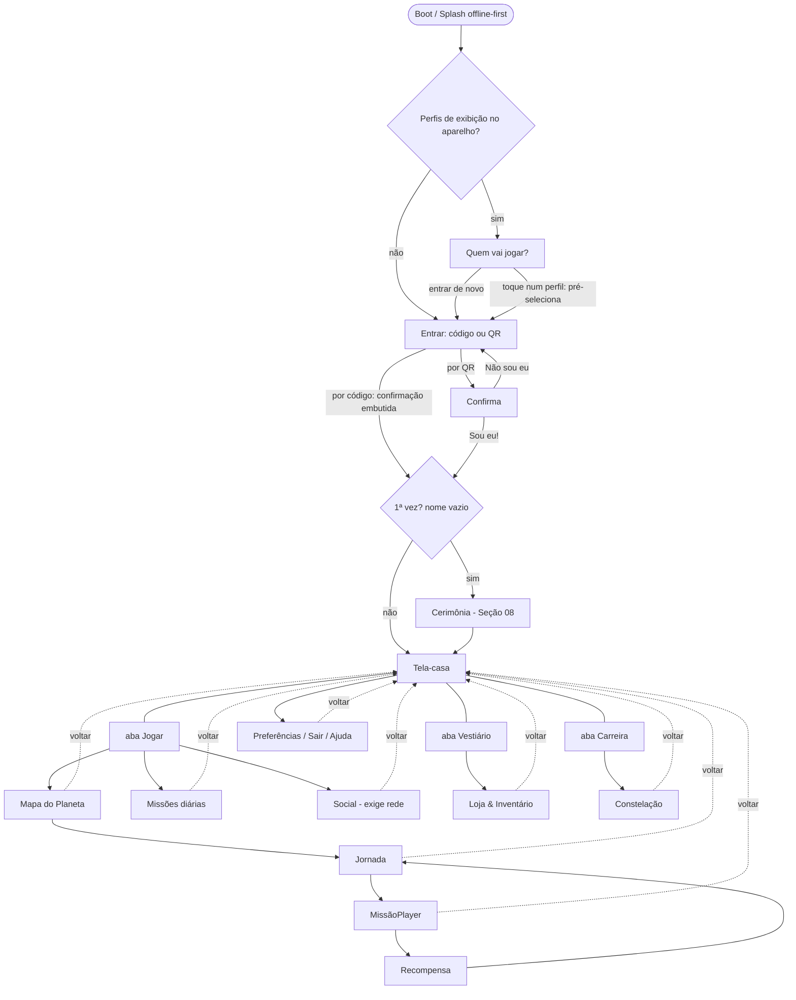
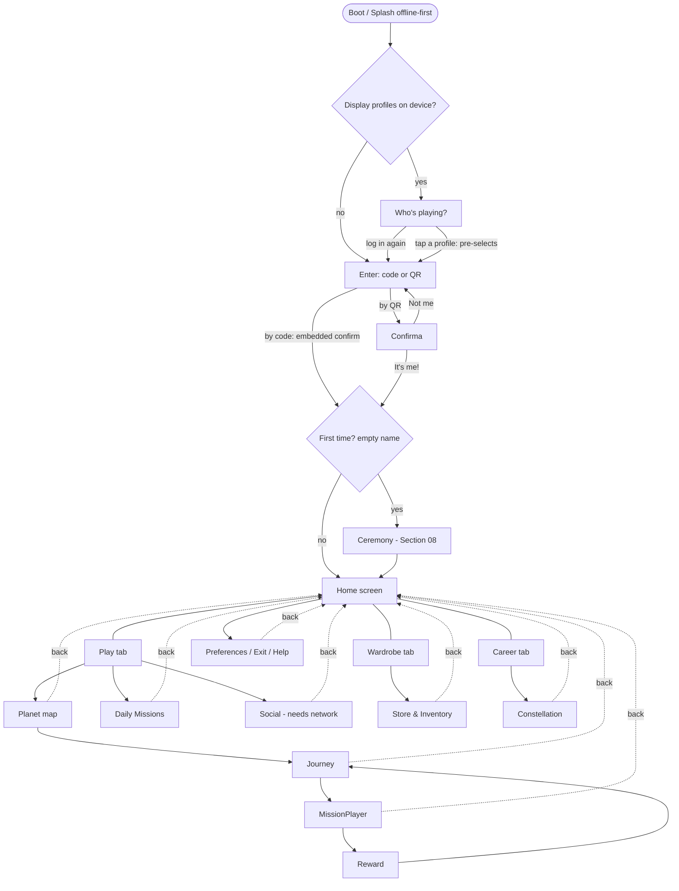

# 07 — UX, Fluxos & Navegação / UX, Flows & Navigation

- **Status:** 🟢 aprovado / approved
- **Padrão / Standard:** [ADR-0002](decisoes/ADR-0002-padrao-de-capitulo.md) (16 partes)
- **Fontes / Sources:** `INDICE.md` (bloco 07, 46 subseções), `docs/quest/01-arquitetura.md`, `docs/quest/README.md`, `_estado-atual/RELATORIO-2026-07-09.md`, código Q0 do app do aluno (`apps/quest/src/estado/sessao.tsx`, `app/App.tsx`, `entrada/`, `cerimonia/`, `lobby/`, `vestiario/`, `carreira/`, `design/tokens.css`), protótipo `constela-play-v7` (fonte estética)
- **Depende de / Depends on:** vocabulário/rótulos → [02](02-vocabulario.md); fantasia/ambientação das cenas → [03](03-universo.md); avatar/prévia 3D/emotes/skate (conteúdo) → [04](04-personagens-avatar.md); economia/HUD (valores)/MissãoPlayer/dica/recompensa (cálculo) → [05](05-sistemas-de-jogo.md); gating/"em breve"/requisitos e forma do Estúdio de autoria → [06](06-pedagogico-bncc.md); cerimônia (fluxo detalhado) → [08](08-onboarding-ftue.md); social/salas/modos ao vivo → [09](09-social.md); card "Missão da Turma"/portais adultos → [10](10-professor-familia.md); router/PWA/offline/render/start_url/gabarito-no-servidor → [11](11-arquitetura.md); privacidade/LGPD do cache local → [12](12-seguranca-privacidade.md); acessibilidade normativa → [13](13-acessibilidade.md); arte/áudio/UI-Kit visual → [15](15-arte-audio-assets.md); i18n normativo → [16](16-localizacao-i18n.md); telemetria → [17](17-telemetria-metricas.md); QA → [18](18-qa-testes.md); rotação/temporadas/flags → [19](19-liveops.md).

> **Convenção / Convention:** "§N" = uma das 16 **partes deste capítulo** / one of the 16 **parts of this
> chapter**; "Seção NN" / "Section NN" = outro capítulo da Bible.
> **Escopo / Scope:** este capítulo decide a **arquitetura de informação, o inventário de telas, o grafo de
> navegação e o contrato de estados de tela** do **app do aluno**. **Não** decide regras de jogo (Seção 05),
> conteúdo/gating (Seção 06), fantasia (Seção 03), arte/áudio (Seção 15), a **tecnologia** de roteamento/PWA/
> render (Seção 11) nem a **norma** de acessibilidade (Seção 13) — apenas as **aplica** e as **referencia**.

---

## 🇧🇷 UX, Fluxos & Navegação

### 1. Objetivo
Ser a **referência definitiva da experiência do app do aluno**: a **arquitetura de informação**, o
**inventário completo de telas** (com dono dos dados e pré-condições), o **grafo de navegação** (arestas
legais, sem becos, sempre com caminho-de-volta), a **máquina de estados de sessão** (lógica) e o **contrato
transversal de estados de tela** (vazio/carregando/erro/offline/sem-permissão) que **toda** tela declara.
Deve permitir que um dev **construa a experiência sem inventar produto**. Decide **telas, fluxos e estados**;
**não** decide a economia (Seção [05](05-sistemas-de-jogo.md)), o conteúdo (Seção [06](06-pedagogico-bncc.md)),
a fantasia (Seção [03](03-universo.md)), a arte (Seção [15](15-arte-audio-assets.md)) nem a **stack**
(Seção [11](11-arquitetura.md)). Inclui, como **anexo separado** (§6), a superfície das **telas do Estúdio de
autoria** (ferramenta de adulto), cuja **existência/forma** é decisão de produto (Seção [06](06-pedagogico-bncc.md) §15).

### 2. Contexto
No ecossistema **Hub → Edu → Quest**, esta é a camada que a **criança toca**: um **PWA** em **tablet/
Chromebook compartilhado**, com público **não-leitor** (1º/2º ano) no piso. **Estado atual (Q0):** o app
**não tem router** — a navegação é uma **máquina de estados em React Context**
(`carregando | deslogado | confirmar | logado`, em `apps/quest/src/estado/sessao.tsx`), com **render
condicional** por early-return e **abas por `useState`** dentro do Lobby; o **token vive só em memória**.
Existem **5 telas reais** (Entrada, ConfirmarIdentidade, Cerimônia, Lobby com 3 abas, Boot) + overlays
(gaveta, despedida, invocação do skate). O **contrato de estados de tela ainda não existe**: só há o boot
"carregando" e o vazio da Carreira — **erro/offline/sem-permissão não têm padrão**, e é por isso que o
**catch silencioso que zera os personagens na Cerimônia** (trava a criança sem mensagem nem retry) é o
**exemplo canônico** do que esta seção corrige (§12). Este capítulo especifica a experiência-alvo (Q1+).

### 3. Filosofia da funcionalidade
**A criança nunca se perde e nunca fica de mãos vazias.** A navegação é desenhada para um humano de 6 anos
que **não lê**: por isso re-derivamos (não redefinimos) as regras de ouro de Seções [00](00-visao-e-norte.md)/
[01](01-principios-imutaveis.md)/[13](13-acessibilidade.md) e as aplicamos a **cada tela**. Três crenças:
- **Uma tela, uma decisão.** No máximo **1 ação primária** por tela; o resto é secundário e silencioso.
- **Todo caminho fala.** **Ícone + cor + áudio** sempre juntos; a tela se **narra sozinha** ao abrir e tem
  "**ouvir de novo**". Nada essencial depende de leitura; **alvos de toque no mínimo da norma** (Seção [13](13-acessibilidade.md)).
- **Sempre há volta.** Nenhum beco sem saída: de **qualquer** profundidade há caminho para a Tela-casa
  (botão, gesto e o *back* físico). **Erro nunca culpa** — é acolhido, com retry, nunca uma tela branca ou
  um "código errado".

### 4. Experiência que o jogador deve sentir
- **Orientação constante:** "eu sei onde estou e como voltar" — o Cosmo, o botão-voltar e o HUD ficam
  sempre no mesmo lugar.
- **O app está vivo e conversa:** entra numa tela e ela **fala**; toca e há resposta imediata (visual +
  som); nunca um **spinner mudo e infinito**.
- **Transição gostosa:** cada mudança de tela é curta, clara e reversível; a celebração pós-missão é em tela
  cheia — nunca se sai "sem nada".
- **Acolhimento no tropeço:** rede caindo, tela vazia ou item indisponível viram uma fala gentil do Cosmo e
  um próximo passo, nunca uma parede.

### 5. Fluxo completo
**Mapa mestre** (do boot ao retorno). A Tela-casa é o **hub**; **além das arestas de ida abaixo, toda tela
profunda tem retorno garantido à Tela-casa** (as arestas pontilhadas "voltar" esquematizam a **invariante**:
toda tela profunda alcança a Tela-casa pelo botão-casa; o *back* passo-a-passo que sobe um nível é a regra
de pilha, §9/§12).

**Primeira vez:** após "Sou eu!", se `nome_exibicao` está vazio, abre a **Cerimônia** (fluxo detalhado =
Seção [08](08-onboarding-ftue.md); aqui é só um nó). **Retorno:** cai direto na Tela-casa, com a Chama e a
Constelação mostrando continuidade. **Offline:** o boot **nunca** mostra tela branca; jornada em cache é
explorável, o que exige rede avisa com gentileza (§12). **Erro:** todo passo tem estado de erro acolhedor
(§12) — o *catch* silencioso da Cerimônia é o anti-exemplo.

### 6. Interface (quando existir)
**Inventário mestre de telas** (o rótulo infantil é da Seção [02](02-vocabulario.md); o dono dos **dados** é
quem alimenta a tela; a 07 decide a **tela**, não os dados):

| # | Tela (interno) | Rótulo infantil | O que é (responsabilidade da 07) | Dono dos dados | Pré-condição |
|---|----------------|-----------------|----------------------------------|----------------|--------------|
| 1 | Boot/Splash | *(transição)* | shell PWA offline-first; decide "Quem vai jogar?" vs. login; nunca tela branca | [11](11-arquitetura.md) | sempre |
| 2 | Quem vai jogar? | **Quem vai jogar?** | **lista de exibição não-sensível** (apelido + miniatura, **sem token**) dos perfis recentes do aparelho; tocar **leva à credencial** (perfil pré-selecionado) — **re-autentica, nunca herda sessão** | auth local ([12](12-seguranca-privacidade.md) p/ cache) | há lista de exibição em cache |
| 3 | Entrar por código | **Entrar** · **Sou eu!** | código falável (SOL1234) → confirmar; sem senha/PIN; letras narradas | auth | deslogado |
| 4 | Entrar por QR | *(câmera/`?qr=`)* | login por leitura do cartão ou deep-link | auth + [11](11-arquitetura.md) | `?qr=` ou câmera |
| 5 | É você, {nome}? | **É você?** | guarda do tablet compartilhado (Princípio 4); tela autônoma em **QR/retomada** (no login por código a confirmação é embutida) | auth | QR/retomada |
| 6 | Cerimônia | *(nó; detalhe = [08](08-onboarding-ftue.md))* | estreia: personagem → apelido → celebração | [08](08-onboarding-ftue.md)/[04](04-personagens-avatar.md) | 1ª vez (`nome_exibicao` vazio) |
| 7 | Tela-casa (aba Jogar) | *(rótulo em aberto — §15)* | hub de retorno; universo ambientado + Cosmo | [03](03-universo.md) | logado |
| 8 | Vestiário (aba) | **Vestiário** | customização do avatar + **entrada da economia cosmética** | [04](04-personagens-avatar.md) | logado |
| 9 | Carreira (aba) | **Carreira** | stats, conquistas, histórico ("Minhas aventuras", rótulo do Q0 a ratificar na [02](02-vocabulario.md)) | [05](05-sistemas-de-jogo.md) | logado |
| 10 | Mapa do Planeta | **Planeta** | trilha de Jornadas do ano escolar | [06](06-pedagogico-bncc.md) | escolher Planeta |
| 11 | Jornada | **Jornada** | sequência de Missões ●─●─○ + Chefão | [06](06-pedagogico-bncc.md) | escolher Jornada |
| 12 | MissãoPlayer | *(host)* | carrega o plugin de mecânica; apresenta Desafios **sem gabarito** | [05](05-sistemas-de-jogo.md)+[11](11-arquitetura.md) | escolher Missão |
| 13 | Recompensa | *(celebração)* | fecho em tela cheia (XP/estrelas/moedas/item) — nunca de mãos vazias | [05](05-sistemas-de-jogo.md)+[15](15-arte-audio-assets.md) | fim de Missão |
| 14 | Loja & Inventário | **Loja** (rótulo = [02](02-vocabulario.md)) | vitrine cosmética; compra só com Moedas ganhas | [19](19-liveops.md)+[05](05-sistemas-de-jogo.md) | do Vestiário |
| 15 | Constelação | **Constelação** | progresso **eu×eu-de-ontem** + álbum de colecionáveis; nunca ranking | [05](05-sistemas-de-jogo.md)/[03](03-universo.md) | da Carreira/céu |
| 16 | Missões diárias | **Missões diárias** | presente de login, as diárias do dia (quantidade = Seção [05](05-sistemas-de-jogo.md)), Chama do Cosmo | [05](05-sistemas-de-jogo.md) | do Jogar/HUD |
| 17 | Social | **Estudar com um amigo** · **Corrida** | amigos da escola, convites, modos ao vivo | [09](09-social.md) | logado + rede + `social_ativo` |
| 18 | Telas de sistema | *(gaveta)* | preferências permitidas (som/música/reduzir-animações), sair, ajuda | 07/[13](13-acessibilidade.md) | sempre |

**Ação primária única (uma por tela):** Tela-casa = **escolher um Planeta**; Vestiário = **trocar uma
peça**; Carreira = **abrir a Constelação**; Mapa do Planeta = **entrar numa Jornada**; Jornada = **jogar a
próxima Missão**; MissãoPlayer = **responder o Desafio**; Recompensa = **continuar**; Loja = **ver um
item**; Constelação = **abrir um colecionável**; Missões diárias = **resgatar o presente**; Social =
**convidar um amigo** ("Corrida" é ação secundária). As telas de entrada/confirmação têm ação primária
evidente (entrar, "Sou eu!"). **Spec de cada tela = contrato mínimo:** rótulo (02) ·
ação primária única · estados obrigatórios (§12) · narração de entrada (§7) · aresta(s) de saída (§9).
Wireframes de referência = Apêndice [E](apendice-E-wireframes.md); arte = Seção [15](15-arte-audio-assets.md).

**Nota — identidade da Constelação:** se a "Tela da Constelação" (item 15) é uma **tela distinta** ou a mesma
superfície do **céu da Tela-casa** é **pendência da Seção [03](03-universo.md)** (§15); a 07 a inventaria como
superfície de progresso (alcançada da Carreira/céu) **sem pré-decidir** essa identidade.

**Anexo — Estúdio de autoria (ferramenta de ADULTO; superfície separada).** A Seção [06](06-pedagogico-bncc.md)
delega "todas as telas" à 07, o que inclui o **Estúdio/CRUD** onde o conteúdo pedagógico é cadastrado/revisado/
publicado. Como é ferramenta de **adulto**, vive **fora do app do aluno**, com **linguagem e padrões
próprios** (sem vocabulário infantil, sem narração obrigatória). **A existência e a forma do Estúdio** (studio
próprio vs. admin do Edu vs. import) é **decisão de produto em aberto** (Seção [06](06-pedagogico-bncc.md) §15);
enquanto não for decidida, a 07 fixa apenas o **contrato de UX** desse anexo: fluxo editorial rascunho→
publicada→arquivada visível (Seção [06](06-pedagogico-bncc.md) §8j) e validação de `bncc_codigo`/áudio na
própria tela. *(A garantia técnica de que o gabarito nunca trafega ao cliente do aluno é da Seção
[11](11-arquitetura.md)/[12](12-seguranca-privacidade.md); aqui a 07 só apresenta Desafios sem gabarito.)* O
inventário detalhado dessas telas é escrito **quando** a ferramenta for decidida.

### 7. UX
- **Áudio como camada de navegação:** ao **entrar** em cada tela/estado, a narração pt-BR toca
  **automaticamente**; há sempre **"ouvir de novo"**; o Cosmo fala em cada transição (público não-leitor,
  Princípio 9). Produção do áudio = Seção [15](15-arte-audio-assets.md).
- **HUD persistente & wayfinding:** Cosmo, botão-voltar e o HUD (Moedas/Estrelas/nível/Chama) ficam em
  **posição fixa** entre telas. A 07 decide a **composição e o layout**; os **valores** são expostos pela
  Seção [05](05-sistemas-de-jogo.md).
- **Ordem de camadas (fixa, decisão da 07):** base < HUD < overlay de item especial < modal < toast <
  celebração em tela cheia. **No máximo 1 modal por vez**, com **foco preso**; toasts em **fila
  não-bloqueante**.
- **Feedback dos controles:** todo alvo tem estados **toque/hover/pressed/disabled** visuais **e** sonoros;
  **desabilitado é explicado por áudio** ("essa abre quando você juntar 3 ⭐"), nunca silêncio morto.
- **Transições:** catálogo de entra/sai por **categoria** (empurrar, cross-fade, zoom de celebração) com
  **fallback obrigatório** sob `prefers-reduced-motion`. Os **números** (durações/curvas) subordinam-se ao
  **device-alvo** (§15) — a categoria é decidida aqui, o orçamento numérico é pendência.
- **Vocabulário canônico** (Seção [02](02-vocabulario.md)): abas **Jogar/Vestiário/Carreira**, **Planeta/
  Jornada/Missão/Desafio/Chefão/Constelação**; **jamais** "lobby/party/prova/exercício/tarefa/erro fatal/
  reprovado". O rótulo da Tela-casa está **em aberto** (§15).
- **Acessibilidade** (norma = Seção [13](13-acessibilidade.md); a 07 **aplica**): alvo de toque no **mínimo
  da Seção 13**, 1 ação primária, ícone+cor+áudio, `prefers-reduced-motion`, modo daltônico, ordem de foco e
  navegação por teclado (Chromebook)/switch; **tempo nunca é critério único**.
- **i18n de layout** (norma = Seção [16](16-localizacao-i18n.md)): telas toleram **expansão de texto PT→EN**
  sem quebrar; ícones culturalmente neutros.

### 8. Game Design
**N/A — a dimensão de jogo (mecânica, economia, progressão, recompensa) é da Seção [05](05-sistemas-de-jogo.md).**
A 07 **hospeda** a apresentação: a **tela de Recompensa** (§6, item 13) e o **HUD** (§7) como superfícies, e as
**transições/juice** (§7) como camada de sensação — sem decidir nenhum número ou regra de jogo.

### 9. Regras de negócio
- **Sempre há caminho-de-volta:** o **grafo (§5)** declara as arestas de ida **e** as arestas-de-volta
  (pontilhadas → Tela-casa); combinado à **regra de pilha** (*back* = sobe um nível → Tela-casa), nenhuma
  tela é um beco sem saída.
- **Uma ação primária por tela** e **no máximo 1 modal por vez** (foco preso; fila de toasts; camadas em
  ordem fixa, §7).
- **Guarda do tablet compartilhado:** token **só em memória**; o boot **sempre** confirma **"É você, {nome}?"**
  antes de herdar qualquer conta (Princípio 4). A tela "Quem vai jogar?" guarda apenas uma **lista de
  exibição não-sensível** (sem token) e **exige credencial no toque** (perfil pré-selecionado; nunca herda
  sessão) — o que pode ser cacheado é regra da Seção [12](12-seguranca-privacidade.md). Estado é **por
  perfil**, nunca vaza entre contas.
- **Nada de adulto na tela da criança:** relatórios, ranking individual, Moedas em dinheiro real, texto livre
  — **proibidos** na UX do aluno (Princípios 2, 5, 7; separação de linguagens com a Seção [10](10-professor-familia.md)).
- **Contrato de estados obrigatório:** **toda** tela declara os **5 estados** (vazio/carregando/erro/offline/
  sem-permissão) com **visual + áudio + ação de saída** (§12) — **não** é opcional; a ausência é o bug (o
  *catch* silencioso).
- **Erro nunca culpa** (Princípio 6): mensagens acolhedoras, com retry; jamais "código errado" que culpe a
  criança — cartão inválido/aluno arquivado recebe um **rótulo acolhedor** (o termo canônico é da Seção
  [02](02-vocabulario.md)), nunca uma acusação.

### 10. Arquitetura técnica
> A **tecnologia** (router vs. máquina de estados, PWA/service worker, offline/IndexedDB, render DOM-SVG vs.
> 3D, `start_url`) é da Seção [11](11-arquitetura.md). Aqui fica o **contrato lógico** de sessão e navegação.

- **Máquina de estados de sessão (lógica; espelha o enum do Q0):** estados `carregando → {deslogado |
  confirmar} → logado`. Sub-view de `deslogado`: **"Quem vai jogar?"** (branch quando há lista de exibição em
  cache). Sub-estado derivado de `logado`: `cerimôniaAberta` quando `nome_exibicao` vazio. Transições
  **lógicas**: `escolher perfil` (de "Quem vai jogar?") → **credencial** (login com perfil pré-selecionado),
  `entrar` (login por código → `logado`), `entrar por QR` → `confirmar`, `confirmar identidade` → `logado`,
  `negar/sair` → `deslogado`, `expirar` → `deslogado` (sessão inválida — o mecanismo 401/refresh é da Seção
  [11](11-arquitetura.md)). *(A **implementação** — Context vs. store, nomes de método — é da Seção
  [11](11-arquitetura.md).)*
- **Grafo de navegação:** o conjunto de **arestas legais** entre as telas do §6 (o mapa do §5), incluindo as
  **arestas-de-volta**, com a invariante "**toda tela alcança a Tela-casa**".
- **Contrato de estados de tela:** a **matriz** (§12) que cada tela implementa; a serialização/carregamento
  dos dados é da Seção [11](11-arquitetura.md).
- **Roteamento & deep-links (mapa lógico):** as **intenções** de link — `start_url` do PWA, `?qr=` de login,
  **retomar Missão**, link do **Portal da Família** — do ponto de vista da **navegação**. **Se** isso vira um
  **router real** com URLs por tela é **pendência cross-módulo** (Seção [11](11-arquitetura.md) + §15).
- **Não decide aqui:** a **stack** de rotas/estado, o service worker, o motor de render — Seção [11](11-arquitetura.md).

### 11. Dependências com outros módulos
- **Rótulos infantis / vocabulário** → Seção [02](02-vocabulario.md) (referenciar, nunca cunhar).
- **Ambientação das cenas (Tela-casa, Planeta)** → Seção [03](03-universo.md); arte = [15](15-arte-audio-assets.md).
- **Prévia 3D do avatar, conteúdo da invocação do skate, conjunto de emotes** → Seção [04](04-personagens-avatar.md).
- **Valores do HUD, MissãoPlayer/registry, regra da dica, cálculo da recompensa, geração das diárias** → Seção [05](05-sistemas-de-jogo.md).
- **Gating/"em breve", o que autorar no Estúdio + existência/forma da ferramenta** (as telas do Estúdio são da 07, §6 anexo) → Seção [06](06-pedagogico-bncc.md).
- **Cerimônia (fluxo detalhado)** → Seção [08](08-onboarding-ftue.md).
- **Amigos/salas/modos ao vivo, reconexão social** → Seção [09](09-social.md).
- **Card "Missão da Turma" na Tela-casa, Portal da Família** → Seção [10](10-professor-familia.md).
- **Router/PWA/offline/render/`start_url`, autoridade do gabarito no servidor** → Seção [11](11-arquitetura.md).
- **Privacidade/LGPD do cache local (lista de exibição)** → Seção [12](12-seguranca-privacidade.md).
- **Norma de acessibilidade** → Seção [13](13-acessibilidade.md); **UI-Kit visual/arte/áudio** → Seção [15](15-arte-audio-assets.md); **i18n** → Seção [16](16-localizacao-i18n.md); **telemetria de UX** → Seção [17](17-telemetria-metricas.md); **testes** → Seção [18](18-qa-testes.md); **rotação da loja/temporadas/flags** → Seção [19](19-liveops.md).

Este capítulo **alimenta:** a superfície onde a Seção [05](05-sistemas-de-jogo.md) mostra HUD/recompensa, a
Seção [03](03-universo.md) mostra o universo, a Seção [09](09-social.md) mostra o social e a Seção
[10](10-professor-familia.md) planta o card da Missão da Turma — todas **referenciam a matriz de estados
(§12) e o grafo (§5) desta seção**.

### 12. Casos extremos (Edge Cases)
**Toda tela declara os 5 estados** — este é o **contrato de estados de tela**. A 07 é dona do **contrato de
apresentação**; o **gatilho/regra** é de 05/06/03/09/11, que a 07 referencia:

| Estado | Contrato de apresentação (visual + áudio + saída) | Gatilho/dono da regra |
|--------|---------------------------------------------------|-----------------------|
| **Carregando** | skeleton + Cosmo presente + áudio de espera; **nunca spinner mudo/infinito**; escala para **Erro** após limite | dados/infra = [11](11-arquitetura.md) |
| **Vazio** | ilustração acolhedora + fala do Cosmo + **ação de 1º passo** (ex.: histórico sem aventuras) | conteúdo = [05](05-sistemas-de-jogo.md)/[06](06-pedagogico-bncc.md) |
| **Erro** (rede/servidor) | mensagem **sem culpa** + **retry** (auto e manual) + rota de fuga; jamais tela branca | infra = [11](11-arquitetura.md) |
| **Offline** | banner de sinal; **o que funciona** (Jornada em cache) vs. **o que exige rede** (Social); fila de tentativas reconcilia ao reconectar | cache/fila = [11](11-arquitetura.md)/[05](05-sistemas-de-jogo.md) §12 |
| **Sem-permissão** | social desligado pela escola/família, horário bloqueado, ou aluno arquivado = **rótulo acolhedor** (canônico = Seção [02](02-vocabulario.md)) — **nunca** "código errado" que culpe a criança | regra = [06](06-pedagogico-bncc.md)/[09](09-social.md)/[10](10-professor-familia.md) |

Casos específicos:
- **Cerimônia sem rede (bug canônico Q0):** hoje o `personagensBase()` cai num *catch* silencioso que zera a
  lista e trava a criança sem mensagem nem retry. **Decisão da 07:** este é o exemplo do estado **Erro** —
  toda tela crítica exige retry + fala do Cosmo. **A 07 é dona do contrato; a correção do código** é tarefa
  de implementação (a tela da Cerimônia é da Seção [08](08-onboarding-ftue.md); o contrato de avatar legado é
  da Seção [04](04-personagens-avatar.md)).
- **Tablet compartilhado / retomada:** boot sempre passa por "É você?" (§9).
- **Back em qualquer profundidade:** o *back* físico (Android/Chromebook) sobe um nível e, no topo, volta à
  Tela-casa; nunca fecha o app num beco (§9). O **gancho de plataforma** é da Seção [11](11-arquitetura.md).
- **Planeta não ofertado pela escola:** o **estado da tela** ("em breve"; a metáfora visual é da Seção
  [03](03-universo.md)) é apresentado pela 07; **a política** (some/bloqueia/"em breve") é **pendência
  cross-módulo** (Seção [03](03-universo.md)/[06](06-pedagogico-bncc.md), ADR-candidato).
- **Reconexão em modo ao vivo:** a **superfície** de "reconectando…" é da 07 (estado da tela Social); a
  **regra** de pausa/timeout é da Seção [09](09-social.md)/[11](11-arquitetura.md).
- **Orientação e telas pequenas:** adapta tablet-paisagem ↔ celular-retrato; o breakpoint numérico depende do
  device-alvo (§15).

### 13. Escalabilidade futura
- **Nova tela** entra pelo **inventário (§6) + grafo (§5)** declarando ação primária, estados (§12) e
  aresta-de-volta — zero mudança na arquitetura de navegação.
- **Novo item especial** reusa a **orquestração de overlays/modais** (§7); a **forma** de cada item (overlay
  vs. tela dedicada) segue o padrão a decidir em §15.
- **i18n de layout** já previsto (§7) — novos idiomas entram sem redesenho (norma = Seção [16](16-localizacao-i18n.md)).
- **Estúdio de autoria** cresce como **superfície de adulto separada** (§6 anexo), sem contaminar o app do aluno.
- **Router real** (se decidido, §15) pluga URLs por tela sobre o grafo lógico já definido, sem redesenhar a IA.

### 14. Checklist de implementação
- [ ] Inventário de telas (§6) implementado com rótulo (02), 1 ação primária definida e aresta-de-volta cada.
- [ ] Grafo de navegação (§5) sem becos: **toda** tela alcança a Tela-casa (arestas-de-volta + regra de pilha); *back* físico mapeado (§12).
- [ ] Máquina de estados de sessão (§10) com a guarda "É você?" no boot e token só em memória; "Quem vai jogar?" só com lista de exibição não-sensível.
- [ ] **Contrato de estados (§12)** implementado em **todas** as telas (vazio/carregando/erro/offline/sem-permissão) com visual+áudio+saída.
- [ ] Correção do *catch* silencioso da Cerimônia como caso do estado Erro (retry + fala do Cosmo).
- [ ] Narração automática ao entrar em cada tela/estado + "ouvir de novo" (§7).
- [ ] HUD persistente e Cosmo/voltar em posição fixa; ordem de camadas fixa; feedback toque/hover/pressed/disabled com áudio (§7).
- [ ] Orquestração de overlays/modais/toasts (1 modal, foco preso, fila de toasts) + contêiner de item-especial (§7/§15).
- [ ] Transições com fallback `prefers-reduced-motion`; foco/teclado (Chromebook)/switch (ponte Seção [13](13-acessibilidade.md)).
- [ ] Layout responsivo (tablet-paisagem/celular-retrato/safe areas) e tolerância a expansão PT→EN.
- [ ] Eventos de telemetria por transição de tela (ponte Seção [17](17-telemetria-metricas.md)); E2E dos fluxos críticos + snapshots por estado (ponte Seção [18](18-qa-testes.md)).
- [ ] DoD conferido contra o Apêndice [F](apendice-F-checklists-dod.md).

### 15. Questões em aberto
Decisões de **produto/arquitetura** que **só o dono toma** — a 07 registra, não improvisa:
- ⚠️ **Router real vs. máquina de estados (07↔11):** adotar URLs navegáveis (deep-links) ou manter a sessão
  sem rotas? Muda o modelo de compartilhamento e a arquitetura de estado (Seção [11](11-arquitetura.md), subseção 11.37).
- ⚠️ **Rótulo infantil oficial da Tela-casa:** "lobby" é proibido e não há nome canônico (registro em Seção
  [02](02-vocabulario.md); proposta narrativa em Seção [03](03-universo.md)).
- ⚠️ **Skate: overlay sobre o Vestiário vs. tela dedicada** — define a **forma** do padrão reutilizável dos
  itens especiais (o **contêiner** é da 07, §7; o **conteúdo** da animação é da Seção [04](04-personagens-avatar.md)).
- ⚠️ **Esquema de deep-link do QR (`?qr=`) e entrada do Portal da Família** — envolve segurança da credencial
  por URL (Seção [12](12-seguranca-privacidade.md)) e a fase do Portal (Q3, Seção [10](10-professor-familia.md)).
- ⚠️ **Device-alvo mínimo** — calibra o orçamento de transições/animações e os breakpoints (mesma pendência
  de Seção [11](11-arquitetura.md)/[15](15-arte-audio-assets.md), Princípio 17).
- ⚠️ **Estúdio de autoria (forma da ferramenta)** — a existência/forma é decisão de produto (Seção [06](06-pedagogico-bncc.md) §15); a 07 só fixa o contrato de UX do anexo (§6).
- ⚠️ **Identidade da superfície da Constelação** — mesma superfície do céu da Tela-casa vs. tela distinta é
  pendência da Seção [03](03-universo.md); a 07 não pré-decide (§6).

*(Pontos de entrada de Loja/Constelação/Diárias/Social a partir da Tela-casa **são decididos pelo grafo do
§5** — decisão de navegação da 07; apenas o **tratamento visual** do ponto de entrada é da Seção [15](15-arte-audio-assets.md).)*

### 16. ADR (Architecture Decision Record)
**Decisões arquiteturais/de UX registradas por este capítulo:**
1. **Tela-casa como hub único** e **invariante "sempre há caminho-de-volta"**: o grafo (§5) declara arestas
   de ida **e** de volta e o *back* físico nunca fecha o app num beco.
2. **Contrato transversal de estados obrigatório** (vazio/carregando/erro/offline/sem-permissão) em **toda**
   tela, com visual+áudio+ação de saída — a 07 é dona da **apresentação**, 05/06/03/09/11 do **gatilho**.
3. **Erro nunca é tela branca nem culpa a criança**: retry + fala do Cosmo; um **rótulo acolhedor** (canônico
   = Seção [02](02-vocabulario.md)) no lugar de "código errado".
4. **Guarda "É você?" no boot** e **token só em memória**; "Quem vai jogar?" guarda só lista de exibição
   não-sensível e **exige credencial no toque** (aplicação do Princípio 4; privacidade do cache = Seção [12](12-seguranca-privacidade.md)).
5. **HUD/composição é da 07; valores são da 05** — fronteira explícita para não duplicar a economia.
6. **Roteamento = mapa lógico na 07; tecnologia (router vs. state machine) = Seção [11](11-arquitetura.md)** —
   uma única pendência compartilhada (§15).
7. **Orquestração de overlays: 1 modal por vez, foco preso, fila de toasts, ordem de camadas fixa** (§7); o
   **contêiner de item-especial** hospeda o **conteúdo** da animação da Seção [04](04-personagens-avatar.md);
   a **forma** do skate (overlay vs. tela) é pendência (§15).
8. **Estúdio de autoria como superfície de adulto separada** (anexo §6), sem vocabulário/narração infantil; a
   garantia de gabarito fora do cliente é da Seção [11](11-arquitetura.md)/[12](12-seguranca-privacidade.md);
   a forma da ferramenta = decisão de produto (Seção [06](06-pedagogico-bncc.md) §15).
9. **Princípios de UX re-derivados, não redefinidos**: §3/§7 aplicam 00/01/13 às telas e **citam** a Seção
   [13](13-acessibilidade.md) como norma (inclusive o mínimo do alvo de toque), **sem cravar limiares próprios**.

*(Registro inline; sem criar arquivo de ADR sem autorização.)*

---

## 🇬🇧 UX, Flows & Navigation

### 1. Objective
Be the **definitive reference for the student app's experience**: the **information architecture**, the
**complete screen inventory** (with data owner and preconditions), the **navigation graph** (legal edges, no
dead ends, always a way back), the **session state machine** (logical) and the **cross-cutting screen-state
contract** (empty/loading/error/offline/no-permission) that **every** screen declares. It must let a dev
**build the experience without inventing product**. It decides **screens, flows and states**; it does **not**
decide the economy (Section [05](05-sistemas-de-jogo.md)), content (Section [06](06-pedagogico-bncc.md)),
fantasy (Section [03](03-universo.md)), art (Section [15](15-arte-audio-assets.md)) or the **stack** (Section
[11](11-arquitetura.md)). It includes, as a **separate annex** (§6), the **authoring-studio screens** surface
(an adult tool), whose **existence/form** is a product decision (Section [06](06-pedagogico-bncc.md) §15).

### 2. Context
In the **Hub → Edu → Quest** ecosystem, this is the layer the **child touches**: a **PWA** on a **shared
tablet/Chromebook**, with **non-readers** (1st/2nd grade) as the floor. **Current state (Q0):** the app has
**no router** — navigation is a **React Context state machine** (`carregando | deslogado | confirmar |
logado`, in `apps/quest/src/estado/sessao.tsx`), with **conditional render** by early-return and **tabs via
`useState`** inside the Lobby; the **token lives in memory only**. There are **5 real screens** (Entrada,
ConfirmarIdentidade, Cerimônia, Lobby with 3 tabs, Boot) + overlays (drawer, goodbye, skate invocation). The
**screen-state contract does not yet exist**: only the "loading" boot and the Career empty state exist —
**error/offline/no-permission have no pattern** — which is why the **silent catch that zeroes the characters
in the Ceremony** (freezing the child with no message or retry) is the **canonical example** of what this
section fixes (§12). This chapter specifies the target experience (Q1+).

### 3. Feature philosophy
**The child never gets lost and never leaves empty-handed.** Navigation is designed for a 6-year-old who
**can't read**: so we re-derive (not redefine) the golden rules of Sections [00](00-visao-e-norte.md)/
[01](01-principios-imutaveis.md)/[13](13-acessibilidade.md) and apply them to **every screen**. Three beliefs:
- **One screen, one decision.** At most **1 primary action** per screen; the rest is secondary and quiet.
- **Every path speaks.** **Icon + color + audio** always together; the screen **narrates itself** on open and
  has "**listen again**". Nothing essential depends on reading; **touch targets at the norm's minimum**
  (Section [13](13-acessibilidade.md)).
- **There's always a way back.** No dead ends: from **any** depth there's a path to the Home screen (button,
  gesture and the physical *back*). **Mistakes never blame** — they're welcomed, with retry, never a blank
  screen or a "wrong code".

### 4. The experience the player should feel
- **Constant orientation:** "I know where I am and how to go back" — Cosmo, the back button and the HUD stay
  in the same place.
- **The app is alive and talks:** enter a screen and it **speaks**; touch and there's an immediate response
  (visual + sound); never a **silent, infinite spinner**.
- **Pleasant transitions:** each screen change is short, clear and reversible; the post-mission celebration is
  full-screen — you never leave "with nothing".
- **Welcome on a stumble:** dropping network, an empty screen or an unavailable item become a gentle Cosmo
  line and a next step, never a wall.

### 5. Complete flow
**Master map** (from boot to return). The Home screen is the **hub**; **beyond the forward edges below, every
deep screen has a guaranteed return to Home** (the dotted "back" edges schematize the **invariant**: every
deep screen reaches Home via the home button; the step-by-step *back* that goes up one level is the stack
rule, §9/§12).

**First time:** after "It's me!", if `nome_exibicao` is empty, the **Ceremony** opens (detailed flow =
Section [08](08-onboarding-ftue.md); here it's just a node). **Return:** straight to the Home screen, with the
Flame and Constellation showing continuity. **Offline:** boot **never** shows a blank screen; a cached Journey
is explorable, what needs network warns gently (§12). **Error:** every step has a welcoming error state (§12)
— the Ceremony's silent *catch* is the anti-example.

### 6. Interface (when it exists)
**Master screen inventory** (the child label is Section [02](02-vocabulario.md)'s; the **data** owner feeds
the screen; 07 decides the **screen**, not the data):

| # | Screen (internal) | Child label | What it is (07's responsibility) | Data owner | Precondition |
|---|-------------------|-------------|----------------------------------|------------|--------------|
| 1 | Boot/Splash | *(transition)* | offline-first PWA shell; decides "Who's playing?" vs. login; never a blank screen | [11](11-arquitetura.md) | always |
| 2 | Who's playing? | **Who's playing?** | **non-sensitive display list** (nickname + thumbnail, **no token**) of the device's recent profiles; tapping **goes to the credential** (profile pre-selected) — **re-authenticates, never inherits a session** | local auth ([12](12-seguranca-privacidade.md) for cache) | display list cached |
| 3 | Enter by code | **Enter** · **It's me!** | speakable code (SOL1234) → confirm; no password/PIN; letters narrated | auth | logged out |
| 4 | Enter by QR | *(camera/`?qr=`)* | login by scanning the card or deep-link | auth + [11](11-arquitetura.md) | `?qr=` or camera |
| 5 | Is this you, {name}? | **Is this you?** | shared-tablet guard (Principle 4); standalone screen on **QR/resume** (by code the confirm is embedded) | auth | QR/resume |
| 6 | Ceremony | *(node; detail = [08](08-onboarding-ftue.md))* | debut: character → nickname → celebration | [08](08-onboarding-ftue.md)/[04](04-personagens-avatar.md) | 1st time (`nome_exibicao` empty) |
| 7 | Home screen (Play tab) | *(label open — §15)* | return hub; ambient universe + Cosmo | [03](03-universo.md) | logged in |
| 8 | Wardrobe (tab) | **Wardrobe** | avatar customization + **cosmetic-economy entry** | [04](04-personagens-avatar.md) | logged in |
| 9 | Career (tab) | **Career** | stats, achievements, history ("My adventures", a Q0 label to ratify in [02](02-vocabulario.md)) | [05](05-sistemas-de-jogo.md) | logged in |
| 10 | Planet map | **Planet** | track of the grade's Journeys | [06](06-pedagogico-bncc.md) | pick a Planet |
| 11 | Journey | **Journey** | sequence of Missions ●─●─○ + Boss | [06](06-pedagogico-bncc.md) | pick a Journey |
| 12 | MissionPlayer | *(host)* | loads the mechanic plugin; presents Challenges **without the answer key** | [05](05-sistemas-de-jogo.md)+[11](11-arquitetura.md) | pick a Mission |
| 13 | Reward | *(celebration)* | full-screen close (XP/stars/coins/item) — never empty-handed | [05](05-sistemas-de-jogo.md)+[15](15-arte-audio-assets.md) | end of Mission |
| 14 | Store & Inventory | **Store** (label = [02](02-vocabulario.md)) | cosmetic showcase; buy only with earned Coins | [19](19-liveops.md)+[05](05-sistemas-de-jogo.md) | from Wardrobe |
| 15 | Constellation | **Constellation** | **me×yesterday-me** progress + collectible album; never a ranking | [05](05-sistemas-de-jogo.md)/[03](03-universo.md) | from Career/sky |
| 16 | Daily Missions | **Daily Missions** | login gift, the day's dailies (count = Section [05](05-sistemas-de-jogo.md)), Cosmo's Flame | [05](05-sistemas-de-jogo.md) | from Play/HUD |
| 17 | Social | **Study with a friend** · **Race** | school friends, invites, live modes | [09](09-social.md) | logged in + network + `social_ativo` |
| 18 | System screens | *(drawer)* | allowed preferences (sound/music/reduce-motion), exit, help | 07/[13](13-acessibilidade.md) | always |

**Single primary action (one per screen):** Home = **pick a Planet**; Wardrobe = **swap a piece**; Career =
**open the Constellation**; Planet map = **enter a Journey**; Journey = **play the next Mission**;
MissionPlayer = **answer the Challenge**; Reward = **continue**; Store = **view an item**; Constellation =
**open a collectible**; Daily Missions = **claim the gift**; Social = **invite a friend** ("Race" is a
secondary action). The entry/confirm screens have an evident primary action (enter, "It's me!"). **Each screen's spec = minimal contract:** label (02) · single primary action ·
mandatory states (§12) · entry narration (§7) · exit edge(s) (§9). Reference wireframes = Appendix
[E](apendice-E-wireframes.md); art = Section [15](15-arte-audio-assets.md).

**Note — Constellation surface identity:** whether the "Constellation screen" (item 15) is a **distinct
screen** or the same surface as the **Home-screen sky** is a **Section [03](03-universo.md) pending decision**
(§15); 07 inventories it as a progress surface (reached from Career/sky) **without pre-deciding** that identity.

**Annex — Authoring Studio (an ADULT tool; separate surface).** Section [06](06-pedagogico-bncc.md) delegates
"all screens" to 07, which includes the **Studio/CRUD** where pedagogical content is entered/reviewed/
published. As an **adult** tool it lives **outside the student app**, with **its own language and patterns**
(no child vocabulary, no mandatory narration). **The Studio's existence and form** (own studio vs. Edu admin
vs. import) is an **open product decision** (Section [06](06-pedagogico-bncc.md) §15); until decided, 07 fixes
only the **UX contract** of this annex: a visible editorial cycle draft→published→archived (Section
[06](06-pedagogico-bncc.md) §8j) and on-screen `bncc_codigo`/audio validation. *(The technical guarantee that
the answer key never reaches the student client is Section [11](11-arquitetura.md)/[12](12-seguranca-privacidade.md)'s;
here 07 only presents Challenges without the answer key.)* The detailed inventory of these screens is written
**when** the tool is decided.

### 7. UX
- **Audio as a navigation layer:** on **entering** each screen/state, pt-BR narration plays
  **automatically**; there's always **"listen again"**; Cosmo speaks on each transition (non-reader audience,
  Principle 9). Audio production = Section [15](15-arte-audio-assets.md).
- **Persistent HUD & wayfinding:** Cosmo, the back button and the HUD (Coins/Stars/level/Flame) stay in a
  **fixed position** across screens. 07 decides **composition and layout**; the **values** are exposed by
  Section [05](05-sistemas-de-jogo.md).
- **Layer order (fixed, 07's decision):** base < HUD < special-item overlay < modal < toast < full-screen
  celebration. **At most 1 modal at a time**, with **trapped focus**; toasts in a **non-blocking queue**.
- **Control feedback:** every target has **touch/hover/pressed/disabled** states, visual **and** audible;
  **disabled is explained by audio** ("this opens when you collect 3 ⭐"), never dead silence.
- **Transitions:** a catalog of enter/exit by **category** (push, cross-fade, celebration zoom) with a
  **mandatory fallback** under `prefers-reduced-motion`. The **numbers** (durations/curves) are subordinate to
  the **target device** (§15) — the category is decided here, the numeric budget is pending.
- **Canonical vocabulary** (Section [02](02-vocabulario.md)): tabs **Play/Wardrobe/Career**, **Planet/Journey/
  Mission/Challenge/Boss/Constellation**; **never** "lobby/party/test/exercise/task/fatal error/failed". The
  Home-screen label is **open** (§15).
- **Accessibility** (norm = Section [13](13-acessibilidade.md); 07 **applies** it): touch target at the
  **Section 13 minimum**, 1 primary action, icon+color+audio, `prefers-reduced-motion`, colorblind mode, focus
  order and keyboard (Chromebook)/switch navigation; **time is never the sole criterion**.
- **Layout i18n** (norm = Section [16](16-localizacao-i18n.md)): screens tolerate **PT→EN text expansion**
  without breaking; culturally neutral icons.

### 8. Game Design
**N/A — the game dimension (mechanics, economy, progression, reward) is Section [05](05-sistemas-de-jogo.md)'s.**
07 **hosts** the presentation: the **Reward screen** (§6, item 13) and the **HUD** (§7) as surfaces, and the
**transitions/juice** (§7) as a feel layer — deciding no game number or rule.

### 9. Business rules
- **There's always a way back:** the **graph (§5)** declares the forward edges **and** the back edges (dotted
  → Home); combined with the **stack rule** (*back* = up one level → Home), no screen is a dead end.
- **One primary action per screen** and **at most 1 modal at a time** (trapped focus; toast queue; fixed layer
  order, §7).
- **Shared-tablet guard:** token **in memory only**; boot **always** confirms **"Is this you, {name}?"** before
  inheriting any account (Principle 4). The "Who's playing?" screen keeps only a **non-sensitive display list**
  (no token) and **requires a credential on tap** (profile pre-selected; never inherits) — what may be cached
  is Section [12](12-seguranca-privacidade.md)'s rule. State is **per profile**, never leaking between accounts.
- **Nothing adult on the child's screen:** reports, individual ranking, real-money Coins, free text —
  **forbidden** in the student UX (Principles 2, 5, 7; language separation with Section [10](10-professor-familia.md)).
- **Mandatory state contract:** **every** screen declares the **5 states** (empty/loading/error/offline/
  no-permission) with **visual + audio + exit action** (§12) — **not** optional; its absence is the bug (the
  silent *catch*).
- **Mistakes never blame** (Principle 6): welcoming messages with retry; never "wrong code" that blames the
  child — an invalid card/archived student gets a **welcoming label** (the canonical term is Section
  [02](02-vocabulario.md)'s), never an accusation.

### 10. Technical architecture
> The **technology** (router vs. state machine, PWA/service worker, offline/IndexedDB, DOM-SVG vs. 3D render,
> `start_url`) is Section [11](11-arquitetura.md)'s. Here lives the **logical contract** of session and navigation.

- **Session state machine (logical; mirrors the Q0 enum):** states `carregando → {deslogado | confirmar} →
  logado`. Sub-view of `deslogado`: **"Who's playing?"** (branch when a display list is cached). Derived
  sub-state of `logado`: `cerimôniaAberta` when `nome_exibicao` is empty. **Logical** transitions: `pick
  profile` (from "Who's playing?") → **credential** (login with profile pre-selected), `enter` (code login →
  `logado`), `enter by QR` → `confirmar`, `confirm identity` → `logado`, `deny/exit` → `deslogado`, `expire`
  → `deslogado` (invalid session — the 401/refresh mechanism is Section [11](11-arquitetura.md)'s).
  *(The **implementation** — Context vs. store, method names — is Section [11](11-arquitetura.md)'s.)*
- **Navigation graph:** the set of **legal edges** among §6's screens (§5's map), including the **back edges**,
  with the invariant "**every screen reaches the Home screen**".
- **Screen-state contract:** the **matrix** (§12) each screen implements; data serialization/loading is
  Section [11](11-arquitetura.md)'s.
- **Routing & deep-links (logical map):** the link **intents** — PWA `start_url`, login `?qr=`, **resume
  Mission**, **Family Portal** link — from the **navigation** standpoint. **Whether** this becomes a **real
  router** with per-screen URLs is a **cross-module pending decision** (Section [11](11-arquitetura.md) + §15).
- **Not decided here:** the routes/state **stack**, the service worker, the render engine — Section [11](11-arquitetura.md).

### 11. Dependencies on other modules
- **Child labels / vocabulary** → Section [02](02-vocabulario.md) (reference, never coin).
- **Scene ambience (Home, Planet)** → Section [03](03-universo.md); art = [15](15-arte-audio-assets.md).
- **Avatar 3D preview, skate-invocation content, emote set** → Section [04](04-personagens-avatar.md).
- **HUD values, MissionPlayer/registry, hint rule, reward calculation, daily generation** → Section [05](05-sistemas-de-jogo.md).
- **Gating/"coming soon", what to author in the Studio + tool existence/form** (the Studio screens are 07's, §6 annex) → Section [06](06-pedagogico-bncc.md).
- **Ceremony (detailed flow)** → Section [08](08-onboarding-ftue.md).
- **Friends/rooms/live modes, social reconnect** → Section [09](09-social.md).
- **"Class Mission" card on the Home screen, Family Portal** → Section [10](10-professor-familia.md).
- **Router/PWA/offline/render/`start_url`, server answer-key authority** → Section [11](11-arquitetura.md).
- **Privacy/LGPD of the local cache (display list)** → Section [12](12-seguranca-privacidade.md).
- **Accessibility norm** → Section [13](13-acessibilidade.md); **visual UI-Kit/art/audio** → Section [15](15-arte-audio-assets.md); **i18n** → Section [16](16-localizacao-i18n.md); **UX telemetry** → Section [17](17-telemetria-metricas.md); **testing** → Section [18](18-qa-testes.md); **store rotation/seasons/flags** → Section [19](19-liveops.md).

This chapter **feeds:** the surface where Section [05](05-sistemas-de-jogo.md) shows HUD/reward, Section
[03](03-universo.md) shows the universe, Section [09](09-social.md) shows social and Section
[10](10-professor-familia.md) plants the Class-Mission card — all **reference this section's state matrix (§12)
and graph (§5)**.

### 12. Edge cases
**Every screen declares the 5 states** — this is the **screen-state contract**. 07 owns the **presentation
contract**; the **trigger/rule** is 05/06/03/09/11's, which 07 references:

| State | Presentation contract (visual + audio + exit) | Trigger/rule owner |
|-------|-----------------------------------------------|--------------------|
| **Loading** | skeleton + Cosmo present + waiting audio; **never a silent/infinite spinner**; escalates to **Error** past a limit | data/infra = [11](11-arquitetura.md) |
| **Empty** | welcoming illustration + Cosmo line + **first-step action** (e.g. history with no adventures) | content = [05](05-sistemas-de-jogo.md)/[06](06-pedagogico-bncc.md) |
| **Error** (network/server) | **blame-free** message + **retry** (auto and manual) + escape route; never a blank screen | infra = [11](11-arquitetura.md) |
| **Offline** | signal banner; **what works** (cached Journey) vs. **what needs network** (Social); attempt queue reconciles on reconnect | cache/queue = [11](11-arquitetura.md)/[05](05-sistemas-de-jogo.md) §12 |
| **No-permission** | social disabled by school/family, blocked hours, or archived student = **welcoming label** (canonical = Section [02](02-vocabulario.md)) — **never** a "wrong code" that blames the child | rule = [06](06-pedagogico-bncc.md)/[09](09-social.md)/[10](10-professor-familia.md) |

Specific cases:
- **Ceremony with no network (canonical Q0 bug):** today `personagensBase()` falls into a silent *catch* that
  zeroes the list and freezes the child with no message or retry. **07's decision:** this is the **Error**
  state example — every critical screen requires retry + a Cosmo line. **07 owns the contract; the code fix**
  is an implementation task (the Ceremony screen is Section [08](08-onboarding-ftue.md)'s; the legacy avatar
  contract is Section [04](04-personagens-avatar.md)'s).
- **Shared tablet / resume:** boot always passes through "Is this you?" (§9).
- **Back at any depth:** the physical *back* (Android/Chromebook) goes up one level and, at the top, returns
  to the Home screen; it never closes the app in a dead end (§9). The **platform hook** is Section [11](11-arquitetura.md)'s.
- **Planet not offered by the school:** the **screen state** ("coming soon"; the visual metaphor is Section
  [03](03-universo.md)'s) is presented by 07; **the policy** (disappears/blocks/"coming soon") is a
  **cross-module pending decision** (Section [03](03-universo.md)/[06](06-pedagogico-bncc.md), ADR candidate).
- **Reconnect in a live mode:** the **"reconnecting…" surface** is 07's (Social screen state); the **pause/
  timeout rule** is Section [09](09-social.md)/[11](11-arquitetura.md)'s.
- **Orientation and small screens:** adapts tablet-landscape ↔ phone-portrait; the numeric breakpoint depends
  on the target device (§15).

### 13. Future scalability
- **A new screen** enters via the **inventory (§6) + graph (§5)** declaring its primary action, states (§12)
  and back edge — zero change to the navigation architecture.
- **A new special item** reuses the **overlay/modal orchestration** (§7); each item's **form** (overlay vs.
  dedicated screen) follows the pattern to be decided in §15.
- **Layout i18n** already planned (§7) — new languages enter without a redesign (norm = Section [16](16-localizacao-i18n.md)).
- **The authoring Studio** grows as a **separate adult surface** (§6 annex), without contaminating the student app.
- **A real router** (if decided, §15) plugs per-screen URLs onto the already-defined logical graph, without
  redesigning the IA.

### 14. Implementation checklist
- [ ] Screen inventory (§6) implemented with a label (02), 1 defined primary action and a back edge each.
- [ ] Navigation graph (§5) with no dead ends: **every** screen reaches Home (back edges + stack rule); physical *back* mapped (§12).
- [ ] Session state machine (§10) with the "Is this you?" boot guard and token in memory only; "Who's playing?" only with a non-sensitive display list.
- [ ] **State contract (§12)** implemented on **all** screens (empty/loading/error/offline/no-permission) with visual+audio+exit.
- [ ] Fix the Ceremony's silent *catch* as an Error-state case (retry + Cosmo line).
- [ ] Automatic narration on entering each screen/state + "listen again" (§7).
- [ ] Persistent HUD and fixed Cosmo/back; fixed layer order; touch/hover/pressed/disabled feedback with audio (§7).
- [ ] Overlay/modal/toast orchestration (1 modal, focus trapped, toast queue) + special-item container (§7/§15).
- [ ] Transitions with a `prefers-reduced-motion` fallback; focus/keyboard (Chromebook)/switch (bridge to Section [13](13-acessibilidade.md)).
- [ ] Responsive layout (tablet-landscape/phone-portrait/safe areas) and PT→EN expansion tolerance.
- [ ] Telemetry events per screen transition (bridge to Section [17](17-telemetria-metricas.md)); E2E of critical flows + per-state snapshots (bridge to Section [18](18-qa-testes.md)).
- [ ] DoD checked against Appendix [F](apendice-F-checklists-dod.md).

### 15. Open questions
**Product/architecture** decisions **only the owner makes** — 07 records, never improvises them:
- ⚠️ **Real router vs. state machine (07↔11):** adopt navigable URLs (deep-links) or keep the routerless
  session? Changes the sharing model and client state architecture (Section [11](11-arquitetura.md), subsection 11.37).
- ⚠️ **Official child label for the Home screen:** "lobby" is forbidden and there's no canonical name (registry
  in Section [02](02-vocabulario.md); narrative proposal in Section [03](03-universo.md)).
- ⚠️ **Skate: overlay over the Wardrobe vs. a dedicated screen** — defines the **form** of the reusable pattern
  for special items (the **container** is 07's, §7; the **content** of the animation is Section [04](04-personagens-avatar.md)'s).
- ⚠️ **QR deep-link scheme (`?qr=`) and the Family Portal's entry** — involves URL-credential security (Section
  [12](12-seguranca-privacidade.md)) and the Portal's phase (Q3, Section [10](10-professor-familia.md)).
- ⚠️ **Minimum target device** — calibrates the transition/animation budget and the breakpoints (same pending
  decision as Section [11](11-arquitetura.md)/[15](15-arte-audio-assets.md), Principle 17).
- ⚠️ **Authoring Studio (tool form)** — its existence/form is a product decision (Section [06](06-pedagogico-bncc.md) §15); 07 only fixes the annex's UX contract (§6).
- ⚠️ **Constellation surface identity** — same surface as the Home-screen sky vs. a distinct screen is a
  Section [03](03-universo.md) pending decision; 07 does not pre-decide (§6).

*(Entry points for Store/Constellation/Dailies/Social from the Home screen **are decided by §5's graph** — 07's
navigation decision; only the **visual treatment** of the entry point is Section [15](15-arte-audio-assets.md)'s.)*

### 16. ADR (Architecture Decision Record)
**Architectural/UX decisions recorded by this chapter:**
1. **Home screen as the single hub** and the **"there's always a way back" invariant**: the graph (§5)
   declares forward **and** back edges and the physical *back* never closes the app in a dead end.
2. **Mandatory cross-cutting state contract** (empty/loading/error/offline/no-permission) on **every** screen,
   with visual+audio+exit action — 07 owns the **presentation**, 05/06/03/09/11 the **trigger**.
3. **An error is never a blank screen and never blames the child**: retry + a Cosmo line; a **welcoming label**
   (canonical = Section [02](02-vocabulario.md)) instead of "wrong code".
4. **"Is this you?" boot guard** and **token in memory only**; "Who's playing?" keeps only a non-sensitive
   display list and **requires a credential on tap** (applying Principle 4; cache privacy = Section [12](12-seguranca-privacidade.md)).
5. **HUD/composition is 07's; values are 05's** — an explicit boundary to avoid duplicating the economy.
6. **Routing = logical map in 07; technology (router vs. state machine) = Section [11](11-arquitetura.md)** —
   a single shared pending decision (§15).
7. **Overlay orchestration: 1 modal at a time, focus trapped, toast queue, fixed layer order** (§7); the
   **special-item container** hosts the animation **content** of Section [04](04-personagens-avatar.md); the
   skate's **form** (overlay vs. screen) is pending (§15).
8. **Authoring Studio as a separate adult surface** (annex §6), without child vocabulary/narration; the
   answer-key-out-of-client guarantee is Section [11](11-arquitetura.md)/[12](12-seguranca-privacidade.md)'s;
   the tool form = product decision (Section [06](06-pedagogico-bncc.md) §15).
9. **UX principles re-derived, not redefined**: §3/§7 apply 00/01/13 to screens and **cite** Section
   [13](13-acessibilidade.md) as the norm (including the touch-target minimum), **without setting their own thresholds**.

*(Recorded inline; no separate ADR file created without authorization.)*
