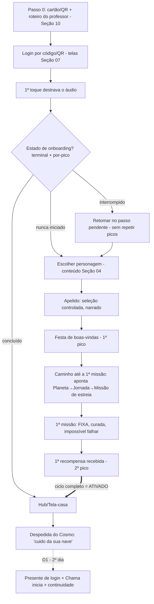
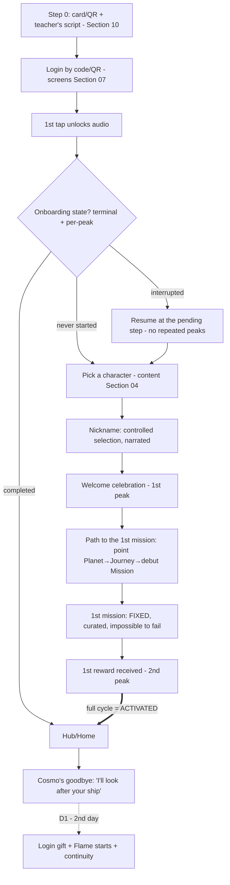

# 08 — Onboarding & FTUE do Aluno / Student Onboarding & FTUE

- **Status:** 🟢 aprovado / approved
- **Padrão / Standard:** [ADR-0002](decisoes/ADR-0002-padrao-de-capitulo.md) (16 partes)
- **Fontes / Sources:** `INDICE.md` (bloco 08, 35 subseções), `docs/quest/03-gamificacao-progressao.md`, `docs/quest/04-integracao-edu.md`, `_estado-atual/RELATORIO-2026-07-09.md`, código Q0 (`apps/quest/src/cerimonia/Cerimonia.tsx`, `app/App.tsx`, `estado/sessao.tsx`, `entrada/Entrada.tsx`, `lobby/Lobby.tsx`, `backend/app/quest/models/perfil.py`), Seções [07](07-ux-fluxos-navegacao.md)/[04](04-personagens-avatar.md)/[02](02-vocabulario.md)
- **Depende de / Depends on:** vocabulário/falas do Cosmo/validação do apelido → [02](02-vocabulario.md); revelação da fantasia/dia-zero → [03](03-universo.md); 6 personagens-base/avatar → [04](04-personagens-avatar.md); economia/1ª recompensa/Chama/presente de login/mecânica/micro-tutorial do registry → [05](05-sistemas-de-jogo.md); conteúdo/BNCC/dificuldade da 1ª missão → [06](06-pedagogico-bncc.md); telas/padrão de tela/contrato de estados → [07](07-ux-fluxos-navegacao.md); FTUE de professor/família → [10](10-professor-familia.md); estado autoritativo/idempotência (mecanismo) → [11](11-arquitetura.md); LGPD/consentimento da família → [12](12-seguranca-privacidade.md); acessibilidade → [13](13-acessibilidade.md); arte/áudio/narração → [15](15-arte-audio-assets.md); i18n → [16](16-localizacao-i18n.md); métrica-norte/telemetria do funil → [17](17-telemetria-metricas.md); QA → [18](18-qa-testes.md); A/B/flags → [19](19-liveops.md).

> **Convenção / Convention:** "§N" = uma das 16 **partes deste capítulo** / one of the 16 **parts of this
> chapter**; "Seção NN" / "Section NN" = outro capítulo da Bible.
> **Escopo / Scope:** este capítulo decide a **experiência do primeiro loop guiado** do aluno (do cartão à 1ª
> recompensa) e a formação de hábito. **Não** decide a economia (Seção 05), o conteúdo (Seção 06), as telas
> (Seção 07), o avatar (Seção 04), a fantasia (Seção 03) nem o **mecanismo** de estado/idempotência (Seção 11)
> — apenas os **encadeia** e os **referencia**.

---

## 🇧🇷 Onboarding & FTUE do Aluno

### 1. Objetivo
Ser a **referência definitiva da estreia da criança**: o **primeiro loop guiado** (Boot → login → cerimônia →
1ª missão → 1ª recompensa → retorno ao hub), a doutrina **"encanto antes de instrução"**, a **definição de
ativação**, a **máquina de estados do onboarding** (com idempotência) e os **ganchos de retorno** que formam
hábito. Deve permitir que um dev **construa a estreia sem inventar produto**. Decide a **experiência**;
**não** decide a economia (Seção [05](05-sistemas-de-jogo.md)), o conteúdo/BNCC (Seção [06](06-pedagogico-bncc.md)),
as telas (Seção [07](07-ux-fluxos-navegacao.md)), o avatar (Seção [04](04-personagens-avatar.md)) nem o
**mecanismo** de estado autoritativo/idempotência (Seção [11](11-arquitetura.md)). O FTUE **de adulto**
(professor/família) é apenas **apontado** (Seção [10](10-professor-familia.md)/[12](12-seguranca-privacidade.md)).

### 2. Contexto
A estreia acontece **numa sala de aula real**: professor conduzindo, **tablet compartilhado**, **wifi
instável**, roteiro da 1ª aula. É o momento mais frágil e mais decisivo do produto. **Estado atual (Q0):**
- A cerimônia **dispara por `nome_exibicao === ''`** (`App.tsx`), **não** por `primeira_vez` — este é
  **código morto** para o FTUE. 3 passos: **personagem** (carrossel dos 6 base) → **nome** (2–20, **letras e
  espaços**) → **festa** (2600 ms → Lobby); cada passo narrado em pt-BR.
- **Não existe flag de conclusão do onboarding** no servidor — o app infere "concluído" só por
  `nome_exibicao` preenchido. **Presente de login: inexistente**; a **Chama** é só casca visual (nada a
  incrementa); há apenas uma **fala de reengajamento por ausência** ("Que saudade!" quando `dias_sem_jogar
  ≥ 3`) — **não** um gancho de retorno de D1.
- **Dívidas técnicas Q0 (registradas; correção = fase de implementação, não agora):** (a) dois **catches
  silenciosos** (personagens zerados sem retry; avatar avança sem persistir); (b) **festa/fanfarra
  duplicada** no 1º login (`Entrada` + `Cerimonia` + painel "pronto"); (c) **conquista falso-positivo**
  ("Estilista espacial" lê campos de avatar legado); (d) **avatar avançando sem persistência**.
- **Divergência doc↔código:** o doc 04 previa escolher **nome + cor do traje** na 1ª vez; o código só oferece
  **personagem + nome** (a customização foi para o Vestiário).

Este capítulo especifica a estreia-alvo (Q1+) e consolida as dívidas acima como **requisitos de correção**.

### 3. Filosofia da funcionalidade
**Encanto antes de instrução.** A criança tem de **querer** estar ali antes de aprender qualquer coisa; a
estreia passa na pergunta-guia da Seção [00](00-visao-e-norte.md): *"uma criança entraria mesmo sem ser
obrigada?"*. Três crenças:
- **O vínculo inicial é sagrado.** Criar o personagem, dar o nome, a cerimônia e a 1ª vitória **não são
  puláveis** — são o momento emocional que faz o jogo virar "**meu**".
- **A primeira vitória é garantida.** A 1ª missão é **impossível de falhar** (Princípio 6): baixa fricção —
  ninguém sai da estreia derrotado.
- **Sempre há um amanhã.** A despedida ("cuido da sua nave") e o gancho D1 plantam o retorno **sem FOMO nem
  pressão** (Princípios 7 e 8). O **Cosmo é guia-companheiro** (o avatar do jogador é o **personagem-base da Seção
  [04](04-personagens-avatar.md)**), **nunca professor**.

### 4. Experiência que o jogador deve sentir
- **"Esse jogo é meu":** escolher o personagem e o nome dá **pertencimento** imediato.
- **"Eu consegui!":** a 1ª missão termina em vitória e celebração — a criança se sente capaz.
- **"Quero voltar amanhã":** a despedida do Cosmo e o presente do 2º dia criam expectativa afetiva.
- **Momento mágico:** a **festa de boas-vindas** (fim da cerimônia) e a **1ª recompensa** (fim da 1ª missão)
  — dois picos emocionais que fecham o vínculo.

### 5. Fluxo completo
O **primeiro loop guiado** (caminho feliz único). **Ativação** acontece **só ao fechar o ciclo completo**
(retorno ao hub após a 1ª recompensa) — login ou criar avatar **isoladamente não contam** (§8a). O **gate de
retomada** lê o **estado de onboarding autoritativo** — o **sinal terminal** (`onboarding_completed_at`) e,
quando ausente, o **sinal por-pico/ponteiro de passo pendente** (§9/§10) para distinguir *nunca iniciado* de
*interrompido* — **nunca** `nome_exibicao`.

**Primeira vez:** o loop inteiro roda uma vez, guiado. **Retomada:** se a cerimônia foi interrompida, o
gate lê o sinal de conclusão e o aluno volta ao **passo pendente** (personagem/nome/festa/missão/recompensa)
**sem repetir a festa nem a recompensa** (§9/§10/§12). **Offline/erro:** cada passo tem estado de erro
acolhedor com retry (§12), aplicando o contrato da Seção [07](07-ux-fluxos-navegacao.md).

### 6. Interface (quando existir)
**N/A própria.** A 08 **não desenha telas** — ela **encadeia** as telas da Seção [07](07-ux-fluxos-navegacao.md)
num fluxo: **login por código/QR, Cerimônia, MissãoPlayer, Recompensa e a gaveta de despedida** (o inventário
mestre e a numeração são da Seção [07](07-ux-fluxos-navegacao.md)). A 08 declara a **ordem, os gates e as
falas**; o **layout e o contrato de estados** são da 07. Wireframes = Apêndice [E](apendice-E-wireframes.md);
arte/áudio = Seção [15](15-arte-audio-assets.md).

### 7. UX
- **Gate de áudio no 1º toque:** como a narração é obrigatória para o não-leitor e o navegador bloqueia
  autoplay, o **primeiro toque** (já no login) destrava o som (sem pedir microfone/câmera, exceto a câmera do
  QR). A partir daí, **cada passo se narra ao abrir** e tem "ouvir de novo" (§9, Princípio 9; produção =
  Seção [15](15-arte-audio-assets.md)).
- **Uma decisão por passo:** cada passo do onboarding tem **1 ação primária**; nada de muro de texto.
- **A cerimônia é o 1º tutorial de toque:** aprender a interagir **fazendo** (arrastar o carrossel, tocar
  "É esse!") — sem tutorial textual.
- **Skip só do opcional (decidido):** o aluno pode **pular explicações opcionais**; **não** pode pular o
  **vínculo com o personagem, a cerimônia, a 1ª missão e a 1ª recompensa** — preserva-se o momento emocional.
- **Vocabulário canônico** (Seção [02](02-vocabulario.md)): **Planeta/Jornada/Missão/Chefão**, falas do
  Cosmo; **jamais** "prova/exercício/tarefa/lobby". **Acessibilidade** (norma = Seção [13](13-acessibilidade.md);
  a 08 aplica ao FTUE): áudio+ícone para não-leitor, alvo no mínimo da 13, daltônico, `reduced-motion` na festa.

### 8. Game Design

*Dimensão de jogo do FTUE (a economia e as mecânicas em si são da Seção [05](05-sistemas-de-jogo.md)).*

**a) Definição de ativação (decidido).** Um aluno só é **ativado** ao **completar o primeiro ciclo de
valor**: **Boot → escolher personagem → nome → festa (fim da cerimônia) → 1ª missão concluída → 1ª recompensa
recebida → retorno ao hub**. **Login ou criar avatar, isoladamente, NÃO contam.** É o **critério de sucesso do funil do
onboarding**; a **métrica-norte/KPI e a calibração numérica** são da Seção [17](17-telemetria-metricas.md). O
funil (§8f) mede cada passo até esse fecho.

**b) Missão de estreia — fixa e curada (decidido).** A 1ª missão é **a mesma para todos os alunos** (fixa,
curada), **não** sai da seleção adaptativa. Motivos: experiência inicial idêntica, medição limpa de
abandono, otimização posterior e um **momento inicial consistente**. Ela é **impossível de falhar**
(Princípio 6) — a **dificuldade** compatível com o não-falhável é garantida pela Seção [06](06-pedagogico-bncc.md)
e a **mecânica introdutória** pela Seção [05](05-sistemas-de-jogo.md). **A adaptação de dificuldade/conteúdo
começa só depois do onboarding.** A 08 fixa apenas o **enquadramento** (curada, não-falhável, tutorial).

**c) Ensino de mecânica embutido (decidido).** A mecânica é ensinada por **demonstração do Cosmo + ação**
(aprender-fazendo), sem muro de texto. **Requisito à Seção [05](05-sistemas-de-jogo.md):** o registry de
mecânicas (05 §10) hoje declara apenas `apresentar/coletarResposta`; a 08 **requer** que ele passe a
**declarar um micro-tutorial por mecânica** — dependência a resolver na 05, não um contrato já existente.

**d) A 1ª recompensa como momento (decidido).** A 08 entrega o **pico emocional** (celebração em tela cheia,
"nunca sai de mãos vazias"); o **cálculo** do valor é da Seção [05](05-sistemas-de-jogo.md), a **tela** da
Seção [07](07-ux-fluxos-navegacao.md) e a **arte** da Seção [15](15-arte-audio-assets.md).

**e) Ganchos de retorno e hábito (decidido — experiência; mecânica = 05).** A **experiência** de reencontro
é da 08; a **mecânica** (Chama, presente de login, trilha de 7 dias) é da Seção [05](05-sistemas-de-jogo.md).
Metas qualitativas por dia (alvos **numéricos** = calibração com a métrica-norte da Seção [17](17-telemetria-metricas.md)):

| Dia | O que a estreia deve produzir |
|-----|-------------------------------|
| **D0** (1ª sessão) | criar identidade (personagem+nome) · concluir a 1ª Missão · receber a 1ª recompensa |
| **D1** (2º dia) | retornar ao Planeta · usar **algum sistema desbloqueado** · concluir uma **nova Missão** |
| **D2** | iniciar **rotina de uso** · explorar **pelo menos 2 loops diferentes** |

**f) Funil de ativação (decidido — definição; pipeline = 17).** A 08 define o **funil**: um evento por
**passo-chave/de conversão** do §5 (login → personagem → nome → festa → 1ª missão → 1ª recompensa → hub), a
**taxa de conclusão da 1ª missão**, o **tempo até a 1ª recompensa** e o **drop-off** por passo. *(O gate de
áudio e o "caminho" são transições, não passos de funil.)* A **taxonomia/pipeline** dos eventos é da Seção
[17](17-telemetria-metricas.md); a 08 define **o que medir e o critério de ativado**.

**g) Onboarding progressivo (decidido — cronograma).** Na estreia (D0) só aparece o **essencial**: o
**Jogar**, a **missão de estreia** e o Cosmo. A revelação segue por **marco de progresso/ação** (não por
tempo puro): ao **concluir o D0**, revela-se o **Vestiário** (personalizar o personagem já criado); ao
acumular o **1º progresso**, a **Carreira/Constelação**; ao ganhar as **primeiras Moedas**, a **Loja**; o
**Social** só quando a escola/família liga `social_ativo`. A 08 decide **a ordem e o tipo de gatilho**; os
**limiares numéricos de nível** são da Seção [05](05-sistemas-de-jogo.md) e a **existência das telas** da
Seção [07](07-ux-fluxos-navegacao.md).

**h) A/B do onboarding (decidido — só no futuro).** Experimentação da estreia é **permitida no futuro,
não na v1** — primeiro consolida-se uma **experiência base**. Guardrails de qualquer experimento futuro:
**não reduzir a compreensão da criança** e **não otimizar retenção sacrificando aprendizagem**. A
viabilidade/flags/rollout são da Seção [19](19-liveops.md) (+ prontidão de 17).

### 9. Regras de negócio
- **Ativação = ciclo completo (§8a);** `nome_exibicao` preenchido **NÃO** é sinônimo de onboarding concluído.
- **Idempotência (requisito da 08; mecanismo = Seção [11](11-arquitetura.md)):** cerimônia interrompida e
  retomada **não repete a festa nem duplica a 1ª recompensa**. Além do **sinal terminal** de conclusão
  (`onboarding_completed_at`, recomendado), a retomada exige um **sinal por-pico** ("festa concedida",
  "recompensa concedida") **ou** um **ponteiro de passo pendente**, para deduplicar em **interrupção
  parcial** — o mecanismo é da Seção [11](11-arquitetura.md); a 08 nomeia o requisito.
- **Apelido por seleção controlada:** **validação estrita do Princípio 2** (2–20 caracteres, sem texto
  livre), narrado; o nome passa a reger todas as falas do Cosmo. *(O registro canônico da validação é da
  Seção [02](02-vocabulario.md)/Princípio 2.)*
- **Áudio destravado no 1º toque** e **narração pt-BR obrigatória** em todo passo (Princípio 9).
- **Erro nunca pune:** a 1ª missão é **impossível de falhar** (Princípio 6).
- **Não-puláveis:** vínculo com o personagem, cerimônia, 1ª missão, 1ª recompensa (§7); só **explicações
  opcionais** são puláveis.
- **Família/LGPD não bloqueia o 1º contato (decidido):** o fluxo é **Aluno → onboarding inicial → 1ª
  experiência**; família e consentimentos entram **depois**, **exceto** quando um requisito **legal** exigir
  um gate específico (regra = Seção [12](12-seguranca-privacidade.md)). O FTUE de família é da Seção [10](10-professor-familia.md).
- **Guarda do tablet compartilhado durante a estreia:** troca de mão no meio da cerimônia cai na guarda "É
  você?" da Seção [07](07-ux-fluxos-navegacao.md) (§12); o estado de onboarding é **por perfil, nunca vaza**.

### 10. Arquitetura técnica
> O **mecanismo** de estado autoritativo, persistência e idempotência é da Seção [11](11-arquitetura.md).
> Aqui fica o **contrato lógico** do onboarding.

- **Máquina de estados do onboarding (lógica):** `pré-app (cartão)` → `login` → `cerimônia
  (personagem → nome → festa)` → `caminho` → `1ª missão` → `1ª recompensa` → **`ativado (hub)`**. Cada
  transição tem um **gate** (o passo anterior concluído); o estado **sobrevive a interrupções** (persistência
  = Seção [11](11-arquitetura.md)).
- **Idempotência (requisito):** cada pico (festa, 1ª recompensa) é concedido **uma única vez** — a retomada
  lê um **sinal por-pico/ponteiro de passo pendente** (interrupção parcial) e o **sinal terminal**
  `onboarding_completed_at` (concluído); ambos **autoritativos no servidor** (Seção [11](11-arquitetura.md)),
  **desacoplados** de `nome_exibicao`.
- **Não decide aqui:** como o estado é gravado/des-duplicado, o modelo de dados e o isolamento por escola —
  Seção [11](11-arquitetura.md). A **correção das dívidas Q0** (§2) é **implementação**, não escopo deste
  documento.

### 11. Dependências com outros módulos
- **Falas do Cosmo / vocabulário / validação canônica do apelido** → Seção [02](02-vocabulario.md).
- **Revelação da fantasia / dia-zero (céu por acender)** → Seção [03](03-universo.md).
- **6 personagens-base + customização do avatar** → Seção [04](04-personagens-avatar.md).
- **Números da 1ª recompensa, Chama, presente de login, mecânica, micro-tutorial por mecânica (extensão do registry requerida, §8c)** → Seção [05](05-sistemas-de-jogo.md).
- **Conteúdo/BNCC e dificuldade não-falhável da 1ª missão** → Seção [06](06-pedagogico-bncc.md).
- **Telas, padrão de tela, contrato de estados** → Seção [07](07-ux-fluxos-navegacao.md).
- **FTUE do professor/família** → Seção [10](10-professor-familia.md).
- **Estado autoritativo, idempotência (sinal por-pico + terminal), flag de conclusão** → Seção [11](11-arquitetura.md).
- **Consentimento LGPD / gate legal da família** → Seção [12](12-seguranca-privacidade.md).
- **Acessibilidade** → Seção [13](13-acessibilidade.md); **arte/áudio/narração** → Seção [15](15-arte-audio-assets.md); **i18n do roteiro** → Seção [16](16-localizacao-i18n.md); **métrica-norte/eventos do funil** → Seção [17](17-telemetria-metricas.md); **testes do FTUE** → Seção [18](18-qa-testes.md); **A/B/flags** → Seção [19](19-liveops.md).

Este capítulo **alimenta:** a Seção [07](07-ux-fluxos-navegacao.md) (a Cerimônia que ela hospeda como nó), a
Seção [17](17-telemetria-metricas.md) (o funil de ativação) e aponta o FTUE adulto à Seção [10](10-professor-familia.md).

### 12. Casos extremos (Edge Cases)
Aplicando o **contrato de estados** da Seção [07](07-ux-fluxos-navegacao.md) ao FTUE:
- **Cerimônia sem rede (bug canônico Q0):** o carregamento dos personagens hoje cai num *catch* silencioso
  que zera a lista sem retry → **estado de Erro** (retry + fala do Cosmo). *(A correção do código é
  implementação; a tela é da Seção [07](07-ux-fluxos-navegacao.md), o avatar-legado da Seção [04](04-personagens-avatar.md).)*
- **Avatar não persistido:** salvar o personagem **antes** de avançar; se falhar, **estado de Erro com
  retry**, nunca avançar "vazio" (dívida Q0).
- **Festa/recompensa duplicada (dívida Q0):** a idempotência (§9/§10) **deduplica** — um único pico por
  conquista, mesmo em interrupção parcial.
- **Missão de estreia não baixada / catálogo ausente:** estado **"em breve"/carregando** com retry, nunca
  tela branca; se o ano não tem conteúdo semeado, a estreia usa a **missão fixa curada** (§8b).
- **Aluno sem ano/matrícula:** o onboarding não trava a criança — mostra acolhimento e aponta o professor
  (regra de matrícula = Seção [06](06-pedagogico-bncc.md)/Edu).
- **Código transferido / 2º aluno no mesmo aparelho no meio da cerimônia:** cai na guarda **"É você?"** da
  Seção [07](07-ux-fluxos-navegacao.md); o estado de onboarding é **por perfil**, nunca vaza.
- **Interromper & retomar** (professor encerra a aula, wifi cai): retoma no passo pendente **sem repetir**
  festa/recompensa (idempotência, §9/§10).

### 13. Escalabilidade futura
- **Nova mecânica** entra com seu **micro-tutorial** declarado (requisito à Seção [05](05-sistemas-de-jogo.md),
  §8c) — a estreia a apresenta sem redesenho.
- **A/B do onboarding** (pós-v1, §8h) pluga variantes sobre o loop base, respeitando os guardrails (não
  reduzir compreensão, não sacrificar aprendizagem por retenção).
- **Onboarding progressivo** (§8g) escala: novos sistemas entram no cronograma de revelação sem sobrecarregar.
- **Roteiro de voz** cresce com i18n (Seção [16](16-localizacao-i18n.md)); produção da narração = Seção [15](15-arte-audio-assets.md).
- **Flag de conclusão** (`onboarding_completed_at`, §9) abre espaço para versões futuras do onboarding sem
  ambiguidade de "concluído".

### 14. Checklist de implementação
- [ ] Loop guiado completo (§5) com o **caminho feliz único** e gates por passo.
- [ ] **Ativação = ciclo completo** (§8a) instrumentada; login/avatar isolados **não** marcam ativado.
- [ ] Missão de estreia **fixa, curada, impossível de falhar** (§8b); adaptação só pós-onboarding.
- [ ] Gate de áudio no 1º toque; narração pt-BR + "ouvir de novo" em cada passo.
- [ ] Apelido por seleção controlada, validação estrita do Princípio 2, narrado (§9).
- [ ] **Idempotência** (§9/§10): festa e 1ª recompensa concedidas **uma vez** (sinal por-pico + sinal terminal); reentrada não duplica.
- [ ] **Flag `onboarding_completed_at`** recomendada à Seção [11](11-arquitetura.md); `nome_exibicao` ≠ concluído.
- [ ] Skip só de explicações opcionais; não-puláveis: vínculo/cerimônia/1ª missão/1ª recompensa.
- [ ] Estados de **erro/vazio/carregando/offline** do FTUE aplicando o contrato da Seção [07](07-ux-fluxos-navegacao.md).
- [ ] Família/LGPD **não** bloqueia o 1º contato (§9); gate legal só se exigido (Seção [12](12-seguranca-privacidade.md)).
- [ ] Funil de ativação instrumentado (§8f; eventos = Seção [17](17-telemetria-metricas.md)); E2E do 1º loop + retomada (Seção [18](18-qa-testes.md)).
- [ ] **Dívidas Q0** (§2) corrigidas na implementação: catches silenciosos, festa duplicada, conquista falso-positivo, avatar sem persistência.
- [ ] DoD conferido contra o Apêndice [F](apendice-F-checklists-dod.md).

### 15. Questões em aberto
As decisões de produto do onboarding foram **fechadas** (ativação, missão de estreia fixa/curada, skip,
metas D0/D1/D2 qualitativas, A/B pós-v1, família não-bloqueante — §8/§9/§16). Restam:
- ⚠️ **Alvos numéricos de D0/D1/D2** (taxa de conclusão, % de retorno) — calibração com a **métrica-norte** da
  Seção [17](17-telemetria-metricas.md), ainda não fixada.
- ⚠️ **Validação empírica do aha-moment** — a hipótese (o ciclo completo encanta) só se confirma **medindo
  após a v1** (funil §8f); não bloqueia a escrita, mas fica registrada.
- ⚠️ **Micro-tutorial no registry (§8c):** a 08 **requer** a extensão do contrato de mecânicas da Seção
  [05](05-sistemas-de-jogo.md) §10 — dependência a formalizar na 05.
- ⚠️ **Produção da narração do FTUE** (TTS vs. gravada, quem grava) — depende do pipeline de áudio da Seção [15](15-arte-audio-assets.md).

### 16. ADR (Architecture Decision Record)
**Decisões registradas por este capítulo:**
1. **Ativação = ciclo de valor completo** (Boot→personagem→nome→festa→1ª missão→1ª recompensa→hub);
   login/avatar isolados não contam; a métrica-norte/KPI é da Seção [17](17-telemetria-metricas.md).
2. **Missão de estreia fixa e curada, impossível de falhar**; adaptação de dificuldade/conteúdo **só depois**
   do onboarding (conteúdo/dificuldade = Seção [06](06-pedagogico-bncc.md), mecânica = Seção [05](05-sistemas-de-jogo.md)).
3. **Skip só de explicações opcionais**; vínculo com o personagem, cerimônia, 1ª missão e 1ª recompensa são
   **não-puláveis** (preservar o momento emocional).
4. **Idempotência do onboarding** (festa/recompensa uma única vez) via **sinal por-pico + sinal terminal**
   (`onboarding_completed_at` recomendado, **desacoplado** de `nome_exibicao`); mecanismo = Seção [11](11-arquitetura.md).
5. **Metas qualitativas D0/D1/D2 definidas** (§8e); alvos numéricos = Seção [17](17-telemetria-metricas.md).
6. **A/B do onboarding só pós-v1**, com guardrails (não reduzir compreensão da criança; não otimizar retenção
   sacrificando aprendizagem). Operação = Seção [19](19-liveops.md).
7. **Família/consentimento LGPD não bloqueia o 1º contato**; entra depois, exceto gate legal específico
   (Seção [12](12-seguranca-privacidade.md)).
8. **Dívidas técnicas Q0 registradas** (catches silenciosos, festa duplicada, conquista falso-positivo,
   avatar sem persistência) como requisitos de correção — implementação em fase própria, não aqui.

*(Registro inline; sem criar arquivo de ADR sem autorização.)*

---

## 🇬🇧 Student Onboarding & FTUE

### 1. Objective
Be the **definitive reference for the child's debut**: the **first guided loop** (Boot → login → ceremony →
1st mission → 1st reward → return to the hub), the **"delight before instruction"** doctrine, the
**activation definition**, the **onboarding state machine** (with idempotency) and the **return hooks** that
build a habit. It must let a dev **build the debut without inventing product**. It decides the **experience**;
it does **not** decide the economy (Section [05](05-sistemas-de-jogo.md)), content/BNCC (Section [06](06-pedagogico-bncc.md)),
screens (Section [07](07-ux-fluxos-navegacao.md)), the avatar (Section [04](04-personagens-avatar.md)) or the
state/idempotency **mechanism** (Section [11](11-arquitetura.md)). The **adult** FTUE (teacher/family) is only
**pointed to** (Section [10](10-professor-familia.md)/[12](12-seguranca-privacidade.md)).

### 2. Context
The debut happens **in a real classroom**: a teacher leading, a **shared tablet**, **flaky wifi**, a first-day
script. It's the product's most fragile and most decisive moment. **Current state (Q0):**
- The ceremony **triggers on `nome_exibicao === ''`** (`App.tsx`), **not** on `primeira_vez` — which is
  **dead code** for the FTUE. 3 steps: **character** (carousel of the 6 base) → **name** (2–20, **letters and
  spaces**) → **party** (2600 ms → Lobby); each step narrated in pt-BR.
- **There is no onboarding-completion flag** on the server — the app infers "done" only from a filled
  `nome_exibicao`. **Login gift: nonexistent**; the **Flame** is a visual shell only (nothing increments it);
  there is only a **re-engagement line for absence** ("I missed you!" when `dias_sem_jogar ≥ 3`) — **not** a
  D1 return hook.
- **Q0 technical debt (registered; fixing = implementation phase, not now):** (a) two **silent catches**
  (characters zeroed with no retry; avatar advances without persisting); (b) **duplicated party/fanfare** on
  the 1st login (`Entrada` + `Cerimonia` + "ready" panel); (c) **false-positive achievement** ("Space
  stylist" reads legacy avatar fields); (d) **avatar advancing without persistence**.
- **Doc↔code divergence:** doc 04 planned choosing **name + suit color** on the 1st time; the code only offers
  **character + name** (customization moved to the Wardrobe).

This chapter specifies the target debut (Q1+) and consolidates the above debt as **fix requirements**.

### 3. Feature philosophy
**Delight before instruction.** The child must **want** to be there before learning anything; the debut
passes Section [00](00-visao-e-norte.md)'s guiding question: *"would a child come in even without being told
to?"*. Three beliefs:
- **The initial bond is sacred.** Creating the character, giving the name, the ceremony and the 1st win are
  **not skippable** — they are the emotional moment that makes the game "**mine**".
- **The first win is guaranteed.** The 1st mission is **impossible to fail** (Principle 6): low friction — no
  one leaves the debut defeated.
- **There's always a tomorrow.** The goodbye ("I'll look after your ship") and the D1 hook plant the return
  **with no FOMO or pressure** (Principles 7 and 8). **Cosmo is a guide-companion** (the player's avatar is the
  **base character of Section [04](04-personagens-avatar.md)**), **never a teacher**.

### 4. The experience the player should feel
- **"This game is mine":** choosing the character and the name gives instant **belonging**.
- **"I did it!":** the 1st mission ends in a win and a celebration — the child feels capable.
- **"I want to come back tomorrow":** Cosmo's goodbye and the 2nd-day gift build affective anticipation.
- **Magic moment:** the **welcome celebration** (end of ceremony) and the **1st reward** (end of the 1st
  mission) — two emotional peaks that seal the bond.

### 5. Complete flow
The **first guided loop** (single happy path). **Activation** happens **only when the full cycle closes**
(return to the hub after the 1st reward) — login or creating an avatar **alone do not count** (§8a). The
**resume gate** reads the **authoritative completion signal** (`onboarding_completed_at`, §9/§10), **not**
`nome_exibicao`.

**First time:** the whole loop runs once, guided. **Resume:** if the ceremony was interrupted, the gate reads
the completion signal and the student returns to the **pending step** (character/name/celebration/mission/
reward) **without repeating the celebration or the reward** (§9/§10/§12). **Offline/error:** each step has a
welcoming error state with retry (§12), applying Section [07](07-ux-fluxos-navegacao.md)'s contract.

### 6. Interface (when it exists)
**N/A of its own.** 08 **draws no screens** — it **chains** Section [07](07-ux-fluxos-navegacao.md)'s screens
into a flow: **login by code/QR, Ceremony, MissionPlayer, Reward and the goodbye drawer** (the master
inventory and numbering are Section [07](07-ux-fluxos-navegacao.md)'s). 08 declares the **order, gates and
lines**; the **layout and state contract** are 07's. Wireframes = Appendix [E](apendice-E-wireframes.md);
art/audio = Section [15](15-arte-audio-assets.md).

### 7. UX
- **Audio gate on the 1st tap:** since narration is mandatory for the non-reader and the browser blocks
  autoplay, the **first tap** (already at login) unlocks sound (without asking for microphone/camera, except
  the QR camera). From there, **each step narrates on open** and has "listen again" (§9, Principle 9;
  production = Section [15](15-arte-audio-assets.md)).
- **One decision per step:** each onboarding step has **1 primary action**; no wall of text.
- **The ceremony is the 1st touch tutorial:** learn to interact **by doing** (drag the carousel, tap "This
  one!") — no textual tutorial.
- **Skip only the optional (decided):** the child may **skip optional explanations**; may **not** skip the
  **bond with the character, the ceremony, the 1st mission and the 1st reward** — the emotional moment is
  preserved.
- **Canonical vocabulary** (Section [02](02-vocabulario.md)): **Planet/Journey/Mission/Boss**, Cosmo's lines;
  **never** "test/exercise/task/lobby". **Accessibility** (norm = Section [13](13-acessibilidade.md); 08
  applies it to the FTUE): audio+icon for the non-reader, target at 13's minimum, colorblind, `reduced-motion`
  in the celebration.

### 8. Game Design

*The game dimension of the FTUE (the economy and mechanics themselves are Section [05](05-sistemas-de-jogo.md)'s).*

**a) Activation definition (decided).** A student is **activated** only upon **completing the first value
cycle**: **Boot → pick character → name → celebration (end of ceremony) → 1st mission completed → 1st reward received
→ return to the hub**. **Login or creating an avatar, alone, do NOT count.** It's the **onboarding funnel's success
criterion**; the **north-star metric/KPI and the numeric calibration** are Section [17](17-telemetria-metricas.md)'s.
The funnel (§8f) measures every step up to that close.

**b) Debut mission — fixed and curated (decided).** The 1st mission is **the same for every student** (fixed,
curated), **not** from the adaptive selection. Reasons: identical initial experience, clean abandonment
measurement, later optimization, and a **consistent initial moment**. It is **impossible to fail** (Principle
6) — the **difficulty** compatible with being unfailable is guaranteed by Section [06](06-pedagogico-bncc.md)
and the **introductory mechanic** by Section [05](05-sistemas-de-jogo.md). **Difficulty/content adaptation
starts only after onboarding.** 08 sets only the **framing** (curated, unfailable, tutorial).

**c) Embedded mechanic teaching (decided).** The mechanic is taught by **Cosmo's demonstration + action**
(learn by doing), no wall of text. **Requirement on Section [05](05-sistemas-de-jogo.md):** the mechanic
registry (05 §10) today declares only `apresentar/coletarResposta`; 08 **requires** it to also **declare a
micro-tutorial per mechanic** — a dependency to resolve in 05, not an already-existing contract.

**d) The 1st reward as a moment (decided).** 08 delivers the **emotional peak** (full-screen celebration,
"never empty-handed"); the **value calculation** is Section [05](05-sistemas-de-jogo.md)'s, the **screen**
Section [07](07-ux-fluxos-navegacao.md)'s and the **art** Section [15](15-arte-audio-assets.md)'s.

**e) Return hooks and habit (decided — experience; mechanic = 05).** The **reunion experience** is 08's; the
**mechanic** (Flame, login gift, 7-day track) is Section [05](05-sistemas-de-jogo.md)'s. Qualitative goals per
day (**numeric** targets = calibration with Section [17](17-telemetria-metricas.md)'s north-star):

| Day | What the debut must produce |
|-----|-----------------------------|
| **D0** (1st session) | create identity (character+name) · complete the 1st Mission · receive the 1st reward |
| **D1** (2nd day) | return to the Planet · use **some unlocked system** · complete a **new Mission** |
| **D2** | begin a **usage routine** · explore **at least 2 different loops** |

**f) Activation funnel (decided — definition; pipeline = 17).** 08 defines the **funnel**: one event per
**key/conversion step** of §5 (login → character → name → celebration → 1st mission → 1st reward → hub), the
**1st-mission completion rate**, the **time to the 1st reward** and the **drop-off** per step. *(The audio gate
and the "path" are transitions, not funnel steps.)* The events' **taxonomy/pipeline** is Section
[17](17-telemetria-metricas.md)'s; 08 defines **what to measure and the activated criterion**.

**g) Progressive onboarding (decided — schedule).** At the debut (D0) only the **essential** appears: **Play**,
the **debut mission** and Cosmo. The reveal follows a **progress/action milestone** (not pure time): on
**completing D0**, the **Wardrobe** is revealed (customize the character already created); on the **1st
progress**, **Career/Constellation**; on earning the **first Coins**, the **Store**; **Social** only when the
school/family turns on `social_ativo`. 08 decides **the order and trigger type**; the **numeric level
thresholds** are Section [05](05-sistemas-de-jogo.md)'s and the **screens' existence** Section [07](07-ux-fluxos-navegacao.md)'s.

**h) Onboarding A/B (decided — future only).** Debut experimentation is **allowed in the future, not in v1** —
a **base experience** is consolidated first. Guardrails for any future experiment: **do not reduce the child's
comprehension** and **do not optimize retention at the expense of learning**. Feasibility/flags/rollout are
Section [19](19-liveops.md)'s (+ 17's readiness).

### 9. Business rules
- **Activation = full cycle (§8a);** a filled `nome_exibicao` is **NOT** a synonym for onboarding completed.
- **Idempotency (08's requirement; mechanism = Section [11](11-arquitetura.md)):** an interrupted-and-resumed
  ceremony **does not repeat the celebration or duplicate the 1st reward**. Beyond the **terminal completion
  signal** (`onboarding_completed_at`, recommended), resume requires a **per-peak signal** ("celebration
  granted", "reward granted") **or** a **pending-step pointer**, to deduplicate on **partial interruption** —
  the mechanism is Section [11](11-arquitetura.md)'s; 08 names the requirement.
- **Nickname by controlled selection:** **strict Principle-2 validation** (2–20 characters, no free text),
  narrated; the name then governs all of Cosmo's lines. *(The canonical validation registry is Section
  [02](02-vocabulario.md)/Principle 2's.)*
- **Audio unlocked on the 1st tap** and **mandatory pt-BR narration** at every step (Principle 9).
- **Mistakes never punish:** the 1st mission is **impossible to fail** (Principle 6).
- **Non-skippable:** the bond with the character, the ceremony, the 1st mission, the 1st reward (§7); only
  **optional explanations** are skippable.
- **Family/LGPD does not block the 1st contact (decided):** the flow is **Student → initial onboarding → 1st
  experience**; family and consents come **later**, **except** when a **legal** requirement demands a specific
  gate (rule = Section [12](12-seguranca-privacidade.md)). The family FTUE is Section [10](10-professor-familia.md)'s.
- **Shared-tablet guard during the debut:** a hand-off mid-ceremony hits Section [07](07-ux-fluxos-navegacao.md)'s
  "Is this you?" guard (§12); onboarding state is **per profile, never leaking**.

### 10. Technical architecture
> The **mechanism** of authoritative state, persistence and idempotency is Section [11](11-arquitetura.md)'s.
> Here lives the **logical contract** of onboarding.

- **Onboarding state machine (logical):** `pre-app (card)` → `login` → `ceremony (character → name →
  celebration)` → `path` → `1st mission` → `1st reward` → **`activated (hub)`**. Each transition has a
  **gate** (the previous step completed); state **survives interruptions** (persistence = Section [11](11-arquitetura.md)).
- **Idempotency (requirement):** each peak (celebration, 1st reward) is granted **exactly once** — resume
  reads a **per-peak signal/pending-step pointer** (partial interruption) and the **terminal signal**
  `onboarding_completed_at` (completed); both **server-authoritative** (Section [11](11-arquitetura.md)),
  **decoupled** from `nome_exibicao`.
- **Not decided here:** how state is stored/de-duplicated, the data model and per-school isolation — Section
  [11](11-arquitetura.md). **Fixing the Q0 debt** (§2) is **implementation**, not this document's scope.

### 11. Dependencies on other modules
- **Cosmo's lines / vocabulary / canonical nickname validation** → Section [02](02-vocabulario.md).
- **Fantasy reveal / day-zero (unlit sky)** → Section [03](03-universo.md).
- **6 base characters + avatar customization** → Section [04](04-personagens-avatar.md).
- **1st-reward numbers, Flame, login gift, mechanic, micro-tutorial per mechanic (required registry extension, §8c)** → Section [05](05-sistemas-de-jogo.md).
- **1st-mission content/BNCC and unfailable difficulty** → Section [06](06-pedagogico-bncc.md).
- **Screens, screen pattern, state contract** → Section [07](07-ux-fluxos-navegacao.md).
- **Teacher/family FTUE** → Section [10](10-professor-familia.md).
- **Authoritative state, idempotency (per-peak + terminal signal), completion flag** → Section [11](11-arquitetura.md).
- **LGPD consent / legal family gate** → Section [12](12-seguranca-privacidade.md).
- **Accessibility** → Section [13](13-acessibilidade.md); **art/audio/narration** → Section [15](15-arte-audio-assets.md); **script i18n** → Section [16](16-localizacao-i18n.md); **north-star/funnel events** → Section [17](17-telemetria-metricas.md); **FTUE tests** → Section [18](18-qa-testes.md); **A/B/flags** → Section [19](19-liveops.md).

This chapter **feeds:** Section [07](07-ux-fluxos-navegacao.md) (the Ceremony it hosts as a node), Section
[17](17-telemetria-metricas.md) (the activation funnel), and points the adult FTUE to Section [10](10-professor-familia.md).

### 12. Edge cases
Applying Section [07](07-ux-fluxos-navegacao.md)'s **state contract** to the FTUE:
- **Ceremony with no network (canonical Q0 bug):** loading the characters today falls into a silent *catch*
  that zeroes the list with no retry → **Error state** (retry + a Cosmo line). *(The code fix is
  implementation; the screen is Section [07](07-ux-fluxos-navegacao.md)'s, the legacy avatar Section [04](04-personagens-avatar.md)'s.)*
- **Avatar not persisted:** save the character **before** advancing; on failure, an **Error state with
  retry**, never advance "empty" (Q0 debt).
- **Duplicated celebration/reward (Q0 debt):** idempotency (§9/§10) **deduplicates** — a single peak per
  achievement, even on partial interruption.
- **Debut mission not downloaded / missing catalog:** a **"coming soon"/loading** state with retry, never a
  blank screen; if the grade has no seeded content, the debut uses the **fixed curated mission** (§8b).
- **Student with no grade/enrollment:** onboarding doesn't freeze the child — it shows a welcome and points to
  the teacher (enrollment rule = Section [06](06-pedagogico-bncc.md)/Edu).
- **Transferred code / 2nd student on the same device mid-ceremony:** hits Section [07](07-ux-fluxos-navegacao.md)'s
  **"Is this you?"** guard; onboarding state is **per profile**, never leaking.
- **Interrupt & resume** (teacher ends class, wifi drops): resumes at the pending step **without repeating**
  celebration/reward (idempotency, §9/§10).

### 13. Future scalability
- **A new mechanic** enters with its declared **micro-tutorial** (requirement on Section [05](05-sistemas-de-jogo.md),
  §8c) — the debut presents it with no redesign.
- **Onboarding A/B** (post-v1, §8h) plugs variants onto the base loop, respecting the guardrails (don't reduce
  comprehension, don't sacrifice learning for retention).
- **Progressive onboarding** (§8g) scales: new systems join the reveal schedule without overload.
- **The voice script** grows with i18n (Section [16](16-localizacao-i18n.md)); narration production = Section [15](15-arte-audio-assets.md).
- **The completion flag** (`onboarding_completed_at`, §9) makes room for future onboarding versions with no
  "done" ambiguity.

### 14. Implementation checklist
- [ ] Full guided loop (§5) with the **single happy path** and per-step gates.
- [ ] **Activation = full cycle** (§8a) instrumented; login/avatar alone do **not** mark activated.
- [ ] Debut mission **fixed, curated, impossible to fail** (§8b); adaptation only post-onboarding.
- [ ] Audio gate on the 1st tap; pt-BR narration + "listen again" on each step.
- [ ] Nickname by controlled selection, strict Principle-2 validation, narrated (§9).
- [ ] **Idempotency** (§9/§10): celebration and 1st reward granted **once** (per-peak + terminal signal); re-entry doesn't duplicate.
- [ ] **`onboarding_completed_at` flag** recommended to Section [11](11-arquitetura.md); `nome_exibicao` ≠ completed.
- [ ] Skip only optional explanations; non-skippable: bond/ceremony/1st mission/1st reward.
- [ ] FTUE **error/empty/loading/offline** states applying Section [07](07-ux-fluxos-navegacao.md)'s contract.
- [ ] Family/LGPD does **not** block the 1st contact (§9); legal gate only if required (Section [12](12-seguranca-privacidade.md)).
- [ ] Activation funnel instrumented (§8f; events = Section [17](17-telemetria-metricas.md)); E2E of the 1st loop + resume (Section [18](18-qa-testes.md)).
- [ ] **Q0 debt** (§2) fixed in implementation: silent catches, duplicated celebration, false-positive achievement, avatar without persistence.
- [ ] DoD checked against Appendix [F](apendice-F-checklists-dod.md).

### 15. Open questions
The onboarding's product decisions are **closed** (activation, fixed/curated debut mission, skip, qualitative
D0/D1/D2 goals, post-v1 A/B, non-blocking family — §8/§9/§16). What remains:
- ⚠️ **Numeric D0/D1/D2 targets** (completion rate, % return) — calibration with Section [17](17-telemetria-metricas.md)'s
  **north-star**, not yet set.
- ⚠️ **Empirical aha-moment validation** — the hypothesis (the full cycle delights) is only confirmed by
  **measuring after v1** (funnel §8f); doesn't block writing, but is registered.
- ⚠️ **Registry micro-tutorial (§8c):** 08 **requires** extending Section [05](05-sistemas-de-jogo.md) §10's
  mechanic contract — a dependency to formalize in 05.
- ⚠️ **FTUE narration production** (TTS vs. recorded, who records) — depends on Section [15](15-arte-audio-assets.md)'s
  audio pipeline.

### 16. ADR (Architecture Decision Record)
**Decisions recorded by this chapter:**
1. **Activation = full value cycle** (Boot→character→name→celebration→1st mission→1st reward→hub); login/avatar
   alone don't count; the north-star metric/KPI is Section [17](17-telemetria-metricas.md)'s.
2. **Fixed and curated debut mission, impossible to fail**; difficulty/content adaptation **only after**
   onboarding (content/difficulty = Section [06](06-pedagogico-bncc.md), mechanic = Section [05](05-sistemas-de-jogo.md)).
3. **Skip only optional explanations**; the bond with the character, the ceremony, the 1st mission and the 1st
   reward are **non-skippable** (preserve the emotional moment).
4. **Onboarding idempotency** (celebration/reward exactly once) via **per-peak + terminal signal**
   (`onboarding_completed_at` recommended, **decoupled** from `nome_exibicao`); mechanism = Section [11](11-arquitetura.md).
5. **Qualitative D0/D1/D2 goals defined** (§8e); numeric targets = Section [17](17-telemetria-metricas.md).
6. **Onboarding A/B only post-v1**, with guardrails (don't reduce the child's comprehension; don't optimize
   retention at the expense of learning). Operation = Section [19](19-liveops.md).
7. **Family/LGPD consent does not block the 1st contact**; it comes later, except a specific legal gate
   (Section [12](12-seguranca-privacidade.md)).
8. **Q0 technical debt registered** (silent catches, duplicated celebration, false-positive achievement,
   avatar without persistence) as fix requirements — implementation in its own phase, not here.

*(Recorded inline; no separate ADR file created without authorization.)*
