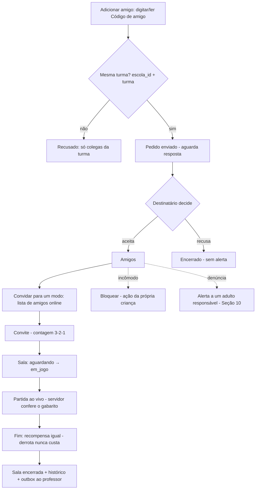
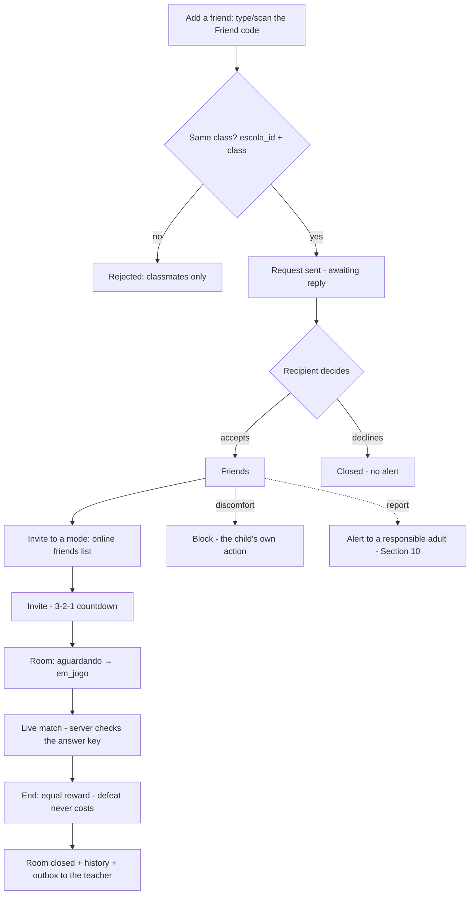

# 09 — Social & Comunidade Segura / Safe Social & Community

- **Status:** 🟢 aprovado / approved
- **Padrão / Standard:** [ADR-0002](decisoes/ADR-0002-padrao-de-capitulo.md) (16 partes)
- **Fontes / Sources:** `INDICE.md` (bloco 09, 39 subseções), `docs/quest/01-arquitetura.md` (WebSocket/salas/tempo real), `docs/quest/03-gamificacao-progressao.md` (modos sociais, rankings sem toxicidade), `docs/quest/05-roadmap.md` (social = Q4), `docs/quest/02-banco-de-dados.md` (schema social — origem legada), `_estado-atual/RELATORIO-2026-07-09.md`, `backend/app/quest/models/perfil.py` (`codigo_amigo`, `social_ativo`), Seções [02](02-vocabulario.md)/[05](05-sistemas-de-jogo.md)/[07](07-ux-fluxos-navegacao.md)/[11](11-arquitetura.md)/[12](12-seguranca-privacidade.md)
- **Depende de / Depends on:** vocabulário/falas → [02](02-vocabulario.md); Constelação eu×eu (fantasia) → [03](03-universo.md); economia/recompensa dos modos → [05](05-sistemas-de-jogo.md); motor único de corrida (11.24) → [11](11-arquitetura.md); telas sociais/contrato de estados → [07](07-ux-fluxos-navegacao.md); revelação do social no FTUE → [08](08-onboarding-ftue.md); toggle da família/destino do alerta de moderação/portal adulto → [10](10-professor-familia.md); transporte WebSocket/Redis/estado-ao-vivo/salas (mecanismo)/outbox → [11](11-arquitetura.md); LGPD/validação do apelido → [12](12-seguranca-privacidade.md); acessibilidade → [13](13-acessibilidade.md); arte das skins da Corrida → [15](15-arte-audio-assets.md); i18n → [16](16-localizacao-i18n.md); telemetria → [17](17-telemetria-metricas.md); QA → [18](18-qa-testes.md); config/flags do `social_ativo` (mecanismo) → [19](19-liveops.md).

> **Convenção / Convention:** "§N" = uma das 16 **partes deste capítulo** / one of the 16 **parts of this
> chapter**; "Seção NN" / "Section NN" = outro capítulo da Bible.
> **Escopo / Scope:** este capítulo decide as **regras do subsistema social** (amizade, modos, mensagens de
> catálogo, rankings entre pessoas). **Não** decide a economia (Seção 05), as telas (Seção 07), o **transporte**
> WebSocket/Redis (Seção 11), o mecanismo de LGPD (Seção 12) nem o vocabulário (Seção 02) — apenas os
> **aplica** e os **referencia**. O teto imutável "amizade nunca cruza escolas" é o **Princípio 16** (Seção 01);
> a 09 o **aplica**.

---

## 🇧🇷 Social & Comunidade Segura

### 1. Objetivo
Ser a **referência definitiva do subsistema social**: amizade, presença, os **modos multiplayer leves**,
**comunicação por catálogo** (nunca chat livre) e **rankings entre pessoas** — de forma que "**aprender
junto**" encante **sem nunca abrir uma superfície de risco** (texto livre, dado exposto, toxicidade).
Deve permitir que um dev **construa o social sem inventar produto**. Decide as **regras sociais**; **não**
decide os números da economia (Seção [05](05-sistemas-de-jogo.md)), as telas (Seção [07](07-ux-fluxos-navegacao.md)),
o **transporte** de tempo real (Seção [11](11-arquitetura.md)), o mecanismo de LGPD (Seção [12](12-seguranca-privacidade.md))
nem o vocabulário (Seção [02](02-vocabulario.md)).

### 2. Contexto
No ecossistema **Hub → Edu → Quest**, o social é o que faz a criança **jogar com um colega**. **Estado atual
(Q0):** o social é a **fase Q4** do roadmap e **ainda não foi construído**. A **infra de opt-in existe desde
Q0** (`quest_perfis.codigo_amigo`, `quest_perfis.social_ativo`), mas **`quest_amizades`, `quest_salas` e
`quest_mensagens_rapidas` ainda não têm model**; **não há nenhum endpoint social**, **nenhuma tela social** no
app, e o **WebSocket `/ws/quest`** é apenas doc (não implementado). *(Divergência **doc↔doc** resolvida aqui
(designada à 9.16 pelo INDICE): as skins da Corrida são **Bichinhos · Espacial · Trilha** (§8); o enum de
código `skin_corrida` deve usar `trilha` — o legado `simples` de `docs/quest/02` migra para `trilha`.)* Este
capítulo especifica o social-alvo (Q4).

### 3. Filosofia da funcionalidade
**Aprender junto encanta — sem nunca abrir uma superfície de risco.** A segurança é **por design**, não
adicionada depois:
- **Sem texto livre, nunca** (Princípio 2): a comunicação é **só por catálogo** de mensagens rápidas
  pré-aprovadas; não há chat, feed aberto nem busca por nome real.
- **A amizade é local e consentida:** só entre colegas da **mesma turma** (§9), dentro do teto imutável
  "nunca cruza escolas" (Princípio 16); o social vem **desligado por padrão** e é ligado pelo adulto.
- **Ninguém perde, ninguém humilha:** **derrota nunca custa nada** (Princípio 6); o ranking individual
  **municipal/entre-escolas** da criança **nunca é exposto** (Princípio 5) — à criança só aparece a **turma
  semanal** (top 3, sem lanterna); a comunidade é cooperativa, não uma arena tóxica.

### 4. Experiência que o jogador deve sentir
- **"É mais gostoso com um amigo":** convidar é simples (botão grande → amigos online → 3-2-1 → jogando).
- **"Ganhamos juntos":** no coop a vitória é da dupla; na Corrida os dois ganham, o 1º só ganha um confete a
  mais.
- **"Nunca sou humilhado":** sem lanterna exposta, sem perdedor que perde algo, sem pressão de tempo punitiva.
- **Momento mágico:** duas crianças, cada uma no seu tablet, **completam uma Missão juntas** e comemoram.

### 5. Fluxo completo
Os fluxos sociais (amizade → convite → partida → recompensa; bloqueio/denúncia). O social só aparece quando
`social_ativo` está ligado (Seção [08](08-onboarding-ftue.md)/§9).

**Primeira vez / retomada / offline / erro:** o social **exige rede** — offline, o app mostra o que funciona
(jornada em cache) vs. o que precisa de rede, aplicando o contrato de estados da Seção [07](07-ux-fluxos-navegacao.md)
(§12). A **reconexão** em partida é **pausa + timeout gentil, sem penalidade** (§12).

### 6. Interface (quando existir)
**N/A própria.** A 09 **não desenha telas** — a **tela Social** e o **contrato de estados** são da Seção
[07](07-ux-fluxos-navegacao.md) (inventário item 17). A 09 declara os **fluxos, as regras e as falas**; este
capítulo apenas **aplica** o vocabulário canônico (Seção [02](02-vocabulario.md)) e enumera os estados específicos do
social (vazio/carregando/erro/sem-permissão). Wireframes = Apêndice [E](apendice-E-wireframes.md); arte das
skins = Seção [15](15-arte-audio-assets.md).

### 7. UX
- **Código de amigo, não nomes:** adicionar amigo é **digitar/ler um código falável** (`COSMO-4F7B`) — **nunca
  há busca por nome real**. O código é narrado e acessível (Princípio 9).
- **Áudio em todo convite** e narração pt-BR nos estados sociais; **alvo ≥ o mínimo da Seção [13](13-acessibilidade.md)**.
- **Identidade entre pares:** **fora da própria turma** a criança aparece só como **apelido + avatar** — o
  **nome real nunca vaza** (Princípios 2 e 3 — LGPD Art. 14; validação do apelido = Seção [12](12-seguranca-privacidade.md)).
- **Vocabulário canônico** (Seção [02](02-vocabulario.md)): **"Estudar com um amigo"**, **"Corrida"**;
  **jamais** as palavras proibidas da Seção [02](02-vocabulario.md) (ex.: party/lobby/matchmaking/squad). A
  `sala` **nunca é nomeada** — a criança só vê os botões dos modos.
- **Tempo nunca pune:** o cronômetro da Corrida é **social e opcional** — nunca critério único de sucesso
  (Princípio 11; derrota/tempo nunca punem = Princípio 6).

### 8. Game Design

*A dimensão de jogo **social** (os números da economia e o cálculo da recompensa são da Seção [05](05-sistemas-de-jogo.md)).*

**a) Os 4 modos (regras — economia = 05; motor único = 11).** Todos em **dupla (2 jogadores)**, sem
**pareamento** com estranhos; **derrota nunca custa nada** (Princípio 6). Só **"Estudar com um amigo"** e
**"Corrida"** têm rótulo infantil canônico (Seção [02](02-vocabulario.md)); os rótulos das crianças para os
outros dois modos ficam **pendentes de registro na Seção 02** (§15) — os nomes abaixo são internos/de design:
- **Estudar com um amigo** (`missao_compartilhada`, coop): objetivo comum; **cada acerto de qualquer um
  avança a dupla**; recompensa **igual** para os dois; sem perdedor.
- **Corrida** (`corrida`, versus leve): acertou → anda; quem chega 1º ganha um **confete a mais**; **os dois**
  são recompensados (moedas aplicáveis = Seção [05](05-sistemas-de-jogo.md)); **skins canônicas: Bichinhos ·
  Espacial · Trilha** (arte = Seção [15](15-arte-audio-assets.md); **motor único parametrizado por JSON =
  Seção [11](11-arquitetura.md), 11.24**).
- **Pintura em dupla** (`pintura_dupla`, coop sem vencedor): cada acerto pinta parte do desenho até completar
  — rótulo infantil a registrar (Seção 02).
- **Duelo amistoso de quiz** (`x1`, versus leve): quiz em tempo real lado a lado, "revanche?", elogio a
  ambos, sem punição — rótulo infantil a registrar (Seção 02; evitar "X1"/gíria, Princípio 12).

**b) Recompensas sociais — anti-punição (regra; economia = 05).** A regra desta seção é que **a derrota nunca
custe nada** e a recompensa seja **simétrica**; **quais moedas cada modo concede e quanto** são da Seção
[05](05-sistemas-de-jogo.md) (configuráveis por Seção [19](19-liveops.md)).

**c) Rankings entre pessoas (decidido).** A **tela primária de progresso é a Constelação eu × eu** (eu de hoje
× eu de ontem — fantasia = Seção [03](03-universo.md), mecânica = Seção [05](05-sistemas-de-jogo.md)); os
rankings **entre pessoas** desta seção são secundários e **anti-toxicidade**:
- **Turma semanal (anti-lanterna):** **zera toda segunda**, celebra o **top 3** e **nunca expõe os últimos**.
- **Evolução (quem mais cresceu):** ranking paralelo por crescimento — dá visibilidade a quem parte de baixo.
- **Coletivo entre turmas / XP da escola:** placar por **turma** ("3º Ano B somou 12.400 XP") — **nunca**
  expõe a criança individual.
- **Municipal:** **só entre escolas e só no Edu/Hub (adultos)** — **nunca** aparece na experiência da criança
  (Princípio 5).

**d) Torneios (fase futura — esboço).** Espaço de competição **opt-in**, com começo/fim e **medalha para
todos os participantes** (intenção anti-toxicidade). Bracket, elegibilidade, alcance dentro do teto e
**premiação além da medalha** = **fase futura**, decisão do dono/economia (§15, Seções [05](05-sistemas-de-jogo.md)/[22](22-monetizacao.md)).

### 9. Regras de negócio
- **Teto imutável (Princípio 16):** solicitante e destinatário compartilham `escola_id` **sempre** — validado
  em **cada rota social e no WebSocket**. Amizade **nunca cruza escolas**.
- **Alcance no lançamento = mesma turma (decidido):** no lançamento, o círculo de amizade é a **própria
  turma**; o código de amigo e a lista de contatos são filtrados por turma (dentro do teto de escola). Escola
  inteira é evolução futura.
- **Social opt-in — desligado por padrão (decidido):** `social_ativo` começa **desligado** numa escola/turma
  nova; exige **ativação explícita do adulto** (postura de privacidade infantil, LGPD Art. 14). O mecanismo de
  config é da Seção [19](19-liveops.md); o toggle da família, da Seção [10](10-professor-familia.md).
- **Controles opt-in em 3 níveis + precedência (decidido):** escola, turma e responsável podem ligar/desligar;
  em conflito, **o mais restritivo vence** (qualquer nível que **desligue** o social prevalece).
- **Sem texto livre, nunca (Princípio 2):** comunicação **só por catálogo** de mensagens rápidas
  pré-aprovadas; **nenhum** campo de texto livre.
- **Bloqueio e denúncia (decidido):** a criança pode **bloquear** por conta própria — ação **direcional**
  (`bloqueada`, registrando **quem bloqueou quem**) que **encerra/oculta o vínculo, esconde a presença mútua,
  barra convites e mensagens rápidas e impede novo pedido** do bloqueado. A **denúncia** é feita por **seleção
  de motivos pré-aprovados** (sem texto livre) e gera um **alerta a um adulto responsável** (quem exatamente,
  fila e SLA de moderação = Seção [10](10-professor-familia.md)).
- **Anti-spam:** existem **tetos de frequência** (pedidos de amizade, convites de partida, mensagens rápidas)
  contra assédio por repetição — os **valores-padrão são config `quest.*`** (Seção [19](19-liveops.md)).
- **Presença (decidido):** "online agora" é visível **só aos amigos aceitos**; há **modo invisível** opcional
  — uma **preferência durável por perfil** (recomendado em `quest_perfis`, análogo a `social_ativo`;
  persistência = Seção [11](11-arquitetura.md)).
- **Identidade:** **nome real só entre colegas da turma**; fora dela, apelido + avatar.
- **Servidor é a autoridade do gabarito** também nos modos (Princípio 13): a partida ao vivo confere no
  servidor; **derrota nunca pune** (Princípio 6).
- **Isolamento multi-escola** (Princípio 15): `escola_id` em **toda** linha e rota social.

### 10. Arquitetura técnica
> O **transporte** (WebSocket/Redis, estado ao vivo, máquina de estados técnica da sala, `quest_outbox`) é da
> Seção [11](11-arquitetura.md). Aqui fica o **contrato lógico** do social.

- **Modelo de domínio social (definido aqui):** `quest_amizades` (solicitante/destinatário, `status`
  pendente/aceita/recusada/bloqueada, `bloqueado_por` para bloqueio **direcional**, `escola_id`, **UNIQUE por
  par não-ordenado** — armazenar como `(menor_id, maior_id)` para 1 linha por dupla), `quest_salas` (modo,
  líder, `estado` aguardando/em_jogo/finalizada/cancelada, snapshot de participantes, `escola_id`),
  `quest_mensagens_rapidas` (`slug`, texto, áudio, `categoria` saudacao/elogio/convite/reacao, emoji). O
  **`escola_id` está em toda linha de dados de usuário** (amizades, salas) pelo Princípio 15; o **catálogo de
  mensagens é global/curado** (sem `escola_id`, ou base global + override opcional por escola), não é dado
  por-escola. *(Esta é a **origem do modelo de domínio**; a **persistência física, índices, migrações e
  contratos de API** são detalhados pela Seção [11](11-arquitetura.md) e pelo Apêndice [B](apendice-B-api-dados.md),
  sem redefinir a semântica. **Correções explícitas sobre o schema legado `docs/quest/02`:** a UNIQUE passa de
  par **ordenado** `(solicitante_id, destinatario_id)` para **par não-ordenado** (1 linha por dupla) e
  acrescenta-se `bloqueado_por` — a Seção [11](11-arquitetura.md)/Apêndice [B](apendice-B-api-dados.md)
  implementam a versão corrigida.)*
- **Protocolo de tempo real (operações lógicas):** o canal lógico `/ws/quest` carrega as operações de
  convidar, entrar/sair, responder, sincronizar e **enviar uma mensagem rápida do catálogo** — com **destino
  explícito** (um amigo aceito ou os participantes da sala) e sujeita aos **tetos de anti-spam** (§9). **O
  servidor é a autoridade do gabarito** (o gabarito nunca vai ao cliente). O **endpoint, a autenticação do
  socket, o formato de wire e o conjunto/registro das mensagens** são da Seção [11](11-arquitetura.md).
- **Ciclo de vida das salas (lógico):** `aguardando → em_jogo → finalizada/cancelada`; o líder cria/inicia; a
  linha em banco é o **histórico** da partida. O **estado ao vivo** (memória → Redis com réplicas) é da Seção [11](11-arquitetura.md).
- **Contratos de API social:** `/quest/social/*` (amigos, convites, responder, mensagens-rápidas) e
  `/quest/salas/*` (criar, entrar, obter), com autorização por papel `aluno` e `escola_id`. Detalhe =
  Apêndice [B](apendice-B-api-dados.md).
- **Não decide aqui:** transporte/Redis/estado-ao-vivo, entrega do `quest_outbox` — Seção [11](11-arquitetura.md).

### 11. Dependências com outros módulos
- **Vocabulário/falas** → Seção [02](02-vocabulario.md); **Constelação eu×eu (fantasia)** → Seção [03](03-universo.md).
- **Números da recompensa e economia dos modos** → Seção [05](05-sistemas-de-jogo.md); **motor único de corrida (engine parametrizado por JSON, 11.24)** → Seção [11](11-arquitetura.md).
- **Telas sociais + contrato de estados** → Seção [07](07-ux-fluxos-navegacao.md).
- **Revelação do social no FTUE** → Seção [08](08-onboarding-ftue.md).
- **Toggle da família, destino/fila do alerta de moderação, portal adulto** → Seção [10](10-professor-familia.md).
- **WebSocket/Redis/estado-ao-vivo/salas (mecanismo), `quest_outbox`** → Seção [11](11-arquitetura.md).
- **LGPD, validação estrita do apelido, base legal do social** → Seção [12](12-seguranca-privacidade.md).
- **Acessibilidade** → Seção [13](13-acessibilidade.md); **arte das skins** → Seção [15](15-arte-audio-assets.md); **i18n das mensagens** → Seção [16](16-localizacao-i18n.md); **telemetria social** → Seção [17](17-telemetria-metricas.md); **testes de multiplayer** → Seção [18](18-qa-testes.md); **config/flags do `social_ativo`** → Seção [19](19-liveops.md).

Este capítulo **alimenta:** a **tela Social** da Seção [07](07-ux-fluxos-navegacao.md), o **alerta de
moderação** e o progresso social que o professor acompanha (Seção [10](10-professor-familia.md)), e os
**eventos sociais** da Seção [17](17-telemetria-metricas.md) (via `quest_outbox`, sem coletar dado sensível novo).

### 12. Casos extremos (Edge Cases)
Aplicando o **contrato de estados** da Seção [07](07-ux-fluxos-navegacao.md) ao social:
- **Reconexão / queda de wifi em partida (decidido):** ao cair, a partida **pausa** (estado ao vivo = Seção
  [11](11-arquitetura.md)); após um **timeout gentil** (**valor** = config `quest.*`, Seção [19](19-liveops.md);
  **mecanismo** = Seção [11](11-arquitetura.md)), a sala **encerra num estado terminal (`finalizada`) sem
  penalidade** — ninguém perde nada (Princípio 6). A superfície "reconectando…" é da Seção
  [07](07-ux-fluxos-navegacao.md); a regra é daqui.
- **Amizade órfã:** quando o amigo é **transferido/arquivado**, o vínculo, a presença e as salas em andamento
  são encerrados com gentileza; pedidos pendentes caducam (regra desta seção; dados = Seção [11](11-arquitetura.md)).
- **Social desligado / sem-permissão:** aplica o estado **sem-permissão** da Seção [07](07-ux-fluxos-navegacao.md)
  ("cartão descansando"/acolhedor) — **nunca** culpa a criança.
- **Anti-spam atingido:** o app avisa com gentileza ("já mandou muitos convites, respira!") e **espera**, sem
  punir.
- **`escola_id` divergente / código de outra turma:** o pedido é **recusado** com mensagem acolhedora (não
  "erro") — o teto e o alcance de turma são inegociáveis (§9).
- **Catálogo de mensagens vazio / não carregado:** estado **vazio/carregando** com retry; nunca um campo de
  texto livre como "alternativa".
- **Offline:** o social **exige rede** — mostra o que funciona vs. o que precisa de rede (§5).

### 13. Escalabilidade futura
- **Novos modos** entram pelo **contrato de sala** (§10) sem redesenhar o social.
- **Torneios** (§8d) crescem sobre o mesmo contrato de sala/ranking, na fase futura, respeitando o teto e a
  não-toxicidade.
- **Presença/salas em escala** migram para Redis (mecanismo = Seção [11](11-arquitetura.md)) sem mudar a regra.
- **Catálogo de mensagens** cresce por **curadoria humana** e ganha idiomas (Seção [16](16-localizacao-i18n.md)).
- **Alcance** pode evoluir de **turma → escola** por config (Seção [19](19-liveops.md)) sem quebrar o teto imutável.

### 14. Checklist de implementação
- [ ] Teto imutável: `escola_id` validado em **cada rota social e no WebSocket** (Princípio 16).
- [ ] Alcance = **mesma turma** no lançamento (filtro do código de amigo e da lista).
- [ ] `social_ativo` **desligado por padrão**; controles em 3 níveis com **precedência do mais restritivo**.
- [ ] Código de amigo (`COSMO-4F7B`) falável/acessível; **nunca** busca por nome real.
- [ ] Ciclo de amizade pedido→aceite/recusa (decidido pela criança) com estados + narração.
- [ ] Mensagens rápidas **só de catálogo** (schema `quest_mensagens_rapidas`); **zero** texto livre.
- [ ] Bloqueio pela criança + **denúncia → alerta ao adulto** (Seção [10](10-professor-familia.md)).
- [ ] Anti-spam com tetos de frequência (config `quest.*`, Seção [19](19-liveops.md)).
- [ ] 4 modos com **derrota que nunca custa**; recompensa via Seção [05](05-sistemas-de-jogo.md).
- [ ] Rankings anti-toxicidade (turma zera segunda, top 3, sem lanterna; evolução; coletivo por turma; municipal só-adultos).
- [ ] Reconexão = pausa + timeout gentil sem penalidade (§12).
- [ ] Presença só a amigos + modo invisível; **nome real só entre colegas da turma**.
- [ ] Protocolo `/ws/quest` com **servidor autoridade do gabarito**; estados de tela sociais (Seção [07](07-ux-fluxos-navegacao.md)).
- [ ] Eventos sociais no `quest_outbox` (Seção [17](17-telemetria-metricas.md)); E2E de multiplayer + reconexão (Seção [18](18-qa-testes.md)).
- [ ] **DoD:** duas crianças da mesma turma, **em casas diferentes** (aparelhos diferentes), completam uma Missão juntas e os dados chegam ao professor, **sem incidente de segurança**. DoD conferido contra o Apêndice [F](apendice-F-checklists-dod.md).

### 15. Questões em aberto
As decisões-chave foram **tomadas com o dono na fronteira e registradas no ADR (§16)** — alcance=turma,
opt-in desligado, bloqueio+denúncia, skins (a Seção 09 é a **dona por delegação do Princípio 16**); as demais
foram **decididas por este capítulo** (presença/modo invisível, precedência do mais restritivo, reconexão,
anti-spam — §8/§9/§16). *Ao aprovar a Seção 09, sincronizar as notas "em aberto" que delegavam a decisão à 09
nas Seções [01](01-principios-imutaveis.md)/[02](02-vocabulario.md) e no `INDICE.md` (itens
09.4/09.5/09.8/09.9/09.16/09.22/09.32/12.16).* Restam:
- ⚠️ **Rótulos infantis dos modos "Pintura em dupla" e "Duelo amistoso de quiz":** registrar no mapa canônico
  da Seção [02](02-vocabulario.md) (requer ADR, pois expande o mapa aprovado).
- ⚠️ **Governança do catálogo de mensagens:** **quem** cadastra/aprova as mensagens rápidas (curadoria humana,
  análoga ao catálogo pedagógico) e o dono da alçada — decisão do dono (Seção [10](10-professor-familia.md)/admin).
- ⚠️ **Valores numéricos do anti-spam** (quantos convites/pedidos/mensagens por janela) — calibração como
  config `quest.*` (Seção [19](19-liveops.md)).
- ⚠️ **Fila e SLA de moderação** (como o alerta de denúncia é tratado, por quem, em quanto tempo) — depende da
  Seção [10](10-professor-familia.md).
- ⚠️ **Torneios (fase futura):** bracket, elegibilidade, alcance dentro do teto e **premiação além da medalha**
  — decisão de produto/economia (Seções [05](05-sistemas-de-jogo.md)/[22](22-monetizacao.md)) na fase futura.

### 16. ADR (Architecture Decision Record)
**Decisões registradas por este capítulo:**
1. **Teto imutável aplicado** (`escola_id` em toda rota social + WebSocket); amizade nunca cruza escolas
   (Princípio 16).
2. **Alcance no lançamento = mesma turma** (filtro do código de amigo e da lista); escola inteira = evolução
   futura por config (Seção [19](19-liveops.md)).
3. **Social opt-in — desligado por padrão**; controles em 3 níveis com **precedência do mais restritivo**.
4. **Sem texto livre** (Princípio 2): comunicação **só por catálogo** de mensagens rápidas pré-aprovadas.
5. **Bloqueio pela própria criança + denúncia que alerta o adulto** (destino/fila = Seção [10](10-professor-familia.md)).
6. **Presença só aos amigos + modo invisível**; **nome real só entre colegas da turma**.
7. **4 modos com derrota que nunca custa** (Princípio 6); recompensa/economia = Seção [05](05-sistemas-de-jogo.md),
   **motor único de corrida = Seção [11](11-arquitetura.md)** (11.24); skins da Corrida = **Bichinhos ·
   Espacial · Trilha** (arte = Seção [15](15-arte-audio-assets.md)).
8. **Rankings anti-toxicidade** (turma zera segunda/top 3/sem lanterna; evolução; coletivo por turma;
   municipal só-adultos, nunca à criança — Princípio 5).
9. **Reconexão = pausa + timeout gentil, sem penalidade** (Princípio 6; **valor da janela** = Seção
   [19](19-liveops.md), **mecanismo** = Seção [11](11-arquitetura.md); encerra em `finalizada`).
10. **Modelo de domínio social definido aqui** (`quest_amizades`/`quest_salas`/`quest_mensagens_rapidas`:
    bloqueio direcional, UNIQUE por par não-ordenado, catálogo global); **persistência/índices/contratos** =
    Seção [11](11-arquitetura.md) + Apêndice [B](apendice-B-api-dados.md), sem redefinir a semântica.

*(Registro inline; sem criar arquivo de ADR sem autorização.)*

---

## 🇬🇧 Safe Social & Community

### 1. Objective
Be the **definitive reference for the social subsystem**: friendship, presence, the **light multiplayer
modes**, **catalog communication** (never free chat) and **person-to-person rankings** — so that "**learning
together**" delights **without ever opening a risk surface** (free text, exposed data, toxicity). It must let
a dev **build the social system without inventing product**. It decides the **social rules**; it does **not**
decide the economy numbers (Section [05](05-sistemas-de-jogo.md)), the screens (Section [07](07-ux-fluxos-navegacao.md)),
the real-time **transport** (Section [11](11-arquitetura.md)), the LGPD mechanism (Section [12](12-seguranca-privacidade.md))
or the vocabulary (Section [02](02-vocabulario.md)).

### 2. Context
In the **Hub → Edu → Quest** ecosystem, social is what makes the child **play with a classmate**. **Current
state (Q0):** social is the roadmap's **Q4 phase** and **has not been built yet**. The **opt-in infra exists
since Q0** (`quest_perfis.codigo_amigo`, `quest_perfis.social_ativo`), but **`quest_amizades`, `quest_salas`
and `quest_mensagens_rapidas` have no model yet**; **there is no social endpoint**, **no social screen** in the
app, and the **`/ws/quest` WebSocket** is doc-only (not implemented). *(**Doc↔doc** divergence resolved here
(assigned to 9.16 by the INDICE): the Race skins are **Critters · Space · Trail** (§8); the code enum
`skin_corrida` must use `trilha` — legacy `simples` in `docs/quest/02` migrates to `trilha`.)* This chapter
specifies the target social system (Q4).

### 3. Feature philosophy
**Learning together delights — without ever opening a risk surface.** Safety is **by design**, not bolted on:
- **No free text, ever** (Principle 2): communication is **catalog-only** with pre-approved quick messages;
  no chat, no open feed, no real-name search.
- **Friendship is local and consented:** only among **same-class** classmates (§9), within the immutable
  "never crosses schools" ceiling (Principle 16); social is **off by default** and turned on by the adult.
- **No one loses, no one is humiliated:** **defeat never costs anything** (Principle 6); the child's
  **municipal/between-schools** individual ranking is **never exposed** (Principle 5) — the child only ever
  sees the **weekly class** (top 3, no exposed last place); the community is cooperative, not a toxic arena.

### 4. The experience the player should feel
- **"It's nicer with a friend":** inviting is simple (big button → friends online → 3-2-1 → playing).
- **"We won together":** in co-op the win is the pair's; in the Race both win, the 1st only gets an extra bit
  of confetti.
- **"I'm never humiliated":** no exposed last place, no loser who loses something, no punishing time pressure.
- **Magic moment:** two children, each on their own tablet, **complete a Mission together** and celebrate.

### 5. Complete flow
The social flows (friendship → invite → match → reward; block/report). Social only appears when `social_ativo`
is on (Section [08](08-onboarding-ftue.md)/§9).

**First time / resume / offline / error:** social **requires network** — offline, the app shows what works
(cached journey) vs. what needs network, applying Section [07](07-ux-fluxos-navegacao.md)'s state contract
(§12). **Reconnect** in a match is **pause + a gentle timeout, no penalty** (§12).

### 6. Interface (when it exists)
**N/A of its own.** 09 **draws no screens** — the **Social screen** and the **state contract** are Section
[07](07-ux-fluxos-navegacao.md)'s (inventory item 17). 09 declares the **flows, rules and lines**; this chapter
only **applies** the canonical vocabulary (Section [02](02-vocabulario.md)) and lists the social-specific states
(empty/loading/error/no-permission). Wireframes = Appendix [E](apendice-E-wireframes.md); skin art = Section
[15](15-arte-audio-assets.md).

### 7. UX
- **Friend code, not names:** adding a friend is **typing/scanning a speakable code** (`COSMO-4F7B`) — **there
  is never a real-name search**. The code is narrated and accessible (Principle 9).
- **Audio on every invite** and pt-BR narration in the social states; **target ≥ Section [13](13-acessibilidade.md)'s minimum**.
- **Peer identity:** **outside their own class** the child appears only as **nickname + avatar** — the **real
  name never leaks** (Principles 2 and 3 — LGPD Art. 14; nickname validation = Section [12](12-seguranca-privacidade.md)).
- **Canonical vocabulary** (Section [02](02-vocabulario.md)): **"Study with a friend"**, **"Race"**; **never**
  the forbidden words from Section [02](02-vocabulario.md) (e.g. party/lobby/matchmaking/squad). The `sala` is
  **never named** — the child only sees the mode buttons.
- **Time never punishes:** the Race's timer is **social and optional** — never the sole success criterion
  (Principle 11; defeat/time never punish = Principle 6).

### 8. Game Design

*The **social** game dimension (economy numbers and reward calculation are Section [05](05-sistemas-de-jogo.md)'s).*

**a) The 4 modes (rules — economy = 05; single engine = 11).** All in **pairs (2 players)**, no **pairing**
with strangers; **defeat never costs anything** (Principle 6). Only **"Study with a friend"** and **"Race"**
have a canonical child-facing label (Section [02](02-vocabulario.md)); the child labels for the other two
modes are **pending registration in Section 02** (§15) — the names below are internal/design ones:
- **Study with a friend** (`missao_compartilhada`, co-op): common goal; **each correct answer from either
  advances the pair**; the reward is **equal** for both; no loser.
- **Race** (`corrida`, light versus): correct → move; whoever arrives 1st gets **extra confetti**; **both**
  are rewarded (applicable coins = Section [05](05-sistemas-de-jogo.md)); **canonical skins: Critters · Space
  · Trail** (art = Section [15](15-arte-audio-assets.md); **single JSON-parametrized engine = Section
  [11](11-arquitetura.md), 11.24**).
- **Paint in pairs** (`pintura_dupla`, co-op, no winner): each correct answer paints part of the drawing until
  it's complete — child label to be registered (Section 02).
- **Friendly quiz duel** (`x1`, light versus): real-time quiz side by side, "rematch?", praise for both, no
  punishment — child label to be registered (Section 02; avoid "X1"/slang, Principle 12).

**b) Social rewards — anti-punishment (rule; economy = 05).** This section's rule is that **defeat never costs
anything** and the reward is **symmetric**; **which coins each mode grants and how much** are Section
[05](05-sistemas-de-jogo.md)'s (config-adjustable via Section [19](19-liveops.md)).

**c) Person-to-person rankings (decided).** The **primary progress screen is the me × me Constellation** (me
today × me yesterday — fantasy = Section [03](03-universo.md), mechanic = Section [05](05-sistemas-de-jogo.md));
the **person-to-person** rankings here are secondary and **anti-toxicity**:
- **Weekly class (anti-last-place):** **resets every Monday**, celebrates the **top 3** and **never exposes the
  last places**.
- **Growth (who grew the most):** a parallel ranking by growth — gives visibility to those starting from the
  bottom.
- **Between-classes collective / school XP:** a **per-class** scoreboard ("3rd Grade B scored 12,400 XP") —
  **never** exposes the individual child.
- **Municipal:** **only between schools and only in Edu/Hub (adults)** — **never** appears in the child's
  experience (Principle 5).

**d) Tournaments (future phase — sketch).** An **opt-in** competition space, with a start/end and a **medal for
all participants** (anti-toxicity intent). Bracket, eligibility, scope within the ceiling and **prizes beyond
the medal** = **future phase**, an owner/economy decision (§15, Sections [05](05-sistemas-de-jogo.md)/[22](22-monetizacao.md)).

### 9. Business rules
- **Immutable ceiling (Principle 16):** requester and recipient share `escola_id` **always** — validated on
  **every social route and on the WebSocket**. Friendship **never crosses schools**.
- **Launch scope = same class (decided):** at launch, the friendship circle is the **own class**; the friend
  code and contact list are filtered by class (within the school ceiling). Whole-school is a future evolution.
- **Social opt-in — off by default (decided):** `social_ativo` starts **off** for a new school/class; it
  requires **explicit adult activation** (child-privacy posture, LGPD Art. 14). The config mechanism is Section
  [19](19-liveops.md)'s; the family toggle, Section [10](10-professor-familia.md)'s.
- **3-level opt-in controls + precedence (decided):** school, class and guardian can turn it on/off; in a
  conflict, **the most restrictive wins** (any level that **turns off** social prevails).
- **No free text, ever (Principle 2):** communication is **catalog-only** with pre-approved quick messages;
  **no** free-text field.
- **Block and report (decided):** the child can **block** on their own — a **directional** action
  (`bloqueada`, recording **who blocked whom**) that **ends/hides the bond, hides mutual presence, bars
  invites and quick messages, and prevents a new request** from the blocked child. The **report** is made by
  **selecting pre-approved reasons** (no free text) and raises an **alert to a responsible adult** (who
  exactly, queue and moderation SLA = Section [10](10-professor-familia.md)).
- **Anti-spam:** there are **frequency caps** (friend requests, match invites, quick messages) against
  repetition-based harassment — the **default values are `quest.*` config** (Section [19](19-liveops.md)).
- **Presence (decided):** "online now" is visible **only to accepted friends**; there is an optional
  **invisible mode** — a **durable per-profile preference** (recommended on `quest_perfis`, analogous to
  `social_ativo`; persistence = Section [11](11-arquitetura.md)).
- **Identity:** **real name only among classmates**; outside the class, nickname + avatar.
- **Server is the answer-key authority** in the modes too (Principle 13): the live match checks on the server;
  **defeat never punishes** (Principle 6).
- **Multi-school isolation** (Principle 15): `escola_id` on **every** social row and route.

### 10. Technical architecture
> The **transport** (WebSocket/Redis, live state, the room's technical state machine, `quest_outbox`) is
> Section [11](11-arquitetura.md)'s. Here lives the **logical contract** of the social system.

- **Social domain model (defined here):** `quest_amizades` (requester/recipient, `status`
  pendente/aceita/recusada/bloqueada, `bloqueado_por` for **directional** blocking, `escola_id`, **UNIQUE per
  unordered pair** — stored as `(menor_id, maior_id)` for exactly one row per pair), `quest_salas` (mode,
  leader, `estado` aguardando/em_jogo/finalizada/cancelada, participant snapshot, `escola_id`),
  `quest_mensagens_rapidas` (`slug`, text, audio, `categoria` saudacao/elogio/convite/reacao, emoji). The
  **`escola_id` is on every user-data row** (friendships, rooms) per Principle 15; the **message catalog is
  global/curated** (no `escola_id`, or a global base + optional per-school override), not per-school data.
  *(This is the **origin of the domain model**; the **physical persistence, indexes, migrations and API
  contracts** are detailed by Section [11](11-arquitetura.md) and Appendix [B](apendice-B-api-dados.md),
  without redefining the semantics. **Explicit corrections over the legacy schema `docs/quest/02`:** the UNIQUE
  moves from an **ordered** pair `(solicitante_id, destinatario_id)` to an **unordered** pair (one row per
  pair) and `bloqueado_por` is added — Section [11](11-arquitetura.md)/Appendix [B](apendice-B-api-dados.md)
  implement the corrected version.)*
- **Real-time protocol (logical operations):** the logical channel `/ws/quest` carries invite, join/leave,
  answer, sync and **sending a catalog quick message** — with an **explicit destination** (an accepted friend
  or the room participants) and subject to the **anti-spam caps** (§9). **The server is the answer-key
  authority** (the answer key never reaches the client). The **endpoint, socket authentication, wire format
  and the message set/logging** are Section [11](11-arquitetura.md)'s.
- **Room lifecycle (logical):** `aguardando → em_jogo → finalizada/cancelada`; the leader creates/starts; the
  DB row is the match **history**. The **live state** (memory → Redis with replicas) is Section [11](11-arquitetura.md)'s.
- **Social API contracts:** `/quest/social/*` (friends, invites, respond, quick-messages) and `/quest/salas/*`
  (create, join, get), authorized by the `aluno` role and `escola_id`. Detail = Appendix [B](apendice-B-api-dados.md).
- **Not decided here:** transport/Redis/live-state, `quest_outbox` delivery — Section [11](11-arquitetura.md).

### 11. Dependencies on other modules
- **Vocabulary/lines** → Section [02](02-vocabulario.md); **me×me Constellation (fantasy)** → Section [03](03-universo.md).
- **Reward numbers and mode economy** → Section [05](05-sistemas-de-jogo.md); **single race engine (JSON-parametrized, 11.24)** → Section [11](11-arquitetura.md).
- **Social screens + state contract** → Section [07](07-ux-fluxos-navegacao.md).
- **Social reveal in the FTUE** → Section [08](08-onboarding-ftue.md).
- **Family toggle, moderation-alert destination/queue, adult portal** → Section [10](10-professor-familia.md).
- **WebSocket/Redis/live-state/rooms (mechanism), `quest_outbox`** → Section [11](11-arquitetura.md).
- **LGPD, strict nickname validation, social legal basis** → Section [12](12-seguranca-privacidade.md).
- **Accessibility** → Section [13](13-acessibilidade.md); **skin art** → Section [15](15-arte-audio-assets.md); **message i18n** → Section [16](16-localizacao-i18n.md); **social telemetry** → Section [17](17-telemetria-metricas.md); **multiplayer testing** → Section [18](18-qa-testes.md); **`social_ativo` config/flags** → Section [19](19-liveops.md).

This chapter **feeds:** Section [07](07-ux-fluxos-navegacao.md)'s **Social screen**, the **moderation alert**
and the social progress the teacher follows (Section [10](10-professor-familia.md)), and the **social events**
of Section [17](17-telemetria-metricas.md) (via `quest_outbox`, collecting no new sensitive data).

### 12. Edge cases
Applying Section [07](07-ux-fluxos-navegacao.md)'s **state contract** to the social system:
- **Reconnect / wifi drop in a match (decided):** on drop, the match **pauses** (live state = Section
  [11](11-arquitetura.md)); after a **gentle timeout** (**value** = `quest.*` config, Section [19](19-liveops.md);
  **mechanism** = Section [11](11-arquitetura.md)), the room **ends in a terminal state (`finalizada`) with no
  penalty** — no one loses anything (Principle 6). The "reconnecting…" surface is Section
  [07](07-ux-fluxos-navegacao.md)'s; the rule is ours.
- **Orphaned friendship:** when the friend is **transferred/archived**, the bond, presence and in-progress
  rooms end gently; pending requests expire (this section's rule; data = Section [11](11-arquitetura.md)).
- **Social off / no-permission:** applies Section [07](07-ux-fluxos-navegacao.md)'s **no-permission** state
  (welcoming "resting card") — **never** blames the child.
- **Anti-spam reached:** the app warns gently ("you've sent lots of invites, take a breath!") and **waits**,
  without punishing.
- **Divergent `escola_id` / a code from another class:** the request is **declined** with a welcoming message
  (not "error") — the ceiling and the class scope are non-negotiable (§9).
- **Empty / unloaded message catalog:** an **empty/loading** state with retry; never a free-text field as an
  "alternative".
- **Offline:** social **requires network** — it shows what works vs. what needs network (§5).

### 13. Future scalability
- **New modes** enter via the **room contract** (§10) without redesigning the social system.
- **Tournaments** (§8d) grow on the same room/ranking contract, in a future phase, respecting the ceiling and
  non-toxicity.
- **Presence/rooms at scale** migrate to Redis (mechanism = Section [11](11-arquitetura.md)) without changing
  the rule.
- **The message catalog** grows by **human curation** and gains languages (Section [16](16-localizacao-i18n.md)).
- **Scope** can evolve from **class → school** via config (Section [19](19-liveops.md)) without breaking the
  immutable ceiling.

### 14. Implementation checklist
- [ ] Immutable ceiling: `escola_id` validated on **every social route and on the WebSocket** (Principle 16).
- [ ] Scope = **same class** at launch (friend-code and list filter).
- [ ] `social_ativo` **off by default**; 3-level controls with **most-restrictive precedence**.
- [ ] Friend code (`COSMO-4F7B`) speakable/accessible; **never** a real-name search.
- [ ] Friendship cycle request→accept/decline (decided by the child) with states + narration.
- [ ] Quick messages **catalog-only** (`quest_mensagens_rapidas` schema); **zero** free text.
- [ ] Block by the child + **report → adult alert** (Section [10](10-professor-familia.md)).
- [ ] Anti-spam with frequency caps (`quest.*` config, Section [19](19-liveops.md)).
- [ ] 4 modes with **defeat that never costs**; reward via Section [05](05-sistemas-de-jogo.md).
- [ ] Anti-toxicity rankings (class resets Monday, top 3, no last place; growth; per-class collective; municipal adults-only).
- [ ] Reconnect = pause + gentle timeout, no penalty (§12).
- [ ] Presence only to friends + invisible mode; **real name only among classmates**.
- [ ] `/ws/quest` protocol with **server answer-key authority**; social screen states (Section [07](07-ux-fluxos-navegacao.md)).
- [ ] Social events in `quest_outbox` (Section [17](17-telemetria-metricas.md)); multiplayer + reconnect E2E (Section [18](18-qa-testes.md)).
- [ ] **DoD:** two children of the same class, **in different homes** (different devices), complete a Mission together and the data reaches the teacher, **with no security incident**. DoD checked against Appendix [F](apendice-F-checklists-dod.md).

### 15. Open questions
The key decisions were **taken with the owner at the boundary and recorded in the ADR (§16)** — scope=class,
opt-in off, block+report, skins (Section 09 is the **owner by delegation of Principle 16**); the rest were
**decided by this chapter** (presence/invisible mode, most-restrictive precedence, reconnect, anti-spam —
§8/§9/§16). *On approval of Section 09, sync the "open" notes that delegated the decision to 09 in Sections
[01](01-principios-imutaveis.md)/[02](02-vocabulario.md) and in `INDICE.md` (items
09.4/09.5/09.8/09.9/09.16/09.22/09.32/12.16).* What remains:
- ⚠️ **Child-facing labels for the "Paint in pairs" and "Friendly quiz duel" modes:** register them in Section
  [02](02-vocabulario.md)'s canonical map (requires an ADR, since it expands the approved map).
- ⚠️ **Message-catalog governance:** **who** registers/approves the quick messages (human curation, analogous
  to the pedagogical catalog) and the authority owner — owner decision (Section [10](10-professor-familia.md)/admin).
- ⚠️ **Anti-spam numeric values** (how many invites/requests/messages per window) — calibration as `quest.*`
  config (Section [19](19-liveops.md)).
- ⚠️ **Moderation queue and SLA** (how a report alert is handled, by whom, in what time) — depends on Section [10](10-professor-familia.md).
- ⚠️ **Tournaments (future phase):** bracket, eligibility, scope within the ceiling and **prizes beyond the
  medal** — product/economy decision (Sections [05](05-sistemas-de-jogo.md)/[22](22-monetizacao.md)) in the
  future phase.

### 16. ADR (Architecture Decision Record)
**Decisions recorded by this chapter:**
1. **Immutable ceiling applied** (`escola_id` on every social route + WebSocket); friendship never crosses
   schools (Principle 16).
2. **Launch scope = same class** (friend-code and list filter); whole-school = future evolution via config
   (Section [19](19-liveops.md)).
3. **Social opt-in — off by default**; 3-level controls with **most-restrictive precedence**.
4. **No free text** (Principle 2): communication is **catalog-only** with pre-approved quick messages.
5. **Block by the child + report that alerts the adult** (destination/queue = Section [10](10-professor-familia.md)).
6. **Presence only to friends + invisible mode**; **real name only among classmates**.
7. **4 modes with defeat that never costs** (Principle 6); reward/economy = Section [05](05-sistemas-de-jogo.md),
   **single race engine = Section [11](11-arquitetura.md)** (11.24); Race skins = **Critters · Space · Trail**
   (art = Section [15](15-arte-audio-assets.md)).
8. **Anti-toxicity rankings** (class resets Monday/top 3/no last place; growth; per-class collective;
   municipal adults-only, never to the child — Principle 5).
9. **Reconnect = pause + gentle timeout, no penalty** (Principle 6; **window value** = Section
   [19](19-liveops.md), **mechanism** = Section [11](11-arquitetura.md); ends as `finalizada`).
10. **The social domain model is defined here** (`quest_amizades`/`quest_salas`/`quest_mensagens_rapidas`:
    directional block, UNIQUE per unordered pair, global catalog); **persistence/indexes/contracts** = Section
    [11](11-arquitetura.md) + Appendix [B](apendice-B-api-dados.md), without redefining the semantics.

*(Recorded inline; no separate ADR file created without authorization.)*
