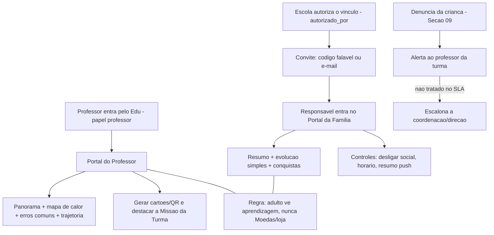
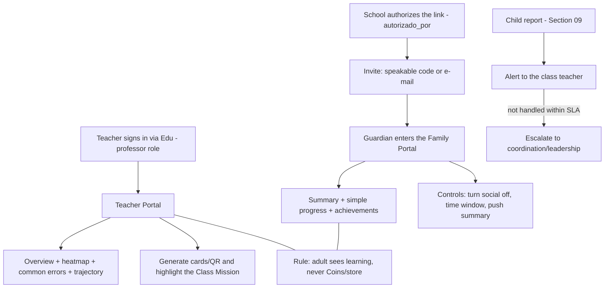

# 10 — Professor & Família / Teacher & Family

- **Status:** 🟢 aprovado / approved
- **Padrão / Standard:** [ADR-0002](decisoes/ADR-0002-padrao-de-capitulo.md) (16 partes)
- **Fontes / Sources:** `INDICE.md` (bloco 10, 38 subseções), `docs/quest/04-integracao-edu.md` (portais professor/família, SSO, reuso do Edu), `docs/quest/01-arquitetura.md` (papéis), `docs/quest/05-roadmap.md` (portal adulto = Q3), `_estado-atual/RELATORIO-2026-07-09.md`, `backend/app/quest/models/perfil.py` (`ResponsavelAluno`, `social_ativo`), `backend/app/quest/routers/professor.py` (cartões/acessos), `backend/app/quest/services/cartoes_pdf.py`, `backend/app/quest/schemas.py` (`AcessoAlunoOut`), Seções [05](05-sistemas-de-jogo.md)/[06](06-pedagogico-bncc.md)/[07](07-ux-fluxos-navegacao.md)/[08](08-onboarding-ftue.md)/[09](09-social.md)/[11](11-arquitetura.md)/[12](12-seguranca-privacidade.md)
- **Depende de / Depends on:** vocabulário → [02](02-vocabulario.md); telemetria/registro de tentativas (fonte dos painéis) → [05](05-sistemas-de-jogo.md); spec de dados pedagógica (mapa de calor BNCC, erros comuns, evolução) → [06](06-pedagogico-bncc.md); contrato de estados/telas/card na Tela-casa → [07](07-ux-fluxos-navegacao.md); timing do FTUE adulto → [08](08-onboarding-ftue.md); toggle do social/precedência dos controles/regra da denúncia/eventos de outbox → [09](09-social.md); persistência/rotas/papéis aditivos ao núcleo/`quest-core` → [11](11-arquitetura.md); base legal LGPD/consentimento/autorização do vínculo/auditoria/retenção → [12](12-seguranca-privacidade.md); push-nunca-à-criança/bem-estar/norma do horário → [13](13-acessibilidade.md); identidade/SSO e gerador de PDF → núcleo Edu ([11](11-arquitetura.md)); taxonomia de telemetria/retenção → [17](17-telemetria-metricas.md); config (`social_ativo`, tetos, janelas de horário, SLA) → [19](19-liveops.md).

> **Convenção / Convention:** "§N" = uma das 16 **partes deste capítulo** / one of the 16 **parts of this
> chapter**; "Seção NN" / "Section NN" = outro capítulo da Bible.
> **Escopo / Scope:** este capítulo decide a **camada de apresentação adulta do Quest** — os dois portais
> (**Professor** e **Família**), a regra "**cada audiência, sua linguagem**", a **política de moderação**, os
> **controles parentais** (superfície) e dois artefatos de dados próprios (o vínculo `responsaveis_alunos` e
> `quest_atribuicoes`). **Não** decide a matemática do jogo (Seção 05), a spec de dados pedagógica (Seção 06),
> as telas/estados (Seção 07), a regra legal LGPD (Seção 12), o transporte/persistência (Seção 11) nem o
> vocabulário (Seção 02) — apenas os **aplica** e os **referencia**.

---

## 🇧🇷 Professor & Família

### 1. Objetivo
Ser a **referência definitiva do lado adulto do Constela Quest**: o **Portal do Professor** (dentro do Edu web)
e o **Portal da Família** (`/quest/familia/*`), governados pela regra "**cada audiência, sua linguagem**".
Traduzir a **telemetria do jogo** em **leitura pedagógica** para o professor e em **conversa** para a família —
sem nunca expor a economia lúdica ao adulto nem um relatório à criança. Deve permitir que um dev **construa os
portais sem inventar produto**. Decide as **superfícies adultas, os papéis/vínculo e a política de moderação**;
**não** decide a matemática (Seção [05](05-sistemas-de-jogo.md)), a spec de dados (Seção [06](06-pedagogico-bncc.md)),
a regra legal (Seção [12](12-seguranca-privacidade.md)), o transporte (Seção [11](11-arquitetura.md)) nem o
vocabulário (Seção [02](02-vocabulario.md)).

### 2. Contexto
No ecossistema **Hub → Edu → Quest**, o adulto (professor, coordenação, família) age **sobre** o Quest, mas
**reusa a identidade já cadastrada no Edu** (Princípio 16) — não há novo cadastro. **Estado atual (Q0):** existe
apenas o **embrião** do lado adulto. O `backend/app/quest/routers/professor.py` está montado em
`/escolas/{escola_id}/quest/*` e faz só **três coisas**: situação de acesso da turma (`AcessoAlunoOut`) e
**geração de cartões/QR** (individual e da turma), com papéis `admin`/`coordenador`/`professor` e auditoria. O
model **`ResponsavelAluno`** (`responsaveis_alunos`) **existe mapeado mas está órfão de API**; `social_ativo`
começa **desligado** (`perfil.py`) sem UI de controle; o `cartoes_pdf.py` já gera a **página "só do
professor"** (tabela nome→código + roteiro da 1ª aula). **Não existem ainda:** painel pedagógico (panorama,
mapa de calor, erros comuns, trajetória, alertas), rotas `/quest/familia/*`, o **cargo `responsavel`** em uso,
a tabela **`quest_atribuicoes`** (Missão da Turma), o **`quest_outbox`** (base de alertas/push, ainda sem
model), o toggle da família, os certificados e o controle de horário. Todo o miolo é **fase Q3** (documentado,
sem código). *(Divergência doc↔código registrada: `docs/quest/04` promete `/quest/professor/*`; o código monta
`/escolas/{escola_id}/quest/*` — o **caminho canônico** é decisão da Seção [11](11-arquitetura.md) (registrado em
§15 desta seção).)* Este capítulo especifica o lado adulto-alvo.

### 3. Filosofia da funcionalidade
**Cada audiência, sua linguagem.** O adulto vê **aprendizagem**; a criança nunca vê **relatório**:
- **O professor enxerga, não vigia:** o painel entrega **ouro pedagógico** — não só o erro, mas **o
  mal-entendido** (a leitura das alternativas erradas; spec = Seção [06](06-pedagogico-bncc.md)) — para
  **ensinar melhor**, nunca para ranquear crianças.
- **A família conversa, não fiscaliza:** o resumo é **gancho de conversa** ("olha o que você conquistou!"),
  em **linguagem simples sem jargão BNCC**, jamais uma tela de vigilância que gere ansiedade.
- **Sem ruído lúdico para o adulto:** professor e família **nunca veem Moedas, itens, loja** nem **ranking
  individual** nos portais Quest — a leitura é **pedagógica/conversacional** (o ranking municipal individual do
  Princípio 5 vive só no Edu/Hub de gestão, para adultos, nunca na criança).
- **Confiança por design:** o acesso de adulto a dado de criança é **auditado** (regra = Seção [12](12-seguranca-privacidade.md));
  a **coleta mínima e a base legal** (Princípio 3) são da Seção [12](12-seguranca-privacidade.md); o portal
  **mostra** transparência, não a inventa.

### 4. Experiência que o jogador deve sentir
O sentimento-alvo aqui é o do **adulto** (a criança vive o jogo nas Seções 03–09):
- **Professor — "enxergo minha turma em 10 segundos":** panorama claro, sem planilha; **sei onde intervir**
  (mapa de calor, erros comuns) e **quem precisa de um empurrão** (alertas de dificuldade/inatividade).
- **Família — "meu filho está aprendendo e eu tenho o que conversar":** um resumo acolhedor, conquistas como
  gancho, **sem números que assustem**.
- **Momento mágico — a reunião de pais:** o professor abre o **mapa de calor** e o responsável mostra o
  **resumo no celular**, os dois falando do mesmo aluno **sem reconfigurar nada** (§14, DoD).
- **Fronteira emocional:** o adulto sai **informado e tranquilo**, nunca ansioso; **push é só para adultos** e
  **nunca** vira urgência/FOMO na criança (Seção [13](13-acessibilidade.md)).

### 5. Fluxo completo
Três fluxos: **professor**, **família** e **moderação** (a denúncia da criança, delegada pela Seção
[09](09-social.md), chega ao adulto aqui).

**Primeira vez / vazio / offline / sem-permissão:** turma recém-criada ou aluno que nunca jogou mostram um
**estado vazio acolhedor** (contrato da Seção [07](07-ux-fluxos-navegacao.md), §12), nunca um "sem dados" seco;
offline e sem-permissão seguem o mesmo contrato.

### 6. Interface (quando existir)
**N/A própria de layout.** A 10 **não desenha o padrão visual** — as telas do **Portal do Professor** (Edu web)
e do **Portal da Família** (`/quest/familia/*`) reusam o **contrato de 5 estados**
(vazio/carregando/erro/offline/sem-permissão) da Seção [07](07-ux-fluxos-navegacao.md) — **não** o grafo de
navegação infantil nem a camada Cosmo/narração (a 07 é escopada ao app do aluno); o **grafo/IA dos portais
adultos é próprio da 10**, que define o **conteúdo e o recorte** (quais cards existem e o que cada um responde).
O card **"Missão da Turma"** é um **container da Seção [07](07-ux-fluxos-navegacao.md)** na **Tela-casa** do
aluno — a 10 **planta** o conteúdo. Wireframes = Apêndice [E](apendice-E-wireframes.md); vocabulário = Seção
[02](02-vocabulario.md).

### 7. UX
- **Linguagem adulta, sem jargão:** o professor vê termos pedagógicos (habilidade, domínio); a **família vê
  linguagem simples** ("evoluiu em Matemática"), **sem códigos BNCC**.
- **Separação de linguagens (invariante):** nenhuma tela **destes portais** expõe **Moedas/itens/loja** nem
  **ranking individual**; nenhuma tela da criança expõe relatório.
- **Estados vazios acolhedores:** "a turma ainda vai começar a jogar", nunca uma tabela em branco.
- **Acessibilidade adulta:** alvo ≥ o mínimo da Seção [13](13-acessibilidade.md); narração não é obrigatória no
  lado adulto (regra infantil da Seção 13 vale para a criança).
- **Nunca culpa a criança:** até o **horário bloqueado** aparece como **estado sem-permissão acolhedor** (rótulo
  = Seções [02](02-vocabulario.md)/[07](07-ux-fluxos-navegacao.md)), jamais "erro".
- **Certificados/exportação** reusam o **gerador de PDF do Edu**, mantendo a identidade visual da escola.

### 8. Game Design
**N/A própria — a 10 não tem economia, progressão nem dificuldade.** Ela **lê** o jogo da criança (dados = Seção
[05](05-sistemas-de-jogo.md)/[06](06-pedagogico-bncc.md)) e injeta **dois toques** que aparecem no jogo, sempre
sem criar mecânica nova:
- **Missão da Turma:** o professor destaca uma missão da semana que vira **card especial na Tela-casa** — a
  **mecânica da missão é da Seção [05](05-sistemas-de-jogo.md)/[06](06-pedagogico-bncc.md)**, o **card é da Seção
  [07](07-ux-fluxos-navegacao.md)**; a 10 só decide **qual** missão e **para quem**.
- **Reconhecimento do professor:** um **reconhecimento simbólico** (um selo/elogio, **sem Moeda nem item de
  economia** — a economia permanece da Seção [05](05-sistemas-de-jogo.md)) que chega como **celebração privada**,
  **nunca** competição/ranking na tela da criança. O **rótulo infantil** e a representação na tela da criança —
  **evitando o token `Estrela` da progressão** — são das Seções [02](02-vocabulario.md)/[03](03-universo.md)/[07](07-ux-fluxos-navegacao.md) (§15).

### 9. Regras de negócio
- **Separação de linguagens (invariante):** professor/família **não veem** Moedas/itens/loja nem o **ranking
  individual** da criança; a criança **não vê** relatório. Aplica-se a **toda** tela do bloco.
- **Papéis e dois mundos de JWT:** `professor`/`coordenador`/`admin` (identidade do Edu) operam o **Portal do
  Professor**; o cargo **`responsavel`** opera **só** o **Portal da Família** (leitura + controles). O papel
  `aluno` **nunca** acessa portais adultos e vice-versa (mecânica do token = Seção [11](11-arquitetura.md)/[12](12-seguranca-privacidade.md));
  **a criança nunca entra em `usuarios`**.
- **Vínculo responsável↔aluno (decidido):** só nasce **autorizado por alguém da escola** (`autorizado_por`) — o
  responsável **nunca se auto-vincula**; o acesso é entregue por **convite** (código falável ou e-mail); há um
  **único vínculo por par responsável↔aluno** (invariante; índice/constraint física = Seção [11](11-arquitetura.md)).
  **Quem** pode autorizar e a base legal do vínculo = Seção [12](12-seguranca-privacidade.md).
- **Moderação da denúncia (decidido):** a denúncia da criança (regra = Seção [09](09-social.md)) gera um
  **alerta ao professor da turma**; **se não tratada dentro do SLA, escalona à coordenação/direção**. A **fila**
  vive no Portal do Professor. O **valor do SLA** é config `quest.*` (Seção [19](19-liveops.md)); o **dever legal
  / tratamento de incidente** é da Seção [12](12-seguranca-privacidade.md).
- **Controle do social pela família:** o responsável pode **desligar o social do filho** (`social_ativo`); esse
  toggle é um dos **níveis** cuja **precedência (mais restritivo vence)** é da Seção [09](09-social.md) — a 10
  só **expõe** o controle, não redefine a contagem nem a regra.
- **Horário permitido (decidido):** a família define uma janela (ex.: "não jogar após 21h") que é **bloqueio
  efetivo imposto no servidor** — fora da janela, o login/jogo do aluno é **impedido de fato**, exibido com
  gentileza (estado sem-permissão da Seção [07](07-ux-fluxos-navegacao.md)), **nunca culpando a criança** (é
  controle parental, não erro/derrota). O **valor** da janela é config (Seção [19](19-liveops.md)).
- **Bem-estar:** o **teto diário de XP** é **mecânica da Seção [05](05-sistemas-de-jogo.md)** (celebração, não
  bloqueio — Princípio 6) com valor da Seção [19](19-liveops.md); a **norma de pausa/bem-estar** é da Seção
  [13](13-acessibilidade.md). **Quem** configura (escola e/ou família) = §15.
- **Push (decidido):** resumo/alertas por push são **só para adultos**, **opt-in**, **nunca** chegam à criança
  (Seção [13](13-acessibilidade.md)); a frequência é config (Seção [19](19-liveops.md)).
- **Missão da Turma:** o professor atribui **por turma** (limite semanal e granularidade fina = §15); persiste
  em `quest_atribuicoes` (§10) e sai como card na Tela-casa (Seção [07](07-ux-fluxos-navegacao.md)).
- **Isolamento e auditoria:** `escola_id` em **toda** linha e rota (Princípio 15); todo acesso de adulto a dado
  de aluno passa por **auditoria** (`logs_auditoria`, já no núcleo via `services/audit`; regra = Seção
  [12](12-seguranca-privacidade.md)).
- **Servidor é a autoridade:** os painéis são **leitura de agregados recalculáveis** (cache das tentativas
  imutáveis — Seções [05](05-sistemas-de-jogo.md)/[06](06-pedagogico-bncc.md)/[11](11-arquitetura.md)); o
  gabarito é conferido no servidor (Princípio 13). O **bloqueio de horário** também é imposto **no servidor**,
  não burlável no cliente (integridade — regra desta seção; mecanismo = Seção [11](11-arquitetura.md)).

### 10. Arquitetura técnica
> A **persistência física, os índices, as migrações e o transporte** são da Seção [11](11-arquitetura.md). Aqui
> fica o **contrato lógico** do lado adulto.

- **Modelo de domínio adulto (definido aqui; persistência/índices/migração = Seção [11](11-arquitetura.md), que
  não redefine a semântica):**
  - `responsaveis_alunos` (**já existe**): `escola_id`, `usuario_id`→`usuarios`, `aluno_id`→`alunos`,
    `parentesco`, `autorizado_por`→`usuarios`, `UNIQUE(usuario_id, aluno_id)`. **Invariante:** o vínculo só é
    válido com `autorizado_por` preenchido (o NOT NULL / validação de serviço no aceite = Seção [11](11-arquitetura.md)).
  - `responsaveis_convites` (**net-new** — veículo do vínculo): `escola_id`, `aluno_id`, `codigo` falável (ou
    `email`), `autorizado_por`, `status` pendente/aceito/expirado, `expira_em`, `aceito_em`, `usuario_id`
    resultante. O **aceite** grava a linha em `responsaveis_alunos`.
  - `controles_responsavel` (**net-new** — o que a família escolhe por criança): `escola_id`, `aluno_id`,
    `responsavel_id`→`usuarios`, `social_desligado`, `janela_inicio`/`janela_fim` (o **horário** escolhido). Os
    **default/limites** das janelas são config (Seção [19](19-liveops.md)); o **valor escolhido** é este dado de
    instância. O `social_ativo` **efetivo** por criança é resolvido pela **precedência da Seção [09](09-social.md)**
    sobre escola/turma/responsável.
  - `quest_denuncias` (**net-new** — a fila de moderação com estado): `escola_id`, `denunciante_id`→`alunos`,
    `denunciado_id`→`alunos`, `motivo` (taxonomia = Seção [09](09-social.md)), `status`
    aberta/em_tratamento/escalada/resolvida, `aberta_em`, `prazo_sla`, `atribuido_a`→`usuarios` (o adulto que
    trata), `escalada_em`, `resolvido_por`→`usuarios`. A **regra do que gera** a denúncia é da Seção [09](09-social.md);
    o **registro/estado/escalonamento** é desta seção.
  - `quest_atribuicoes` (**net-new** — Missão da Turma): `escola_id`, `turma_id`→`turmas`,
    `missao_id`→`quest_missoes`, `criado_por`→`usuarios`, `semana` (ano+semana ISO). Se o limite for **1 por
    semana**, `UNIQUE(turma_id, semana)`; granularidade fina e limite = §15.
  - `quest_reconhecimentos` (**net-new** — reconhecimento simbólico do professor): `escola_id`,
    `professor_id`→`usuarios`, `aluno_id`→`alunos`, `tipo` (slug do catálogo), `criado_em`. **Sem** Moeda/item de
    economia; a **superfície/entrega** na tela da criança = Seção [07](07-ux-fluxos-navegacao.md) (§15).
  - *(O cargo **`responsavel`** é um **novo valor** de `usuarios.cargo` — hoje `String(30)` **livre, sem enum de
    banco**: introduzi-lo é **adição de valor + fiação de auth/portal**, sem migração de schema, a menos que a
    Seção [11](11-arquitetura.md) decida promover `cargo` a enum.)*
- **Contratos de API (lógicos):** `/quest/professor/*` (panorama, habilidades, erros-comuns, trajetória,
  alertas, cartões, atribuições, fila de moderação) e `/quest/familia/*` (resumo, evolução, conquistas,
  controles), autorizados por **papel + `escola_id`**. **Caminho físico e detalhe** = Seção [11](11-arquitetura.md)
  + Apêndice [B](apendice-B-api-dados.md). *(Divergência doc↔código: o Q0 monta `/escolas/{escola_id}/quest/*`;
  o **caminho canônico** é decisão da Seção [11](11-arquitetura.md), registrada em §15.)*
- **Fonte dos painéis:** agregados **recalculáveis** de `quest_tentativas`/`quest_habilidades` (fórmula/spec =
  Seções [05](05-sistemas-de-jogo.md)/[06](06-pedagogico-bncc.md)); a 10 **não** define o registro nem a fórmula.
  O **cache** é da Seção [11](11-arquitetura.md).
- **Notificações:** alertas e push adultos **derivam** de eventos do **`quest_outbox`** (que **ainda não tem
  model** — mecanismo = Seção [11](11-arquitetura.md); taxonomia = Seção [17](17-telemetria-metricas.md); eventos
  sociais = Seção [09](09-social.md)). A 10 é dona do **mapeamento evento→mensagem adulta** (categorias:
  dificuldade, inatividade, moderação, resumo semanal); a **tabela evento→mensagem** e a home do catálogo adulto
  ficam em §15/Apêndice [B](apendice-B-api-dados.md). O `quest_outbox` **notifica**; o **estado** da moderação
  vive em `quest_denuncias`.
- **Horário (bloqueio no servidor):** a autorização de sessão/entrada do aluno consulta a janela vigente de
  `controles_responsavel`; **default/limites** = config (Seção [19](19-liveops.md)).
- **Reuso do Edu:** os **certificados** reusam o **gerador de PDF do Edu** (`services/relatorios`); os
  **cartões** usam o gerador próprio do Quest (`cartoes_pdf`, que puxa a cor da escola do Edu); a
  **identidade/SSO** vem do Edu (Princípio 16).
- **Não decide aqui:** persistência/índices/rota física, mecanismo de outbox/push, cache de agregados — Seção
  [11](11-arquitetura.md).

### 11. Dependências com outros módulos
- **Vocabulário** → Seção [02](02-vocabulario.md).
- **Registro imutável de tentativas + números do progresso (XP/Estrela/Nível/Chama) como FONTE traduzida em
  leitura pedagógica — sem vocabulário de economia/progressão lúdica ao adulto** → Seção [05](05-sistemas-de-jogo.md).
- **Spec de dados do mapa de calor BNCC, domínio por habilidade e erros comuns** → Seção [06](06-pedagogico-bncc.md).
- **Padrão de tela, contrato de 5 estados e o container do card "Missão da Turma"** → Seção [07](07-ux-fluxos-navegacao.md).
- **Encaixe do Passo 0 do professor no loop infantil** → Seção [08](08-onboarding-ftue.md) *(o FTUE adulto —
  Passo 0 do professor e 1º acesso da família — é desta seção)*.
- **Regra de precedência dos controles sociais, regra da denúncia e eventos de outbox social** → Seção [09](09-social.md).
- **Persistência/rotas/cargo `responsavel`/`quest-core`/cache/outbox** → Seção [11](11-arquitetura.md).
- **Base legal LGPD, consentimento, autorização do vínculo, auditoria, retenção** → Seção [12](12-seguranca-privacidade.md).
- **Push nunca à criança, norma de bem-estar e do horário** → Seção [13](13-acessibilidade.md).
- **Taxonomia de telemetria e retenção/anonimização** → Seção [17](17-telemetria-metricas.md).
- **Config (`social_ativo`, tetos, janela de horário, SLA de moderação)** → Seção [19](19-liveops.md).

Este capítulo **alimenta:** a criança — via a **Missão da Turma** e o **reconhecimento do professor** (superfície
= Seção [07](07-ux-fluxos-navegacao.md), mecânica = Seção [05](05-sistemas-de-jogo.md)); o professor e a família —
com a **leitura** do progresso; e a Seção [12](12-seguranca-privacidade.md) — com os **acessos auditáveis**.
**Dá origem a:** o cargo `responsavel` e a tabela `quest_atribuicoes` (schema = Seção [11](11-arquitetura.md)) e
os contratos dos portais (Apêndice [B](apendice-B-api-dados.md)).

### 12. Casos extremos (Edge Cases)
Aplicando o **contrato de estados** da Seção [07](07-ux-fluxos-navegacao.md) ao lado adulto:
- **Turma recém-criada / aluno que nunca jogou:** **estado vazio acolhedor** ("a turma ainda vai começar"),
  nunca "sem dados".
- **Professor multi-turma / multi-escola:** seletor de turma; **isolamento por `escola_id`** em toda consulta.
- **Rotatividade do adulto (troca de professor titular / transferência de turma):** o vínculo professor↔turma
  vem do **cadastro do Edu** — ao trocar, o acesso segue o Edu **sem reconfiguração** no Quest (Princípio 16).
- **Múltiplos responsáveis por um aluno:** cada responsável autorizado pode aplicar o controle **mais
  restritivo** (desligar social, impor horário); a **hierarquia** entre eles = §15.
- **Um responsável com vários filhos:** seletor de filho; cada vínculo é uma linha própria.
- **Adulto que é staff e responsável ao mesmo tempo** (o professor também é pai de um aluno): o acesso ao Portal
  da Família é **gateado pela existência de um vínculo `responsaveis_alunos`**, não só pelo cargo — a identidade
  única do Edu (e-mail) e o papel acumulável = Seções [11](11-arquitetura.md)/[12](12-seguranca-privacidade.md) (§15).
- **Aluno sai da escola:** o acesso do responsável é **revogado**; o portal reflete o **perfil arquivado**
  (estado sem-permissão da Seção [07](07-ux-fluxos-navegacao.md)); a **anonimização** após o prazo é da Seção
  [17](17-telemetria-metricas.md)/[12](12-seguranca-privacidade.md).
- **Denúncia sem professor titular disponível:** escala **direto à coordenação** (o alerta nunca fica órfão).
- **Horário bloqueado no meio de uma partida social:** encerra com gentileza, **sem penalidade** (Seção
  [09](09-social.md); regra = Seções [05](05-sistemas-de-jogo.md)/[06](06-pedagogico-bncc.md)); a criança nunca
  é culpada.
- **Offline / sem-permissão / social desligado:** seguem o contrato da Seção [07](07-ux-fluxos-navegacao.md).

### 13. Escalabilidade futura
- **Novos cards** de painel entram sem redesenhar o portal.
- **Novos tipos de atribuição** crescem sobre `quest_atribuicoes` sem nova tabela.
- **Visão consolidada multi-turma/rede** (coordenador/secretaria/rede municipal) é **evolução futura** — a
  fronteira com gestão/Live-ops (Seção [19](19-liveops.md)) fica registrada (§15).
- **Certificados** ganham idiomas (Seção [16](16-localizacao-i18n.md)) e novos modelos sem reescrever o gerador.
- **Novas plataformas de dados** (ver Seção [20](20-migracao-importacao.md)) alimentam os **mesmos** painéis,
  porque a fonte é o agregado das Seções [05](05-sistemas-de-jogo.md)/[06](06-pedagogico-bncc.md).

### 14. Checklist de implementação
- [ ] **Separação de linguagens:** nenhuma tela adulta expõe Moedas/itens/loja/ranking individual; nenhuma tela
      da criança expõe relatório.
- [ ] **Papéis:** `responsavel` (aditivo em `usuarios`, Seção [11](11-arquitetura.md)) só no Portal da Família;
      `aluno` nunca acessa portais adultos; a criança nunca em `usuarios`.
- [ ] **Vínculo** `responsaveis_alunos` **autorizado pela escola** (`autorizado_por`) + convite (código/e-mail)
      via `responsaveis_convites`; nunca auto-vínculo; **um único vínculo por par** (constraint física = Seção [11](11-arquitetura.md)).
- [ ] **Portal do Professor:** panorama, mapa de calor BNCC, erros comuns (spec/semântica = Seção [06](06-pedagogico-bncc.md)),
      trajetória, alertas — renderizando a spec da Seção [06](06-pedagogico-bncc.md) sobre a fonte da Seção [05](05-sistemas-de-jogo.md).
- [ ] **Portal da Família:** resumo, evolução em linguagem simples (sem BNCC), conquistas como gancho.
- [ ] **Moderação:** alerta ao professor da turma + **escalonar à coordenação** por SLA (config Seção [19](19-liveops.md));
      fila no Portal do Professor.
- [ ] **Controles:** desligar social (precedência = Seção [09](09-social.md)); **horário = bloqueio efetivo no
      servidor** exibido gentil; resumo push opt-in só-adulto.
- [ ] **Missão da Turma** (`quest_atribuicoes`) por turma → card na Tela-casa (Seção [07](07-ux-fluxos-navegacao.md)).
- [ ] **Reconhecimento do professor** simbólico (selo/elogio, **sem item de economia**); rótulo infantil = Seções [02](02-vocabulario.md)/[03](03-universo.md)/[07](07-ux-fluxos-navegacao.md) (§15).
- [ ] **Auditoria** de acessos adultos (`logs_auditoria`, Seção [12](12-seguranca-privacidade.md)); `escola_id`
      em toda rota (Princípio 15).
- [ ] **Reuso do Edu:** gerador de PDF do Edu para os **certificados**; **cartões** via gerador próprio do Quest (`cartoes_pdf`); identidade/SSO (Princípio 16).
- [ ] **Estados vazios** e **multi-turma/multi-escola** cobertos; rotatividade do adulto segue o cadastro do Edu.
- [ ] **DoD — reunião de pais:** o professor abre o mapa de calor e o responsável mostra o resumo no celular, do
      mesmo aluno, **sem reconfigurar nada**. DoD conferido contra o Apêndice [F](apendice-F-checklists-dod.md).

### 15. Questões em aberto
As decisões-chave foram **tomadas com o dono na fronteira e registradas no ADR (§16)** — moderação
(professor→coordenação), vínculo (escola autoriza + convite), horário (bloqueio efetivo) e reconhecimento
(simbólico). Restam calibrações/decisões que dependem de outra seção:
- ⚠️ **Valor do SLA de moderação** (em quanto tempo escala à coordenação) — config `quest.*` (Seção [19](19-liveops.md)).
- ⚠️ **Limite semanal e granularidade fina da Missão da Turma** (turma/grupo) — calibração (Seções
  [05](05-sistemas-de-jogo.md)/[19](19-liveops.md)).
- ⚠️ **Recorte família↔escola de quem configura o teto diário / bem-estar** — calibração (Seções
  [05](05-sistemas-de-jogo.md)/[13](13-acessibilidade.md)/[19](19-liveops.md)).
- ⚠️ **Rótulo infantil e representação do reconhecimento do professor** (sem reusar o token `Estrela` da
  progressão) — Seções [02](02-vocabulario.md)/[03](03-universo.md)/[07](07-ux-fluxos-navegacao.md).
- ⚠️ **Gatilhos e modelos dos certificados em PDF** (nível, conclusão de planeta, fim de temporada) — decisão do
  dono (reuso do gerador do Edu).
- ⚠️ **Hierarquia entre múltiplos responsáveis** (quando um liga e outro desliga além do "mais restritivo vence").
- ⚠️ **Visão consolidada multi-turma/rede** do coordenador/secretaria — fronteira 10 × gestão/Live-ops (Seção
  [19](19-liveops.md)).
- ⚠️ **Caminho canônico das rotas** (`/quest/professor|familia/*` vs `/escolas/{escola_id}/quest/*` do Q0) —
  dono do contrato = Seção [11](11-arquitetura.md).
- ⚠️ **Frequência configurável do push** da família — config (Seção [19](19-liveops.md)).
- ⚠️ **Tabela/mapeamento evento→mensagem adulta e home do catálogo de mensagens adultas** — detalhe = Apêndice
  [B](apendice-B-api-dados.md).
- ⚠️ **Contrato de entrega do reconhecimento do professor** (evento/superfície na tela da criança) — Seções
  [07](07-ux-fluxos-navegacao.md)/[11](11-arquitetura.md).
- ⚠️ **Adulto que é staff e responsável** (papel acumulável vs. cargo único + e-mail UNIQUE) — mecanismo = Seções
  [11](11-arquitetura.md)/[12](12-seguranca-privacidade.md).
- ⚠️ **Base legal, consentimento e retenção exatos** — home canônico na Seção [12](12-seguranca-privacidade.md)/[17](17-telemetria-metricas.md)
  (a 10 apenas mostra a transparência).

### 16. ADR (Architecture Decision Record)
**Decisões registradas por este capítulo:**
1. **Camada de apresentação adulta** = dois portais (Professor no Edu web; Família em `/quest/familia/*`) sob a
   regra **"cada audiência, sua linguagem"** (adulto nunca vê Moedas/loja/ranking individual; criança nunca vê
   relatório).
2. **Moderação da denúncia:** alerta ao **professor da turma**, **escalonando à coordenação/direção** por SLA
   (fila no Portal do Professor; SLA = Seção [19](19-liveops.md); regra da denúncia = Seção [09](09-social.md);
   dever legal = Seção [12](12-seguranca-privacidade.md)).
3. **Vínculo responsável↔aluno:** a **escola autoriza** (`autorizado_por`) + **convite** (código/e-mail); o
   responsável **nunca se auto-vincula**.
4. **Horário permitido = bloqueio efetivo no servidor**, exibido com gentileza; o **teto diário de XP** continua
   **mecânica da Seção [05](05-sistemas-de-jogo.md)** (valor = Seção [19](19-liveops.md)).
5. **Reconhecimento do professor = simbólico** (um selo/elogio, **sem item de economia** — economia = Seção
   [05](05-sistemas-de-jogo.md)); celebração privada, nunca competição; **rótulo infantil** (sem reusar o token
   `Estrela`) = Seções [02](02-vocabulario.md)/[03](03-universo.md)/[07](07-ux-fluxos-navegacao.md) (§15).
6. **Missão da Turma = `quest_atribuicoes`** (net-new), atribuição **por turma**; card = container da Seção
   [07](07-ux-fluxos-navegacao.md).
7. **Cargo `responsavel`** = novo valor de `usuarios.cargo` (hoje `String(30)` livre, sem enum de banco); a
   criança nunca em `usuarios`; o papel `aluno` nunca acessa portais adultos (auth/portal = código; eventual
   promoção de `cargo` a enum = Seção [11](11-arquitetura.md)).
8. **Push adulto = opt-in** (escolha de superfície desta seção); o invariante **push nunca à criança** é da
   Seção [13](13-acessibilidade.md), aqui apenas aplicado; alertas/push derivam do `quest_outbox` (mecanismo =
   Seção [11](11-arquitetura.md); taxonomia = Seção [17](17-telemetria-metricas.md)).
9. **Modelo de domínio adulto definido aqui** (`responsaveis_alunos`/`quest_atribuicoes` + cargo `responsavel`);
   **persistência/índices/contratos** = Seção [11](11-arquitetura.md) + Apêndice [B](apendice-B-api-dados.md),
   sem redefinir a semântica.

*(Registro inline; sem criar arquivo de ADR sem autorização.)*

---

## 🇬🇧 Teacher & Family

### 1. Objective
Be the **definitive reference for the Constela Quest adult side**: the **Teacher Portal** (inside the Edu web app)
and the **Family Portal** (`/quest/familia/*`), governed by the rule "**each audience, its own language**".
Translate the **game telemetry** into **pedagogical reading** for the teacher and into **conversation** for the
family — never exposing the playful economy to the adult nor a report to the child. It must let a dev **build the
portals without inventing product**. It decides the **adult surfaces, the roles/link and the moderation policy**;
it does **not** decide the math (Section [05](05-sistemas-de-jogo.md)), the data spec (Section [06](06-pedagogico-bncc.md)),
the legal rule (Section [12](12-seguranca-privacidade.md)), the transport (Section [11](11-arquitetura.md)) or the
vocabulary (Section [02](02-vocabulario.md)).

### 2. Context
In the **Hub → Edu → Quest** ecosystem, the adult (teacher, coordination, family) acts **on** Quest but **reuses
the identity already registered in Edu** (Principle 16) — no new sign-up. **Current state (Q0):** only the **seed**
of the adult side exists. `backend/app/quest/routers/professor.py` is mounted at `/escolas/{escola_id}/quest/*`
and does only **three things**: the class access status (`AcessoAlunoOut`) and **card/QR generation** (individual
and per-class), with roles `admin`/`coordenador`/`professor` and auditing. The **`ResponsavelAluno`** model
(`responsaveis_alunos`) **exists mapped but is orphaned of any API**; `social_ativo` starts **off** (`perfil.py`)
with no control UI; `cartoes_pdf.py` already generates the **"teacher-only" page** (name→code table + first-class
script). **Not yet existing:** the pedagogical panel (overview, heatmap, common errors, trajectory, alerts), the
`/quest/familia/*` routes, the **`responsavel`** role in use, the **`quest_atribuicoes`** table (Class Mission),
the **`quest_outbox`** (alerts/push substrate, still no model), the family toggle, certificates, and the time
control. The whole core is **phase Q3** (documented, no code). *(Recorded doc↔code divergence: `docs/quest/04`
promises `/quest/professor/*`; the code mounts `/escolas/{escola_id}/quest/*` — the **canonical path** is Section
[11](11-arquitetura.md)'s decision (recorded in §15 of this chapter).)* This chapter specifies the target adult side.

### 3. Feature philosophy
**Each audience, its own language.** The adult sees **learning**; the child never sees a **report**:
- **The teacher sees, doesn't surveil:** the panel delivers **pedagogical gold** — not just the error but **the
  misconception** (the reading of wrong options; spec = Section [06](06-pedagogico-bncc.md)) — to **teach
  better**, never to rank children.
- **The family converses, doesn't police:** the summary is a **conversation hook** ("look what you achieved!"),
  in **simple language without BNCC jargon**, never a surveillance screen that breeds anxiety.
- **No playful noise for the adult:** teacher and family **never see Coins, items, the store** or an
  **individual ranking** in the Quest portals — the reading is **pedagogical/conversational** (Principle 5's
  municipal individual ranking lives only in the Edu/Hub for management, for adults, never for the child).
- **Trust by design:** adult access to a child's data is **audited** (rule = Section [12](12-seguranca-privacidade.md));
  **minimal collection and legal basis** (Principle 3) are Section [12](12-seguranca-privacidade.md)'s; the
  portal **shows** transparency, it doesn't invent it.

### 4. The experience the player should feel
The target feeling here is the **adult's** (the child lives the game in Sections 03–09):
- **Teacher — "I see my class in 10 seconds":** a clear overview, no spreadsheet; **I know where to step in**
  (heatmap, common errors) and **who needs a nudge** (difficulty/inactivity alerts).
- **Family — "my child is learning and I have something to talk about":** a welcoming summary, achievements as a
  hook, **no numbers that scare**.
- **Magic moment — the parents' meeting:** the teacher opens the **heatmap** and the guardian shows the
  **summary on their phone**, both talking about the same child **with no reconfiguration** (§14, DoD).
- **Emotional boundary:** the adult leaves **informed and calm**, never anxious; **push is adults-only** and
  **never** becomes urgency/FOMO for the child (Section [13](13-acessibilidade.md)).

### 5. Complete flow
Three flows: **teacher**, **family** and **moderation** (the child's report, delegated by Section
[09](09-social.md), reaches the adult here).

**First time / empty / offline / no-permission:** a newly created class or a child who never played show a
**welcoming empty state** (Section [07](07-ux-fluxos-navegacao.md)'s contract, §12), never a dry "no data";
offline and no-permission follow the same contract.

### 6. Interface (when it exists)
**N/A of its own layout.** 10 **does not design the visual pattern** — the **Teacher Portal** (Edu web) and the
**Family Portal** (`/quest/familia/*`) screens reuse the **5-state contract**
(empty/loading/error/offline/no-permission) of Section [07](07-ux-fluxos-navegacao.md) — **not** the child
navigation graph nor the Cosmo/narration layer (07 is scoped to the child app); the **adult portals' graph/IA is
10's own**, which defines the **content and the framing** (which cards exist and what each answers). The **"Class
Mission"** card is a **Section [07](07-ux-fluxos-navegacao.md) container** in the child's **Home screen** — 10
**plants** the content. Wireframes = Appendix [E](apendice-E-wireframes.md); vocabulary = Section
[02](02-vocabulario.md).

### 7. UX
- **Adult language, no jargon:** the teacher sees pedagogical terms (skill, mastery); the **family sees simple
  language** ("improved in Math"), **no BNCC codes**.
- **Separation of languages (invariant):** no **portal** screen exposes **Coins/items/store** or an
  **individual ranking**; no child screen exposes a report.
- **Welcoming empty states:** "the class is about to start playing", never a blank table.
- **Adult accessibility:** target ≥ Section [13](13-acessibilidade.md)'s minimum; narration is not mandatory on
  the adult side (Section 13's child rule applies to the child).
- **Never blames the child:** even a **blocked time window** appears as a welcoming **no-permission state**
  (label = Sections [02](02-vocabulario.md)/[07](07-ux-fluxos-navegacao.md)), never an "error".
- **Certificates/exports** reuse the **Edu PDF generator**, keeping the school's visual identity.

### 8. Game Design
**N/A of its own — 10 has no economy, progression or difficulty.** It **reads** the child's game (data = Sections
[05](05-sistemas-de-jogo.md)/[06](06-pedagogico-bncc.md)) and injects **two touches** that appear in the game,
always without creating new mechanics:
- **Class Mission:** the teacher highlights a mission of the week that becomes a **special Home-screen card** —
  the **mission mechanic is Section [05](05-sistemas-de-jogo.md)/[06](06-pedagogico-bncc.md)'s**, the **card is
  Section [07](07-ux-fluxos-navegacao.md)'s**; 10 only decides **which** mission and **for whom**.
- **Teacher recognition:** a **symbolic recognition** (a seal/praise, **no Coin or economy item** — the economy
  stays Section [05](05-sistemas-de-jogo.md)'s) that arrives as a **private celebration**, **never**
  competition/ranking on the child's screen. The **child-facing label** and the on-screen representation —
  **avoiding the progression token `Estrela`** — are Sections [02](02-vocabulario.md)/[03](03-universo.md)/[07](07-ux-fluxos-navegacao.md)'s (§15).

### 9. Business rules
- **Separation of languages (invariant):** teacher/family **do not see** Coins/items/store or the child's
  **individual ranking**; the child **does not see** a report. Applies to **every** screen of the block.
- **Roles and two JWT worlds:** `professor`/`coordenador`/`admin` (Edu identity) operate the **Teacher Portal**;
  the **`responsavel`** role operates **only** the **Family Portal** (read + controls). The `aluno` role **never**
  accesses adult portals and vice versa (token mechanics = Section [11](11-arquitetura.md)/[12](12-seguranca-privacidade.md));
  **the child never enters `usuarios`**.
- **Guardian↔student link (decided):** it is born only **authorized by someone at the school** (`autorizado_por`)
  — the guardian **never self-links**; access is delivered by **invite** (speakable code or e-mail); there is a
  **single link per guardian↔student pair** (invariant; physical index/constraint = Section [11](11-arquitetura.md)).
  **Who** may authorize and the link's legal basis = Section [12](12-seguranca-privacidade.md).
- **Report moderation (decided):** the child's report (rule = Section [09](09-social.md)) raises an **alert to the
  class teacher**; **if not handled within the SLA, it escalates to coordination/leadership**. The **queue** lives
  in the Teacher Portal. The **SLA value** is `quest.*` config (Section [19](19-liveops.md)); the **legal duty /
  incident handling** is Section [12](12-seguranca-privacidade.md)'s.
- **Family control of social:** the guardian can **turn the child's social off** (`social_ativo`); that toggle is
  one of the **levels** whose **precedence (most restrictive wins)** is Section [09](09-social.md)'s — 10 only
  **exposes** the control, it redefines neither the count nor the rule.
- **Time window (decided):** the family sets a window (e.g. "no playing after 9pm") that is an **effective block
  enforced on the server** — outside the window the child's login/play is **actually prevented**, shown gently
  (Section [07](07-ux-fluxos-navegacao.md)'s no-permission state), **never blaming the child** (it is parental
  control, not an error/defeat). The window's **value** is config (Section [19](19-liveops.md)).
- **Well-being:** the **daily XP cap** is a **Section [05](05-sistemas-de-jogo.md) mechanic** (celebration, not a
  block — Principle 6) with Section [19](19-liveops.md) values; the **pause/well-being norm** is Section
  [13](13-acessibilidade.md)'s. **Who** configures (school and/or family) = §15.
- **Push (decided):** push summaries/alerts are **adults-only**, **opt-in**, and **never** reach the child
  (Section [13](13-acessibilidade.md)); frequency is config (Section [19](19-liveops.md)).
- **Class Mission:** the teacher assigns **per class** (weekly limit and finer granularity = §15); it persists in
  `quest_atribuicoes` (§10) and surfaces as a Home-screen card (Section [07](07-ux-fluxos-navegacao.md)).
- **Isolation and auditing:** `escola_id` on **every** row and route (Principle 15); every adult access to a
  child's data is **audited** (`logs_auditoria`, already in the core via `services/audit`; rule = Section
  [12](12-seguranca-privacidade.md)).
- **Server is the authority:** the panels are **reads of recomputable aggregates** (a cache of the immutable
  attempts — Sections [05](05-sistemas-de-jogo.md)/[06](06-pedagogico-bncc.md)/[11](11-arquitetura.md)); the
  answer key is checked on the server (Principle 13). The **time block** is also enforced **on the server**, not
  bypassable on the client (integrity — this section's rule; mechanism = Section [11](11-arquitetura.md)).

### 10. Technical architecture
> The **physical persistence, indexes, migrations and transport** are Section [11](11-arquitetura.md)'s. Here
> lives the **logical contract** of the adult side.

- **Adult domain model (defined here; persistence/indexes/migration = Section [11](11-arquitetura.md), which does
  not redefine the semantics):**
  - `responsaveis_alunos` (**already exists**): `escola_id`, `usuario_id`→`usuarios`, `aluno_id`→`alunos`,
    `parentesco`, `autorizado_por`→`usuarios`, `UNIQUE(usuario_id, aluno_id)`. **Invariant:** the link is valid
    only with `autorizado_por` set (the NOT NULL / service validation at acceptance = Section [11](11-arquitetura.md)).
  - `responsaveis_convites` (**net-new** — the link's vehicle): `escola_id`, `aluno_id`, speakable `codigo` (or
    `email`), `autorizado_por`, `status` pendente/aceito/expirado, `expira_em`, `aceito_em`, resulting
    `usuario_id`. **Acceptance** writes the `responsaveis_alunos` row.
  - `controles_responsavel` (**net-new** — what the family chooses per child): `escola_id`, `aluno_id`,
    `responsavel_id`→`usuarios`, `social_desligado`, `janela_inicio`/`janela_fim` (the chosen **time window**). The
    **defaults/limits** of these windows are config (Section [19](19-liveops.md)); the **chosen value** is this
    instance data. The **effective** per-child `social_ativo` is resolved by **Section [09](09-social.md)'s
    precedence** over school/class/guardian.
  - `quest_denuncias` (**net-new** — the moderation queue with state): `escola_id`, `denunciante_id`→`alunos`,
    `denunciado_id`→`alunos`, `motivo` (taxonomy = Section [09](09-social.md)), `status`
    aberta/em_tratamento/escalada/resolvida, `aberta_em`, `prazo_sla`, `atribuido_a`→`usuarios` (the adult
    handling it), `escalada_em`, `resolvido_por`→`usuarios`. The **rule of what generates** the report is Section
    [09](09-social.md)'s; the **record/state/escalation** is this section's.
  - `quest_atribuicoes` (**net-new** — Class Mission): `escola_id`, `turma_id`→`turmas`,
    `missao_id`→`quest_missoes`, `criado_por`→`usuarios`, `semana` (ISO year+week). If the limit is **1 per
    week**, `UNIQUE(turma_id, semana)`; finer granularity and the limit = §15.
  - `quest_reconhecimentos` (**net-new** — the teacher's symbolic recognition): `escola_id`,
    `professor_id`→`usuarios`, `aluno_id`→`alunos`, `tipo` (catalog slug), `criado_em`. **No** Coin/economy item;
    the **surface/delivery** on the child's screen = Section [07](07-ux-fluxos-navegacao.md) (§15).
  - *(The **`responsavel`** role is a **new value** of `usuarios.cargo` — today a **free `String(30)`, with no DB
    enum**: introducing it is **adding a value + wiring auth/portal**, with no schema migration, unless Section
    [11](11-arquitetura.md) decides to promote `cargo` to an enum.)*
- **API contracts (logical):** `/quest/professor/*` (overview, skills, common-errors, trajectory, alerts, cards,
  assignments, moderation queue) and `/quest/familia/*` (summary, progress, achievements, controls), authorized
  by **role + `escola_id`**. **Physical path and detail** = Section [11](11-arquitetura.md) + Appendix
  [B](apendice-B-api-dados.md). *(Doc↔code divergence: Q0 mounts `/escolas/{escola_id}/quest/*`; the **canonical
  path** is Section [11](11-arquitetura.md)'s decision, recorded in §15.)*
- **Panel source:** **recomputable** aggregates of `quest_tentativas`/`quest_habilidades` (formula/spec =
  Sections [05](05-sistemas-de-jogo.md)/[06](06-pedagogico-bncc.md)); 10 does **not** define the record or the
  formula. The **cache** is Section [11](11-arquitetura.md)'s.
- **Notifications:** adult alerts and push **derive** from **`quest_outbox`** events (which **has no model yet** —
  mechanism = Section [11](11-arquitetura.md); taxonomy = Section [17](17-telemetria-metricas.md); social events =
  Section [09](09-social.md)). 10 owns the **event→adult-message mapping** (categories: difficulty, inactivity,
  moderation, weekly summary); the **event→message table** and the adult catalog's home are in §15/Appendix
  [B](apendice-B-api-dados.md). `quest_outbox` **notifies**; the moderation **state** lives in `quest_denuncias`.
- **Time window (server-side block):** the child's session/entry authorization checks the current window in
  `controles_responsavel`; **defaults/limits** = config (Section [19](19-liveops.md)).
- **Edu reuse:** **certificates** reuse the **Edu PDF generator** (`services/relatorios`); **cards** use Quest's
  own generator (`cartoes_pdf`, which pulls the school color from Edu); the **identity/SSO** comes from Edu
  (Principle 16).
- **Not decided here:** persistence/indexes/physical route, outbox/push mechanism, aggregate cache — Section
  [11](11-arquitetura.md).

### 11. Dependencies on other modules
- **Vocabulary** → Section [02](02-vocabulario.md).
- **Immutable attempt record + progress numbers (XP/Star/Level/Flame) as a SOURCE translated into pedagogical
  reading — no playful economy/progression vocabulary to the adult** → Section [05](05-sistemas-de-jogo.md).
- **Data spec of the BNCC heatmap, per-skill mastery and common errors** → Section [06](06-pedagogico-bncc.md).
- **Screen pattern, 5-state contract and the "Class Mission" card container** → Section [07](07-ux-fluxos-navegacao.md).
- **Fit of the teacher's Step 0 into the child loop** → Section [08](08-onboarding-ftue.md) *(the adult FTUE —
  teacher Step 0 and family's 1st access — is this section's)*.
- **Social-controls precedence rule, report rule and social outbox events** → Section [09](09-social.md).
- **Persistence/routes/`responsavel` role/`quest-core`/cache/outbox** → Section [11](11-arquitetura.md).
- **LGPD legal basis, consent, link authorization, auditing, retention** → Section [12](12-seguranca-privacidade.md).
- **Push never to the child, well-being and time-window norm** → Section [13](13-acessibilidade.md).
- **Telemetry taxonomy and retention/anonymization** → Section [17](17-telemetria-metricas.md).
- **Config (`social_ativo`, caps, time window, moderation SLA)** → Section [19](19-liveops.md).

This chapter **feeds:** the child — via the **Class Mission** and **teacher recognition** (surface = Section
[07](07-ux-fluxos-navegacao.md), mechanic = Section [05](05-sistemas-de-jogo.md)); the teacher and family — with
the progress **reading**; and Section [12](12-seguranca-privacidade.md) — with **auditable accesses**. **Spawns:**
the `responsavel` role and the `quest_atribuicoes` table (schema = Section [11](11-arquitetura.md)) and the
portal contracts (Appendix [B](apendice-B-api-dados.md)).

### 12. Edge cases
Applying Section [07](07-ux-fluxos-navegacao.md)'s **state contract** to the adult side:
- **Newly created class / child who never played:** a **welcoming empty state** ("the class is about to
  begin"), never "no data".
- **Multi-class / multi-school teacher:** class selector; **isolation by `escola_id`** on every query.
- **Adult turnover (change of lead teacher / class transfer):** the teacher↔class link comes from the **Edu
  registry** — on change, access follows Edu **with no reconfiguration** in Quest (Principle 16).
- **Multiple guardians for one student:** each authorized guardian may apply the **most restrictive** control
  (turn social off, impose a time window); the **hierarchy** among them = §15.
- **One guardian with several children:** a child selector; each link is its own row.
- **An adult who is both staff and guardian** (the teacher is also a student's parent): access to the Family
  Portal is **gated by the existence of a `responsaveis_alunos` link**, not by the role alone — Edu's unique
  identity (e-mail) and the cumulative-role mechanism = Sections [11](11-arquitetura.md)/[12](12-seguranca-privacidade.md) (§15).
- **Student leaves the school:** the guardian's access is **revoked**; the portal reflects the **archived
  profile** (Section [07](07-ux-fluxos-navegacao.md)'s no-permission state); **anonymization** after the
  deadline is Section [17](17-telemetria-metricas.md)/[12](12-seguranca-privacidade.md)'s.
- **Report with no lead teacher available:** it escalates **straight to coordination** (the alert is never
  orphaned).
- **Time window blocked mid social match:** it ends gently, **with no penalty** (Sections [09](09-social.md);
  rule = [05](05-sistemas-de-jogo.md)/[06](06-pedagogico-bncc.md)); the child is never blamed.
- **Offline / no-permission / social off:** they follow Section [07](07-ux-fluxos-navegacao.md)'s contract.

### 13. Future scalability
- **New panel cards** enter without redesigning the portal.
- **New assignment types** grow on `quest_atribuicoes` without a new table.
- **Consolidated multi-class/network view** (coordinator/secretariat/municipal network) is a **future
  evolution** — the boundary with management/Live-ops (Section [19](19-liveops.md)) is registered (§15).
- **Certificates** gain languages (Section [16](16-localizacao-i18n.md)) and new templates without rewriting the
  generator.
- **New data platforms** (see Section [20](20-migracao-importacao.md)) feed the **same** panels, because the
  source is the aggregate of Sections [05](05-sistemas-de-jogo.md)/[06](06-pedagogico-bncc.md).

### 14. Implementation checklist
- [ ] **Separation of languages:** no adult screen exposes Coins/items/store/individual ranking; no child screen
      exposes a report.
- [ ] **Roles:** `responsavel` (additive in `usuarios`, Section [11](11-arquitetura.md)) only in the Family
      Portal; `aluno` never accesses adult portals; the child never in `usuarios`.
- [ ] **Link** `responsaveis_alunos` **authorized by the school** (`autorizado_por`) + invite (code/e-mail) via
      `responsaveis_convites`; never self-linking; **a single link per pair** (physical constraint = Section [11](11-arquitetura.md)).
- [ ] **Teacher Portal:** overview, BNCC heatmap, common errors (spec/semantics = Section [06](06-pedagogico-bncc.md)),
      trajectory, alerts — rendering Section [06](06-pedagogico-bncc.md)'s spec over Section [05](05-sistemas-de-jogo.md)'s source.
- [ ] **Family Portal:** summary, simple-language progress (no BNCC), achievements as a hook.
- [ ] **Moderation:** alert to the class teacher + **escalate to coordination** by SLA (config Section [19](19-liveops.md));
      queue in the Teacher Portal.
- [ ] **Controls:** turn social off (precedence = Section [09](09-social.md)); **time window = effective
      server-side block** shown gently; opt-in adults-only push summary.
- [ ] **Class Mission** (`quest_atribuicoes`) per class → Home-screen card (Section [07](07-ux-fluxos-navegacao.md)).
- [ ] **Teacher recognition** symbolic (seal/praise, **no economy item**); child-facing label = Sections [02](02-vocabulario.md)/[03](03-universo.md)/[07](07-ux-fluxos-navegacao.md) (§15).
- [ ] **Auditing** of adult accesses (`logs_auditoria`, Section [12](12-seguranca-privacidade.md)); `escola_id`
      on every route (Principle 15).
- [ ] **Edu reuse:** Edu PDF generator for the **certificates**; **cards** via Quest's own generator (`cartoes_pdf`); identity/SSO (Principle 16).
- [ ] **Empty states** and **multi-class/multi-school** covered; adult turnover follows the Edu registry.
- [ ] **DoD — parents' meeting:** the teacher opens the heatmap and the guardian shows the summary on their
      phone, for the same child, **with no reconfiguration**. DoD checked against Appendix [F](apendice-F-checklists-dod.md).

### 15. Open questions
The key decisions were **taken with the owner at the boundary and recorded in the ADR (§16)** — moderation
(teacher→coordination), link (school authorizes + invite), time window (effective block) and recognition
(symbolic). What remains are calibrations/decisions that depend on another section:
- ⚠️ **Moderation SLA value** (how long until it escalates to coordination) — `quest.*` config (Section [19](19-liveops.md)).
- ⚠️ **Weekly limit and finer granularity of the Class Mission** (class/group) — calibration (Sections
  [05](05-sistemas-de-jogo.md)/[19](19-liveops.md)).
- ⚠️ **Family↔school framing of who configures the daily cap / well-being** — calibration (Sections
  [05](05-sistemas-de-jogo.md)/[13](13-acessibilidade.md)/[19](19-liveops.md)).
- ⚠️ **Child-facing label and representation of the teacher recognition** (without reusing the progression token
  `Estrela`) — Sections [02](02-vocabulario.md)/[03](03-universo.md)/[07](07-ux-fluxos-navegacao.md).
- ⚠️ **PDF certificate triggers and templates** (level, planet completion, season end) — owner decision (reusing
  the Edu generator).
- ⚠️ **Hierarchy among multiple guardians** (when one turns on and another off beyond "most restrictive wins").
- ⚠️ **Consolidated multi-class/network view** for the coordinator/secretariat — boundary 10 × management/Live-ops
  (Section [19](19-liveops.md)).
- ⚠️ **Canonical route path** (`/quest/professor|familia/*` vs Q0's `/escolas/{escola_id}/quest/*`) — contract
  owner = Section [11](11-arquitetura.md).
- ⚠️ **Configurable push frequency** for the family — config (Section [19](19-liveops.md)).
- ⚠️ **Event→adult-message table/mapping and the home of the adult message catalog** — detail = Appendix
  [B](apendice-B-api-dados.md).
- ⚠️ **Delivery contract of the teacher recognition** (event/surface on the child's screen) — Sections
  [07](07-ux-fluxos-navegacao.md)/[11](11-arquitetura.md).
- ⚠️ **An adult who is both staff and guardian** (cumulative role vs. single `cargo` + UNIQUE e-mail) — mechanism
  = Sections [11](11-arquitetura.md)/[12](12-seguranca-privacidade.md).
- ⚠️ **Exact legal basis, consent and retention** — canonical home in Section [12](12-seguranca-privacidade.md)/[17](17-telemetria-metricas.md)
  (10 only shows the transparency).

### 16. ADR (Architecture Decision Record)
**Decisions recorded by this chapter:**
1. **Adult presentation layer** = two portals (Teacher in the Edu web; Family at `/quest/familia/*`) under the
   rule **"each audience, its own language"** (adult never sees Coins/store/individual ranking; child never sees
   a report).
2. **Report moderation:** alert to the **class teacher**, **escalating to coordination/leadership** by SLA
   (queue in the Teacher Portal; SLA = Section [19](19-liveops.md); report rule = Section [09](09-social.md);
   legal duty = Section [12](12-seguranca-privacidade.md)).
3. **Guardian↔student link:** the **school authorizes** (`autorizado_por`) + **invite** (code/e-mail); the
   guardian **never self-links**.
4. **Time window = effective server-side block**, shown gently; the **daily XP cap** remains a **Section
   [05](05-sistemas-de-jogo.md) mechanic** (value = Section [19](19-liveops.md)).
5. **Teacher recognition = symbolic** (a seal/praise, **no economy item** — economy = Section
   [05](05-sistemas-de-jogo.md)); private celebration, never competition; **child-facing label** (without
   reusing the token `Estrela`) = Sections [02](02-vocabulario.md)/[03](03-universo.md)/[07](07-ux-fluxos-navegacao.md) (§15).
6. **Class Mission = `quest_atribuicoes`** (net-new), assigned **per class**; card = Section
   [07](07-ux-fluxos-navegacao.md) container.
7. **`responsavel` role** = a new value of `usuarios.cargo` (today a free `String(30)`, no DB enum); the child
   never in `usuarios`; the `aluno` role never accesses adult portals (auth/portal = code; any promotion of
   `cargo` to an enum = Section [11](11-arquitetura.md)).
8. **Adult push = opt-in** (this section's surface choice); the **push-never-to-the-child** invariant is Section
   [13](13-acessibilidade.md)'s, only applied here; alerts/push derive from `quest_outbox` (mechanism = Section
   [11](11-arquitetura.md); taxonomy = Section [17](17-telemetria-metricas.md)).
9. **Adult domain model defined here** (`responsaveis_alunos`/`quest_atribuicoes` + `responsavel` role);
   **persistence/indexes/contracts** = Section [11](11-arquitetura.md) + Appendix [B](apendice-B-api-dados.md),
   without redefining the semantics.

*(Recorded inline; no separate ADR file created without authorization.)*
