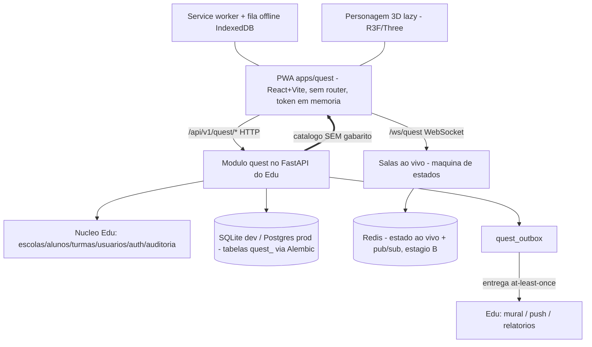
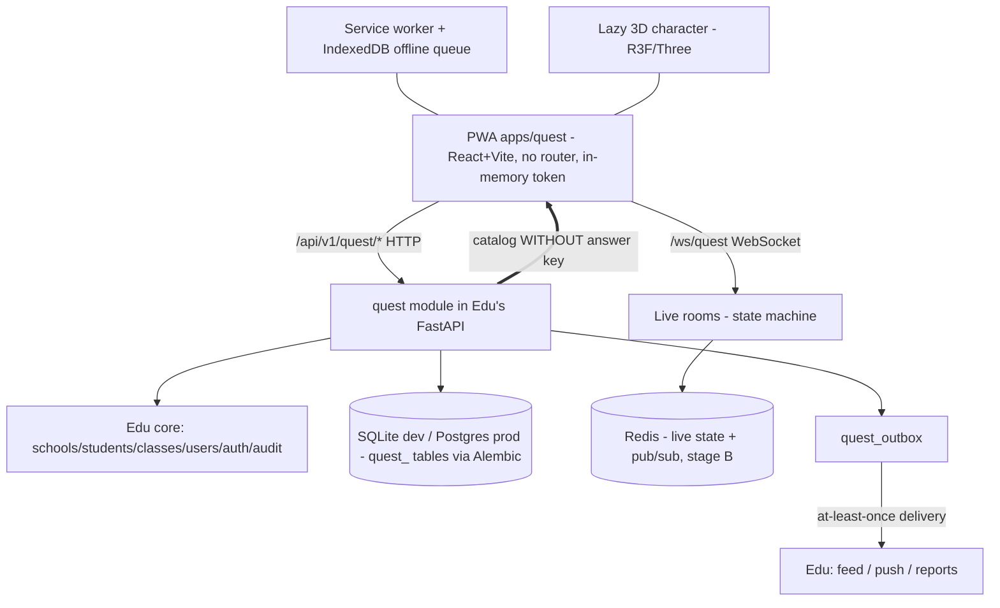

# 11 — Arquitetura Técnica / Technical Architecture

- **Status:** 🟢 aprovado / approved
- **Padrão / Standard:** [ADR-0002](decisoes/ADR-0002-padrao-de-capitulo.md) (16 partes)
- **Fontes / Sources:** `INDICE.md` (bloco 11, 51 subseções), `docs/quest/01-arquitetura.md`, `docs/quest/02-banco-de-dados.md`, `docs/quest/04-integracao-edu.md`, `docs/quest/05-roadmap.md`, `_estado-atual/RELATORIO-2026-07-09.md`, `backend/app/main.py`, `backend/app/core/{database,deps,config,security,rate_limit}.py`, `backend/app/quest/` (models/routers/services/schemas), `backend/alembic/`, `packages/quest-core`, `apps/quest/src/`, Seções [01](01-principios-imutaveis.md)/[05](05-sistemas-de-jogo.md)/[06](06-pedagogico-bncc.md)/[07](07-ux-fluxos-navegacao.md)/[08](08-onboarding-ftue.md)/[09](09-social.md)/[10](10-professor-familia.md)
- **Depende de / Depends on:** princípios imutáveis (P13/P14/P15/P16/P17) → [01](01-principios-imutaveis.md); vocabulário → [02](02-vocabulario.md); hierarquia do universo/catálogo → [03](03-universo.md); forma do avatar 3D (GLB/rig) → [04](04-personagens-avatar.md); economia/ledger-regras/valores → [05](05-sistemas-de-jogo.md); fórmula BNCC/spec do catálogo → [06](06-pedagogico-bncc.md); contrato de UX/estados/telas → [07](07-ux-fluxos-navegacao.md); requisito de idempotência do onboarding → [08](08-onboarding-ftue.md); regras sociais/ciclo lógico da sala/`/ws/quest` lógico → [09](09-social.md); contrato adulto/papéis/vínculo/moderação/`quest_outbox`-mapeamento → [10](10-professor-familia.md); base legal LGPD/consentimento/retenção/política de rate-limit/ameaça do login → [12](12-seguranca-privacidade.md); norma de acessibilidade → [13](13-acessibilidade.md); infra/deploy/backup/DR/CDN/observabilidade → [14](14-infra-deploy-dr.md); arte/áudio/pipeline de assets → [15](15-arte-audio-assets.md); i18n → [16](16-localizacao-i18n.md); taxonomia de telemetria/outbox → [17](17-telemetria-metricas.md); valores de config `quest.*` → [19](19-liveops.md); provisionamento/migração de dados → [20](20-migracao-importacao.md); passe/temporada → [22](22-monetizacao.md).

> **Convenção / Convention:** "§N" = uma das 16 **partes deste capítulo** / one of the 16 **parts of this
> chapter**; "Seção NN" / "Section NN" = outro capítulo da Bible.
> **Escopo / Scope:** este capítulo decide a **infraestrutura e o mecanismo** do Constela Quest — fronteira do
> módulo, persistência física, tempo real, autoridade do gabarito, ledger, isolamento, PWA/render, `quest-core`,
> caminho canônico das rotas e o **piso de desempenho concreto**. Ele **implementa** — nunca redefine — as regras
> de economia (Seção 05), pedagogia (Seção 06), UX (Seção 07), social (Seção 09), adulto (Seção 10), legais
> (Seção 12), de acessibilidade (Seção 13) e os **valores** de config (Seção 19). Infra/deploy/DR são da Seção 14.

---

## 🇧🇷 Arquitetura Técnica

### 1. Objetivo
Ser a **referência técnica definitiva do Constela Quest**: o desenho de arquitetura que permite um dev
**implementar sem tomar nenhuma decisão de produto**. Fixa a **fronteira do módulo**, a **persistência**, o
**tempo real**, a **autoridade do gabarito**, o **ledger**, o **isolamento multi-escola**, a **camada
PWA/render** e o **piso de desempenho**. Decide o **mecanismo**; **não** decide os números da economia (Seção
[05](05-sistemas-de-jogo.md)), a fórmula pedagógica (Seção [06](06-pedagogico-bncc.md)), as regras sociais
(Seção [09](09-social.md)), a regra legal (Seção [12](12-seguranca-privacidade.md)), a norma de acessibilidade
(Seção [13](13-acessibilidade.md)), a infra/deploy (Seção [14](14-infra-deploy-dr.md)) nem os **valores** de
config (Seção [19](19-liveops.md)).

### 2. Contexto
No ecossistema **Hub → Edu → Quest**, o Quest é um **módulo dentro do backend do Edu** (FastAPI único) **+ um PWA
próprio** (`apps/quest`), reusando a identidade já cadastrada no Edu (Princípio 16). **Estado atual (Q0):** o
monólito modular já existe — `backend/app/quest` com **dependência de mão única** (o quest importa o núcleo; o
Edu **nunca** importa `quest.models/services`), **Alembic** como autoridade do schema (base 0001, grupos 1–3),
**dois mundos de JWT** (claim `papel="aluno"`, `token_version`), o PWA **sem router** (máquina de estados, token
só em memória) e o `quest-core`. O frontend **já adotou R3F/Three.js** no personagem 3D (lazy-loaded), com
tela-casa (`lobby` no código)/Cosmo em SVG/CSS. **Falta (só doc):** WebSocket `/ws/quest`, Redis, `quest_outbox`,
as tabelas de economia/social e as **demais** adultas net-new (o vínculo **`responsaveis_alunos` já existe**), e
as rotas de jogo. **Divergências doc↔código resolvidas aqui:** (a) render = **híbrido oficial** (§9/§16,
reescrevendo o `docs/quest/01`); (b) **caminho canônico** das rotas (§9/§16); (c) catálogo =
**servidor é a fonte** (o hardcode do cliente migra); (d) rate-limit → **Redis distribuído**. Este capítulo
especifica a arquitetura-alvo.

### 3. Filosofia da funcionalidade
**Implementar a intenção, não reinventá-la.** A 11 é o **mecanismo**; as regras vivem nas outras seções:
- **Fronteira de mão única, extraível:** o Quest é um módulo com fronteira nítida dentro do Edu — pronto para
  virar serviço próprio por **gatilhos objetivos**, sem big-bang.
- **Servidor é a autoridade (Princípio 13):** o gabarito **nunca** vai ao cliente; a correção é sempre no
  servidor — nem DevTools nem fila offline fabricam XP.
- **Economia auditável (Princípio 14):** moedas só mudam por **ledger imutável**; saldo é **cache
  recomputável**; regras numéricas **não são hardcoded** (os valores são de 05/19).
- **Isolamento por design (Princípio 15):** `escola_id` em **toda tabela de dados de usuário**, rota e mensagem de
  WebSocket (exceções: o catálogo global de mensagens — Seção [09](09-social.md) —, e a **tenancy transitiva**:
  `quest_progresso`/`quest_habilidades` derivam a escola via `perfil_id`→`quest_perfis`); os dois mundos de JWT
  nunca se cruzam.
- **Piso de desempenho e alcance (Princípio 17):** device-alvo mínimo, orçamento de carga/memória e
  **offline-first** — toda arte e mecânica **subordina-se ao device-alvo**, com degradação graciosa antes de
  quebrar o tablet da escola.

### 4. Experiência que o jogador deve sentir
O "usuário" desta seção é o **dev/sistema** (a criança vive o jogo nas Seções 03–09):
- **O dev implementa sem adivinhar:** contratos, schemas e a fronteira do módulo são explícitos; o `quest-core` é
  a fonte única dos tipos.
- **Rápido no device modesto:** carrega e fica jogável rápido no tablet compartilhado com wifi fraco; o 3D só
  baixa quando aparece.
- **Resiliente:** uma criança offline volta e a **fila sincroniza sem perder nada**; uma queda de wifi no meio de
  uma partida **pausa e reconecta**, sem penalidade (regra = Seção [09](09-social.md)).
- **Momento mágico técnico:** **30 tablets numa aula às 7h30** jogando juntos sem cair, cada escola isolada da
  outra, e nenhum XP fabricado no cliente.

### 5. Fluxo completo
As camadas e o caminho de um request (HTTP + WebSocket + outbox):

**Ciclo de uma tentativa:** `iniciar → responder → finalizar`, com a **recompensa calculada no servidor** (o
cliente devolve só a resposta crua; o servidor confere contra o gabarito e grava a tentativa imutável).
**Offline:** a tentativa entra na **fila IndexedDB** (append-only, `origem_offline`) e o gabarito é conferido no
**sync** ao reconectar. **Reconexão** em partida = pausa + timeout gentil (regra = Seção [09](09-social.md);
valor = Seção [19](19-liveops.md)).

### 6. Interface (quando existir)
**N/A própria.** A 11 **não desenha telas** — ela fixa a **tecnologia** que as telas da Seção
[07](07-ux-fluxos-navegacao.md) usam: **render híbrido** (R3F/Three.js **só no personagem 3D**, lazy-loaded;
**SVG/CSS** no ambiente e na UI), PWA/service worker, e o estado do cliente (sem router). Wireframes = Apêndice
[E](apendice-E-wireframes.md); a forma do avatar 3D (GLB/rig) é da Seção [04](04-personagens-avatar.md); a arte é
da Seção [15](15-arte-audio-assets.md).

### 7. UX
- **Desempenho é UX:** **tempo-até-jogável curto** no device-alvo; o **3D é sempre lazy** (só baixa quando um
  personagem aparece); **degradação graciosa** (corta partículas/sombras) antes de travar.
- **Fallback 2D:** se o device não sustenta o 3D, o personagem cai para uma representação leve — a experiência
  **nunca quebra**.
- **Offline-first onde couber:** a jornada em cache continua jogável; a **API/o gabarito nunca são cacheados**.
- **`prefers-reduced-motion` e daltônico** respeitados na camada de render (a **norma** é da Seção [13](13-acessibilidade.md)).
- **Sem jargão técnico ao usuário:** erros de rede viram os estados acolhedores da Seção [07](07-ux-fluxos-navegacao.md), nunca stack traces.

### 8. Game Design
**N/A própria — a 11 não tem mecânica de jogo.** Ela provê o **mecanismo plugável** que hospeda o game design
das outras seções, sem redefini-lo:
- **Registry de mecânicas** (interface `MecanicaProps`/`RespostaDesafio` + `MECANICAS`) e **schema/validador por
  mecânica** — o **conteúdo** e a **dificuldade** são da Seção [06](06-pedagogico-bncc.md); a **acessibilidade
  por mecânica** é da Seção [13](13-acessibilidade.md); o **micro-tutorial** exigido pela Seção [08](08-onboarding-ftue.md) é um requisito do contrato.
- **Motor único de corrida** parametrizado por **JSON de tema** (mecanismo; as skins são arte da Seção [15](15-arte-audio-assets.md) e a moldura anti-toxicidade é da Seção [09](09-social.md)).
- **Contrato da tentativa** e **ledger** — o **cálculo** e os **números** são da Seção [05](05-sistemas-de-jogo.md).

### 9. Regras de negócio
- **Monólito modular (decidido):** o Quest é um **módulo com fronteira** dentro do backend do Edu, com
  **dependência de mão única** (quest → núcleo; o Edu nunca importa `quest`). Extração para serviço próprio por
  **critério qualitativo** (quando a carga de WebSocket, a escala ou o tamanho do time justificarem); os números
  concretos (réplicas/escolas) são ilustrativos e se calibram com as Seções [14](14-infra-deploy-dr.md)/[19](19-liveops.md).
- **Dois mundos de JWT (Princípio 15):** o token do aluno **hoje** é `{sub=id da credencial, papel:"aluno", ver,
  iat, exp}` — o `escola_id`/`aluno_id`/`perfil` vêm de **lookup** da credencial, **não de claim** — e é
  **rejeitado** no Edu e vice-versa; o **alvo** é um **contrato de token unificado** (um só emissor/validador)
  substituindo os dois construtores atuais. `token_version` revoga por regeneração de cartão.
- **Autoridade do gabarito (Princípio 13):** o catálogo é servido **sem** o campo `gabarito` (inclusive no cache
  offline); a correção é **sempre no servidor**; a fila offline confere o gabarito **no sync**.
- **Ledger imutável (Princípio 14):** moedas mudam **só** via `quest_transacoes_moedas` (append-only); **saldo,
  nível, estrelas** são **cache recomputável**; **regras numéricas não são hardcoded** (valores = Seções
  [05](05-sistemas-de-jogo.md)/[19](19-liveops.md)).
- **Isolamento multi-escola (Princípio 15):** `escola_id` em **toda linha de dados de usuário**, rota e mensagem
  de WebSocket. Exceções: o **catálogo global** de mensagens rápidas (sem `escola_id` — Seção [09](09-social.md));
  e a **tenancy transitiva** (`quest_progresso`/`quest_habilidades` já existentes só têm `perfil_id` e derivam a
  escola via `perfil_id`→`quest_perfis`).
- **Render híbrido oficial (decidido):** **R3F/Three.js só no personagem 3D** (lazy-loaded) + **SVG/CSS** no
  ambiente/UI, **subordinado ao piso de desempenho** — reescreve o `docs/quest/01` e resolve a **nota de
  não-princípio da Seção [01](01-principios-imutaveis.md)** ("DOM/SVG-first vs Three.js", §15).
- **Device-alvo mínimo (decidido — Princípio 17):** tablet/Chromebook **compartilhado**, ~**2–3 GB RAM**, GPU
  integrada modesta, Chrome/Chromium recente, **wifi fraco**. Os números do orçamento (§10) são **metas com
  degradação graciosa**, não garantias absolutas.
- **PWA-first (decidido):** **PWA instalável** como plataforma principal; **desktop via Tauri** (já previsto no
  CORS) como evolução; **apps nativos** em fase futura.
- **Catálogo servido pelo servidor (decidido):** `quest_mundos`/jornadas/missões/desafios são a **fonte da
  verdade** via API (sem gabarito); o **hardcode do cliente** (`materias.ts`) migra **gradualmente**; a
  **navegação** permanece por **máquina de estados** (deep-link só via QR).
- **Caminho canônico das rotas (decidido):** namespace `/api/v1/quest/*` — aluno (`/quest/auth|perfil|jogo|social|salas`),
  adulto (`/quest/professor/*`, `/quest/familia/*`). A rota Q0 `/escolas/{escola_id}/quest/*` **migra** para o
  canônico (só spec nesta etapa; sem alteração de código).
- **`cargo` do adulto:** mantido como `String(30)` **livre** + validação em código (**sem migração**); promover a
  enum é evolução opcional.

### 10. Arquitetura técnica
> Aqui vive o **detalhe** do mecanismo. Infra/deploy/backup/DR são da Seção [14](14-infra-deploy-dr.md); os
> **valores** de config, da Seção [19](19-liveops.md); a **taxonomia** dos eventos, da Seção [17](17-telemetria-metricas.md).

- **Camadas:** (a) **backend** `app/quest/{routers,models,services,schemas.py,deps.py}` dentro do FastAPI do Edu
  (o subpacote `conteudo/` de seeds é **alvo** a criar); (b) **frontend** `apps/quest` (React+Vite+TS PWA, **sem
  router**; estado **hoje** = React Context + token só em memória (`estado/sessao.tsx`); **alvo** = TanStack Query
  + Zustand); (c) **pacotes** `@constela/core` + `quest-core` (fonte única dos tipos da API — o contrato do avatar
  legado é saneado aqui).
- **Banco `quest_` (persistência = aqui):** convenções (prefixo, UTC, `escola_id` indexado em **dados de
  usuário** — ou **tenancy transitiva** via `perfil_id`, ex.: `quest_progresso`/`quest_habilidades` —, histórico
  imutável) e o **schema/índices/migrações Alembic** das **8 famílias de domínio + o `quest_outbox`** (infra
  transversal):
  - **Identidade:** `quest_perfis` (`social_ativo` **já existe**; o **modo invisível** é preferência durável **a
    acrescentar** — coluna nova ou chave em `preferencias` JSON), `quest_credenciais_aluno`, e
    **`responsaveis_alunos` (já existe)** com
    `UNIQUE(usuario_id, aluno_id)`; o **`NOT NULL autorizado_por`** é **endurecimento futuro** (hoje a coluna é
    NULLABLE).
  - **Catálogo:** `quest_mundos`/jornadas/missões/desafios (o `gabarito` **nunca** serializado ao cliente).
  - **Progresso/tentativas:** `quest_progresso`/`quest_tentativas` (imutável)/`quest_habilidades`.
  - **Economia/ledger:** `quest_transacoes_moedas` (append-only; saldo = cache).
  - **Ritmo/conquistas.**
  - **Social:** `quest_amizades`/`quest_salas`/`quest_mensagens_rapidas` com **UNIQUE por par não-ordenado** +
    `bloqueado_por` (corrige o legado de `docs/quest/02`); o **catálogo de mensagens é global** (sem `escola_id`).
  - **Adultas (net-new):** `responsaveis_convites`/`controles_responsavel`/`quest_denuncias`/`quest_atribuicoes`/`quest_reconhecimentos`.
  - **Temporadas.**
  - **`quest_outbox`** (infra): `id`, **`event_id` (UUID único = chave de dedup)**, `tipo`, `escola_id`, `payload`,
    `criado_em`, `status`, `tentativas`, `entregue_em`.
  A FK de `quest_tentativas.sala_id` nasce quando `quest_salas` existir (migração aditiva, sem quebrar histórico).
  *(A **semântica** dessas tabelas é das Seções 05/06/09/10; a 11 dá o **schema físico**. O **DDL coluna-a-coluna**
  e os contratos de request/response vivem no Apêndice [B](apendice-B-api-dados.md), a popular.)*
- **Tempo real (`/ws/quest`):** **envelope** de mensagem `{tipo, sala_id, escola_id, seq, payload}` com **ack/erro**
  e **reenvio de snapshot** no rejoin; os **nomes das operações** (convidar, entrar/sair, responder, sincronizar,
  mensagem rápida) são de 09/10. A **máquina de estados técnica** **codifica** o ciclo de vida e a semântica de
  liderança/convidado **definidos na Seção [09](09-social.md)** (`aguardando→em_jogo→finalizada/cancelada`); a
  **reconexão** usa a **janela configurável** (valor = Seção [19](19-liveops.md)) com reenvio de estado; estado ao
  vivo em **memória (estágio A) → Redis hash + pub/sub (estágio B)**.
- **`quest_outbox` (entrega):** produtor **imutável** para a extração + **entrega at-least-once** com **dedup pelo
  `event_id`** no consumidor e **retry/dead-letter**; a **taxonomia** dos eventos é da Seção [17](17-telemetria-metricas.md),
  o **mapeamento evento→mensagem adulta** é da Seção [10](10-professor-familia.md).
- **Cache:** **HTTP/ETag** do catálogo; **agregados recalculáveis** (`quest_habilidades`, rankings, saldo/nível)
  recomputados a partir das **tentativas imutáveis** — nunca um agregado órfão; presença/rankings em **Redis** no
  estágio B.
- **Contrato da tentativa:** `iniciar → responder → finalizar`; a **chave de idempotência é um UUID gerado no
  cliente** na criação da tentativa (online e offline), **persistida em `quest_tentativas.idempotencia_uuid`
  (UNIQUE; migração aditiva sobre a tabela existente)** para o **dedup no servidor** no `finalizar`/no sync. A
  tentativa offline **carrega a versão da missão (`missao_versao`) em cache** e o servidor confere contra **essa
  versão** (contra re-versionamento). Recompensa calculada no servidor.
- **Gate de horário:** a **autorização de sessão/entrada do aluno** consulta a **janela vigente** de
  `controles_responsavel` **no servidor** (não burlável no cliente); os **valores/limites** são da Seção [19](19-liveops.md)
  e a **regra** é da Seção [10](10-professor-familia.md).
- **Rate-limit:** o mecanismo migra de **memória por processo** para **Redis distribuído** (a **política** —
  limites/janelas — é da Seção [12](12-seguranca-privacidade.md)).
- **Escalabilidade A>B>C:** A (monólito, salas em memória) → B (Redis para estado-ao-vivo/rankings/rate-limit,
  réplicas stateless) → C (extração do módulo para serviço próprio) — por gatilhos, não big-bang.
- **Não decide aqui:** infra/deploy/backup/DR/CDN/observabilidade (Seção [14](14-infra-deploy-dr.md)), taxonomia
  de telemetria (Seção [17](17-telemetria-metricas.md)), valores de config (Seção [19](19-liveops.md)), regra
  legal de retenção/rate-limit (Seção [12](12-seguranca-privacidade.md)).

### 11. Dependências com outros módulos
- **Princípios (P13/P14/P15/P16/P17)** → Seção [01](01-principios-imutaveis.md); **vocabulário** → Seção [02](02-vocabulario.md); **hierarquia do universo** → Seção [03](03-universo.md); **forma do avatar 3D** → Seção [04](04-personagens-avatar.md).
- **Economia/ledger-regras/valores** → Seção [05](05-sistemas-de-jogo.md); **fórmula BNCC/spec do catálogo** → Seção [06](06-pedagogico-bncc.md).
- **Contrato de UX/estados/máquina de sessão lógica** → Seção [07](07-ux-fluxos-navegacao.md); **requisito de idempotência do onboarding** → Seção [08](08-onboarding-ftue.md).
- **Regras sociais/ciclo lógico da sala/operações do `/ws/quest`** → Seção [09](09-social.md); **contrato adulto/papéis/vínculo/mapeamento do outbox** → Seção [10](10-professor-familia.md).
- **LGPD/consentimento/retenção/política de rate-limit/ameaça do login** → Seção [12](12-seguranca-privacidade.md); **norma de acessibilidade** → Seção [13](13-acessibilidade.md).
- **Infra/deploy/backup/DR/CDN/observabilidade** → Seção [14](14-infra-deploy-dr.md); **arte/áudio/pipeline de assets** → Seção [15](15-arte-audio-assets.md); **taxonomia do outbox/telemetria** → Seção [17](17-telemetria-metricas.md); **valores de config `quest.*`** → Seção [19](19-liveops.md); **provisionamento/migração de dados** → Seção [20](20-migracao-importacao.md); **passe/temporada** → Seção [22](22-monetizacao.md).

Este capítulo **alimenta:** **todas** as seções que delegaram infra/mecanismo à 11 (05/06/07/08/09/10), a Seção
[12](12-seguranca-privacidade.md) (mecanismo do token/isolamento/rate-limit) e a Seção [17](17-telemetria-metricas.md)
(entrega do outbox). **Dá origem a:** o schema físico de todas as tabelas `quest_*` e os contratos de API
(Apêndice [B](apendice-B-api-dados.md)).

### 12. Casos extremos (Edge Cases)
- **Queda de wifi em partida:** o WebSocket **reconecta dentro da janela configurável** (valor = Seção [19](19-liveops.md))
  com reenvio de estado; expirado, a sala **encerra sem penalidade** (regra = Seção [09](09-social.md)).
- **Sync offline conflitante:** as tentativas offline são **append-only** e conferidas no servidor; **idempotência**
  por chave impede recompensa dupla no reenvio.
- **DevTools/adulteração:** o gabarito **nunca** está no cliente; XP forjado é rejeitado na conferência do servidor.
- **Escala para réplicas:** o **rate-limit em memória** e as **salas em memória** migram para **Redis** no estágio
  B — sem isso, o anti-abuso vaza e o estado-ao-vivo diverge entre workers.
- **Corrida de DDL no deploy:** migrações aplicadas **uma vez** (não por worker) — paridade dev/prod via Alembic
  (operação de deploy = Seção [14](14-infra-deploy-dr.md)).
- **`quest_salas` nascendo:** a FK de `quest_tentativas.sala_id` entra por **migração aditiva** sem quebrar linhas
  históricas.
- **Device abaixo do piso:** **fallback 2D** do personagem e corte de efeitos — a experiência degrada, não quebra.
- **Revogação de sessão:** `token_version` invalida o token do aluno ao regenerar o cartão.
- **Vazamento entre escolas:** toda query/rota/WS filtra por `escola_id` (direto ou por join no perfil na tenancy transitiva); um teto de contrato (Seção [18](18-qa-testes.md)) verifica o isolamento.

### 13. Escalabilidade futura
- **A > B > C** como caminho: A (monólito, memória) → B (Redis para estado-ao-vivo/rankings/rate-limit, réplicas
  stateless) → C (extração do módulo `quest` para serviço próprio) — a fronteira de mão única já deixa isso pronto.
- **`quest_outbox` como base de extração:** produtor imutável ao migrar de polling para fila real.
- **Novas mecânicas/tabelas** entram pelo **registry** e por **migrações aditivas** sem reescrita.
- **Cenário de capacidade** (pico de aula 7h30) como **referência ilustrativa**; o **número-alvo** de
  dispositivos simultâneos e o **teste de carga** são da Seção [14](14-infra-deploy-dr.md)/[18](18-qa-testes.md).

### 14. Checklist de implementação
- [ ] **Fronteira de mão única:** o Edu nunca importa `quest.models/services`; gatilhos de extração documentados.
- [ ] **Dois mundos de JWT** com contrato **unificado**; `token_version`; `escola_id` em toda rota/WS e **linha de dados de usuário** (Princípio 15).
- [ ] **Autoridade do gabarito:** catálogo servido **sem** `gabarito`; conferência no servidor; sync offline confere (Princípio 13).
- [ ] **Ledger** `quest_transacoes_moedas` append-only; saldo/nível/estrelas como **cache recomputável**; nada hardcoded (Princípio 14).
- [ ] **Schema Alembic** das 8 famílias de domínio + `quest_outbox`, com índices/constraints (UNIQUE não-ordenado das amizades; `UNIQUE(usuario_id, aluno_id)` de `responsaveis_alunos`; `NOT NULL autorizado_por` como endurecimento; FK `sala_id` aditiva; `event_id` único do outbox; `idempotencia_uuid` UNIQUE em `quest_tentativas`, aditivo).
- [ ] **`/ws/quest`** com máquina de estados da sala + reconexão na janela configurável (valor = Seção [19](19-liveops.md)); estado memória → **Redis** (estágio B).
- [ ] **`quest_outbox`** model + entrega **at-least-once** com dedup + retry/dead-letter (taxonomia = Seção [17](17-telemetria-metricas.md)).
- [ ] **Catálogo servido pelo servidor** (fonte da verdade); hardcode do cliente migrando; navegação por máquina de estados.
- [ ] **Render híbrido:** R3F/Three.js **só no personagem** (lazy) + SVG/CSS no ambiente; **fallback 2D**; reduced-motion (norma = Seção [13](13-acessibilidade.md)).
- [ ] **PWA:** service worker + precache do shell (API nunca em cache) + **fila offline IndexedDB** append-only.
- [ ] **Piso de desempenho** respeitado no device-alvo (metas do §10, degradação graciosa).
- [ ] **Rota canônica** `/api/v1/quest/*`; `quest-core` como fonte única dos tipos.
- [ ] **Rate-limit** migrando para Redis distribuído (política = Seção [12](12-seguranca-privacidade.md)).
- [ ] **DoD técnico:** testes de contrato (mecânica, tentativa API, WebSocket, sync offline, isolamento por escola). Conferido contra o Apêndice [F](apendice-F-checklists-dod.md).

### 15. Questões em aberto
As decisões-chave foram **tomadas com o dono na fronteira e registradas no ADR (§16)** — render híbrido,
device-alvo, PWA-first, catálogo servido pelo servidor + padrões técnicos. Restam calibrações/decisões que
dependem de outra seção:
- ⚠️ **Números finos do orçamento de desempenho** (compressão de textura, contagem de polígonos, peso por GLB,
  FPS-alvo exato) — calibração com a Seção [15](15-arte-audio-assets.md); matriz de device/carga = Seções
  [14](14-infra-deploy-dr.md)/[18](18-qa-testes.md).
- ⚠️ **Gestão de segredos e rotação da chave JWT** (armazenamento, rotação, revogação em massa via `token_version`)
  — Seções [12](12-seguranca-privacidade.md)/[14](14-infra-deploy-dr.md).
- ⚠️ **Backup/restore, RPO/RTO e deploy/rollback zero-downtime** durante o pico — Seção [14](14-infra-deploy-dr.md).
- ⚠️ **Observabilidade/SLO/SLI** além do mínimo (reuso de `logs_auditoria`) — Seções [14](14-infra-deploy-dr.md)/[19](19-liveops.md).
- ⚠️ **Semântica fina de entrega do outbox** (locking do processador, janela de dedup) — coordenada com a Seção [17](17-telemetria-metricas.md).
- ⚠️ **Interface de autoria/publicação do catálogo** e a **conexão com o software futuro de matérias+questões do
  dono** — produto = Seção [06](06-pedagogico-bncc.md), operação = Seção [19](19-liveops.md); a 11 só implementa o
  contrato de escrita.
- ⚠️ **Escopo de conteúdo de lançamento** (1 planeta profundo vs 9 rasos) — decisão de roadmap/dono (Seção [23](23-roadmap.md)); a arquitetura de catálogo suporta ambos.
- ⚠️ **Definição de "dia"/"semana"/fuso** de corte que o ritmo diário consome — Seção [05](05-sistemas-de-jogo.md).
- ⚠️ **Pendência 07↔11 do router:** **resolvida** — mantém a **máquina de estados** (deep-link só via QR); router
  real = evolução futura opcional. Cross-fix na nota de §15 da Seção [07](07-ux-fluxos-navegacao.md) **ao aprovar**.
- ⚠️ **Mecanismo do adulto que é staff e responsável** (papel acumulável) — gate do Portal da Família pela
  existência do vínculo `responsaveis_alunos`, desacoplado do `cargo` de valor único (delegado pela Seção [10](10-professor-familia.md)).
- ⚠️ **Contrato de entrega do reconhecimento do professor** (evento no `quest_outbox` + superfície na tela da
  criança) — delegado pelas Seções [10](10-professor-familia.md)/[07](07-ux-fluxos-navegacao.md).
- ⚠️ **Sincronização da Seção 01 e do `docs/quest/01`** com esta seção: a nota de não-princípio "DOM/SVG-first vs
  Three.js" (render), o Princípio 17 "Piso de desempenho e alcance" e o **Princípio 15** (reconhecer o
  qualificador "dados de usuário" + a exceção do catálogo global e a tenancy transitiva) — cross-fixes a aplicar
  **ao aprovar** esta seção.

### 16. ADR (Architecture Decision Record)
**Decisões registradas por este capítulo:**
1. **Monólito modular** com dependência de mão única (quest → núcleo; Edu nunca importa `quest`) e gatilhos
   objetivos de extração; caminho A>B>C.
2. **Render híbrido oficial:** R3F/Three.js **só no personagem 3D** (lazy) + SVG/CSS no ambiente/UI,
   **subordinado ao piso de desempenho** — reescreve o `docs/quest/01` e resolve a **nota de não-princípio da
   Seção [01](01-principios-imutaveis.md)** ("DOM/SVG-first vs Three.js", §15).
3. **Device-alvo mínimo + orçamento (Princípio 17):** tablet/Chromebook compartilhado ~2–3 GB RAM, Chrome
   recente, wifi fraco; números como **metas com degradação graciosa** (fallback 2D), não garantias.
4. **PWA instalável** como plataforma principal; **Tauri desktop** (evolução) e **nativos** (fase futura).
5. **Catálogo servido pelo servidor** (`quest_mundos` via API, **sem gabarito** — Princípio 13); o **hardcode do
   cliente migra**; navegação por **máquina de estados** (deep-link só via QR).
6. **Rota canônica** `/api/v1/quest/*` (aluno + `/quest/professor|familia/*`); o Q0 `/escolas/{escola_id}/quest/*`
   migra para o canônico.
7. **Tempo real:** WebSocket `/ws/quest` + máquina de estados técnica da sala (ciclo definido na Seção
   [09](09-social.md)) + reconexão na **janela configurável** (valor = Seção [19](19-liveops.md)); estado memória
   → **Redis pub/sub** (estágio B).
8. **`quest_outbox`:** produtor imutável + entrega **at-least-once** com dedup pelo `event_id` no consumidor +
   retry/dead-letter (taxonomia = Seção [17](17-telemetria-metricas.md)).
9. **Autoridade do gabarito (P13)** e **ledger imutável (P14)** como mecanismos; **isolamento por `escola_id`
   (P15)** em dados de usuário/rotas/WS (o catálogo de mensagens é global); **rate-limit** → Redis distribuído
   (política = Seção [12](12-seguranca-privacidade.md)).
10. **Dois mundos de JWT** com contrato **unificado (alvo)**; **`cargo` `String(30)` livre** (sem migração);
    `quest-core` como fonte única dos tipos.

*(Registro inline; sem criar arquivo de ADR sem autorização.)*

---

## 🇬🇧 Technical Architecture

### 1. Objective
Be the **definitive technical reference for Constela Quest**: the architecture design that lets a dev
**implement without making any product decision**. It fixes the **module boundary**, **persistence**, **real
time**, the **answer-key authority**, the **ledger**, **multi-school isolation**, the **PWA/render layer** and
the **performance floor**. It decides the **mechanism**; it does **not** decide the economy numbers (Section
[05](05-sistemas-de-jogo.md)), the pedagogical formula (Section [06](06-pedagogico-bncc.md)), the social rules
(Section [09](09-social.md)), the legal rule (Section [12](12-seguranca-privacidade.md)), the accessibility norm
(Section [13](13-acessibilidade.md)), infra/deploy (Section [14](14-infra-deploy-dr.md)) or the config **values**
(Section [19](19-liveops.md)).

### 2. Context
In the **Hub → Edu → Quest** ecosystem, Quest is a **module inside the Edu backend** (single FastAPI) **+ its own
PWA** (`apps/quest`), reusing the identity already registered in Edu (Principle 16). **Current state (Q0):** the
modular monolith already exists — `backend/app/quest` with a **one-way dependency** (quest imports the core; Edu
**never** imports `quest.models/services`), **Alembic** as the schema authority (base 0001, groups 1–3), **two
JWT worlds** (claim `papel="aluno"`, `token_version`), the **router-less** PWA (state machine, in-memory token)
and `quest-core`. The frontend **already adopted R3F/Three.js** for the 3D character (lazy-loaded), with
the home screen (`lobby` in code)/Cosmo in SVG/CSS. **Missing (doc-only):** the `/ws/quest` WebSocket, Redis,
`quest_outbox`, the economy/social tables and the **other** net-new adult tables (the **`responsaveis_alunos`
link already exists**), and the game routes. **Doc↔code divergences resolved here:** (a) render = **official
hybrid** (§9/§16, rewriting `docs/quest/01`); (b) the **canonical route path** (§9/§16); (c) catalog = **server is
the source** (the client hardcode migrates); (d) rate-limit → **distributed Redis**. This chapter specifies the
target architecture.

### 3. Feature philosophy
**Implement the intent, don't reinvent it.** 11 is the **mechanism**; the rules live in the other sections:
- **One-way, extractable boundary:** Quest is a module with a clean boundary inside Edu — ready to become its own
  service by **objective triggers**, no big bang.
- **Server is the authority (Principle 13):** the answer key **never** reaches the client; grading is always on
  the server — neither DevTools nor the offline queue can fabricate XP.
- **Auditable economy (Principle 14):** coins change only via an **immutable ledger**; balance is a **recomputable
  cache**; numeric rules are **not hardcoded** (values are 05/19's).
- **Isolation by design (Principle 15):** `escola_id` on **every user-data table**, route and WebSocket message
  (exceptions: the global message catalog — Section [09](09-social.md) —, and **transitive tenancy**:
  `quest_progresso`/`quest_habilidades` derive the school via `perfil_id`→`quest_perfis`); the two JWT worlds
  never cross.
- **Performance and reach floor (Principle 17):** minimum target device, load/memory budget and **offline-first**
  — all art and mechanics **are subordinate to the target device**, with graceful degradation before breaking the
  school's tablet.

### 4. The experience the player should feel
The "user" of this section is the **dev/system** (the child lives the game in Sections 03–09):
- **The dev implements without guessing:** contracts, schemas and the module boundary are explicit; `quest-core`
  is the single source of types.
- **Fast on the modest device:** it loads and becomes playable quickly on the shared tablet on weak wifi; the 3D
  only downloads when it appears.
- **Resilient:** a child who went offline returns and the **queue syncs without losing anything**; a wifi drop
  mid-match **pauses and reconnects**, with no penalty (rule = Section [09](09-social.md)).
- **Technical magic moment:** **30 tablets in a 7:30am class** playing together without dropping, each school
  isolated from the others, and no XP fabricated on the client.

### 5. Complete flow
The layers and a request's path (HTTP + WebSocket + outbox):

**One attempt's cycle:** `start → answer → finish`, with the **reward computed on the server** (the client
returns only the raw answer; the server checks it against the answer key and writes the immutable attempt).
**Offline:** the attempt enters the **IndexedDB queue** (append-only, `origem_offline`) and the answer key is
checked at **sync** on reconnect. **Reconnect** in a match = pause + gentle timeout (rule = Section
[09](09-social.md); value = Section [19](19-liveops.md)).

### 6. Interface (when it exists)
**N/A of its own.** 11 **draws no screens** — it fixes the **technology** the Section
[07](07-ux-fluxos-navegacao.md) screens use: **hybrid render** (R3F/Three.js **only for the 3D character**,
lazy-loaded; **SVG/CSS** for environment and UI), PWA/service worker, and the client state (no router).
Wireframes = Appendix [E](apendice-E-wireframes.md); the 3D avatar's form (GLB/rig) is Section
[04](04-personagens-avatar.md)'s; the art is Section [15](15-arte-audio-assets.md)'s.

### 7. UX
- **Performance is UX:** **short time-to-playable** on the target device; the **3D is always lazy** (only
  downloads when a character appears); **graceful degradation** (cuts particles/shadows) before stalling.
- **2D fallback:** if the device can't sustain the 3D, the character drops to a light representation — the
  experience **never breaks**.
- **Offline-first where it fits:** the cached journey stays playable; the **API/answer key are never cached**.
- **`prefers-reduced-motion` and colorblind** respected in the render layer (the **norm** is Section [13](13-acessibilidade.md)'s).
- **No technical jargon to the user:** network errors become Section [07](07-ux-fluxos-navegacao.md)'s welcoming states, never stack traces.

### 8. Game Design
**N/A of its own — 11 has no game mechanic.** It provides the **pluggable mechanism** that hosts the other
sections' game design, without redefining it:
- **Mechanic registry** (interface `MecanicaProps`/`RespostaDesafio` + `MECANICAS`) and a **schema/validator per
  mechanic** — the **content** and **difficulty** are Section [06](06-pedagogico-bncc.md)'s; the **per-mechanic
  accessibility** is Section [13](13-acessibilidade.md)'s; the **micro-tutorial** required by Section
  [08](08-onboarding-ftue.md) is a contract requirement.
- **Single race engine** parametrized by a **theme JSON** (mechanism; the skins are Section [15](15-arte-audio-assets.md)'s art and the anti-toxicity frame is Section [09](09-social.md)'s).
- **The attempt contract** and the **ledger** — the **calculation** and the **numbers** are Section [05](05-sistemas-de-jogo.md)'s.

### 9. Business rules
- **Modular monolith (decided):** Quest is a **module with a boundary** inside the Edu backend, with a **one-way
  dependency** (quest → core; Edu never imports `quest`). Extraction to its own service by a **qualitative
  criterion** (when WebSocket load, scale or team size justify it); the concrete numbers (replicas/schools) are
  illustrative and calibrate with Sections [14](14-infra-deploy-dr.md)/[19](19-liveops.md).
- **Two JWT worlds (Principle 15):** the student token **today** is `{sub=credential id, papel:"aluno", ver, iat,
  exp}` — `escola_id`/`aluno_id`/`perfil` come from a credential **lookup**, **not from a claim** — and is
  **rejected** in Edu and vice versa; the **target** is a **unified token contract** (a single issuer/validator)
  replacing the two current builders. `token_version` revokes on card regeneration.
- **Answer-key authority (Principle 13):** the catalog is served **without** the `gabarito` field (including in
  the offline cache); grading is **always on the server**; the offline queue checks the answer key **at sync**.
- **Immutable ledger (Principle 14):** coins change **only** via `quest_transacoes_moedas` (append-only);
  **balance, level, stars** are a **recomputable cache**; **numeric rules are not hardcoded** (values = Sections
  [05](05-sistemas-de-jogo.md)/[19](19-liveops.md)).
- **Multi-school isolation (Principle 15):** `escola_id` on **every user-data row**, route and WebSocket message.
  Exceptions: the **global catalog** of quick messages (without `escola_id` — Section [09](09-social.md)); and
  **transitive tenancy** (`quest_progresso`/`quest_habilidades`, which already exist, carry only `perfil_id` and
  derive the school via `perfil_id`→`quest_perfis`).
- **Official hybrid render (decided):** **R3F/Three.js only for the 3D character** (lazy-loaded) + **SVG/CSS** for
  environment/UI, **subordinate to the performance floor** — rewrites `docs/quest/01` and resolves the **open
  non-principle note in Section [01](01-principios-imutaveis.md)** ("DOM/SVG-first vs Three.js", §15).
- **Minimum target device (decided — Principle 17):** a **shared** tablet/Chromebook, ~**2–3 GB RAM**, modest
  integrated GPU, recent Chrome/Chromium, **weak wifi**. The budget numbers (§10) are **targets with graceful
  degradation**, not absolute guarantees.
- **PWA-first (decided):** the **installable PWA** as the main platform; **desktop via Tauri** (already in the
  CORS) as an evolution; **native apps** in a future phase.
- **Server-served catalog (decided):** `quest_mundos`/journeys/missions/challenges are the **source of truth** via
  API (without the answer key); the **client hardcode** (`materias.ts`) migrates **gradually**; **navigation**
  stays a **state machine** (deep-link only via QR).
- **Canonical route path (decided):** the `/api/v1/quest/*` namespace — student (`/quest/auth|perfil|jogo|social|salas`),
  adult (`/quest/professor/*`, `/quest/familia/*`). The Q0 route `/escolas/{escola_id}/quest/*` **migrates** to
  the canonical one (spec only in this phase; no code change).
- **Adult `cargo`:** kept as a **free** `String(30)` + code validation (**no migration**); promoting it to an enum
  is an optional evolution.

### 10. Technical architecture
> Here lives the **detail** of the mechanism. Infra/deploy/backup/DR are Section [14](14-infra-deploy-dr.md)'s;
> the config **values**, Section [19](19-liveops.md)'s; the event **taxonomy**, Section [17](17-telemetria-metricas.md)'s.

- **Layers:** (a) **backend** `app/quest/{routers,models,services,schemas.py,deps.py}` inside Edu's FastAPI (the
  `conteudo/` seeds subpackage is a **target** to create); (b) **frontend** `apps/quest` (React+Vite+TS PWA, **no
  router**; state **today** = React Context + in-memory token (`estado/sessao.tsx`); **target** = TanStack Query +
  Zustand); (c) **packages** `@constela/core` + `quest-core` (single source of API types — the legacy avatar
  contract is cleaned up here).
- **`quest_` database (persistence = here):** conventions (prefix, UTC, `escola_id` indexed on **user data** — or
  **transitive tenancy** via `perfil_id`, e.g. `quest_progresso`/`quest_habilidades` —, immutable history) and the
  **Alembic schema/indexes/migrations** of the **8 domain families + the `quest_outbox`** (cross-cutting infra):
  - **Identity:** `quest_perfis` (`social_ativo` **already exists**; the **invisible mode** is a durable
    preference **to add** — a new column or a key in the `preferencias` JSON), `quest_credenciais_aluno`, and
    **`responsaveis_alunos` (already exists)** with
    `UNIQUE(usuario_id, aluno_id)`; the **`NOT NULL autorizado_por`** is a **future hardening** (today the column
    is NULLABLE).
  - **Catalog:** `quest_mundos`/journeys/missions/challenges (the `gabarito` **never** serialized to the client).
  - **Progress/attempts:** `quest_progresso`/`quest_tentativas` (immutable)/`quest_habilidades`.
  - **Economy/ledger:** `quest_transacoes_moedas` (append-only; balance = cache).
  - **Rhythm/achievements.**
  - **Social:** `quest_amizades`/`quest_salas`/`quest_mensagens_rapidas` with a **UNIQUE per unordered pair** +
    `bloqueado_por` (correcting `docs/quest/02`'s legacy); the **message catalog is global** (no `escola_id`).
  - **Adult (net-new):** `responsaveis_convites`/`controles_responsavel`/`quest_denuncias`/`quest_atribuicoes`/`quest_reconhecimentos`.
  - **Seasons.**
  - **`quest_outbox`** (infra): `id`, **`event_id` (unique UUID = dedup key)**, `tipo`, `escola_id`, `payload`,
    `criado_em`, `status`, `tentativas`, `entregue_em`.
  The FK of `quest_tentativas.sala_id` is born when `quest_salas` exists (additive migration, without breaking
  history). *(The **semantics** of these tables are Sections 05/06/09/10's; 11 gives the **physical schema**. The
  **column-level DDL** and the request/response contracts live in Appendix [B](apendice-B-api-dados.md), to be
  populated.)*
- **Real time (`/ws/quest`):** a message **envelope** `{tipo, sala_id, escola_id, seq, payload}` with **ack/error**
  and **snapshot resend** on rejoin; the **operation names** (invite, join/leave, answer, sync, quick message) are
  09/10's. The **technical state machine** **encodes** the lifecycle and leader/guest semantics **defined in
  Section [09](09-social.md)** (`aguardando→em_jogo→finalizada/cancelada`); **reconnect** uses the **configurable
  window** (value = Section [19](19-liveops.md)) with state resend; live state in **memory (stage A) → Redis hash
  + pub/sub (stage B)**.
- **`quest_outbox` (delivery):** an **immutable** producer for extraction + **at-least-once delivery** with
  **dedup by `event_id`** at the consumer and **retry/dead-letter**; the event **taxonomy** is Section
  [17](17-telemetria-metricas.md)'s, the **event→adult-message mapping** is Section [10](10-professor-familia.md)'s.
- **Cache:** catalog **HTTP/ETag**; **recomputable aggregates** (`quest_habilidades`, rankings, balance/level)
  recomputed from the **immutable attempts** — never an orphaned aggregate; presence/rankings in **Redis** at
  stage B.
- **Attempt contract:** `start → answer → finish`; the **idempotency key is a client-generated UUID** at attempt
  creation (online and offline), **persisted in `quest_tentativas.idempotencia_uuid` (UNIQUE; additive migration
  over the existing table)** for **server-side dedup** at `finish`/at sync. The offline attempt **carries the
  cached mission version (`missao_versao`)** and the server checks against **that version** (against
  re-versioning). Reward computed on the server.
- **Time-window gate:** the **student's session/entry authorization** checks the **current window** of
  `controles_responsavel` **on the server** (not bypassable on the client); the **values/limits** are Section
  [19](19-liveops.md)'s and the **rule** is Section [10](10-professor-familia.md)'s.
- **Rate-limit:** the mechanism migrates from **in-process memory** to **distributed Redis** (the **policy** —
  limits/windows — is Section [12](12-seguranca-privacidade.md)'s).
- **Scalability A>B>C:** A (monolith, in-memory rooms) → B (Redis for live-state/rankings/rate-limit, stateless
  replicas) → C (extract the module into its own service) — by triggers, no big bang.
- **Not decided here:** infra/deploy/backup/DR/CDN/observability (Section [14](14-infra-deploy-dr.md)), telemetry
  taxonomy (Section [17](17-telemetria-metricas.md)), config values (Section [19](19-liveops.md)), the legal rule
  for retention/rate-limit (Section [12](12-seguranca-privacidade.md)).

### 11. Dependencies on other modules
- **Principles (P13/P14/P15/P16/P17)** → Section [01](01-principios-imutaveis.md); **vocabulary** → Section [02](02-vocabulario.md); **universe hierarchy** → Section [03](03-universo.md); **3D avatar form** → Section [04](04-personagens-avatar.md).
- **Economy/ledger-rules/values** → Section [05](05-sistemas-de-jogo.md); **BNCC formula/catalog spec** → Section [06](06-pedagogico-bncc.md).
- **UX/state contract/logical session machine** → Section [07](07-ux-fluxos-navegacao.md); **onboarding idempotency requirement** → Section [08](08-onboarding-ftue.md).
- **Social rules/logical room lifecycle/`/ws/quest` operations** → Section [09](09-social.md); **adult contract/roles/link/outbox mapping** → Section [10](10-professor-familia.md).
- **LGPD/consent/retention/rate-limit policy/login threat** → Section [12](12-seguranca-privacidade.md); **accessibility norm** → Section [13](13-acessibilidade.md).
- **Infra/deploy/backup/DR/CDN/observability** → Section [14](14-infra-deploy-dr.md); **art/audio/asset pipeline** → Section [15](15-arte-audio-assets.md); **outbox/telemetry taxonomy** → Section [17](17-telemetria-metricas.md); **config values `quest.*`** → Section [19](19-liveops.md); **data provisioning/migration** → Section [20](20-migracao-importacao.md); **season pass** → Section [22](22-monetizacao.md).

This chapter **feeds:** **every** section that delegated infra/mechanism to 11 (05/06/07/08/09/10), Section
[12](12-seguranca-privacidade.md) (token/isolation/rate-limit mechanism) and Section [17](17-telemetria-metricas.md)
(outbox delivery). **Spawns:** the physical schema of all `quest_*` tables and the API contracts (Appendix
[B](apendice-B-api-dados.md)).

### 12. Edge cases
- **Wifi drop in a match:** the WebSocket **reconnects within the configurable window** (value = Section [19](19-liveops.md))
  with state resend; on expiry, the room **ends with no penalty** (rule = Section [09](09-social.md)).
- **Conflicting offline sync:** offline attempts are **append-only** and checked on the server; **idempotency** by
  key prevents a double reward on resend.
- **DevTools/tampering:** the answer key is **never** on the client; forged XP is rejected at the server check.
- **Scaling to replicas:** the **in-memory rate-limit** and **in-memory rooms** migrate to **Redis** at stage B —
  without it, anti-abuse leaks and live state diverges across workers.
- **DDL race on deploy:** migrations applied **once** (not per worker) — dev/prod parity via Alembic (deploy
  operation = Section [14](14-infra-deploy-dr.md)).
- **`quest_salas` being born:** the FK of `quest_tentativas.sala_id` enters via an **additive migration** without
  breaking historical rows.
- **Device below the floor:** **2D fallback** of the character and effect cuts — the experience degrades, doesn't
  break.
- **Session revocation:** `token_version` invalidates the student token on card regeneration.
- **Cross-school leak:** every query/route/WS filters by `escola_id` (directly or via a profile join under transitive tenancy); a contract test (Section [18](18-qa-testes.md)) checks isolation.

### 13. Future scalability
- **A > B > C** as the path: A (monolith, memory) → B (Redis for live-state/rankings/rate-limit, stateless
  replicas) → C (extract the `quest` module into its own service) — the one-way boundary already makes this
  ready.
- **`quest_outbox` as an extraction base:** an immutable producer when migrating from polling to a real queue.
- **New mechanics/tables** enter via the **registry** and **additive migrations** without a rewrite.
- **Capacity scenario** (7:30am class peak) as an **illustrative reference**; the **target number** of
  simultaneous devices and the **load test** are Section [14](14-infra-deploy-dr.md)/[18](18-qa-testes.md)'s.

### 14. Implementation checklist
- [ ] **One-way boundary:** Edu never imports `quest.models/services`; extraction triggers documented.
- [ ] **Two JWT worlds** with a **unified** contract; `token_version`; `escola_id` on every route/WS and **user-data row** (Principle 15).
- [ ] **Answer-key authority:** catalog served **without** `gabarito`; server-side grading; offline sync checks (Principle 13).
- [ ] **Ledger** `quest_transacoes_moedas` append-only; balance/level/stars as a **recomputable cache**; nothing hardcoded (Principle 14).
- [ ] **Alembic schema** of the 8 domain families + `quest_outbox`, with indexes/constraints (UNIQUE unordered pair for friendships; `UNIQUE(usuario_id, aluno_id)` on `responsaveis_alunos`; `NOT NULL autorizado_por` as hardening; additive `sala_id` FK; unique outbox `event_id`; UNIQUE `idempotencia_uuid` on `quest_tentativas`, additive).
- [ ] **`/ws/quest`** with the room state machine + reconnect within the configurable window (value = Section [19](19-liveops.md)); state memory → **Redis** (stage B).
- [ ] **`quest_outbox`** model + **at-least-once** delivery with dedup + retry/dead-letter (taxonomy = Section [17](17-telemetria-metricas.md)).
- [ ] **Server-served catalog** (source of truth); client hardcode migrating; state-machine navigation.
- [ ] **Hybrid render:** R3F/Three.js **only for the character** (lazy) + SVG/CSS for the environment; **2D fallback**; reduced-motion (norm = Section [13](13-acessibilidade.md)).
- [ ] **PWA:** service worker + shell precache (API never cached) + **IndexedDB offline queue** append-only.
- [ ] **Performance floor** respected on the target device (§10 targets, graceful degradation).
- [ ] **Canonical route** `/api/v1/quest/*`; `quest-core` as the single source of types.
- [ ] **Rate-limit** migrating to distributed Redis (policy = Section [12](12-seguranca-privacidade.md)).
- [ ] **Technical DoD:** contract tests (mechanic, attempt API, WebSocket, offline sync, per-school isolation). Checked against Appendix [F](apendice-F-checklists-dod.md).

### 15. Open questions
The key decisions were **taken with the owner at the boundary and recorded in the ADR (§16)** — hybrid render,
target device, PWA-first, server-served catalog + technical patterns. What remains are calibrations/decisions
that depend on another section:
- ⚠️ **Fine numbers of the performance budget** (texture compression, polygon count, per-GLB weight, exact target
  FPS) — calibration with Section [15](15-arte-audio-assets.md); device/load matrix = Sections
  [14](14-infra-deploy-dr.md)/[18](18-qa-testes.md).
- ⚠️ **Secrets management and JWT key rotation** (storage, rotation, mass revocation via `token_version`) —
  Sections [12](12-seguranca-privacidade.md)/[14](14-infra-deploy-dr.md).
- ⚠️ **Backup/restore, RPO/RTO and zero-downtime deploy/rollback** during the peak — Section [14](14-infra-deploy-dr.md).
- ⚠️ **Observability/SLO/SLI** beyond the minimum (reusing `logs_auditoria`) — Sections [14](14-infra-deploy-dr.md)/[19](19-liveops.md).
- ⚠️ **Fine outbox delivery semantics** (processor locking, dedup window) — coordinated with Section [17](17-telemetria-metricas.md).
- ⚠️ **Catalog authoring/publishing interface** and the **connection to the owner's future subjects+questions
  software** — product = Section [06](06-pedagogico-bncc.md), operation = Section [19](19-liveops.md); 11 only
  implements the write contract.
- ⚠️ **Launch content scope** (1 deep planet vs 9 shallow) — roadmap/owner decision (Section [23](23-roadmap.md)); the catalog architecture supports both.
- ⚠️ **Definition of "day"/"week"/cutoff timezone** the daily rhythm consumes — Section [05](05-sistemas-de-jogo.md).
- ⚠️ **07↔11 router pendency:** **resolved** — keeps the **state machine** (deep-link only via QR); a real router
  = optional future evolution. Cross-fix in Section [07](07-ux-fluxos-navegacao.md)'s §15 note **on approval**.
- ⚠️ **Mechanism for the adult who is both staff and guardian** (cumulative role) — gate the Family Portal by the
  existence of the `responsaveis_alunos` link, decoupled from the single-value `cargo` (delegated by Section [10](10-professor-familia.md)).
- ⚠️ **Delivery contract of the teacher recognition** (a `quest_outbox` event + surface on the child's screen) —
  delegated by Sections [10](10-professor-familia.md)/[07](07-ux-fluxos-navegacao.md).
- ⚠️ **Syncing Section 01 and `docs/quest/01`** with this section: the open non-principle note "DOM/SVG-first vs
  Three.js" (render), Principle 17 "Performance and reach floor", and **Principle 15** (recognize the "user data"
  qualifier + the global-catalog exception and transitive tenancy) — cross-fixes to apply **on approval** of this
  section.

### 16. ADR (Architecture Decision Record)
**Decisions recorded by this chapter:**
1. **Modular monolith** with a one-way dependency (quest → core; Edu never imports `quest`) and objective
   extraction triggers; the A>B>C path.
2. **Official hybrid render:** R3F/Three.js **only for the 3D character** (lazy) + SVG/CSS for environment/UI,
   **subordinate to the performance floor** — rewrites `docs/quest/01` and resolves the **open non-principle note
   in Section [01](01-principios-imutaveis.md)** ("DOM/SVG-first vs Three.js", §15).
3. **Minimum target device + budget (Principle 17):** shared tablet/Chromebook ~2–3 GB RAM, recent Chrome, weak
   wifi; numbers as **targets with graceful degradation** (2D fallback), not guarantees.
4. **Installable PWA** as the main platform; **Tauri desktop** (evolution) and **native** (future phase).
5. **Server-served catalog** (`quest_mundos` via API, **without the answer key** — Principle 13); the **client
   hardcode migrates**; **state-machine** navigation (deep-link only via QR).
6. **Canonical route** `/api/v1/quest/*` (student + `/quest/professor|familia/*`); the Q0
   `/escolas/{escola_id}/quest/*` migrates to the canonical one.
7. **Real time:** WebSocket `/ws/quest` + the room's technical state machine (lifecycle defined in Section
   [09](09-social.md)) + reconnect within the **configurable window** (value = Section [19](19-liveops.md)); state
   memory → **Redis pub/sub** (stage B).
8. **`quest_outbox`:** immutable producer + **at-least-once** delivery with consumer-side dedup by `event_id` +
   retry/dead-letter (taxonomy = Section [17](17-telemetria-metricas.md)).
9. **Answer-key authority (P13)** and **immutable ledger (P14)** as mechanisms; **isolation by `escola_id` (P15)**
   on user data/routes/WS (the message catalog is global); **rate-limit** → distributed Redis (policy = Section [12](12-seguranca-privacidade.md)).
10. **Two JWT worlds** with a **unified contract (target)**; **`cargo` free `String(30)`** (no migration);
    `quest-core` as the single source of types.

*(Recorded inline; no separate ADR file created without authorization.)*
