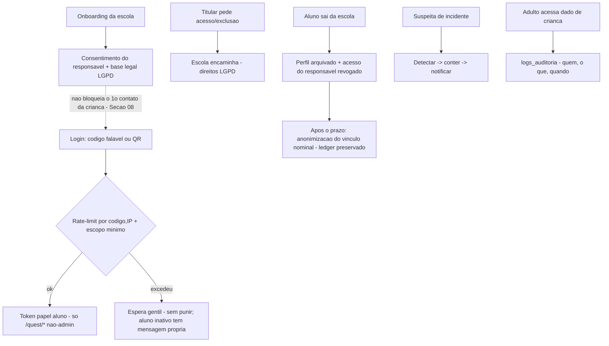
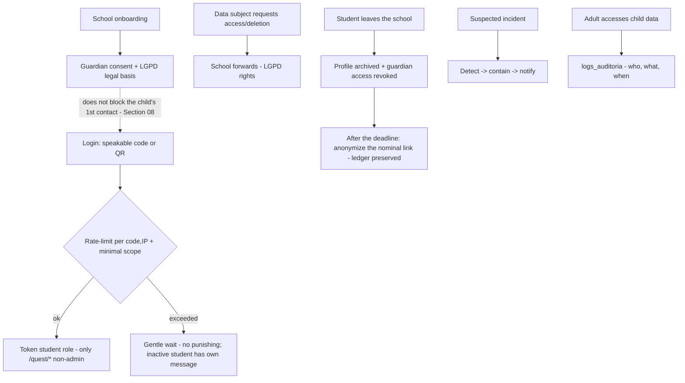

# 12 — Segurança, Privacidade & LGPD / Security, Privacy & LGPD

- **Status:** 🔴 rascunho / draft
- **Padrão / Standard:** [ADR-0002](decisoes/ADR-0002-padrao-de-capitulo.md) (16 partes)
- **Fontes / Sources:** `INDICE.md` (bloco 12, 38 subseções), `docs/quest/04-integracao-edu.md` (LGPD/consentimento/retenção/base legal), `docs/quest/01-arquitetura.md` (segurança/auth), `_estado-atual/RELATORIO-2026-07-09.md`, `backend/app/core/security.py` (JWT/bcrypt/Fernet), `backend/app/core/deps.py`, `backend/app/core/rate_limit.py`, `backend/app/quest/services/credenciais.py` (login código-só, `token_version`), `backend/app/services/audit.py`/`logs_auditoria`, Seções [01](01-principios-imutaveis.md)/[09](09-social.md)/[10](10-professor-familia.md)/[11](11-arquitetura.md)
- **Depende de / Depends on:** princípios (P1/P2/P3/P4/P5/P15/P16/P18) → [01](01-principios-imutaveis.md); vocabulário/lista de proibidos do apelido → [02](02-vocabulario.md); regra de produto do social (default/alcance/precedência) → [09](09-social.md); autorização do vínculo/portais adultos/auditoria (superfície) → [10](10-professor-familia.md); **mecanismo** de token/isolamento/rate-limit distribuído/ledger/autoridade do gabarito/rotação de chave → [11](11-arquitetura.md); backup/DR/criptografia em repouso/segredos (operação) → [14](14-infra-deploy-dr.md); taxonomia/execução da telemetria/expurgo → [17](17-telemetria-metricas.md); config `quest.*` (valores de limites/janelas) → [19](19-liveops.md); provisionamento/offboarding de dados → [20](20-migracao-importacao.md); operação de suporte (direitos do titular) → [21](21-suporte-operacao.md).

> **Convenção / Convention:** "§N" = uma das 16 **partes deste capítulo** / one of the 16 **parts of this
> chapter**; "Seção NN" / "Section NN" = outro capítulo da Bible / another Bible chapter.
> **Escopo / Scope:** este capítulo decide a **política de segurança e de privacidade (LGPD)** e o **modelo de
> ameaça** do Constela Quest — coleta mínima, base legal, consentimento, retenção, anonimização, auditoria,
> direitos do titular, incidentes, e o modelo de ameaça do login código-só. Ele **não** decide o **mecanismo**
> (token, isolamento, rate-limit distribuído, ledger — Seção 11), a **infra/backup** (Seção 14), a **taxonomia**
> de telemetria (Seção 17) nem os **valores** de config (Seção 19) — apenas os **exige** e **referencia**.

---

## 🇧🇷 Segurança, Privacidade & LGPD

### 1. Objetivo
Ser a **referência definitiva de segurança e privacidade** do Constela Quest: a **política legal (LGPD)** e o
**modelo de ameaça** que garantem que o **dado de uma criança** nunca vaze, nunca seja vendido e nunca vire
anúncio. Permite construir com segurança **sem improvisar regra jurídica**. Decide a **política e a ameaça**;
**não** decide o **mecanismo** (Seção [11](11-arquitetura.md)), a **infra/backup** (Seção [14](14-infra-deploy-dr.md)),
a **taxonomia** de telemetria (Seção [17](17-telemetria-metricas.md)) nem os **valores** de config (Seção [19](19-liveops.md)).

### 2. Contexto
No ecossistema **Hub → Edu → Quest**, o Quest trata **dado de menor** e **reusa a identidade do Edu** (Princípio
16) — não coleta cadastro novo. **Estado atual (Q0):** o **login código-só** já existe (código falável
`PALAVRA+NNNN`, único na rede; QR alternativo; fluxo **"É você?"** em 2 etapas — Princípio 4), com **defesa em duas camadas em
memória por processo** (um limitador por `(código, IP)`, para que o erro de uma criança não puna a turma, e um
teto por IP, contra enumeração em massa, dimensionado para o NAT único da escola — valores/mecanismo distribuído
= Seções [11](11-arquitetura.md)/[19](19-liveops.md));
**dois mundos de JWT** (papel `aluno` rejeitado no Edu e vice-versa); **isolamento por `escola_id`**; **auditoria**
via `logs_auditoria` no núcleo (com **assimetrias conhecidas** — PATCH `/preferencias`, login-QR falho e catálogos
cosméticos públicos **sem registro/token**); **senha reversível removida** (só **bcrypt** para adultos +
**recuperação por token de uso único**); **Fernet** mantido **apenas para a chave de API externa**. **Não existe
ainda:** termo de consentimento, política de retenção/anonimização, direitos do titular, resposta a incidente,
Encarregado (DPO), DoD de segurança, e o Portal da Família (transparência ao titular). Este capítulo especifica a
política-alvo.

### 3. Filosofia da funcionalidade
**Privacidade de criança por design — o dado mais seguro é o que não se coleta.**
- **Coleta mínima (Princípio 3, LGPD Art. 14):** nada além do que a escola já cadastrou no Edu; **sem foto,
  localização, biometria** ou dado sensível novo.
- **Segurança por rate-limit e escopo, não por segredo:** o código impresso **pode ficar exposto** (como no
  Elefante Letrado); a defesa é o **limitador** por `(código, IP)` + o **escopo mínimo** do papel aluno — nunca a
  obscuridade do código.
- **Sem monetização do dado da criança (Princípio 18):** **sem anúncios** e **sem SDK de rastreamento de
  terceiros** na experiência infantil.
- **Transparência e controle:** a escola/família enxerga **o que é coletado e para quê**; o titular exerce seus
  direitos **pela escola**.

### 4. Experiência que o jogador deve sentir
O sentimento-alvo é de **confiança** (o "usuário" aqui é a escola/família/dev; a criança apenas é protegida):
- **Escola — "estou em conformidade":** a papelada LGPD (consentimento, base legal, política) vem pronta; a
  responsabilidade é compartilhada de forma clara.
- **Família — "sei o que coletam do meu filho e posso pedir para apagar":** transparência simples, sem
  juridiquês, e um caminho de exclusão pela escola.
- **Criança — protegida sem sentir:** ela nunca vê tela de segurança; o cuidado é invisível.
- **Momento de verdade técnico:** um adulto malicioso tenta acessar dado de **outra escola** e o **isolamento**
  barra; um cartão perdido tem o **QR regenerado** e as sessões derrubadas (o código exposto é o risco residual aceito).

### 5. Fluxo completo
Os fluxos de segurança/privacidade (login defensivo; consentimento; direitos; anonimização; incidente):

**Retenção/anonimização:** a **auditoria** (`logs_auditoria`) é **permanente** (só minimiza dado pessoal); as
**respostas detalhadas** são um artefato **expurgável** (a separar — Seção [17](17-telemetria-metricas.md)),
**expurgadas no prazo** (⚠️ **24 meses a confirmar**, §15); o **ledger de agregados** é append-only (Princípio
14); na **saída** o vínculo nominal é **anonimizado**; o **direito de exclusão** hoje apaga o ledger em cascata (§9/§15).

### 6. Interface (quando existir)
**N/A própria.** A 12 **não desenha telas** — a **transparência** ("o que é coletado e para quê") aparece no
**Portal da Família** (Seção [10](10-professor-familia.md), superfície = Seção [07](07-ux-fluxos-navegacao.md));
a **política de privacidade pública** e o **termo de consentimento** são documentos (link no onboarding). A 12
fixa **o conteúdo mínimo obrigatório** dessas superfícies (não o layout): **identidade do controlador, contato do
Encarregado (DPO), dados coletados e finalidade, base legal, prazo de retenção, direitos do titular e como
exercê-los**; os itens que dependem de confirmação jurídica ficam em §15.

### 7. UX
- **Sem texto livre ao aluno (Princípio 2):** a **única exceção** é o **`nome_exibicao`** validado (como a criança
  pede para ser chamada **dentro da turma**; regra estrita **2–20, só letras** = Princípio 2/Seção
  [01](01-principios-imutaveis.md); vocabulário/lista negra de moderação = §15). **Fora da turma** a criança
  aparece só pelo **`apelido`** (pseudônimo — Princípio 3/LGPD), garantindo que o **nome real não vaze** entre
  turmas.
- **Erros acolhedores:** o fluxo **"É você?"** (Princípio 4) é **confirmatório por design** — devolve o nome do
  dono a um código válido e distingue o aluno inativo, logo **não** é anti-enumeração; a defesa contra enumeração
  é o **rate-limit** + a **não-monetização do dado**, não a ocultação da existência. Erros nunca punem a criança.
- **Consentimento em linguagem clara** para a família (sem juridiquês), com o mapa **dado→finalidade**.
- **Acessibilidade** das telas de transparência/consentimento = mínimo da Seção [13](13-acessibilidade.md).

### 8. Game Design
**N/A própria — segurança não é mecânica de jogo.** Os **controles antifraude** que sustentam a economia (o
**gabarito nunca vai ao cliente** — Princípio 13/Seção [11](11-arquitetura.md); o **ledger imutável** — Princípio
14/Seções [05](05-sistemas-de-jogo.md)/[11](11-arquitetura.md)) são **mecanismo de outras seções**; aqui eles
entram apenas como **leitura de ameaça** (por que existem, o que mitigam), sem redefinir o mecanismo.

### 9. Regras de negócio
- **Modelo de ameaça do login código-só (Princípio 1; decidido):** o código impresso é **exposto por design**.
  Matriz **vetor → defesa**: **força bruta/adivinhação** → limitador por `(código, IP)` + teto por IP + a
  **entropia** do código; **enumeração em massa** → teto por IP; **erro de digitação da criança** → normalização
  tolerante (regras = Seção [11](11-arquitetura.md)) e **aluno inativo não pune**; **cartão roubado/perdido** →
  **risco residual aceito** (o código **não é rotacionado** — a criança o decora); a regeneração troca só o **QR**
  + `token_version` (derruba sessões antigas), não remedia um código já lido (mecanismo = Seção [11](11-arquitetura.md)).
  Sempre com **escopo mínimo** do papel aluno. Os **valores** dos limites e o **mecanismo distribuído** são das
  Seções [11](11-arquitetura.md)/[19](19-liveops.md); a 12 fixa o **requisito e a razão**.
- **Espaço/entropia do código (decidido — alvo a ratificar):** o formato `PALAVRA+NNNN` deve ter **entropia
  suficiente** contra adivinhação sistemática **dentro da escola**, sob o rate-limit; a **entropia-alvo exata**
  (comprimento/alfabeto) é calibração do dono (§15).
- **Escopo mínimo do papel aluno (política):** o token do aluno alcança **apenas** `/quest/*` não-administrativo,
  **nunca** rotas do Edu; a mecânica do token é da Seção [11](11-arquitetura.md).
- **Coleta mínima (Princípio 3, Art. 14):** lista **fechada** do que **não** se coleta (foto, localização,
  biometria, contato pessoal, qualquer dado além do Edu); todo dado coletado tem **finalidade declarada**
  (pedagógica/produto) exibível à família.
- **Base legal e consentimento:** o tratamento de dado de menor apoia-se no **consentimento do responsável** +
  **execução do contrato com a escola**; o **termo** é coletado no **onboarding da escola** e **não bloqueia o
  1º contato** da criança (Seção [08](08-onboarding-ftue.md)) — só há gate legal antes de um passo se um
  requisito específico exigir. A **base legal por fluxo** (jogo/telemetria/social/portais) é confirmada com o
  jurídico (§15).
- **Retenção e anonimização (fonte canônica aqui):** (a) **`logs_auditoria`** (trilha de accountability) é
  **permanente**; a minimização é **mascarar** código/IP de criança, **não** apagar o registro de acesso. (b) As
  **respostas detalhadas das tentativas** são um **artefato expurgável** — hoje inline na coluna `respostas` de
  `quest_tentativas`, **a separar** num store próprio cujo lar é a Seção [17](17-telemetria-metricas.md) (dívida,
  §15) —, **expurgadas** ao fim do **prazo** (⚠️ **24 meses a confirmar**, §15). (c) O **ledger de agregados** é
  **append-only** (Princípio 14; nunca editado nem apagado em operação normal);
  na **saída** do aluno o perfil é **arquivado** + acesso do responsável revogado (Seção [10](10-professor-familia.md))
  e o vínculo nominal é **anonimizado após o prazo**. **Direito de exclusão (erasure):** o Q0 hoje **apaga o ledger
  em cascata** ao excluir o aluno — reconciliar (aceitar o *delete-on-erasure*, mais protetivo, ou migrar para
  anonimização) = §15.
- **Auditoria de acesso (decidido):** **todo acesso de adulto** (professor/responsável/coordenador) a dado de
  criança gera `logs_auditoria` (permanente); o `detalhes` **minimiza dado pessoal** — `código`/`IP` de criança
  **mascarados**. Cobertura mínima a fechar no Q0: **PATCH `/preferencias`** e **login-QR falho** (hoje sem
  registro — são **ações da própria criança**, entram como **trilha de segurança**, não como acesso de adulto); e
  revisar os **catálogos cosméticos públicos sem token** (confirmar "sem auditoria por design").
- **Sem texto livre ao aluno (Princípio 2):** exceção única = o **`nome_exibicao`** validado (formato **2–20, só
  letras** = Princípio 2/Seção [01](01-principios-imutaveis.md); moderação/lista negra = §15; §7).
- **Teto legal — amizade nunca cruza escolas:** é a **fronteira jurídica** (Princípio 16); a **regra de produto**
  do alcance de lançamento e do opt-in é da Seção [09](09-social.md) (referenciada, não repetida). O **ranking
  individual municipal** é **dado pessoal de menor** — nunca exposto à criança, só a adultos no Edu/Hub (Princípio
  5; exibição = Seções [09](09-social.md)/[05](05-sistemas-de-jogo.md)).
- **Sem anúncios / sem rastreamento de terceiros (Princípio 18):** nenhum anúncio, nenhum SDK de tracking de
  terceiros na experiência da criança; só telemetria própria, mínima e finalística.
- **Segredos:** a **chave de API externa** é o **único segredo reversível** admitido (Fernet); credenciais de
  adulto são **bcrypt**; recuperação de acesso é por **token de uso único** que expira. A **rotação da chave de
  assinatura JWT** e a **gestão de segredos** são **política aqui + mecanismo/operação na Seção [11](11-arquitetura.md)/[14](14-infra-deploy-dr.md)** (§15).
- **Isolamento (Princípio 15)** como controle de segurança: `escola_id` filtra **toda linha de dados de usuário,
  rota e mensagem de WebSocket** (exceções fixadas pela Seção [11](11-arquitetura.md): catálogo global de mensagens
  e tenancy transitiva); mecanismo = Seção [11](11-arquitetura.md).
- **Direitos do titular:** acesso/correção/exclusão/anonimização exercidos **pela escola**; o fluxo operacional é
  da Seção [21](21-suporte-operacao.md).
- **Assets públicos na CDN:** cosméticos/trilhas podem ser públicos (sem token); **nunca** dado de aluno nem
  `gabarito`.

### 10. Arquitetura técnica
> O **mecanismo** (token, isolamento, rate-limit distribuído, rotação de chave) é da Seção [11](11-arquitetura.md);
> o **backup/criptografia em repouso** é da Seção [14](14-infra-deploy-dr.md); o **expurgo** é da Seção [17](17-telemetria-metricas.md).
> Aqui fica o **contrato de política**.

- **Auditoria:** `logs_auditoria` (schema/entrega = núcleo, Seção [11](11-arquitetura.md)) registra `quem, o quê,
  quando, escola_id`; a 12 define **quais operações** o alimentam (todo acesso de adulto a dado de criança) e a
  **minimização** do `detalhes` (mascarar `código`/`IP` de criança).
- **Credenciais:** login do aluno = **código** (sem hash de senha, pois não há senha); adulto = **bcrypt**; reset
  = **token de uso único** com expiração; **Fernet** cifra **só** a chave de API (a string de derivação legada
  `senha-visivel` deve ser **renomeada com re-cifra** — dívida, §15).
- **Retenção/anonimização (política):** define o **prazo** e o **gatilho**; a **execução** (job de expurgo,
  anonimização de colunas nominais, agregados que sobrevivem) é da Seção [17](17-telemetria-metricas.md)/[14](14-infra-deploy-dr.md).
- **Não decide aqui:** o desenho do **JWT** (claims/TTL/`token_version`), do **rate-limit distribuído**, do
  **isolamento** e do **ledger** — Seção [11](11-arquitetura.md); backup/segredos em repouso — Seção [14](14-infra-deploy-dr.md);
  taxonomia de eventos — Seção [17](17-telemetria-metricas.md).

### 11. Dependências com outros módulos
- **Princípios (P1/P2/P3/P4/P5/P15/P16/P18)** → Seção [01](01-principios-imutaveis.md) (o formato do nome de exibição, 2–20 só letras, é do **Princípio 2**); **vocabulário e moderação do nome** → Seção [02](02-vocabulario.md).
- **Regra de produto do social (default/alcance/precedência)** → Seção [09](09-social.md); **vínculo/portais adultos/auditoria (superfície)** → Seção [10](10-professor-familia.md).
- **Mecanismo de token/isolamento/rate-limit/ledger/gabarito/rotação de chave** → Seção [11](11-arquitetura.md).
- **Backup/DR/criptografia em repouso/segredos (operação)** → Seção [14](14-infra-deploy-dr.md); **taxonomia/expurgo de telemetria** → Seção [17](17-telemetria-metricas.md); **valores de config (limites/janelas)** → Seção [19](19-liveops.md); **provisionamento/offboarding** → Seção [20](20-migracao-importacao.md); **operação dos direitos do titular** → Seção [21](21-suporte-operacao.md).

Este capítulo **alimenta:** o **DoD de segurança** que todas as seções seguem, a **transparência** que a Seção
[10](10-professor-familia.md) exibe, e a **política de retenção/anonimização** que a Seção [17](17-telemetria-metricas.md)
executa. **Dá origem a:** o termo de consentimento, a política de privacidade pública e o processo de incidente.

### 12. Casos extremos (Edge Cases)
- **Cartão perdido/roubado:** **regenerado sem expor dado** (mecanismo de regeneração/invalidação de sessão =
  Seção [11](11-arquitetura.md)); **risco residual aceito**; mensagem acolhedora ao aluno (UI = Seção [07](07-ux-fluxos-navegacao.md)).
- **Força bruta/enumeração no código:** o **rate-limit** (duas camadas) + a **entropia** limitam; o fluxo é
  confirmatório (não anti-enumeração — §7), então a defesa é a **cadência**, não o sigilo da existência.
- **Criança digita errado:** a **normalização tolerante** (regras = Seção [11](11-arquitetura.md)) nunca pune.
- **Adulto tenta acessar outra escola:** o **isolamento** barra; o acesso é **auditado**.
- **Vazamento/incidente:** **detectar → conter → notificar** (processo mínimo; detalhes = §15).
- **Aluno sai da escola:** **anonimização** no gatilho definido; o responsável perde o acesso.
- **Pedido de exclusão do titular:** encaminhado **pela escola** (Seção [21](21-suporte-operacao.md)).
- **Log com dado pessoal:** hoje `quest.login_falhou` grava `código`+`IP` e `quest.login` grava `IP` da criança **em claro** — a política exige **mascarar** (dívida, §15).
- **Tablet compartilhado:** a conta **não fica salva** (Princípio 4); o cache local nunca guarda `gabarito` nem
  dado de outra criança (Seção [11](11-arquitetura.md)).

### 13. Escalabilidade futura
- **Rate-limit distribuído** suporta mais escolas sem afrouxar a defesa (tecnologia/mecanismo = Seção [11](11-arquitetura.md)).
- **Retenção/expurgo automatizados** por política (job = Seção [17](17-telemetria-metricas.md)/[14](14-infra-deploy-dr.md)).
- **DPO e política pública** evoluem com o alcance (mais escolas/municípios).
- **Novos tratamentos** entram pela **base legal** e pela **coleta mínima** — nunca por exceção improvisada.

### 14. Checklist de implementação
- [ ] **DoD de segurança** (revisão obrigatória de toda feature): escopo de token; isolamento por `escola_id`;
      **sem texto livre**; `gabarito` **nunca** no cliente; auditoria dos acessos de adulto; **sem anúncios**.
- [ ] **Login código-só** com rate-limit (duas camadas) + escopo mínimo; aluno inativo não pune; erros não punem
      (o fluxo é confirmatório — §7).
- [ ] **Coleta mínima** (lista fechada do que não se coleta) + mapa **dado→finalidade** exibível à família.
- [ ] **Consentimento** no onboarding da escola; **não bloqueia** o 1º contato (Seção [08](08-onboarding-ftue.md)).
- [ ] **Retenção** (prazo §15): `logs_auditoria` **permanente** (dado pessoal mascarado); **respostas detalhadas**
      (artefato expurgável, a separar — Seção [17](17-telemetria-metricas.md)) expurgadas no prazo; **ledger de
      agregados append-only** (Princípio 14); erasure (hoje por cascata) reconciliado em §15.
- [ ] **Auditoria** de todo acesso de adulto a dado de criança; cobertura mínima de segurança fechada (PATCH
      `/preferencias`, login-QR falho); `detalhes` minimiza `código`/`IP`.
- [ ] **`nome_exibicao`** validado (**2–20, só letras** = Princípio 2; lista negra = §15); **fora da turma só o
      `apelido`** (pseudônimo) — nome real **não vaza** entre turmas.
- [ ] **Segredos:** só a chave de API é reversível (Fernet); adultos = bcrypt + reset por token uso único;
      rotação da chave JWT (§15).
- [ ] **Direitos do titular** via escola (Seção [21](21-suporte-operacao.md)); **processo de incidente** mínimo.
- [ ] **Teto legal** amizade nunca cruza escolas (Princípio 16); **sem SDK de rastreamento** (Princípio 18). DoD
      conferido contra o Apêndice [F](apendice-F-checklists-dod.md).

### 15. Questões em aberto
As decisões-chave de política e de modelo de ameaça foram **fixadas aqui**; restam confirmações do dono/jurídico
e calibrações dependentes de outra seção:
- ⚠️ **Prazo de retenção** das **respostas detalhadas** (dentro de `quest_tentativas`) — sugerido **24 meses**
  (Princípio 3, a confirmar); a auditoria (`logs_auditoria`) permanece **permanente**.
- ⚠️ **Erasure do ledger:** o Q0 apaga `quest_tentativas` por `ON DELETE CASCADE` ao excluir o aluno — decidir se
  o *delete-on-erasure* é a política ou se migra para anonimização; e se a Seção [17](17-telemetria-metricas.md)
  separa a coluna `respostas` numa tabela expurgável.
- ⚠️ **Base legal LGPD por fluxo** (jogo/telemetria/social/portais): consentimento, execução de contrato ou
  legítimo interesse — a confirmar com o jurídico.
- ⚠️ **Gatilho exato de anonimização** na saída do aluno (imediato ao arquivar, ao fim do prazo, ou outro).
- ⚠️ **Quem autoriza o vínculo responsável↔aluno** (professor/coordenador/secretaria) e sua base legal —
  coordenado com a Seção [10](10-professor-familia.md).
- ⚠️ **Encarregado (DPO) designado** + **política de privacidade pública** a publicar.
- ⚠️ **Processo formal de incidente** e de **direitos do titular** (prazos, quem executa) — Seção [21](21-suporte-operacao.md).
- ⚠️ **Entropia-alvo do código** de login (comprimento/alfabeto) contra enumeração.
- ⚠️ **Rotação de segredos** (chave JWT, chave Fernet): cadência e procedimento — política aqui, mecanismo/operação
  na Seção [11](11-arquitetura.md)/[14](14-infra-deploy-dr.md).
- ⚠️ **Criptografia/retenção dos backups** de dado de criança — a 12 **exige**; a Seção [14](14-infra-deploy-dr.md)
  **executa**.
- ⚠️ **Lista negra de moderação do nome de exibição** — hoje a Seção [02](02-vocabulario.md) só tem os proibidos
  de UI; definir a blacklist do apelido (aqui ou na 02, via ADR).
- ⚠️ **Cláusulas jurídicas** do termo de consentimento e da política pública (controlador/DPO/bases/prazos), a
  confirmar com o jurídico (§6).
- ⚠️ **Sequenciamento de execução:** a retenção/anonimização/expurgo **exige** as Seções [17](17-telemetria-metricas.md)/[14](14-infra-deploy-dr.md)
  (ainda não escritas) para executar; e o bloco 12 do `INDICE.md` deve **sincronizar** com a decisão de
  alcance/opt-in já aprovada na Seção [09](09-social.md).
- ⚠️ **Dívidas do Q0 a fechar:** **mascarar** o `código`+`IP` de `quest.login_falhou` e o `IP` de `quest.login`;
  renomear a string Fernet `senha-visivel` (re-cifra); auditar PATCH `/preferencias` e login-QR falho; revisar
  catálogos públicos sem token.

### 16. ADR (Architecture Decision Record)
**Decisões registradas por este capítulo:**
1. **Privacidade por design + coleta mínima** (LGPD Art. 14; Princípio 3): nada além do Edu; sem foto/localização/biometria.
2. **Modelo de ameaça do login código-só (Princípio 1):** exposto por design; matriz vetor→defesa (força bruta →
   limitador `(código, IP)` + teto por IP + entropia; cartão roubado → risco residual + regeneração); aluno
   inativo não pune (valores/mecanismo = Seções [11](11-arquitetura.md)/[19](19-liveops.md)).
3. **Sem texto livre ao aluno** (Princípio 2); exceção única = **`nome_exibicao`** validado (2–20, letras =
   Princípio 2; lista negra = §15); fora da turma só o **`apelido`** (pseudônimo, LGPD).
4. **Regimes de dado:** `logs_auditoria` **permanente** (dado pessoal mascarado); **respostas detalhadas** =
   artefato expurgável (lar = Seção [17](17-telemetria-metricas.md)), expurgadas no prazo (⚠️ 24 meses a
   confirmar); **ledger de agregados append-only** (Princípio 14), apagado só no **direito de exclusão** (hoje por
   cascata — §15).
5. **Auditoria de todo acesso de adulto a dado de criança** (fechar as assimetrias do Q0; **minimizar** `código`/`IP`
   no `detalhes`).
6. **Sem anúncios / sem rastreamento de terceiros** (Princípio 18).
7. **A chave de API é o único segredo reversível** (Fernet); adultos = bcrypt + reset por token de uso único.
8. **Teto legal — amizade nunca cruza escolas** (Princípio 16); a regra de produto do alcance/opt-in é da Seção
   [09](09-social.md).
9. **Direitos do titular via escola** + **processo de incidente mínimo** + **DPO/política pública** (designação = §15).
10. **Mecanismo = Seções [11](11-arquitetura.md)/[14](14-infra-deploy-dr.md)/[17](17-telemetria-metricas.md)**; a
    12 fixa a **política e o modelo de ameaça**, não redefine o mecanismo.

*(Registro inline; sem criar arquivo de ADR sem autorização.)*

---

## 🇬🇧 Security, Privacy & LGPD

### 1. Objective
Be the **definitive security and privacy reference** for Constela Quest: the **legal (LGPD) policy** and the
**threat model** ensuring a **child's data** never leaks, is never sold and never becomes an ad. It lets teams
build securely **without improvising legal rules**. It decides **policy and threat**; it does **not** decide the
**mechanism** (Section [11](11-arquitetura.md)), the **infra/backup** (Section [14](14-infra-deploy-dr.md)), the
telemetry **taxonomy** (Section [17](17-telemetria-metricas.md)) or the config **values** (Section [19](19-liveops.md)).

### 2. Context
In the **Hub → Edu → Quest** ecosystem, Quest handles **minors' data** and **reuses Edu's identity** (Principle
16) — no new registration. **Current state (Q0):** the **code-only login** already exists (speakable
`PALAVRA+NNNN` code, network-unique; alternate QR; 2-step **"Is this you?"** flow — Principle 4), with a
**two-layer defense in in-process memory** (a limiter per `(code, IP)`, so one child's mistake doesn't punish the
class, and an IP cap, against mass enumeration, sized for the school's single NAT — values/distributed mechanism =
Sections [11](11-arquitetura.md)/[19](19-liveops.md));
**two JWT worlds** (the `aluno` role rejected in Edu and vice versa); **isolation by `escola_id`**; **auditing**
via `logs_auditoria` in the core (with **known asymmetries** — PATCH `/preferencias`, failed QR-login and public
cosmetic catalogs **without record/token**); **reversible password removed** (only **bcrypt** for adults +
**single-use token recovery**); **Fernet** kept **only for the external API key**. **Not yet existing:** the
consent form, retention/anonymization policy, data-subject rights, incident response, a Data Protection Officer
(DPO), a security DoD, and the Family Portal (transparency to the data subject). This chapter specifies the target
policy.

### 3. Feature philosophy
**Child privacy by design — the safest data is the data you don't collect.**
- **Minimal collection (Principle 3, LGPD Art. 14):** nothing beyond what the school already registered in Edu;
  **no photo, location, biometrics** or new sensitive data.
- **Security by rate-limit and scope, not by secrecy:** the printed code **may be exposed** (like Elefante
  Letrado); the defense is the **limiter** per `(code, IP)` + the **minimal scope** of the student role — never
  the code's obscurity.
- **No monetizing the child's data (Principle 18):** **no ads** and **no third-party tracking SDK** in the
  child's experience.
- **Transparency and control:** the school/family sees **what is collected and why**; the data subject exercises
  their rights **through the school**.

### 4. The experience the player should feel
The target feeling is **trust** (the "user" here is the school/family/dev; the child is simply protected):
- **School — "I'm compliant":** the LGPD paperwork (consent, legal basis, policy) comes ready; responsibility is
  clearly shared.
- **Family — "I know what they collect about my child and I can ask to delete it":** simple transparency, no
  legalese, and a deletion path via the school.
- **Child — protected without noticing:** they never see a security screen; the care is invisible.
- **Technical moment of truth:** a malicious adult tries to reach **another school's** data and **isolation**
  blocks it; a lost card has its **QR regenerated** and sessions dropped (the exposed code is the accepted residual risk).

### 5. Complete flow
The security/privacy flows (defensive login; consent; rights; anonymization; incident):

**Retention/anonymization:** the **audit trail** (`logs_auditoria`) is **permanent** (it only minimizes personal
data); the **detailed answers** are a **purgeable** artifact (to be split — Section [17](17-telemetria-metricas.md)),
**purged at the deadline** (⚠️ **24 months, to be confirmed**, §15); the **aggregate ledger** is append-only
(Principle 14); on **exit** the nominal link is **anonymized**; the **right to erasure** today deletes the ledger
by cascade (§9/§15).

### 6. Interface (when it exists)
**N/A of its own.** 12 **draws no screens** — **transparency** ("what is collected and why") appears in the
**Family Portal** (Section [10](10-professor-familia.md), surface = Section [07](07-ux-fluxos-navegacao.md)); the
**public privacy policy** and the **consent form** are documents (linked at onboarding). 12 fixes the **minimum
required content** of those surfaces (not the layout): **controller identity, DPO contact, data collected and
purpose, legal basis, retention period, data-subject rights and how to exercise them**; the items pending legal
confirmation are in §15.

### 7. UX
- **No free text to the student (Principle 2):** the **only exception** is the validated **`nome_exibicao`** (how
  the child asks to be called **within the class**; strict rule **2–20, letters only** = Principle 2/Section
  [01](01-principios-imutaveis.md); vocabulary/moderation blacklist = §15). **Outside the class** the child appears
  only by the **`apelido`** (pseudonym — Principle 3/LGPD), ensuring the **real name doesn't leak** between classes.
- **Welcoming errors:** the **"Is this you?"** flow (Principle 4) is **confirmatory by design** — it returns the
  owner's name for a valid code and distinguishes the inactive student, so it is **not** anti-enumeration; the
  defense against enumeration is the **rate-limit** + **not monetizing the data**, not hiding existence. Errors
  never punish the child.
- **Consent in plain language** for the family (no legalese), with the **data→purpose** map.
- **Accessibility** of the transparency/consent screens = Section [13](13-acessibilidade.md)'s minimum.

### 8. Game Design
**N/A of its own — security is not a game mechanic.** The **anti-fraud controls** that uphold the economy (the
**answer key never reaches the client** — Principle 13/Section [11](11-arquitetura.md); the **immutable ledger** —
Principle 14/Sections [05](05-sistemas-de-jogo.md)/[11](11-arquitetura.md)) are **other sections' mechanisms**;
here they appear only as a **threat reading** (why they exist, what they mitigate), without redefining the
mechanism.

### 9. Business rules
- **Code-only login threat model (Principle 1; decided):** the printed code is **exposed by design**. The
  **vector → defense** matrix: **brute force/guessing** → limiter per `(code, IP)` + IP cap + the code's
  **entropy**; **mass enumeration** → IP cap; **a child's typo** → tolerant normalization (rules = Section
  [11](11-arquitetura.md)) and **an inactive student is not punished**; **stolen/lost card** → **accepted residual
  risk** (the code is **not rotated** — the child memorizes it); regeneration only swaps the **QR** + `token_version`
  (drops old sessions), it doesn't remedy an already-read code (mechanism = Section [11](11-arquitetura.md)). Always with the
  **minimal scope** of the student role. The limit **values** and the **distributed mechanism** are Sections
  [11](11-arquitetura.md)/[19](19-liveops.md)'s; 12 fixes the **requirement and the rationale**.
- **Code space/entropy (decided — target to ratify):** the `PALAVRA+NNNN` format must have **enough entropy**
  against systematic guessing **within the school**, under the rate-limit; the **exact target entropy**
  (length/alphabet) is an owner calibration (§15).
- **Minimal student-role scope (policy):** the student token reaches **only** non-administrative `/quest/*`,
  **never** Edu routes; the token mechanic is Section [11](11-arquitetura.md)'s.
- **Minimal collection (Principle 3, Art. 14):** a **closed** list of what is **not** collected (photo, location,
  biometrics, personal contact, any data beyond Edu); every collected datum has a **declared purpose**
  (pedagogical/product) shown to the family.
- **Legal basis and consent:** processing a minor's data rests on the **guardian's consent** + **performance of
  the contract with the school**; the **form** is collected at **school onboarding** and **does not block the
  child's 1st contact** (Section [08](08-onboarding-ftue.md)) — a legal gate precedes a step only if a specific
  requirement demands it. The **legal basis per flow** (game/telemetry/social/portals) is confirmed with legal
  counsel (§15).
- **Retention and anonymization (canonical source here):** (a) **`logs_auditoria`** (the audit trail) is
  **permanent**; minimization is **masking** a child's code/IP, **not** deleting the access record. (b) The
  **detailed attempt answers** are a **purgeable artifact** — today inline in the `respostas` column of
  `quest_tentativas`, **to be split** into a store owned by Section [17](17-telemetria-metricas.md) (debt, §15) —,
  **purged** at the **deadline** (⚠️ **24 months, to be confirmed**, §15). (c) The **aggregate ledger** is
  **append-only** (Principle 14; never edited or deleted in normal operation); on the student's **exit** the
  profile is **archived** + guardian access revoked (Section
  [10](10-professor-familia.md)) and the nominal link is **anonymized after the deadline**. **Right to erasure:**
  Q0 today **deletes the ledger by cascade** on student deletion — reconcile (accept *delete-on-erasure*, more
  protective, or migrate to anonymization) = §15.
- **Access auditing (decided):** **every adult access** (teacher/guardian/coordinator) to a child's data
  generates `logs_auditoria` (permanent); the `detalhes` **minimizes personal data** — a child's `code`/`IP`
  **masked**. Minimum coverage to close in Q0: **PATCH `/preferencias`** and **failed QR-login** (today unlogged —
  they are the **child's own actions**, entering as a **security trail**, not adult access); and review the
  **public cosmetic catalogs without a token** (confirm "no auditing by design").
- **No free text to the student (Principle 2):** the sole exception is the validated **`nome_exibicao`** (format
  **2–20, letters only** = Principle 2/Section [01](01-principios-imutaveis.md); moderation/blacklist = §15; §7).
- **Legal ceiling — friendship never crosses schools:** it is the **legal boundary** (Principle 16); the
  **product rule** of launch scope and opt-in is Section [09](09-social.md)'s (referenced, not repeated). The
  **individual municipal ranking** is a **minor's personal data** — never shown to the child, only to adults in
  Edu/Hub (Principle 5; display = Sections [09](09-social.md)/[05](05-sistemas-de-jogo.md)).
- **No ads / no third-party tracking (Principle 18):** no ads, no third-party tracking SDK in the child's
  experience; only our own telemetry, minimal and purpose-bound.
- **Secrets:** the **external API key** is the **only reversible secret** allowed (Fernet); adult credentials are
  **bcrypt**; access recovery is via a **single-use token** that expires. The **JWT signing-key rotation** and
  **secrets management** are **policy here + mechanism/ops in Section [11](11-arquitetura.md)/[14](14-infra-deploy-dr.md)** (§15).
- **Isolation (Principle 15)** as a security control: `escola_id` filters **every user-data row, route and
  WebSocket message** (exceptions set by Section [11](11-arquitetura.md): the global message catalog and transitive
  tenancy); mechanism = Section [11](11-arquitetura.md).
- **Data-subject rights:** access/correction/deletion/anonymization exercised **through the school**; the
  operational flow is Section [21](21-suporte-operacao.md)'s.
- **Public CDN assets:** cosmetics/tracks may be public (no token); **never** a student's data or the `gabarito`.

### 10. Technical architecture
> The **mechanism** (token, isolation, distributed rate-limit, key rotation) is Section [11](11-arquitetura.md)'s;
> the **backup/at-rest encryption** is Section [14](14-infra-deploy-dr.md)'s; the **purge** is Section
> [17](17-telemetria-metricas.md)'s. Here lives the **policy contract**.

- **Auditing:** `logs_auditoria` (schema/delivery = core, Section [11](11-arquitetura.md)) records `who, what,
  when, escola_id`; 12 defines **which operations** feed it (every adult access to child data) and the
  **minimization** of `detalhes` (mask a child's `code`/`IP`).
- **Credentials:** the student login = **code** (no password hash, since there is no password); adult = **bcrypt**;
  reset = **single-use token** with expiry; **Fernet** encrypts **only** the API key (the legacy derivation string
  `senha-visivel` must be **renamed with re-encryption** — debt, §15).
- **Retention/anonymization (policy):** defines the **deadline** and the **trigger**; the **execution** (purge
  job, anonymizing nominal columns, surviving aggregates) is Section [17](17-telemetria-metricas.md)/[14](14-infra-deploy-dr.md)'s.
- **Not decided here:** the **JWT** design (claims/TTL/`token_version`), the **distributed rate-limit**, the
  **isolation** and the **ledger** — Section [11](11-arquitetura.md); backup/at-rest secrets — Section
  [14](14-infra-deploy-dr.md); event taxonomy — Section [17](17-telemetria-metricas.md).

### 11. Dependencies on other modules
- **Principles (P1/P2/P3/P4/P5/P15/P16/P18)** → Section [01](01-principios-imutaveis.md) (the display-name format, 2–20 letters, is **Principle 2**'s); **vocabulary and name moderation** → Section [02](02-vocabulario.md).
- **Social product rule (default/scope/precedence)** → Section [09](09-social.md); **link/adult portals/auditing (surface)** → Section [10](10-professor-familia.md).
- **Token/isolation/rate-limit/ledger/answer-key/key-rotation mechanism** → Section [11](11-arquitetura.md).
- **Backup/DR/at-rest encryption/secrets (ops)** → Section [14](14-infra-deploy-dr.md); **telemetry taxonomy/purge** → Section [17](17-telemetria-metricas.md); **config values (limits/windows)** → Section [19](19-liveops.md); **provisioning/offboarding** → Section [20](20-migracao-importacao.md); **data-subject-rights operation** → Section [21](21-suporte-operacao.md).

This chapter **feeds:** the **security DoD** every section follows, the **transparency** Section
[10](10-professor-familia.md) shows, and the **retention/anonymization policy** Section [17](17-telemetria-metricas.md)
executes. **Spawns:** the consent form, the public privacy policy and the incident process.

### 12. Edge cases
- **Lost/stolen card:** the **QR is regenerated** and sessions drop (`token_version`); the **code is not rotated** —
  its exposure is the **accepted residual risk** (mechanism = Section [11](11-arquitetura.md)); a welcoming message
  (UI = Section [07](07-ux-fluxos-navegacao.md)).
- **Brute force/enumeration on the code:** the **rate-limit** (two layers) + the **entropy** limit it; the flow is
  confirmatory (not anti-enumeration — §7), so the defense is **cadence**, not hiding existence.
- **Child mistypes:** **tolerant normalization** (rules = Section [11](11-arquitetura.md)) never punishes.
- **Adult tries to reach another school:** **isolation** blocks it; the access is **audited**.
- **Leak/incident:** **detect → contain → notify** (minimal process; details = §15).
- **Student leaves the school:** **anonymization** on the defined trigger; the guardian loses access.
- **Data-subject deletion request:** forwarded **through the school** (Section [21](21-suporte-operacao.md)).
- **Log with personal data:** today `quest.login_falhou` stores a child's `code`+`IP` and `quest.login` stores the `IP` **in clear** — the policy requires **masking** (debt, §15).
- **Shared tablet:** the account **is not saved** (Principle 4); the local cache never keeps the `gabarito` or
  another child's data (Section [11](11-arquitetura.md)).

### 13. Future scalability
- **Distributed rate-limit** supports more schools without loosening the defense (technology/mechanism = Section [11](11-arquitetura.md)).
- **Automated retention/purge** by policy (job = Section [17](17-telemetria-metricas.md)/[14](14-infra-deploy-dr.md)).
- **DPO and public policy** evolve with reach (more schools/municipalities).
- **New processing** enters through the **legal basis** and **minimal collection** — never by an improvised
  exception.

### 14. Implementation checklist
- [ ] **Security DoD** (mandatory review of every feature): token scope; isolation by `escola_id`; **no free
      text**; `gabarito` **never** on the client; auditing of adult accesses; **no ads**.
- [ ] **Code-only login** with rate-limit (two layers) + minimal scope; inactive student not punished; errors
      don't punish (the flow is confirmatory — §7).
- [ ] **Minimal collection** (closed list of what is not collected) + **data→purpose** map shown to the family.
- [ ] **Consent** at school onboarding; **does not block** the 1st contact (Section [08](08-onboarding-ftue.md)).
- [ ] **Retention** (deadline §15): `logs_auditoria` **permanent** (personal data masked); **detailed answers**
      (purgeable artifact, to be split — Section [17](17-telemetria-metricas.md)) purged at the deadline;
      **append-only aggregate ledger** (Principle 14); erasure (today by cascade) reconciled in §15.
- [ ] **Auditing** of every adult access to child data; minimum security coverage closed (PATCH `/preferencias`,
      failed QR-login); `detalhes` minimizes `code`/`IP`.
- [ ] **`nome_exibicao`** validated (**2–20, letters only** = Principle 2; blacklist = §15); **outside the class
      only the `apelido`** (pseudonym) — the real name **does not leak** between classes.
- [ ] **Secrets:** only the API key is reversible (Fernet); adults = bcrypt + single-use-token reset; JWT key
      rotation (§15).
- [ ] **Data-subject rights** via the school (Section [21](21-suporte-operacao.md)); minimal **incident process**.
- [ ] **Legal ceiling** friendship never crosses schools (Principle 16); **no tracking SDK** (Principle 18). DoD
      checked against Appendix [F](apendice-F-checklists-dod.md).

### 15. Open questions
The key policy and threat-model decisions are **fixed here**; what remains are owner/legal confirmations and
calibrations that depend on another section:
- ⚠️ **Retention deadline** for the **detailed answers** (inside `quest_tentativas`) — suggested **24 months**
  (Principle 3, to confirm); the audit trail (`logs_auditoria`) stays **permanent**.
- ⚠️ **Ledger erasure:** Q0 deletes `quest_tentativas` via `ON DELETE CASCADE` on student deletion — decide whether
  *delete-on-erasure* is the policy or it migrates to anonymization; and whether Section [17](17-telemetria-metricas.md)
  splits the `respostas` column into a purgeable table.
- ⚠️ **LGPD legal basis per flow** (game/telemetry/social/portals): consent, contract performance or legitimate
  interest — to confirm with legal counsel.
- ⚠️ **Exact anonymization trigger** on the student's exit (immediate on archive, at the deadline, or other).
- ⚠️ **Who authorizes the guardian↔student link** (teacher/coordinator/registrar) and its legal basis —
  coordinated with Section [10](10-professor-familia.md).
- ⚠️ **Designated DPO** + **public privacy policy** to publish.
- ⚠️ **Formal incident process** and **data-subject rights** (deadlines, who executes) — Section [21](21-suporte-operacao.md).
- ⚠️ **Target code entropy** (length/alphabet) against enumeration.
- ⚠️ **Secrets rotation** (JWT key, Fernet key): cadence and procedure — policy here, mechanism/ops in Section
  [11](11-arquitetura.md)/[14](14-infra-deploy-dr.md).
- ⚠️ **Encryption/retention of backups** of child data — 12 **requires**; Section [14](14-infra-deploy-dr.md)
  **executes**.
- ⚠️ **Display-name moderation blacklist** — Section [02](02-vocabulario.md) today has only forbidden UI words;
  define the nickname blacklist (here or in 02, via ADR).
- ⚠️ **Legal clauses** of the consent form and public policy (controller/DPO/bases/deadlines), to confirm with
  legal counsel (§6).
- ⚠️ **Execution sequencing:** retention/anonymization/purge **requires** Sections [17](17-telemetria-metricas.md)/[14](14-infra-deploy-dr.md)
  (not yet written) to execute; and `INDICE.md`'s block 12 must **sync** with the scope/opt-in already decided in
  Section [09](09-social.md).
- ⚠️ **Q0 debts to close:** **mask** the `code`+`IP` of `quest.login_falhou` and the `IP` of `quest.login`; rename
  the Fernet `senha-visivel` string (re-encrypt); audit PATCH `/preferencias` and failed QR-login; review public
  catalogs without a token.

### 16. ADR (Architecture Decision Record)
**Decisions recorded by this chapter:**
1. **Privacy by design + minimal collection** (LGPD Art. 14; Principle 3): nothing beyond Edu; no photo/location/biometrics.
2. **Code-only login threat model (Principle 1):** exposed by design; vector→defense matrix (brute force → limiter
   `(code, IP)` + IP cap + entropy; stolen card → residual risk + regeneration); inactive student not punished
   (values/mechanism = Sections [11](11-arquitetura.md)/[19](19-liveops.md)).
3. **No free text to the student** (Principle 2); sole exception = validated **`nome_exibicao`** (2–20, letters =
   Principle 2; blacklist = §15); outside the class only the **`apelido`** (pseudonym, LGPD).
4. **Data regimes:** `logs_auditoria` **permanent** (personal data masked); **detailed answers** = a purgeable
   artifact (home = Section [17](17-telemetria-metricas.md)), purged at the deadline (⚠️ 24 months to confirm);
   **append-only aggregate ledger** (Principle 14), deleted only on the **right to erasure** (today by cascade — §15).
5. **Auditing of every adult access to child data** (close the Q0 asymmetries; **minimize** `code`/`IP` in
   `detalhes`).
6. **No ads / no third-party tracking** (Principle 18).
7. **The API key is the only reversible secret** (Fernet); adults = bcrypt + single-use-token reset.
8. **Legal ceiling — friendship never crosses schools** (Principle 16); the product rule of scope/opt-in is
   Section [09](09-social.md)'s.
9. **Data-subject rights via the school** + **minimal incident process** + **DPO/public policy** (designation = §15).
10. **Mechanism = Sections [11](11-arquitetura.md)/[14](14-infra-deploy-dr.md)/[17](17-telemetria-metricas.md)**;
    12 fixes the **policy and the threat model**, it does not redefine the mechanism.

*(Recorded inline; no separate ADR file created without authorization.)*
