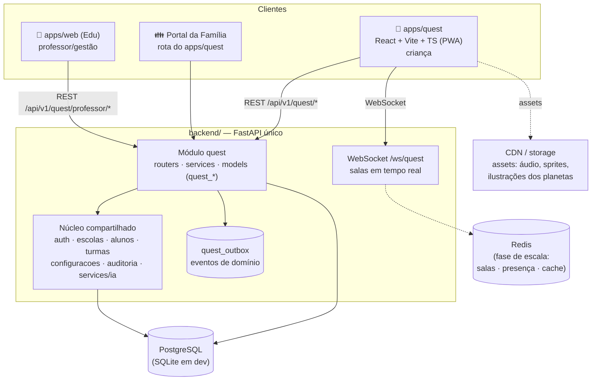
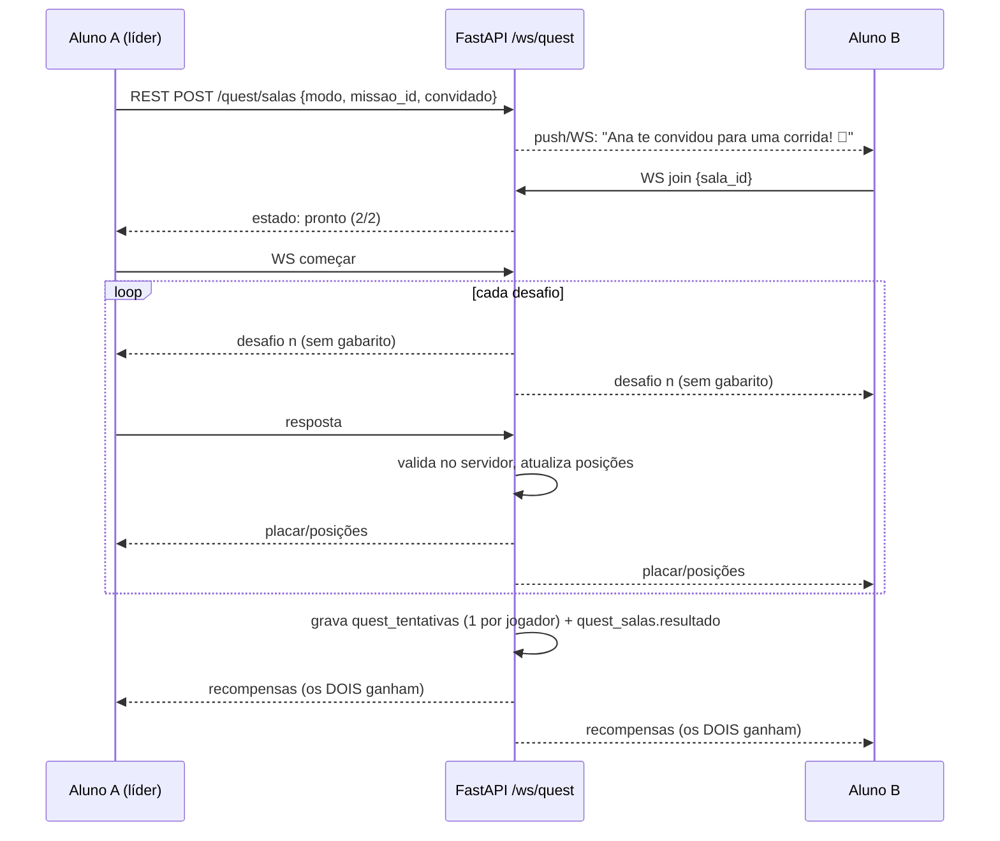

# 01 — Arquitetura de Sistema

## Princípio: monólito modular com fronteiras de extração

O Quest nasce **dentro** do backend existente, como um módulo com fronteira
explícita — não espalhado pelo código do Edu. A regra de dependência tem uma
única direção:

```
quest  ──pode importar──▶  núcleo compartilhado (escolas, alunos, turmas,
                            matriculas, usuarios, configuracoes, auditoria, ia)
edu    ──pode importar──▶  núcleo compartilhado
edu    ──NUNCA importa──▶  quest.models / quest.services diretamente
edu    ──consome quest──▶  via rotas /quest/professor/* e via quest_outbox
```

Por que não um microsserviço desde o dia 1:

- A identidade (aluno, turma, escola) já vive no banco do Edu. Serviço
  separado = sincronizar cadastros, federar autenticação e operar dois
  deploys — custo alto com um desenvolvedor e zero ganho antes de existir
  carga real.
- A fronteira de módulo + o outbox de eventos deixam a extração futura
  mecânica: mover `backend/app/quest/` para um serviço próprio, apontar o
  outbox para uma fila e replicar as tabelas de identidade (read-only).

Quando extrair (gatilhos objetivos): >30 escolas ativas simultâneas, ou o
WebSocket precisar de mais de 2 réplicas, ou o time crescer para 2+ devs
com deploys conflitando.

## Visão geral



## Stack

| Camada | Tecnologia | Justificativa |
|---|---|---|
| Frontend aluno | React 18 + Vite + TypeScript, PWA (service worker) | Ecossistema já dominado no projeto; PWA cobre Chromebook/tablet/celular sem loja |
| Animação/juice | CSS/SVG + Framer Motion (transições de tela, recompensas) | O protótipo v7 prova a estética com SVG puro; Framer só onde CSS não alcança |
| Drag & drop | `@dnd-kit` | Acessível, touch-first, leve |
| Áudio | Howler.js (música/efeitos) + Web Speech API com fallback de áudio pré-gravado (instruções faladas) | **Alunos de 1º/2º ano ainda não leem** — toda instrução precisa de áudio |
| Estado | TanStack Query (servidor) + Zustand (jogo/sessão) | Mesmo padrão do mobile do Edu (TanStack) |
| Backend | FastAPI (módulo `app/quest`) | Backend único; reusa auth, config, auditoria e `services/ia` |
| Tempo real | WebSocket nativo do FastAPI; salas em memória → Redis pub/sub com réplicas | Modos são turn-based/ritmo de quiz |
| Banco | PostgreSQL (prod) / SQLite (dev), SQLAlchemy 2 | Idêntico ao Edu |
| Assets | Storage + CDN (Cloudflare R2 ou equivalente) | Trilhas sonoras e ilustrações por planeta não passam pelo backend |
| Canvas (futuro) | PixiJS por rota lazy-loaded | Só para modos arcade (plataforma, labirinto) — não entra no núcleo |

## Estrutura de pastas

```
sgpe/
├── backend/app/
│   ├── ...                      (Edu — inalterado)
│   └── quest/                   ★ novo módulo
│       ├── __init__.py
│       ├── routers/
│       │   ├── auth.py          login do aluno (código + PIN de figuras / QR)
│       │   ├── perfil.py        astronauta, avatar, configurações, constelação
│       │   ├── catalogo.py      planetas, jornadas, missões (leitura)
│       │   ├── jogo.py          iniciar/finalizar tentativa, responder desafio
│       │   ├── economia.py      loja, inventário, transações, passe
│       │   ├── tarefas.py       missões diárias/semanais, sequência
│       │   ├── social.py        amizades, convites, mensagens rápidas
│       │   ├── salas.py         REST de salas (criar/entrar/estado)
│       │   ├── ws.py            WebSocket /ws/quest (partidas ao vivo)
│       │   ├── professor.py     visão do professor (consumida pelo Edu)
│       │   └── familia.py       portal do responsável
│       ├── models/              SQLAlchemy — tabelas quest_* (ver doc 02)
│       ├── schemas/             Pydantic — contratos da API
│       ├── services/            ★ regra de negócio PURA (sem FastAPI import)
│       │   ├── progressao.py    XP, níveis, estrelas, curva, tetos diários
│       │   ├── economia.py      moedas via ledger imutável, loja
│       │   ├── tarefas.py       geração/checagem de missões diárias
│       │   ├── conquistas.py    avaliação de critérios (data-driven)
│       │   ├── habilidades.py   agregação BNCC + dificuldade adaptativa
│       │   ├── salas.py         máquina de estados das partidas
│       │   ├── cosmo.py         falas/humores do mascote (tabela + IA futura)
│       │   ├── seguranca.py     apelidos seguros, mensagens aprovadas, limites
│       │   └── eventos.py       gravação no outbox + consumo pelo Edu
│       └── conteudo/            seeds JSON (missões iniciais por planeta/ano)
│
├── apps/
│   ├── web/                     (Edu — ganha telas que consomem /quest/professor)
│   └── quest/                   ★ novo app  (@constela/quest)
│       ├── public/              manifest PWA, ícones, áudios base
│       └── src/
│           ├── app/             rotas, providers, guarda de sessão
│           ├── design/          tokens do constela-play-v7 + componentes
│           │                    (Botao3D, Chip, Painel, Toast, Trilho…)
│           ├── cosmo/           mascote vivo (olhos, fala, humores, TTS)
│           ├── lobby/           céu, cenários por planeta, trilho de seleção
│           ├── planetas/        mapa do universo, trilha de jornadas/missões
│           ├── jogo/
│           │   ├── MissaoPlayer.tsx      orquestra desafios de uma missão
│           │   ├── mecanicas/            ★ registry plugável (ver abaixo)
│           │   │   ├── quiz/
│           │   │   ├── arrastar/
│           │   │   ├── ligar/
│           │   │   ├── memoria/
│           │   │   ├── cacapalavras/
│           │   │   ├── completar/
│           │   │   └── sequencia/
│           │   ├── corrida/              motor único de corrida (3 skins:
│           │   │                          bichinhos, foguetes, trilha simples)
│           │   └── recompensa/           celebração pós-missão (XP/moedas/itens)
│           ├── social/          amigos, convite "Estudar com um amigo", salas
│           ├── vestiario/       avatar, loja, inventário, pets
│           ├── constelacao/     progresso pessoal (mapa estelar)
│           ├── audio/           Howler + fala de instruções
│           ├── estado/          stores Zustand + query client
│           └── servicos/        cliente HTTP + WebSocket (padrões do core)
│
├── packages/
│   ├── core/                    (Edu — inalterado)
│   └── quest-core/              ★ tipos da API quest + cliente compartilhável
│                                  (o Edu web importa daqui os tipos das telas
│                                   de professor; futuro app mobile idem)
└── docs/quest/                  esta documentação
```

### O contrato de mecânica (coração da extensibilidade)

Toda mecânica de desafio é um plugin registrado. Adicionar um tipo novo de
atividade = criar uma pasta em `mecanicas/` + um schema de conteúdo. Nada
mais muda.

```ts
// apps/quest/src/jogo/mecanicas/tipos.ts
export interface MecanicaProps {
  desafio: Desafio;              // corpo JSON validado (enunciado, mídia, opções)
  modo: 'solo' | 'coop' | 'corrida' | 'x1';
  aoResponder(resultado: RespostaDesafio): void;  // única saída
  aoPedirDica(): void;
}

export interface RespostaDesafio {
  correta: boolean;
  respostaDada: unknown;         // formato específico da mecânica
  tempoMs: number;
  dicasUsadas: number;
}

// registry: mecanica → componente + validador do JSON de conteúdo
export const MECANICAS: Record<string, MecanicaPlugin> = { quiz, arrastar, ... };
```

Regras do contrato:

- A mecânica **não sabe** de XP, moedas, rede ou multiplayer — só recebe um
  desafio e devolve uma resposta. Quem pontua é o `MissaoPlayer` (solo) ou a
  sala (multiplayer), sempre **validando no servidor**.
- O servidor é a autoridade: o cliente envia a resposta crua, o backend
  confere contra o gabarito e devolve o resultado. Criança com DevTools
  aberto (ou app adulterado) não fabrica XP.
- Cada mecânica declara suas necessidades de acessibilidade (áudio de
  instrução obrigatório, alvo mínimo de toque 48px, modo daltônico).

### Motor de corrida único

"Corrida do Saber", "Corrida dos Bichinhos" e "Corrida Espacial" são **a
mesma mecânica** (responder certo → avançar N casas) com temas diferentes
(pista simples / animais / foguetes+meteoros). Um motor, três skins —
definidos por JSON de tema, não por código.

## Tempo real (modos com amigos)



- Estado vivo da sala: dicionário em memória do processo (fase 1). Com
  réplicas: Redis (hash da sala + pub/sub entre instâncias).
- Reconexão: a sala tolera queda de 30s (criança em Wi-Fi de escola);
  o estado é re-enviado no rejoin.
- Partida abandonada nunca pune: o que ficou vira "missão quase completa"
  com recompensa parcial.

## PWA e offline

Realidade das escolas: conexão instável. O Quest funciona com internet
intermitente:

- **Shell offline**: app abre sempre (service worker com precache).
- **Missões da jornada atual** ficam em cache (conteúdo JSON + áudios).
- **Tentativas são append-only** → fila offline (IndexedDB) sincronizada ao
  reconectar. Como o servidor valida gabarito, tentativas offline são
  aceitas com flag `origem_offline` e valem XP normal (conteúdo já estava
  assinado/em cache — o gabarito de missões cacheadas é conferido no sync).
- Modos sociais exigem rede (indicados com o ícone de sinal).

## Segurança técnica

- JWT com papel `aluno` tem escopo restrito: só rotas `/api/v1/quest/*`
  não-administrativas; nunca acessa rotas do Edu.
- Validação de gabarito exclusivamente no servidor; catálogo entregue ao
  cliente **sem** o campo `gabarito`.
- Rate limit por perfil nas rotas de jogo (anti-farm e anti-abuso).
- Moedas mudam apenas via ledger (`quest_transacoes_moedas`) — saldo é
  consequência, nunca campo editado direto. Mesma filosofia auditável do Edu.
- Todas as escritas relevantes passam pela auditoria existente
  (`logs_auditoria`).
- Isolamento multi-escola por `escola_id` em toda tabela e rota, idêntico
  ao Edu. Social nunca cruza escolas (fase 1: nem turmas, configurável).

## Escalabilidade (caminho, não big-bang)

| Estágio | Gatilho | Mudança |
|---|---|---|
| A (lançamento) | — | 1 instância Railway, salas em memória, rankings calculados na leitura |
| B | ~10 escolas ativas / picos de aula | Redis: salas, presença, cache de rankings e catálogo; réplicas do backend (API é stateless) |
| C | ~30+ escolas / times maiores | Extrair `quest` para serviço próprio (fronteira já pronta), fila real no lugar do outbox polling, read-replica para telemetria |
| Sempre | — | Assets em CDN; catálogo com cache HTTP (ETag) — conteúdo muda raramente |

O horário de pico é previsível (horário de aula): metade das turmas de uma
escola entrando 7h30 é o cenário de dimensionamento, não médias diárias.
