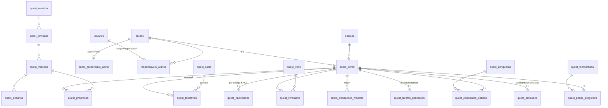

# 02 — Modelo de Dados

Todas as tabelas novas usam o prefixo `quest_` e vivem no mesmo banco do
Edu. O núcleo existente (`escolas`, `usuarios`, `alunos`, `turmas`,
`matriculas`, `configuracoes`, `logs_auditoria`) é **reutilizado, nunca
alterado estruturalmente** — exceto dois acréscimos aditivos descritos ao
final.

## Diagrama (entidades principais)

## Grupo 1 — Identidade e acesso

### `quest_perfis` — o astronauta do aluno

| Coluna | Tipo | Notas |
|---|---|---|
| id | PK | |
| escola_id | FK escolas, index | isolamento multi-escola |
| aluno_id | FK alunos, **unique** | 1 aluno = 1 perfil |
| apelido | str(40) | gerado de lista segura ("Estrela Corajosa"); nome real só aparece dentro da própria turma |
| codigo_amigo | str(12), unique | ex. `COSMO-4F7B` — para adicionar amigos sem digitar nomes |
| nivel | int, default 1 | derivável de xp_total; cacheado por leitura constante |
| xp_total | int, default 0 | só cresce, nunca se gasta |
| moedas | int, default 0 | **cache do ledger** (`quest_transacoes_moedas`); recalculável |
| estrelas_total | int, default 0 | cache da soma de `quest_progresso.estrelas` |
| sequencia_dias | int, default 0 | dias seguidos ativos ("Chama do Cosmo") |
| escudo_sequencia | bool | protege 1 falta por semana (renovado toda 2ª feira) |
| ultimo_dia_ativo | date | |
| avatar | JSON | itens equipados: `{cor, roupa, chapeu, acessorio, pet, efeito, moldura}` |
| preferencias | JSON | som, música, narração, reduzir animações, tamanho de fonte |
| dificuldade | JSON | nível adaptativo por mundo: `{"matematica": 3, ...}` (1–5) |
| social_ativo | bool, default conforme escola | responsável/professor pode desligar |
| status | str(20) | ativo \| pausado |
| created_at | datetime | |

### `quest_credenciais_aluno` — login infantil (separado do jogo)

| Coluna | Tipo | Notas |
|---|---|---|
| id | PK | |
| escola_id | FK, index | |
| aluno_id | FK alunos, unique | |
| codigo_login | str(20), unique | curto e falável: `SOL-1234` — impresso no cartão de acesso |
| pin_figuras_hash | str(200) | PIN de 4 figuras (🦊🌙⭐🍎) hasheado como senha |
| qr_token | str(64), unique | login por QR nos tablets; **trocável** (revoga cartões antigos) |
| token_version | int | mesma mecânica de invalidação do Edu |
| ultimo_acesso | datetime | |

O professor gera/imprime os cartões de acesso pelo Edu. Sessão do aluno:
JWT papel `aluno` de 12h + refresh de 30 dias vinculado ao aparelho —
criança não redigita credencial toda aula.

### Responsáveis — reuso de `usuarios`

- Novo cargo no enum existente: `responsavel` (login por e-mail/senha normal).
- Nova tabela de vínculo:

**`responsaveis_alunos`**: id, usuario_id (FK), aluno_id (FK), parentesco
(str), autorizado_por (FK usuarios — quem da escola confirmou o vínculo),
created_at. UNIQUE(usuario_id, aluno_id).

## Grupo 2 — Conteúdo pedagógico (catálogo global)

O catálogo é **global** (mantido pelo admin `is_global`), não por escola —
o currículo BNCC é o mesmo. Escolas ganham controles de ativação por
configuração (`configuracoes`, namespace `quest.*`).

### `quest_mundos` — disciplinas/planetas

| Coluna | Tipo | Notas |
|---|---|---|
| id, slug (unique), nome, descricao | | slug: `matematica`, `portugues`, `ciencias`, `geografia`, `historia`, `ingles`, `artes`, `edfisica`, `erer` |
| ordem | int | ordem de desbloqueio sugerida |
| tema | JSON | paleta (c1/c2/sky claro+escuro), trilha sonora (URL), efeitos, personagens secundários, cenário SVG — o formato já existe no protótipo v7 (`SUBJECTS`/`SCENES`) |
| icone | str | emoji/asset |
| ativo | bool | novos mundos = nova linha, zero mudança de arquitetura |

### `quest_jornadas` — trilhas dentro do planeta

| Coluna | Tipo | Notas |
|---|---|---|
| id, mundo_id (FK), nome, descricao | | |
| ano_escolar | str(30), index | "1º Ano" … "5º Ano" — mesma convenção de `turmas.ano_escolar` |
| ordem | int | sequência dentro do ano |
| bncc | JSON | lista de códigos de habilidade (ex. `["EF02MA05", "EF02MA06"]`) |
| estrelas_chefao | int | estrelas necessárias para liberar a missão-chefão |
| ativo | bool | |

### `quest_missoes`

| Coluna | Tipo | Notas |
|---|---|---|
| id, jornada_id (FK), nome, ordem | | |
| tipo | str(20) | `normal` \| `chefao` \| `evento` |
| icone, descricao_crianca | | texto curto + áudio de narração |
| xp_base, moedas_base | int | recompensa de referência (regras em doc 03) |
| config | JSON | tempo sugerido, nº de desafios sorteados, modos permitidos (solo/coop/corrida) |
| versao | int, default 1 | editar missão publicada → nova versão; tentativas guardam a versão jogada |
| status | str(20) | rascunho \| publicada \| arquivada |
| created_at | | |

### `quest_desafios`

| Coluna | Tipo | Notas |
|---|---|---|
| id, missao_id (FK), ordem | | |
| mecanica | str(30) | `quiz` \| `arrastar` \| `ligar` \| `memoria` \| `cacapalavras` \| `completar` \| `sequencia` … (registry do frontend) |
| dificuldade | int (1–5) | alimenta a seleção adaptativa |
| bncc_codigo | str(12), index | habilidade que este desafio exercita |
| corpo | JSON | enunciado, áudio da instrução, mídia, opções — schema por mecânica |
| gabarito | JSON | **nunca enviado ao cliente** |
| dica | JSON | texto + áudio (fala do Cosmo) |
| explicacao | JSON | mostrada após errar — em linguagem de criança |

## Grupo 3 — Progresso e telemetria

### `quest_progresso` — estado por aluno × missão

id, perfil_id (FK), missao_id (FK), estrelas (0–3), melhor_pct, tentativas
(contador), primeira_conclusao_em, ultima_tentativa_em.
UNIQUE(perfil_id, missao_id). Índice (perfil_id, missao_id).

### `quest_tentativas` — telemetria imutável (filosofia snapshot do Edu)

| Coluna | Tipo | Notas |
|---|---|---|
| id, escola_id, perfil_id, missao_id, missao_versao | | index (perfil_id, finalizada_em) e (escola_id, finalizada_em) |
| modo | str(20) | solo \| coop \| corrida \| x1 |
| sala_id | FK quest_salas, nullable | partidas sociais |
| iniciada_em, finalizada_em | datetime | tempo de estudo = soma das janelas |
| total_desafios, acertos | int | |
| tempo_seg | int | |
| xp_ganho, moedas_ganhas, estrelas | int | o que foi efetivamente premiado |
| respostas | JSON | por desafio: `{desafio_id, correta, resposta, tempo_ms, dicas, tentativas}` |
| origem | str(10) | web \| pwa-offline |

Nunca sobrescrita, nunca apagada. É a fonte de: painel do professor,
portal da família, agregados de habilidade e detecção de erros comuns.

### `quest_habilidades` — agregado por habilidade BNCC

perfil_id, bncc_codigo, tentativas, acertos, dominio (0–100, média móvel),
ultima_atividade_em. UNIQUE(perfil_id, bncc_codigo).

É um **cache recalculável** a partir de `quest_tentativas` (mesma regra do
Edu: correção de dados nunca deixa agregado órfão — existe rotina de
recomputação).

## Grupo 4 — Economia e coleção

### `quest_itens` — catálogo cosmético (global)

id, slug (unique), tipo (`roupa` \| `chapeu` \| `oculos` \| `acessorio` \|
`pet` \| `efeito` \| `moldura` \| `dança`), nome, raridade (comum/rara/
épica/lendária — enum já usado no Edu), preco_moedas (nullable — item de
conquista não se compra), desbloqueio (JSON: nível mínimo, conquista,
evento, temporada), mundo_id (nullable — colecionáveis por planeta),
asset (ref CDN), ativo.

### `quest_inventario`

id, perfil_id, item_id, origem (`compra` \| `conquista` \| `evento` \|
`passe` \| `presente_professor`), obtido_em. UNIQUE(perfil_id, item_id).
O que está **equipado** fica em `quest_perfis.avatar` (JSON).

### `quest_transacoes_moedas` — ledger imutável

id, perfil_id, delta (+/-), saldo_apos, motivo (str: `missao`, `diaria`,
`compra_item`, `evento`, `ajuste_admin`), referencia (JSON: ids), created_at.
Saldo do perfil = cache do ledger. Toda divergência é detectável e
recomputável — mesma auditabilidade das `notas` do Edu.

## Grupo 5 — Ritmo diário e conquistas

### `quest_tarefas_periodicas` — missões diárias/semanais

id, perfil_id, periodo (`diaria` \| `semanal`), data_ref (date — segunda-feira
para semanais), objetivo (JSON: `{tipo: "concluir_missoes", alvo: 3,
mundo: "matematica"}`), progresso (int), recompensa (JSON), concluida_em,
resgatada_em. UNIQUE(perfil_id, periodo, data_ref, slot).
Geradas no primeiro acesso do dia (3 diárias + 2 semanais), sorteadas com
viés para mundos/habilidades onde o aluno está mais fraco.

### `quest_conquistas` (catálogo) e `quest_conquistas_obtidas`

Catálogo: id, slug, nome, descricao, raridade, icone, criterio (JSON
data-driven: `{indicador: "missoes_concluidas", alvo: 50, mundo: null}`),
secreta (bool), ativo.
Obtidas: perfil_id, conquista_id, obtida_em. UNIQUE(par).
O avaliador de critérios é genérico (`services/conquistas.py`) — conquistas
novas entram por dados, não por código (padrão já validado no Edu).

## Grupo 6 — Social e partidas

### `quest_amizades`

id, escola_id, solicitante_id (FK quest_perfis), destinatario_id (FK),
status (`pendente` \| `aceita` \| `recusada` \| `bloqueada`), created_at,
respondida_em. UNIQUE(solicitante_id, destinatario_id).
Regra: mesma escola, sempre. (Fase 1: mesma turma — abre por configuração.)

### `quest_salas` — registro de partidas sociais

id, escola_id, codigo (str curto), modo (`missao_compartilhada` \|
`corrida` \| `pintura_dupla` \| `x1`), skin_corrida (nullable:
`bichinhos` \| `espacial` \| `simples`), missao_id, lider_id,
estado (`aguardando` \| `em_jogo` \| `finalizada` \| `cancelada`),
participantes (JSON snapshot: perfil, avatar, bichinho escolhido),
resultado (JSON), criada_em, finalizada_em.
Estado ao vivo fica em memória/Redis; a linha é o registro histórico.

### `quest_mensagens_rapidas` — catálogo de comunicação segura

id, slug, texto, audio (ref), categoria (`saudacao` \| `elogio` \|
`convite` \| `reacao`), emoji, ativo. **Não existe campo de texto livre
em nenhuma tabela acessível ao papel aluno.**

## Grupo 7 — Temporadas e eventos

### `quest_temporadas`

id, nome, tema (JSON), inicio, fim, trilha (JSON: níveis do passe →
`[{nivel, xp_passe, recompensa_item_id | moedas}]`), ativo.
Passe **gratuito** — trilha única de recompensas por jogar.

### `quest_passe_progresso`

perfil_id, temporada_id, xp_passe, nivel_passe, resgatados (JSON de níveis).
UNIQUE(perfil_id, temporada_id).

### `quest_eventos` — eventos temáticos (Festa Junina, Dia das Crianças…)

id, slug, nome, inicio, fim, config (JSON: missões extras, itens limitados,
decoração do lobby), ativo.

## Grupo 8 — Integração

### `quest_outbox` — eventos de domínio

id, escola_id, tipo (`missao_concluida`, `nivel_alcancado`,
`conquista_obtida`, `sequencia_marcada`, `sessao_encerrada`,
`alerta_dificuldade`), payload (JSON), created_at, processado_em (nullable),
tentativas_envio (int).

Consumidores hoje: notificações push (responsável/professor via serviço
existente) e agregações do Edu. Amanhã: fila real quando o quest for
extraído — o produtor não muda.

## Tabelas adiadas (desenhadas, não criadas)

Clubes (`quest_clubes`, `quest_clubes_membros`) e torneios
(`quest_torneios`, `quest_torneios_inscricoes`, `quest_torneios_partidas`)
entram na fase "Mundo vivo" (doc 05). O desenho acima não precisa mudar
para recebê-las — clubes referenciam perfis; torneios referenciam salas.

## Mudanças no núcleo existente (aditivas, retrocompatíveis)

1. `usuarios.cargo`: aceitar o valor `responsavel` (validação de rotas já é
   por papel; responsável só acessa `/quest/familia/*`).
2. Papel `aluno` **não entra** em `usuarios` — alunos autenticam por
   `quest_credenciais_aluno` e o JWT carrega `{papel: "aluno", perfil_id,
   aluno_id, escola_id}`. Mantém o cadastro de pessoas (alunos) separado de
   contas administrativas, como o Edu já faz.

## Convenções (herdadas do Edu)

- Datas em UTC no banco; formatação pt-BR nos clientes.
- `escola_id` + índice em toda tabela com dados de aluno.
- Histórico imutável (`quest_tentativas`, ledger, outbox) — correções geram
  registros novos, nunca sobrescrevem.
- Regras numéricas (XP, preços, limites) **não são hardcoded**: valores
  padrão no código, personalização por escola em `configuracoes`
  (namespace `quest.*`).
