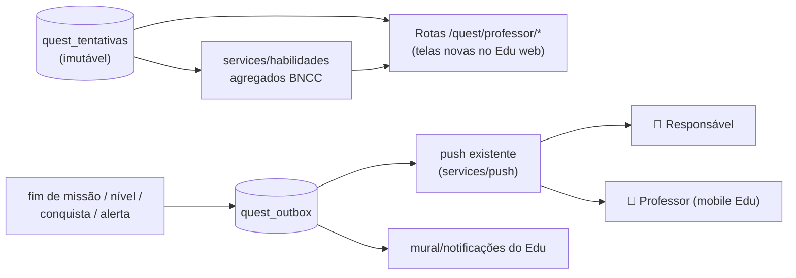

# 04 — Integração com o Constela Edu, Família e Segurança

## Tipos de usuário (consolidado)

| Papel | Autentica por | Vive em | Acessa |
|---|---|---|---|
| **Aluno** | Cartão de acesso: QR ou código curto (`SOL1234`, só letras e números — SEM senha, como no Elefante Letrado) | `quest_credenciais_aluno` (JWT `papel=aluno`) | Só o Quest (rotas `/quest/*` não administrativas) |
| **Responsável** | E-mail + senha | `usuarios` (cargo `responsavel`) | Portal da Família (`/quest/familia/*`) — leitura |
| **Professor** | Login Edu existente | `usuarios` | Edu + telas de professor do Quest (`/quest/professor/*`) |
| **Coordenador/Admin** | Login Edu existente | `usuarios` | Tudo da escola: ativação de recursos, controles sociais |
| **Admin global** | Login Edu existente (`is_global`) | `usuarios` | Catálogo de conteúdo, itens, temporadas, eventos |

### Login do aluno (o problema mais subestimado do projeto)

Criança de 6 anos não tem e-mail nem decora senha. Decisão de produto
(09/07/2026): **sem senha/PIN — o código impresso É a credencial**, como no
Elefante Letrado; ele pode ficar exposto. A defesa contra abuso é o
limitador por (código, IP) — dimensionado para 30 tablets atrás do NAT da
escola — e o escopo mínimo do papel aluno. O fluxo:

1. Professor abre a turma no Edu → "Cartões do Quest" → PDF com um cartão
   por aluno (QR + código só letras/números) + página final "só do
   professor" (tabela nome → código e roteiro da 1ª aula).
2. Na escola (tablet compartilhado): a entrada abre com **"Quem vai
   jogar?"** (astronautas que já entraram no aparelho — 1 toque) ou a
   criança digita o código e confirma **"Sou eu!"**.
3. **Primeira vez**: cerimônia de boas-vindas — a criança escolhe COMO
   quer ser chamada (nome/apelido digitado, só letras, 2–20) e a cor do
   traje; o Quest passa a chamá-la por esse nome em toda fala.
4. Ao reabrir o app com sessão guardada, SEMPRE aparece "É você, {nome}?" —
   a criança do turno seguinte nunca herda a conta da anterior.
5. Cartão perdido: regeneração **individual** por aluno (não derruba a
   turma); o código nunca muda (a criança decora), só o QR.
6. Aluno transferido/arquivado recebe mensagem própria ("cartão
   descansando") — nunca "código errado", que a faria se culpar.

## Sincronização Quest → Edu

Mesmo banco = a "sincronização" é **consulta + eventos**, não cópia de dados.



### O que o professor vê (telas novas no Edu web, dados do módulo quest)

| Visão | Conteúdo | Fonte |
|---|---|---|
| Turma — panorama | Tempo de estudo, missões concluídas, taxa de acertos, alunos ativos/inativos na semana | `quest_tentativas` agregada |
| Habilidades BNCC | Mapa de calor turma × habilidade (domínio 0–100); clicar → quais alunos precisam de reforço | `quest_habilidades` |
| Erros mais comuns | Desafios com maior taxa de erro na turma + as alternativas erradas mais escolhidas (ouro pedagógico: revela o *mal-entendido*, não só o erro) | `quest_tentativas.respostas` |
| Aluno — trajetória | Evolução de domínio por mundo, tempo, sequência, conquistas | agregados por perfil |
| Alertas | "5 alunos empacados na mesma habilidade", "aluno sem acesso há 7 dias" | `quest_outbox` tipo `alerta_dificuldade` |
| **Missão da Turma** | Professor atribui uma missão como destaque da semana; vira card especial no lobby dos alunos | nova tabela leve `quest_atribuicoes` (fase 3) |

Princípio: o professor **não vê** moedas, itens ou loja (ruído lúdico);
vê aprendizagem. A criança **não vê** relatórios; vê aventura. Cada
audiência, sua linguagem.

### O que o responsável vê (Portal da Família)

Tempo de estudo por dia/semana, evolução por matéria (linguagem simples,
sem jargão BNCC), conquistas e nível (para conversar com o filho: "me
conta dessa medalha!"), certificados em PDF (reusa o gerador do Edu),
controles: desligar social do filho, horário permitido (ex.: não jogar
após 21h), notificações push semanais de resumo.

## Segurança infantil e LGPD

### Comunicação

- **Não existe chat livre.** Nenhum campo de texto livre é acessível ao
  papel aluno — nem "nome do pet". Tudo é seleção de catálogo
  (`quest_mensagens_rapidas`, listas de nomes).
- Amizades: mesma escola sempre; padrão inicial mesma turma; pedido de
  amizade é aceito/recusado pela criança, e professor/responsável podem
  desligar o social por aluno (`quest_perfis.social_ativo`), por turma ou
  por escola (configuração).
- Fora da própria turma, a criança aparece como **apelido + avatar**
  (nunca nome completo).

### LGPD (Art. 14 — dados de crianças)

- **Melhor interesse**: coleta mínima — o Quest não pede foto, localização,
  nem dados além do que a escola já cadastrou no Edu.
- **Base legal e consentimento**: o tratamento se dá no contexto da
  prestação do serviço educacional contratado pela escola; o termo de
  consentimento específico dos responsáveis integra o onboarding da escola
  (documento padrão fornecido; escola coleta assinatura como já faz com
  autorizações de imagem). Recursos sociais são **opt-in por escola**.
- **Transparência**: Portal da Família mostra exatamente o que é coletado
  e para quê.
- **Retenção**: telemetria detalhada (`respostas` das tentativas) tem
  política de retenção configurável (padrão 24 meses); agregados
  pedagógicos permanecem. Saída do aluno da escola → perfil pausado; após
  o prazo, anonimização (perfil vira "Aluno removido", telemetria perde o
  vínculo nominal).
- **Auditoria**: acessos de professores/responsáveis a dados de alunos
  passam pelos `logs_auditoria` existentes.

### Bem-estar (design ético para 6–11 anos)

- Teto diário de XP + lembrete de pausa do Cosmo (40 min, configurável).
- Zero dark patterns: sem "só falta 1!", sem timer de oferta, sem
  notificação de FOMO para a criança (push é para adultos).
- Erro nunca gera punição mecânica (perda de moedas/estrelas/vidas).
  Não existem "vidas".

## Contratos de API (visão resumida)

```
/api/v1/quest/
├── auth/            POST entrar (qr|codigo+pin) · POST renovar · POST sair
├── perfil/          GET eu · PATCH avatar · PATCH preferencias · GET constelacao
├── catalogo/        GET planetas · GET planetas/{slug}/jornadas
│                    GET missoes/{id} (desafios SEM gabarito)
├── jogo/            POST tentativas (iniciar) · POST tentativas/{id}/respostas
│                    POST tentativas/{id}/finalizar → recompensas calculadas
├── tarefas/         GET hoje (diárias+semanais+login) · POST {id}/resgatar
├── economia/        GET loja · POST comprar · GET inventario · GET passe
├── social/          GET amigos · POST convites · POST convites/{id}/responder
│                    GET mensagens-rapidas
├── salas/           POST criar · POST {codigo}/entrar · GET {id}
├── ws               /ws/quest?token=…  (partidas ao vivo)
├── professor/       GET turmas/{id}/panorama · GET turmas/{id}/habilidades
│                    GET turmas/{id}/erros-comuns · GET alunos/{id}/trajetoria
│                    POST atribuicoes (Missão da Turma)
└── familia/         GET filhos · GET filhos/{id}/resumo · PATCH filhos/{id}/controles
```

Convenções idênticas ao Edu: JSON, JWT Bearer, validação Pydantic, papéis
checados no backend em cada rota, isolamento por `escola_id`, paginação
nos agregados.

## IA (papel do módulo — fase futura, fundações prontas desde já)

Reusa `services/ia` (provedor trocável, contexto montado no backend):

| Uso | Guarda-corpo |
|---|---|
| Explicar erro em linguagem de criança (fala do Cosmo) | prompt com o desafio + resposta errada; saída passa por filtro de vocabulário; cache por (desafio, erro) para custo previsível |
| Dicas contextuais | idem; a criança nunca digita texto livre para o modelo |
| Gerar desafios novos | **sempre** entram como `rascunho` para revisão do professor/admin no Edu — IA nunca publica direto para criança |
| Adaptar dificuldade v2 | modelo lê agregados de habilidade, ajusta seleção; decisões registradas (auditável) |
| Histórias/narrativa de missão | geradas em lote na autoria de conteúdo (adulto no loop), não em tempo real |
