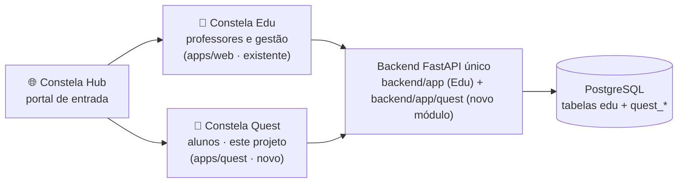

# Constela Quest — Documentação de Arquitetura

> **Constela Quest** é a plataforma dos alunos (1º ao 5º ano) do ecossistema
> Constela: um jogo educativo onde a criança explora planetas (disciplinas),
> cumpre missões (atividades) e evolui sua constelação (progresso) — com o
> mascote Cosmo ao lado o tempo todo.

## Ecossistema

## Documentos

| Documento | Conteúdo |
|---|---|
| [01-arquitetura.md](01-arquitetura.md) | Visão de sistema, stack, módulos, estrutura de pastas, tempo real, escalabilidade |
| [02-banco-de-dados.md](02-banco-de-dados.md) | Modelo de dados completo (tabelas `quest_*` + reuso do núcleo Edu) |
| [03-gamificacao-progressao.md](03-gamificacao-progressao.md) | Economia (XP/moedas/estrelas), níveis, sequência, conquistas, planetas, modos sociais, Cosmo |
| [04-integracao-edu.md](04-integracao-edu.md) | Login do aluno, eventos de domínio, painel do professor, portal da família, LGPD |
| [05-roadmap.md](05-roadmap.md) | Fases de implementação (cada uma entregável e usável) |

## Decisões-chave (resumo executivo)

| Decisão | Escolha | Por quê |
|---|---|---|
| Onde o Quest vive | **Mesmo monorepo e mesmo backend**, como módulo isolado (`backend/app/quest/`, `apps/quest/`) | A identidade (escolas, alunos, turmas) já existe no Edu; integração professor↔aluno vira consulta local em vez de sincronização entre sistemas. Fronteiras de módulo explícitas permitem extrair para serviço próprio quando a escala exigir. |
| Banco | Mesmo PostgreSQL, tabelas prefixadas `quest_` | Zero duplicação de cadastro; isolamento lógico pelo prefixo + regra de dependência única direção (quest → núcleo, nunca o contrário). |
| Frontend | `apps/quest` — React + Vite + TypeScript, **PWA instalável** | Mesmo ecossistema do Edu (reaproveita padrões do `@constela/core`); PWA roda em Chromebook, tablet e celular da escola sem loja de aplicativos. |
| Mecânicas de jogo | DOM/SVG/CSS animado primeiro; canvas (PixiJS) só para modos arcade futuros | O protótipo `constela-play-v7.html` prova que a estética desejada se alcança com SVG/CSS. DOM é acessível, leve e rápido de produzir. Quiz, arrastar, ligar, memória e caça-palavras não precisam de engine. |
| Tempo real (multiplayer) | WebSocket no próprio FastAPI; estado das salas em memória → Redis quando houver réplicas | Os modos são de ritmo de quiz (resposta → avanço), não física de 60fps. Latência de 100–300 ms é invisível. |
| Conteúdo pedagógico | Catálogo no banco (mundos → jornadas → missões → desafios), JSON versionado, alinhado à **BNCC** por código de habilidade | Conteúdo novo sem redeploy; telemetria por habilidade BNCC é o que o professor precisa ver no Edu. |
| Vocabulário | O código usa nomes internos estáveis; a criança só vê o vocabulário lúdico | Ver tabela abaixo. |
| Monetização | **Nenhuma compra dentro do app.** Moedas só se ganham jogando; a escola licencia o produto | Público de 6–11 anos + LGPD Art. 14. Passe de temporada existe, mas é 100% gratuito (trilha de recompensas por jogar). |
| Segurança social | Sem chat livre, nunca. Mensagens rápidas pré-aprovadas, amizades restritas à escola, tudo desligável por escola/responsável | Ver [04-integracao-edu.md](04-integracao-edu.md). |

## Vocabulário do produto

A criança nunca vê termos de sistema. O mapeamento é fixo e vale para UI,
textos do Cosmo e comunicação com as escolas:

| Interno (código/banco) | Criança vê | Observação |
|---|---|---|
| `mundo` (disciplina) | **Planeta** ("Planeta Matemática") | "Mundo" é o conceito; na UI todo mundo é um planeta do universo Constela |
| `jornada` (unidade/fase) | **Jornada** ("Jornada dos Números Gigantes") | Região/trilha dentro do planeta |
| `missao` (atividade) | **Missão** | |
| `desafio` (exercício) | **Desafio** | |
| `progresso` | **Constelação** | O mapa estelar pessoal do aluno |
| `tentativa` | — (invisível) | Registro de telemetria |
| `sala` (partida multiplayer) | — (invisível) | A criança só vê "Estudar com um amigo" / "Corrida" |
| `perfil` | **Meu astronauta** | |

Palavras proibidas na interface infantil: *party, lobby, matchmaking, squad,
ranking global, prova, exercício, tarefa, erro fatal, reprovado*.

## A pergunta que guia tudo

> "Uma criança teria vontade de entrar no Constela Quest mesmo se não fosse
> obrigada pela escola?"

Toda feature nova responde a essa pergunta antes de entrar no roadmap.
Os quatro pilares que sustentam o "sim":

1. **Autonomia** — a criança escolhe o planeta, o visual do astronauta, o pet.
2. **Progresso visível** — cada sessão termina com algo novo: XP, estrela,
   item, pedaço da constelação. Nunca sai de mãos vazias.
3. **Vínculo** — Cosmo reage, lembra, comemora; amigos convidam para jogar.
4. **Surpresa** — missões diárias rotativas, eventos, colecionáveis raros.
